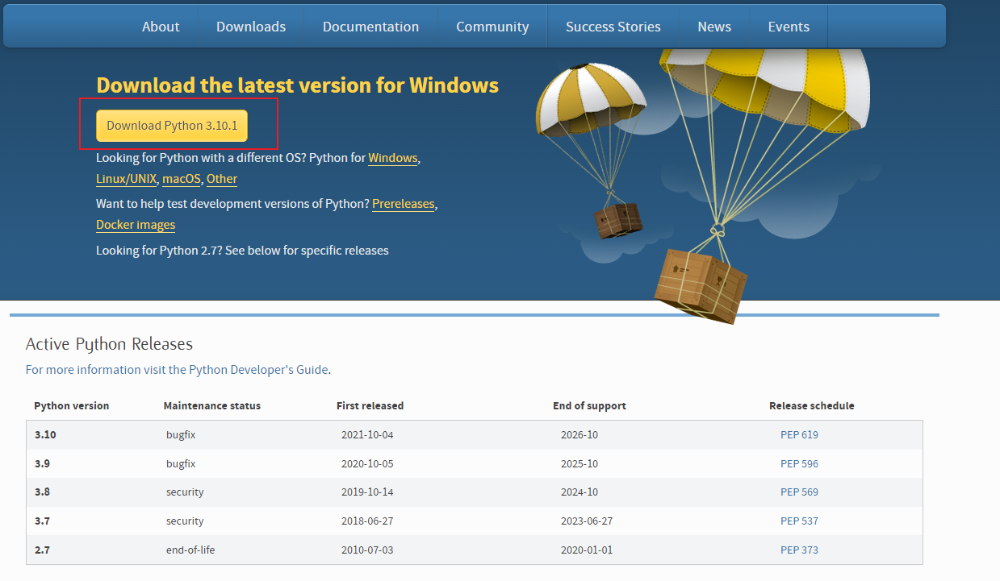

# C语言选手快速上手Python指南

> 本文基于2022年1月3日最新版 Python3.10.1
>
> 官方文档：https://docs.python.org/zh-cn/3/



# 1、注释

单行注释使用 `#` 开头， 多行注释使用 `'''多行注释'''`

```python
# 单行注释

"""
多行注释
多行注释
"""

'''
我也是多行注释
我也是多行注释
'''
```

# 2、逻辑语句

**与或非**逻辑直接用英文 `and` 、 `or` 和 `not`  表示，而且不需要带括号

```tex
&& ==> and
|| ==> or
!  ==> not
```

C 语法：

```c
if(a > 0 && a < 10){
    // 具体逻辑
}
```

对应的 Python 语法：

```python
if a > 0 and a < 10:
    # 具体逻辑
```

# 3、pass语句

什么也不做的时候使用，或者没想好这个逻辑怎么写的时候使用，比如

```python
if flag == 1:
    pass  # 其实我有个逻辑，但我没想好，以后我再来写
```

再比如，

```python
class MyClass:
    pass  # 这个类我也没想好，以后再来写
```

