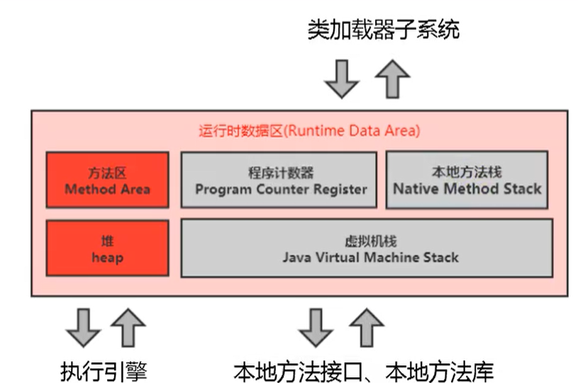
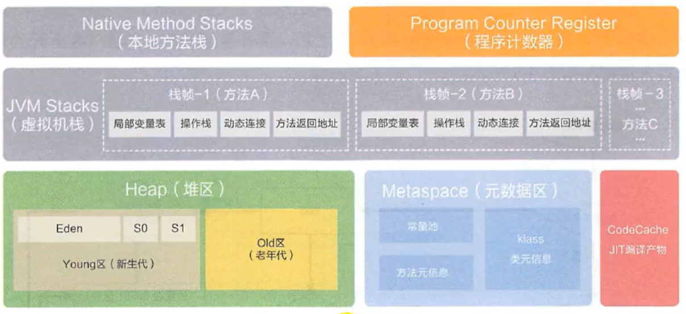
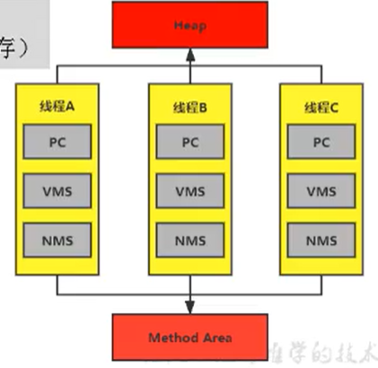
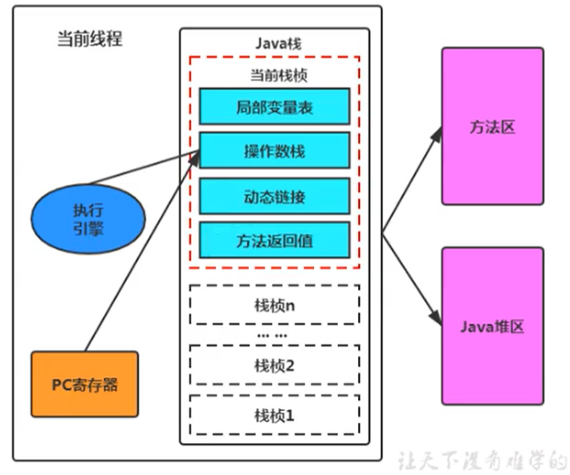
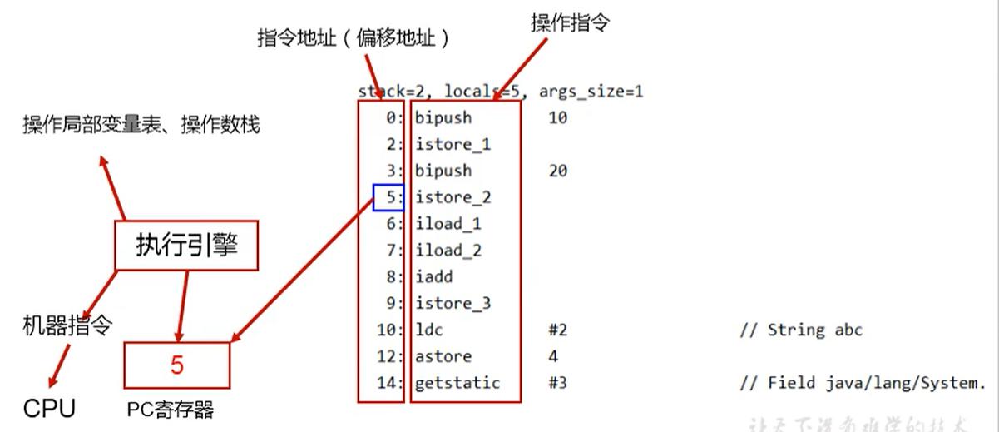

# 运行时数据区概述、线程和程序计数器

## 概述图

具体一点：

线程私有的：虚拟机栈、本地方法栈、程序计数器

线程共享的：堆、堆外内存（永久代或元空间，代码缓存）

JVM 调优优化的是堆空间（95%）和方法区（5%）

## 线程

在Hotspot JVM里，每个线程都与操作系统的本地线程直接映射。

当一个Java线程准备好执行以后，此时一个操作系统的本地线程也同时创建。Java线程执行终止后，本地线程也会回收。

## 程序计数器

JVM 中的 PC 是对物理 PC 寄存器的一种抽象模拟

PC寄存器用来存储指向下一条指令的地址,也即将要执行的指令代码。由执行引擎读取下一条指令。

如果执行的是本地方法，PC 的值就未定了。

> 唯一一个在 JVM 规范中没有规定 OOM 的区域，同时没有 GC

### 举例

### 面试题

#### 为什么要PC ？

上下文切换之后，CPU 需要知道我下面要执行什么指令，PC存的就是指令的地址

