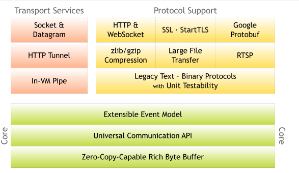

# Netty是什么？

官网：https://netty.io/

官方文档：https://netty.io/wiki/user-guide-for-4.x.html

## 定义

Netty是由JBOSS提供的一个java开源框架，现为 Github上的独立项目。

Netty 是 一个异步事件驱动的**网络应用程序框架**，用于快速开发可维护的高性能协议服务器和客户端。

## 为什么使用NIO？

netty做的更多：

- 支持常用的应用层协议
- 解决传输问题：粘包、半包问题
- 支持流量整形
- 完整的断联、Idle 等异常处理

做的更好：

- 规避 JDK NIO bug
- API 更友好更强大
- 屏蔽了JDK NIO的变化和实现细节

目前版本：

大事件：2015年废弃了 5.0 版本（alpha版本），所以教训就是，坚决不用 alpha那些版本的

现在默认是 4.1 的分支，支持安卓

# 三种IO模式

| 排队打饭   | BIO（阻塞IO） | JDK1.4之前 |
| ---------- | ------------- | ---------- |
| 点餐等叫号 | NIO（非阻塞） | 1.4        |
| 包厢模式   | AIO（异步IO） | 1.7        |

阻塞：就是死等。没有数据，读会阻塞直到有数据；缓存区满了，写也会阻塞。

非阻塞：遇到上面的情况，不等了，我先返回

同步：数据就绪以后自己去读是同步

异步：数据就绪以后，有个程序读好了通知我

## 为什么现在仅支持NIO？

BIO 连接数高的时候耗费资源、效率低

AIO被删是因为Linux下的AIO不成熟

## NIO一定比BIO好吗？

单线程、低并发，BIO性能甚至比NIO还好

