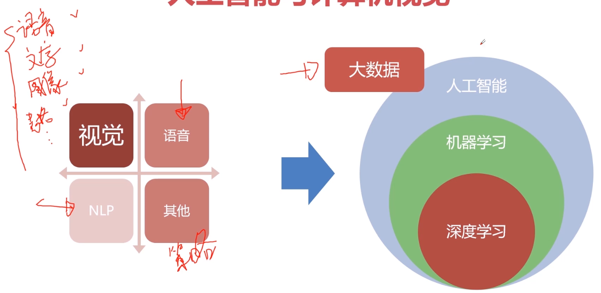

# 计算机视觉基本概念

## 人工智能与计算机视觉

要处理的任务：

- 图像分类、检索、分割、生成、降噪、加密
- 目标检测、目标跟踪
- 超分辨率重构
- 关键点定位
- 多模态
- 视频编解码
- 3D视觉
- 等等

HSV 色彩模式

- 色相(Hue)：指物体传导或反射的波长。更常见的是以颜色如红色，橘色或绿色来辨识，取0到360度的数值来衡量

- 饱和度(Saturation)：又称色度，是指色彩的强度或纯度，取值范围为0%~100%

- 明度(Value)：表示颜色明亮的程度，取值范围为0%(黑)到100%(白)

灰度图

- 灰度图通常由一个unit8、unit16、单精度类型或者双精度类型的数组描述

- M\*N 的矩阵，矩阵中每一个元素与图像的一个像素点相对应

- 通常0代表黑色，1、255或65635(为数据矩阵的取值范围上限)代表白色
  - 浮点算法:Gray = R*0.3＋G*0.59 +B*0.11*
  - 整数方法: Gray = (R*30+G*59+B*11)/100*
  - 移位方法:Gray = (R*28+G*151+B*77) >> 8
  - 平均值法: Gray =(R+G+B)/3
  - 仅取绿色: Gray = G

