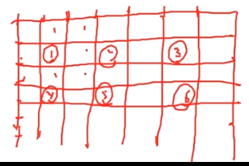
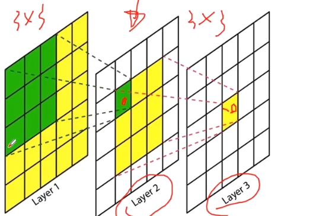

# 卷积神经网络

以卷积层为主的深度神经网络


卷积：对图像和滤波矩阵做内积(逐个元素相乘再求和)的操作

```bash
nn.Conv2d(
	in_channels,
	out_channels,
	kernel_size,
	stride=1,
	padding=0,
	dilation=1,# 空洞卷积的参数
	groups=1, # 分组卷积的参数
	bias=True
)
```


卷积之后尺寸缩小就是下采样


**空洞（膨胀）卷积**



上下左右膨胀了，不经过 pooling 层加大感受野


转置卷积（反卷积）：上采样的过程

```bash
torch.nn.ConvTranspose2d
```


可变性卷积：卷积核在不同位置不同


**感受野**

feature map 中某个元素对应到输入图像上的那块区域




如何压缩卷积层参数和计算量？

从感受野不变+减少参数量的角度压缩卷积层

- 采用多个 3×3 卷积核代替大卷积核
- 采用深度可分离卷积（分组卷积）
- 通道Shuffle
- Pooling层
- Stride=2
- 等等


