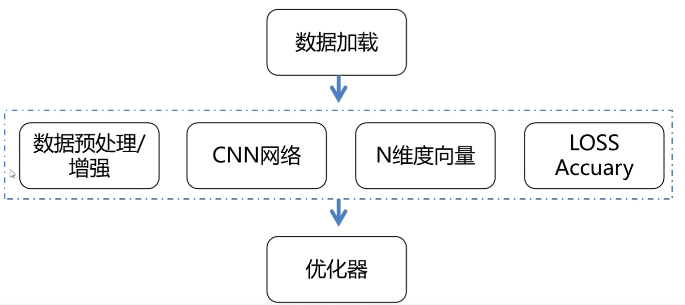

# 图像分类网络框架解读

## 基本结构

## 数据加载

使用 torchvision.dataset 的已有数据集
torch.utils.data 下的 Dataset，DataLoader 自定义数据集

## 数据增强

解决的问题：过拟合问题、泛化能力弱

## 网络结构

串联、并联、跳跃连接、深度可分离卷积

## 类别概率分布

如何将卷积输出的 tensor 转换为 N 维向量？
- FC（平铺之后作为 FC 层的输入，然后映射）
    - 模型结构不好变化，比如平铺之后原来是100，现在是101，整个网络就需要再次设计
- Conv
- pooling
    - 无参数

softmax 映射到概率分布

$ S_{i} = \frac{e^{i}} {\sum_{j} {e^{j}}} $

## Loss

分类问题：交叉熵

one-hot 编码比较硬，可以使用标签平滑

## 常用评价指标

混淆矩阵
- 测准率（所有预测对的）
- Recall召回率（所有的正样本你预测对了多少）
- Precision精度（你预测这是正样本，那么正确率是多少）

PR 曲线、ROC 曲线、AUC 面积

## 优化器

Adam
lr = 0.001
学习率指数衰减