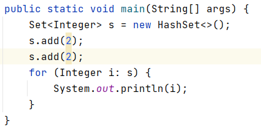
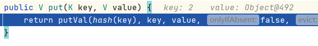
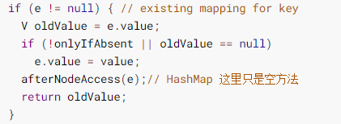

# 2020-02-14面试题

[toc]

<div style="page-break-after:always"></div>

### 1、Java的基本变量有哪些？各占几个字节？

8种：int,short,long,byte,char,double,float,bool

int，float 4字节

short，char 2字节

long，double 8字节

byte 1字节

boolean 1bit

### 2、构造函数能被重写吗？能被重载吗？

可以重载，但是不能被重写（构造函数与类名相同，不能被继承，所以不能重载）

### 3、子类的super是重写吗？

不是，只是调用父类的构造函数，并且只能放在第一行。

### 4、接口和抽象类的区别有哪些？能被实例化吗？里面变量有什么不同吗？方法有什么不同？

不同点：表示内容不同、性质不同、成员变量不同

一、表示内容不同

1、抽象类：抽象类表zhuan示该类中可能已经有一些方法的具体定义。

2、接口：接口就仅仅只能定义各个方法的界面（方法名，参数列表，返回类型），并不关心具体细节。

二、性质不同

1、抽象类：抽象类是对象的抽象。

2、接口：接口是一种行为规范。

三、成员变量不同

1、抽象类：抽象类中的成员变量可以被不同的修饰符修饰。

2、接口：接口中的成员变量默认的都是静态常量（static final）。

共同点如下：

1、都是上层的抽象层。

2、都不能被实例化

3、都能包含抽象的方法，这些抽象的方法用于描述类具备的功能，但是不比提供具体的实现。

### 5、线程的创建方式有哪几种？创建方法说下？内存模型中线程私有的有哪些？

3种：

1、实现 Runnable 接口，重写 run 方法，创建实现类的实例，并把实例作为 Thread 的构造器参数来创建 Thread 对象

2、通过实现 Callable 接口和 FutureTask 来创建 Thread 线程，

3、通过继承 Thread 类，重写 run 方法，创建Thread子类的实例，调用 start 方法来启动该线程

4、通过线程池来创建线程

线程私有的：虚拟机栈、本地方法栈、程序计数器

### 6、String abc = new Stirng("abc")，新建了几个对象？abc指向哪？

两个或一个

首先要看常量池里是否有“abc”这个字符串，如果有，则创建一个，如果没有，则创建两个。

### 7、TCP/IP有几层？每一层的作用？MAC地址在哪层？

四层

应用层决定了向用户提供应用服务时通信的活动。TCP/IP 协议族内预存了各类通用的应用服务。

传输层对上层应用层， 提供处于网络连接中的两台计算机之间的数据传输。

网络层用来处理在网络上流动的数据包。

网络接口层用来处理连接网络的硬件部分。

mac 在数据链路层

### 8、List和Set区别是什么？Set为什么能去重？

list 是线性表，有序，可以重复

set 是集合，无序，不能有重复的元素

以 hashset 为例，

```java
// Dummy value to associate with an Object in the backing Map
private static final Object PRESENT = new Object();

public boolean add(E e) {
  return map.put(e, PRESENT)==null;
}
```

调用了 hashmap 的 put 方法

```java
public V put(K key, V value) {
  return putVal(hash(key), key, value, false, true);
}

/**
     * Implements Map.put and related methods.
     *
     * @param hash hash for key
     * @param key the key
     * @param value the value to put
     * @param onlyIfAbsent if true, don't change existing value
     * @param evict if false, the table is in creation mode.
     * @return previous value, or null if none
     */
final V putVal(int hash, K key, V value, 
               boolean onlyIfAbsent,
               boolean evict) {
  Node<K,V>[] tab; 
  Node<K,V> p; 
  int n, i;
  if ((tab = table) == null || (n = tab.length) == 0)
    n = (tab = resize()).length;
  if ((p = tab[i = (n - 1) & hash]) == null)
    tab[i] = newNode(hash, key, value, null);
  else {
    Node<K,V> e; 
    K k;
    // 如果 key 相同
    if (p.hash == hash &&
        ((k = p.key) == key || (key != null && key.equals(k))))
      e = p;
    else if (p instanceof TreeNode)
      e = ((TreeNode<K,V>)p).putTreeVal(this, tab, hash, key, value);
    else {
      for (int binCount = 0; ; ++binCount) {
        // 如果走到链表尾部，还是没有找到，就尾插
        if ((e = p.next) == null) {
          p.next = newNode(hash, key, value, null);
          if (binCount >= TREEIFY_THRESHOLD - 1) // -1 for 1st
            treeifyBin(tab, hash);
          break;
        }
        // 如果 key 相同 
        if (e.hash == hash &&
            ((k = e.key) == key || (key != null && key.equals(k))))
          break;
        p = e;// 配合 e 对链表实现遍历
      }
    }
    // 如果 key 相同，用新值替代老值，并且返回老值
    if (e != null) { // existing mapping for key
      V oldValue = e.value;
      if (!onlyIfAbsent || oldValue == null)
        e.value = value;
      afterNodeAccess(e);// HashMap 这里只是空方法
      return oldValue;
    }
  }
  ++modCount;
  if (++size > threshold)
    resize();
  afterNodeInsertion(evict);
  return null;
}
```






第二次


因为两次 put 的 k，v完全相同，运行到

```java
if (p.hash == hash &&
        ((k = p.key) == key || (key != null && key.equals(k))))
      e = p;
```

就会直接到



等于什么也没有干

### 9、A继承exception，B又继承A，然后在C中的方法抛出B，问我这样写对吗？

对的

### 10、HashMap底层原理：bucket扩容？k冲突了怎么办？

桶中元素大于阈值就触发扩容。

jdk8中put方法：先计算key的哈希值，然后调用putVal方法==>先判断哈希表是否为空，为空就扩容，不为空计算出key在哈希表中的位置i，看table[i]是否为空，为空就直接新建一个节点放进去，不为空判断当前位置的hash值，key和要插入的是否相同，相同则根据要求看是否覆盖val，不相同就查看table[i]是否是红黑树节点，如果是的话就用红黑树直接插入键值对，如果不是开始遍历链表，如果遇到hash值,key相同的，根据要求看是否覆盖val，否则直接尾插法插入，如果链表长度大于8，转为红黑树结构，执行完成后看size是否大于阈值threshold，大于就扩容，否则直接结束

### 11、Volatile有什么作用？

（1）保证该变量对所有线程的可见性；

（2）禁止指令重排序优化。

### 12、内网中服务器ip地址怎么确定？

### 13、URL为什么有时候获取的是网页有时候直接下载图片

返回的HTTP报文中的Content-Type控制，Content-Type如果为image/jpeg（或其他图片格式）则展示图片，若application/octet-stream这种或者其他的则是下载

### 14、互斥锁和自旋锁、读写锁

读写锁实际是一种特殊的自旋锁。一次只有一个线程可以占有写模式的读写锁, 但是可以有多个线程同时占有读模式的读写锁。如果读写锁当前没有读者，也没有写者，那么写者可以立刻获得读写锁，否则它必须自旋在那里，直到没有任何写者或读者。如果读写锁没有写者，那么读者可以立即获得该读写锁，否则读者必须自旋在那里，直到写者释放该读写锁。

### 15、Redis用过吗，单线程还是多线程

在业务处理的时候，Redis是单线程的。但是有些事情是其他线程来做的，它也会clone或者fork一个线程来处理。