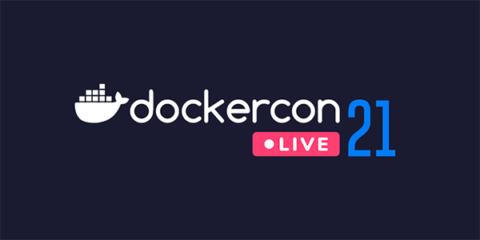
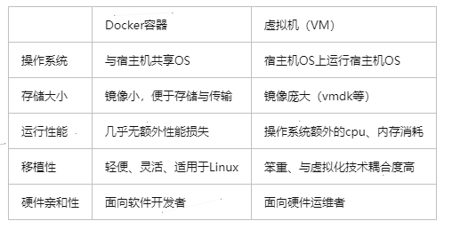

# Docker学习笔记

> 参考文献：
>
> [1]B站小狂神视频：https://www.bilibili.com/video/BV1og4y1q7M4
>
> [2]百度百科



# 1、概述

## 官网和百度百科介绍

官网：https://www.docker.com/

文档：https://docs.docker.com/

Docker 是一个开源的应用容器引擎，让开发者可以打包他们的应用以及依赖包到一个可移植的容器中,然后发布到任何流行的Linux机器或Windows 机器上,也可以实现虚拟化,容器是完全使用沙箱机制,相互之间不会有任何接口。

基于 Go 语言 并遵从 Apache2.0 协议开源。

<!-- more -->

## 什么是容器？

容器是打包代码及其所有依赖项的软件的标准单元，因此应用程序可以从一个计算环境快速可靠地运行到另一个计算环境。

Docker容器映像是轻巧的，独立的，可执行的软件软件包，其中包括运行应用程序所需的一切：代码，运行时，系统工具，系统库和设置。

容器映像在运行时成为容器，对于Docker容器，映像在容器[Docker Engine](https://www.docker.com/products/container-runtime)上运行时成为容器。不论基础架构如何，容器化软件都可用于基于Linux和Windows的应用程序，始终运行相同。容器将软件与其环境隔离开来，并确保尽管开发和登台之间存在差异，但软件仍可以均匀运行。

在Docker Engine上运行的Docker容器：

- **标准：** Docker创建了容器的行业标准，因此它们可以在任何地方移植
- **轻巧：**容器共享计算机的OS系统内核，因此不需要每个应用程序都具有OS，从而提高了服务器效率，并降低了服务器和许可成本
- **安全：**容器中的应用程序更安全，Docker提供业界最强大的默认隔离功能

## Docker架构

Docker 使用客户端-服务器 (C/S) 架构模式，使用远程API来管理和创建Docker容器。

Docker*客户端*与Docker*守护进程*进行对话，该*守护进程*完成了构建，运行和分发Docker容器的繁重工作。

Docker客户端和守护程序*可以* 在同一系统上运行，或者您可以将Docker客户端连接到远程Docker守护程序。

Docker客户端和守护程序在UNIX套接字或网络接口上使用REST API进行通信。另一个Docker客户端是Docker Compose，它使您可以处理由一组容器组成的应用程序。

Docker Hub是任何人都可以使用的公共注册表，并且Docker配置为默认在Docker Hub上查找映像

Docker 容器通过 Docker 镜像来创建。容器与镜像的关系类似于面向对象编程中的对象与类

一个完整的Docker有以下几个部分组成：

（1）Client客户端：客户端（`docker`）是许多Docker用户与Docker交互的主要方式。

（2）Daemon守护进程：守护程序（`dockerd`）侦听Docker API请求并管理Docker对象，例如图像，容器，网络和卷。守护程序还可以与其他守护程序通信以管理Docker服务。

（3）Image镜像：模板

（4）Container容器 ：基于模板的实例


> https://www.docker.com/resources/what-container

## Docker能干嘛

- 更快地交付和部署程序
- 更便捷的升级和扩缩容
- 更简单的系统运维
- 更高效的计算资源利用（在同一硬件上运行更多工作负载）

## 底层技术

Docker用[Go编程语言](https://golang.org/)编写，并利用Linux内核的多个功能来交付其功能。

Docker使用一种称为`namespaces`的技术来提供称为*容器*的隔离工作区。

运行容器时，Docker会为该容器创建一组 *名称空间*。这些名称空间提供了一层隔离。容器的每个方面都在单独的名称空间中运行，并且对其的访问仅限于该名称空间。

## docker为什么比虚拟机快

1.Docker有着比虚拟机更少的抽象层。Docker不需要实现硬件资源虚拟化，Docker容器上的程序直接使用的都是实际物理机的硬件资源，因此在CPU、内存利用率上Docker将会在效率上有明显优势。

2.Docker利用的是宿主机的内核，而不需要Guest OS，因此，当新建一个容器时，Docker不需要和虚拟机一样重新加载一个操作系统，避免了引导、加载操作系统内核这个比较费时费资源的过程，当新建一个虚拟机时，虚拟机软件需要加载Guest OS，这个新建过程是分钟级别的，而Docker由于直接利用宿主机的操作系统则省略了这个过程，因此新建一个Docker容器只需要几秒钟。



# 安装步骤

## 官方文档走下来

1、卸载旧版本

```bash
sudo apt-get remove docker docker-engine docker.io containerd runc
```

2、我们使用仓库来安装

```bash
$ sudo apt-get update

$ sudo apt-get install \
    apt-transport-https \
    ca-certificates \
    curl \
    gnupg \
    lsb-release \
    software-properties-common

$ curl -fsSL https://download.docker.com/linux/ubuntu/gpg | sudo apt-key add - # 官方
 
$ curl -fsSL https://mirrors.aliyun.com/docker-ce/linux/ubuntu/gpg | sudo apt-key add - # 国内

# 设置国内的仓库
$ sudo add-apt-repository "deb [arch=amd64] https://mirrors.aliyun.com/docker-ce/linux/ubuntu $(lsb_release -cs) stable"
  
# 更新包索引
$ sudo apt-get update
# 下载
sudo apt-get install docker-ce docker-ce-cli containerd.io
# 查看版本
$ docker version
# 测试
$ sudo docker run hello-world
################################一长串输出######################
Unable to find image 'hello-world:latest' locally
latest: Pulling from library/hello-world
0e03bdcc26d7: Pull complete 
Digest: sha256:95ddb6c31407e84e91a986b004aee40975cb0bda14b5949f6faac5d2deadb4b9
Status: Downloaded newer image for hello-world:latest

Hello from Docker!
This message shows that your installation appears to be working correctly.

To generate this message, Docker took the following steps:
 1. The Docker client contacted the Docker daemon.
 2. The Docker daemon pulled the "hello-world" image from the Docker Hub.
    (amd64)
 3. The Docker daemon created a new container from that image which runs the
    executable that produces the output you are currently reading.
 4. The Docker daemon streamed that output to the Docker client, which sent it
    to your terminal.

To try something more ambitious, you can run an Ubuntu container with:
 $ docker run -it ubuntu bash

Share images, automate workflows, and more with a free Docker ID:
 https://hub.docker.com/

For more examples and ideas, visit:
 https://docs.docker.com/get-started/
 
 # 查看镜像
$ docker images
## 输出 ##
REPOSITORY    TAG       IMAGE ID       CREATED         SIZE
hello-world   latest    bf756fb1ae65   13 months ago   13.3kB

```

## 卸载步骤

```bash
$ sudo apt-get purge docker-ce docker-ce-cli containerd.io
$ sudo rm -rf /var/lib/docker

# /var/lib/docker -->  docker 的默认工作目录
```

## 基本流程


# 常用命令


