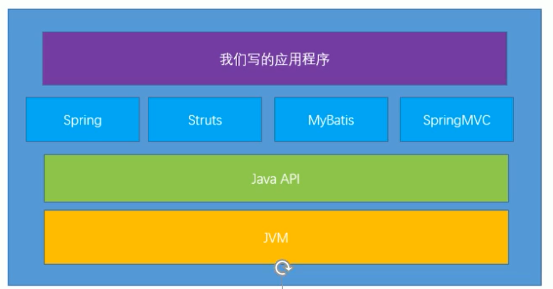
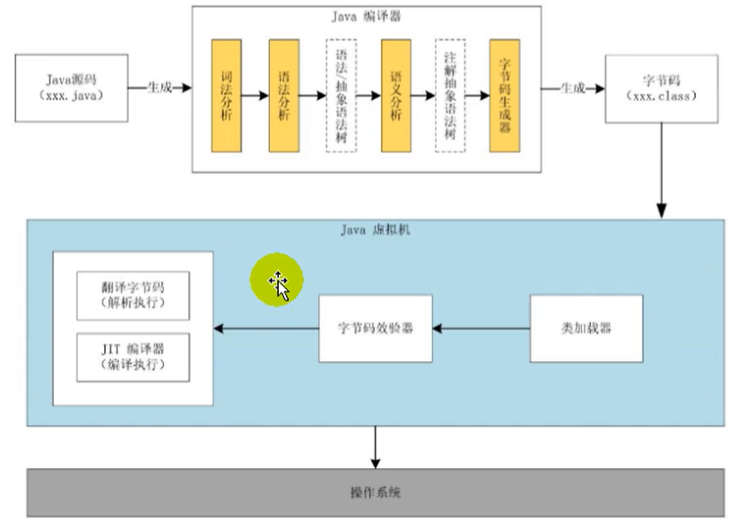

# JVM和Java体系结构

练好内功



## Java生态圈

Java是目前应用最为广泛的软件开发平台之一。随着Java以及Java社区的不断壮大Java 也早已不再是简简单单的一门计算机语言了，它更是一个平台、一种文化、一个社区。

- 作为一个平台，Java虚拟机扮演着举足轻重的作用
  - Groovy、Scala、JRuby、Kotlin等都是Java平台的一部分
- 作为灯种文化，Java几乎成为了“开源”的代名词。
  - 第三方开源软件和框架。如Tomcat、Struts，MyBatis，Spring等。
  - 就连JDK和JVM自身也有不少开源的实现，如openJDK、Harmony。


每个语言都需要转换成字节码文件，最后转换的字节码文件都能通过Java虚拟机进行运行和处理


随着Java7的正式发布，Java虚拟机的设计者们通过JSR-292规范基本实现在Java虚拟机平台上运行非Java语言编写的程序。

Java虚拟机根本不关心运行在其内部的程序到底是使用何种编程语言编写的，它只关心“字节码”文件。也就是说Java虚拟机拥有语言无关性，并不会单纯地与Java语言“终身绑定”，只要其他编程语言的编译结果满足并包含Java虚拟机的内部指令集、符号表以及其他的辅助信息，它就是一个有效的字节码文件，就能够被虚拟机所识别并装载运行。

## 字节码

我们平时说的java字节码，指的是用java语言编译成的字节码。准确的说任何能在jvm平台上执行的字节码格式都是一样的。所以应该统称为：jvm字节码。

不同的编译器，可以编译出相同的字节码文件，字节码文件也可以在不同的JVM上运行。

Java虚拟机与Java语言并没有必然的联系，它只与特定的二进制文件格式—Class文件格式所关联，Class文件中包含了Java虚拟机指令集（或者称为字节码、Bytecodes）和符号表，还有一些其他辅助信息。

##  Java虚拟机

Java虚拟机是一台执行Java字节码的虚拟计算机，它拥有独立的运行机制，其运行的Java字节码也未必由Java语言编译而成。

JVM平台的各种语言可以共享Java虚拟机带来的跨平台性、优秀的垃圾回器，以及可靠的即时编译器。

Java技术的核心就是Java虚拟机（JVM，Java Virtual Machine），因为所有的Java程序都运行在Java虚拟机内部。

Java虚拟机就是二进制字节码的运行环境，负责装载字节码到其内部，解释/编译为对应平台上的机器指令执行。每一条Java指令，Java虚拟机规范中都有详细定义，如怎么取操作数，怎么处理操作数，处理结果放在哪里。

特点：

- 一次编译，到处运行
- 自动内存管理
- 自动垃圾回收功能

## JVM整体结构

- HotSpot VM是目前市面上高性能虚拟机的代表作之一。
- 它采用解释器与即时编译器并存的架构。
- 在今天，Java程序的运行性能早已脱胎换骨，已经达到了可以和C/C++程序一较高下的地步。


执行引擎包含三部分：解释器，及时编译器，垃圾回收器

## Java代码执行流程



只是能生成被Java虚拟机所能解释的字节码文件，那么理论上就可以自己设计一套代码了

## JVM的架构模型

Java编译器输入的指令流基本上是一种**基于栈**的指令集架构，另外一种指令集架构则是基于寄存器的指令集架构。具体来说：这两种架构之间的区别：

基于栈式架构的特点

- 设计和实现更简单，适用于资源受限的系统；
- 避开了寄存器的分配难题：使用零地址指令方式分配。
- 指令流中的指令大部分是零地址指令，其执行过程依赖于操作栈。指令集更小，编译器容易实现。
- 不需要硬件支持，可移植性更好，更好实现跨平台

基于寄存器架构的特点

- 典型的应用是x86的二进制指令集：比如传统的PC以及Android的Davlik虚拟机。
- 指令集架构则完全依赖硬件，可移植性差
- 性能优秀和执行更高效
- 花费更少的指令去完成一项操作。
- 在大部分情况下，基于寄存器架构的指令集往往都以一地址指令、二地址指令和三地址指令为主，而基于栈式架构的指令集却是以零地址指令为主方水洋

### 测试用例

```java
package com.tcmyxc;

public class StackSturTest {

    public static void main(String[] args) {
        int i = 2;
        int j = 3;
        int k = i + j;
    }
}
```

反编译

```bash
javap -v StackSturTest.class
```

输出

```tex
public static void main(java.lang.String[]);
    descriptor: ([Ljava/lang/String;)V
    flags: ACC_PUBLIC, ACC_STATIC
    Code:
      stack=2, locals=4, args_size=1
         0: iconst_2
         1: istore_1
         2: iconst_3
         3: istore_2
         4: iload_1
         5: iload_2
         6: iadd
         7: istore_3
         8: return
      LineNumberTable:
        line 6: 0
        line 7: 2
        line 8: 4
        line 9: 8
      LocalVariableTable:
        Start  Length  Slot  Name   Signature
            0       9     0  args   [Ljava/lang/String;
            2       7     1     i   I
            4       5     2     j   I
            8       1     3     k   I
```


由于跨平台性的设计，Java的指令都是根据栈来设计的。不同平台CPU架构不同，所以不能设计为基于寄存器的。优点是跨平台，指令集小，编译器容易实现，缺点是性能下降，实现同样的功能需要更多的指令。

## JVM生命周期

### 虚拟机的启动

启动是通过引导类加载器（bootstrap class loader）创建一个初始类（initial class）来完成的，这个类是由虚拟机的具体实现指定的。

### 虚拟机的执行

- 一个运行中的Java虚拟机有着一个清晰的任务：执行Java程序。
- 程序开始执行时他才运行，程序结束时他就停止。
- 执行一个所谓的Java程序的时候，真真正正在执行的是一个叫做Java虚拟机的进程。

### 虚拟机的退出

有如下的几种情况：

- 程序正常执行结束
- 程序在执行过程中遇到了异常或错误而异常终止
- 由于操作系统用现错误而导致Java虚拟机进程终止
- 某线程调用Runtime类或system类的exit方法，或Runtime类的halt方法，并且Java安全管理器也允许这次exit或halt操作。
- 除此之外，JNI（Java Native Interface）规范描述了用JNI Invocation API来加载或卸载 Java虚拟机时，Java虚拟机的退出情况。

## Hotspot

热点代码探测技术

- 通过计数器找到最具编译价值的代码，从而触发即时编译或者栈上替换
- 通过编译器和解释器协同工作，在最优的程序响应时间和最佳的执行性能中取得平衡


