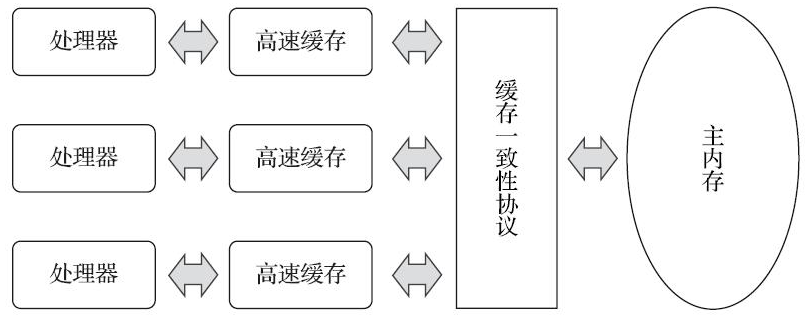
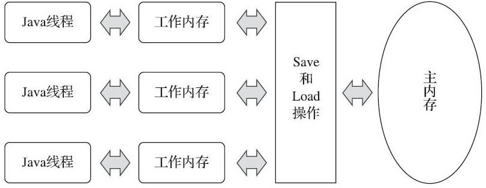

# Java内存模型

缓存一致性：为了解决多个处理器的运算任务都涉及同一块主内存区域时，可能导致各自的缓存数据不一致的问题。

指令重排：为了使处理器内部的运算单元能尽量被充分利用，处理器可能会对输入代码进行乱序执行（Out-Of-Order Execution）优化，处理器会在计算之后将乱序执行的结果重组，保证该结果与顺序执行的结果是一致的，但并不保证程序中各个语句计算的先后顺序与输入代码中的顺序一致，因此如果存在一个计算任务依赖另外一个计算任务的中间结果，那么其顺序性并不能靠代码的先后顺序来保证。与处理器的乱序执行优化类似，Java虚拟机的即时编译器中也有**指令重排序**（Instruction Reorder）优化

Java内存模型在JDK5实现了JSR-133之后才成熟完善

> JSR-133：Java内存模型和线程规范修订版
>
> https://jcp.org/aboutJava/communityprocess/final/jsr133/index.html
>
> 中文版：http://ifeve.com/jsr133-cn/

## 目的

定义程序中各种变量的访问规则，即关注在虚拟机中把变量值存储到内存和从内存中取出变量值这样的底层细节

所有的变量都存储在主内存。线程对变量的所有操作（读取、赋值等）都必须在工作内存中进行，而不能直接读写主内存中的数据。不同的线程之间也无法直接访问对方工作内存中的变量，线程间变量值的传递均需要通过主内存来完成

## 内存交互操作

定义了8中操作，每种都是原子的，不可分的

