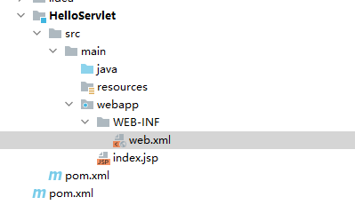
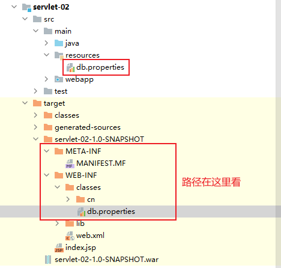
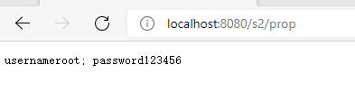
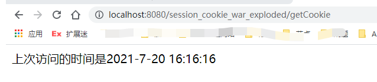
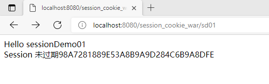

<center><font size="48px"><b>JavaWeb</b></font></center>

# Servlet

## 简介

Servlet（Server Applet）是[Java](https://baike.baidu.com/item/Java/85979) Servlet的简称，称为小服务程序或服务连接器，用Java编写的[服务器](https://baike.baidu.com/item/服务器/100571)端程序，具有独立于平台和[协议](https://baike.baidu.com/item/协议/13020269)的特性，主要功能在于交互式地浏览和生成数据，生成动态[Web](https://baike.baidu.com/item/Web/150564)内容。

广义的Servlet是指任何实现了Servlet接口的类

Servlet运行于支持Java的应用服务器中。从原理上讲，Servlet可以响应任何类型的请求，但绝大多数情况下Servlet只用来扩展基于HTTP协议的Web服务器。

【总结】实现了servlet接口的java程序，就是servlet

<!-- more -->

## HelloServlet

Servlet接口Sun公司有两个默认的实现类：HttpServlet，GenericServlet

1. maven模板，webapp，修改web.xml（这部分看自己tomcat服务器web.xml是啥，然后复制个头文件过来就行）

   ```xml
   <?xml version="1.0" encoding="UTF-8" ?>
   <web-app xmlns="http://xmlns.jcp.org/xml/ns/javaee"
            xmlns:xsi="http://www.w3.org/2001/XMLSchema-instance"
            xsi:schemaLocation="http://xmlns.jcp.org/xml/ns/javaee
                         http://xmlns.jcp.org/xml/ns/javaee/web-app_4_0.xsd"
            version="4.0"
            metadata-complete="true">
   
     
   </web-app>
   ```

   

2. 将项目的结构补充完整，java和resources

   

   

3. 编写一个Servlet程序

   - 编写一个普通的类

   - 实现Servlet接口，这里我们直接继承HttpServlet

     ```java
     public class HelloServlet extends HttpServlet {
     
         // 由于get或者post只是实现方式不同，可以互相调用，业务逻辑都一样
         @Override
         protected void doGet(HttpServletRequest req, HttpServletResponse resp) throws ServletException, IOException {
             PrintWriter writer = resp.getWriter();
     
             writer.print("Hello Servlet!");
         }
     
         @Override
         protected void doPost(HttpServletRequest req, HttpServletResponse resp) throws ServletException, IOException {
             doGet(req, resp);
         }
     }
     ```

4. 编写Servlet的映射

   - 为什么需要映射？

     - 因为我们写的是java程序，但是要通过浏览器访问，浏览器访问需要连接服务器，所以我们需要在web服务中注册我们写的Servlet，还需要给个URL路径

       ```xml
       <!--注册servlet-->
       <servlet>
           <servlet-name>hello</servlet-name>
           <servlet-class>com.tcmyxc.servlet.HelloServlet</servlet-class>
       </servlet>
       <!--servlet请求路径-->
       <servlet-mapping>
           <servlet-name>hello<</servlet-name>
               <url-pattern>/hello</url-pattern>
       </servlet-mapping>
       ```

       

5. 配置Tomcat

   - 注意配置项目发布的路径

   

6. 启动测试


从 Servlet3 开始，也可以使用注解开发

1、修改 web.xml 根标签的属性 metadata-complete 为 false

```xml
<web-app xmlns="http://xmlns.jcp.org/xml/ns/javaee"
         xmlns:xsi="http://www.w3.org/2001/XMLSchema-instance"
         xsi:schemaLocation="http://xmlns.jcp.org/xml/ns/javaee
                      http://xmlns.jcp.org/xml/ns/javaee/web-app_4_0.xsd"
         version="4.0"
         metadata-complete="false">
```

2、使用注解开发，不需要在 web.xml 中配置这个 servlet

```java
@WebServlet(name = "hello-servlet", value = "/hello")
public class HelloServlet extends HttpServlet {

    @Override
    protected void doGet(HttpServletRequest req, HttpServletResponse resp) throws ServletException, IOException {
        PrintWriter writer = resp.getWriter();// 响应流
        writer.write("Hello Servlet");
        writer.close();
    }

    @Override
    protected void doPost(HttpServletRequest req, HttpServletResponse resp) throws ServletException, IOException {
        doGet(req, resp);
    }
}
```

## Servlet原理

Servlet由Web服务器调用


## Mapping

1. 一个 Servlet 可以指定一个路径

2. 一个 Servlet 可以指定多个路径

3. 一个 Servlet 可以指定通用路径

   ```xml
   <servlet-mapping>
       <servlet-name>hello-servlet</servlet-name>
       <url-pattern>/hello/*</url-pattern>
   </servlet-mapping>
   ```

4. 可以自定义后缀，但是 `*` 前面不能加任何东西

   ```xml
   <servlet-mapping>
       <servlet-name>hello-servlet</servlet-name>
       <url-pattern>*.do</url-pattern>
   </servlet-mapping>
   ```


## ServletContext

每个 web 程序都有一个 ServletContext 对象，代表当前的 web 应用

### 1、共享数据

（方便不同 servlet 之间共享数据），一个设置属性的 k, v，另外一个根据属性的 k 获取 v

```java
@WebServlet(name = "helloServlet", value = "/hello")
public class HelloServlet extends HttpServlet {
    @Override
    protected void doGet(HttpServletRequest req, HttpServletResponse resp) 
        throws ServletException, IOException {
        ServletContext servletContext = this.getServletContext();
        servletContext.setAttribute("name", "徐文祥");// 设置值
        resp.getWriter().write("Hello");
    }

    @Override
    protected void doPost(HttpServletRequest req, HttpServletResponse resp) 
        throws ServletException, IOException {
        doGet(req, resp);
    }
}
```


```java
@WebServlet(name = "getHelloMsgServlet", value = "/getMsg")
public class GetHelloMsgServlet extends HttpServlet {

    @Override
    protected void doPost(HttpServletRequest req, HttpServletResponse resp) 
        throws ServletException, IOException {
        doGet(req, resp);
    }

    @Override
    protected void doGet(HttpServletRequest req, HttpServletResponse resp) 
        throws ServletException, IOException {
        ServletContext servletContext = this.getServletContext();
        String name = (String) servletContext.getAttribute("name");// 取值
        resp.setContentType("text/html;charset=utf-8");
        resp.getWriter().write("名字是" + name);
    }
}
```


### 2、获取初始化参数

首先在 `web.xml` 中配置

```xml
<!-- 配置初始化的参数-->
<context-param>
    <param-name>jdbcUrl</param-name>
    <param-value>jdbc:mysql://localhost:3306/mybatis</param-value>
</context-param>
```

```java
@WebServlet(name = "getInitparameterServlet", value = "/jdbcUrl")
public class GetInitparameterServlet extends HelloServlet{

    @Override
    protected void doPost(HttpServletRequest req, HttpServletResponse resp) 
        throws ServletException, IOException {
        doGet(req, resp);
    }

    @Override
    protected void doGet(HttpServletRequest req, HttpServletResponse resp) 
        throws ServletException, IOException {
        ServletContext servletContext = this.getServletContext();
        String jdbcUrl = servletContext.getInitParameter("jdbcUrl");
        resp.setContentType("text/html;charset=utf-8");
        resp.getWriter().write("jdbcUrl: " + jdbcUrl);
    }
}
```

结果：


### 3、请求转发

转发不会改变路径

```java
@WebServlet(name = "dispatcherServlet", value = "/dis")
public class DispatcherServlet extends HttpServlet {

    @Override
    protected void doGet(HttpServletRequest req, HttpServletResponse resp) throws ServletException, IOException {
        ServletContext servletContext = this.getServletContext();
        // 请求转发,将/dis 转发到 /hello
        servletContext.getRequestDispatcher("/hello").forward(req, resp);
    }

    @Override
    protected void doPost(HttpServletRequest req, HttpServletResponse resp) throws ServletException, IOException {
        doGet(req, resp);
    }
}
```

### 4、读取资源文件

Properties 需要一个输入流，那我们就构造出来一个



```java
@WebServlet(name = "propertiesServlet", value = "/prop")
public class PropertiesServlet extends HttpServlet {

    @Override
    protected void doGet(HttpServletRequest req, HttpServletResponse resp) throws ServletException, IOException {
        // 从资源文件中加载输入流
        InputStream resourceAsStream = this.getServletContext().getResourceAsStream("/WEB-INF/classes/db.properties");
        Properties properties = new Properties();
        properties.load(resourceAsStream);
        String username = properties.getProperty("username");
        String password = properties.getProperty("password");

        // 输出
        resp.getWriter().write("username" + username + "; password" + password);
    }

    @Override
    protected void doPost(HttpServletRequest req, HttpServletResponse resp) throws ServletException, IOException {
        doGet(req, resp);
    }
}
```


测试：



## HttpServletResponse

服务器收到客户端的 http 请求，针对这个请求，会创建一个代表请求的 HttpServletRequest 和代表响应的 HttpServletResponse

先看一下本身的方法


再看看从父类继承的方法


### 分类

#### 发送数据的方法

```java
public ServletOutputStream getOutputStream() throws IOException;

public PrintWriter getWriter() throws IOException;
```


#### 设置响应头的方法

```java
public void setCharacterEncoding(String charset);

public void setHeader(String name, String value);

等等
```

#### 状态码

```java
public static final int SC_OK = 200;
public static final int SC_MULTIPLE_CHOICES = 300;
```

### 常见的应用

#### （1）向浏览器发送消息

#### （2）下载文件

- 获取下载文件的路径、文件名
- 让浏览器支持下载我们需要的东西
- 获取下载的输入流
- 创建缓冲区
- 获取输出流
- 将 FileOutputStream 流写入buffer 缓冲区
- 使用输出流将缓冲区的数据输出到客户端

```java
@WebServlet(name = "fileServlet", value = "/getImg")
public class FileServlet extends HttpServlet {

    @Override
    protected void doGet(HttpServletRequest req, HttpServletResponse resp) throws ServletException, IOException {
//        - 获取下载文件的路径、文件名
        String realPath = this.getServletContext().getRealPath("/WEB-INF/classes/img/徐文祥.png");
        System.out.println("realPath: " + realPath);

        String filename = realPath.substring(realPath.lastIndexOf("\\") + 1);
        System.out.println("filename: " + filename);
//        - 让浏览器支持下载我们需要的东西，同时设置中文支持
        resp.setHeader("Content-disposition","attachment;filename=" + URLEncoder.encode(filename, "UTF-8"));
//        - 获取下载的输入流
        FileInputStream fileInputStream = new FileInputStream(new File(realPath));
//        - 创建缓冲区
        int len = 0;
        byte[] buffer = new byte[1024];

//        - 获取输出流
        ServletOutputStream outputStream = resp.getOutputStream();
//        - 将 FileOutputStream 流写入buffer 缓冲区，使用输出流将缓冲区的数据输出到客户端
        while((len = fileInputStream.read(buffer)) > 0 ){
            outputStream.write(buffer, 0, len);
        }

        fileInputStream.close();
        outputStream.close();
    }

    @Override
    protected void doPost(HttpServletRequest req, HttpServletResponse resp) throws ServletException, IOException {
        doGet(req, resp);
    }
}
```

#### （3）验证码功能

- 前端实现
- 后端实现，需要用到 Java 的图片类，生成一个图片

```java
@WebServlet(name = "imageServlet", value = "/getNum")
public class ImageServlet extends HttpServlet {
    @Override
    protected void doGet(HttpServletRequest req, HttpServletResponse resp) throws ServletException, IOException {
        // 如何让浏览器 5 秒刷新一次
        resp.setHeader("refresh", "5");
        // 在内存中创建一个图片
        BufferedImage image = new BufferedImage(80, 20, BufferedImage.TYPE_INT_RGB);
        // 得到图片
        Graphics2D graphics = (Graphics2D) image.getGraphics();// 笔
        // 设置笔的颜色
        graphics.setColor(Color.white);
        graphics.fillRect(0, 0, 80, 20);
        // 给图片写数据
        graphics.setColor(Color.red);
        graphics.drawString(makeNumber(), 0, 20);

        // 告诉浏览器，这个请求用图片方式打开
        resp.setContentType("image/png");
        // 网站是有缓存的，不让浏览器缓存
        resp.setDateHeader("expires", -1);
        resp.setHeader("Cache-Control", "no-cache");
        resp.setHeader("Pragma", "no-cache");

        // 写给浏览器
        ImageIO.write(image, "png", resp.getOutputStream());
    }

    @Override
    protected void doPost(HttpServletRequest req, HttpServletResponse resp) throws ServletException, IOException {
        doGet(req, resp);
    }

    // 生成随机数
    private String makeNumber(){
        Random random = new Random();
        String num = random.nextInt(9999) + "";
        StringBuffer sb = new StringBuffer();
        for(int i=0; i<4-num.length(); i++){
            sb.append("0");
        }
        return sb.toString() + num;
    }
}
```

#### （4）重定向（掌握）

##### 例子1

```java
@WebServlet(name = "redirectServlet", value = "/redirect")
public class RedirectServlet extends HttpServlet {

    @Override
    protected void doGet(HttpServletRequest req, HttpServletResponse resp) throws ServletException, IOException {
        resp.sendRedirect("/r/getNum");// 需要加上项目的路径
    }

    @Override
    protected void doPost(HttpServletRequest req, HttpServletResponse resp) throws ServletException, IOException {
        doGet(req, resp);
    }
}
```


重定向和换发的区别：

- 转发的时候 URL 不会发生变化
- 重定向 URL 会发生变化

##### 例子2

```java
@WebServlet(name = "requestTest", value = "/login")
public class RequestTest extends HttpServlet {

    @Override
    protected void doGet(HttpServletRequest req, HttpServletResponse resp) throws ServletException, IOException {
        System.out.println("进入 RequestTest");
        System.out.println(req.getParameter("username"));
        System.out.println(req.getParameter("password"));
        resp.sendRedirect("/r/success.jsp");
    }

    @Override
    protected void doPut(HttpServletRequest req, HttpServletResponse resp) throws ServletException, IOException {
        doGet(req, resp);
    }
}
```


**前端页面**

登录页面

```jsp
<%@ page contentType="text/html; charset=UTF-8" pageEncoding="UTF-8" %>
<!DOCTYPE html>
<html>
<head>
    <title>JSP - Hello World</title>
</head>
<body>
<h1><%= "Hello World!" %>
</h1>

<%-- 这里提交的路径需要找到项目的路径--%>
<%-- ${pageContext.request.contextPath} 代表当前项目--%>
<form action="${pageContext.request.contextPath}/login" method="get">
    用户名：<input type="text" name="username"><br>
    密码：<input type="password" name="password"><br>
    <input type="submit">
</form>
</body>
</html>
```


登录后页面：

```jsp
<%@ page contentType="text/html; charset=UTF-8" pageEncoding="UTF-8" %>
<!DOCTYPE html>
<html>
<head>
    <title>JSP - Hello World</title>
</head>
<body>
<h1><%= "Hello World!" %>
</h1>
<h1>Success 页面</h1>
</body>
</html>
```


**测试：**

（1）


（2）


（3）


## HttpServletRequest

前端的 http 请求会被封装到 HttpServletRequest 中，我们通过 HttpServletRequest 的各种方法可以得到客户端发来的各种信息

### 获取前端发送的参数、请求转发

Servlet

```java
@WebServlet(name = "requestServletDemo", value = "/login")
public class RequestServletDemo extends HttpServlet {

    @Override
    protected void doGet(HttpServletRequest req, HttpServletResponse resp) throws ServletException, IOException {
        doPost(req, resp);
    }

    @Override
    protected void doPost(HttpServletRequest req, HttpServletResponse resp) throws ServletException, IOException {
        // 获取参数的名字
        Enumeration<String> e = req.getParameterNames();
        while (e.hasMoreElements()) {
            System.out.println(e.nextElement());
        }

        System.out.println(req.getParameter("username"));
        System.out.println(req.getParameter("password"));
        
        // 通过请求转发
        // 这里的 / 代表当前项目
        req.getRequestDispatcher("/success.jsp").forward(req, resp);
    }
}
```


前端页面跟上面的一样

测试结果：

```tex
username
password
123
1234567890
```


转发（URL没变）

## Session和Cookie

session：客户端和服务器的一次交互就是会话

cookie：服务器发给客户端的令牌，客户端每次访问需要带着这个令牌访问，不然我不承认

### Cookie 示例

1、从请求中拿 Cookie

```java
WebServlet(name = "cookieDemo", value = "/getCookie")
public class CookieDemo extends HttpServlet {

    @Override
    protected void doGet(HttpServletRequest req, HttpServletResponse resp) throws ServletException, IOException {
        // 防止中文乱码
        req.setCharacterEncoding("utf-8");
        resp.setCharacterEncoding("utf-8");
        resp.setContentType("text/html;charset=utf-8");

        PrintWriter out = resp.getWriter();

        // 从客户端获取cookie
        Cookie[] cookies = req.getCookies();
        // 判断 cookie 是否为空
        if(cookies != null){
            // 如果存在，就遍历一下
            for(Cookie cookie : cookies){
                if (cookie.getName().equals("lastLoginName")) {
                    long lastLoginName = Long.parseLong(cookie.getValue());
                    Date date = new Date(lastLoginName);
                    out.write("上次访问的时间是" + date.toLocaleString());
                }
            }
        }
        else{
            out.write("这是您近期第一次访问本站");
        }

        // 给客户端响应一个 cookie
        Cookie cookie = new Cookie("name", "徐文祥");
        Cookie cookie2 = new Cookie("lastLoginName", System.currentTimeMillis() + "");
        resp.addCookie(cookie);
        resp.addCookie(cookie2);
    }

    @Override
    protected void doPost(HttpServletRequest req, HttpServletResponse resp) throws ServletException, IOException {
        doGet(req, resp);
    }
}
```

**运行结果**



**浏览器 Cookie 查看**


- 一个 Cookie 只能保存一个信息
- 可以有多个 Cookie 发给服务器
-  一个站点最多放 20 个，浏览器上限300个
- Cookie 大小有限制，最多4kb


如何删除 Cookie？

- 不设置有效期（即过期时间为0），关闭就没了

### Session（重点）

- 服务器会给每一个用户（浏览器）创建一个 Session 对象
- 一个 Session 独占一个浏览器，只要浏览器没关、Sesion 就存在
- 用户登录之后，整个网站都能访问


Session 和 Cookie 的区别


**代码示例**

```java
@WebServlet(name = "sessionDemo01", value = "/sd01")
public class SessionDemo01 extends HttpServlet {

    @Override
    protected void doGet(HttpServletRequest req, HttpServletResponse resp) throws ServletException, IOException {
        // 防止中文乱码
        req.setCharacterEncoding("utf-8");
        resp.setCharacterEncoding("utf-8");
        resp.setContentType("text/html;charset=utf-8");

        PrintWriter out = resp.getWriter();
        out.write("Hello sessionDemo01<br/>");
        // 获取 session
        HttpSession session = req.getSession();
        session.setAttribute("name", "徐文祥");
        System.out.println(session.getId());
        System.out.println(session.isNew());
        if(session.isNew()){
            out.write("Sesssion 创建成功" + session.getId());
        }
        else{
            out.write("Session 未过期" + session.getId());
        }
    }

    @Override
    protected void doPost(HttpServletRequest req, HttpServletResponse resp) throws ServletException, IOException {
        doGet(req, resp);
    }
}
```





从这里我们可以看出，Cookie 里面放了 Session 的 ID，然后每次访问，带着这个 ID 访问，服务器就能识别出这个是哪个 Session

> 注销 Session ，手动注销，然后使生效即可（调用 invalidate 方法）


Session 过期时间在 `web.xml` 文件配置

## JSP

### 定义

> JSP（全称JavaServer Pages）是由Sun Microsystems公司主导创建的一种动态网页技术标准。JSP部署于网络服务器上，可以响应客户端发送的请求，并根据请求内容动态地生成HTML、XML或其他格式文档的Web网页，然后返回给请求者。JSP技术以Java语言作为脚本语言，为用户的HTTP请求提供服务，并能与服务器上的其它Java程序共同处理复杂的业务需求。

### JSP 原理

JSP 本质上就是一个 Servlet

## 过滤器

## MVC架构


