# Java基础知识复习

[TOC]

## 概述

1. 一个Java程序至少要有一个类

2. 为了运行某个类，这个类必须要有main方法

3. 源文件名和公用类名必须完全相同

4. 编译和运行

   ```bash
   javac Hello.java
   java Hello
   ```

5. Java源程序区分大小写

## 基础知识

从控制台读取数据

```java
Scanner input = new Scanner(System.in);
```

声明常量

```java
final datatype CONSTANTNAME = VALUE;
```

基本数据类型有8种：

- int
- short
- long
- byte
- char
- float
- double
- boolean


【注意】

- 使用时，long型加个l，float加个f
- 缩窄需要显示转换


String是引用类型

文档注释以`/**`开始，以`*/`结束

字符串转数字：

```java
int intValue = Integer.parseInt(intString);
double doubleValue = Double.parseDouble(doubleString);
```

格式化输出

```java
System.out.printf(...);
%c	-> 字符;
%b	-> 布尔值;
%d	-> 整数;
%f	-> 浮点数;
%e	-> 浮点数，科学计数法;
%s	-> 字符串;   
```

**switch表达式支持**

1.5之前：`int`，`short`，`char`，`byte`

1.5：枚举类和上述的包装类

1.7：支持`String`


输入输出重定向

```shell
java ClassName < input.txt
java ClassName > output.txt
也可以同时用
java ClassName < input.txt > output.txt
```


定义方法：

```java
修饰符 返回值类型 方法名(参数列表){
    // 方法体
}
```

`main`方法是Java虚拟机调用的

方法重载：必须有不同的参数列表

方法签名：方法名+参数列表

`for-each`循环：

```java
for(doule u: myList){
    // 一些语句
}
```

数组创建之后大小不能更改！

创建二维数组时必须指定第一个下标！

数组复制的三种方法：

- 循环语句逐个来
- 使用`System`类的`arraycopy`静态方法（复制前需要创建目标数组，同时分配好空间）

- 使用`clone`方法

**数组名作为方法的参数，必须加括号！传的是引用**

`Arrays`类：

- `java.util.Arrays`类有很多静态方法

- sort方法

  ```java
  Arrays.sort(数组名);
  Arrays.sort(数组名, beginIndex, endIndex);
  ```

- binSearch二分查找法

  ```java
  Arrays.binSearch(数组名, key);
  ```

- equals方法

- fill方法填充数组

## 类和对象

1. 两个类可以在同一个文件，但是只有一个公共类！

2. 想要new一个对象，必须提供构造方法！

3. 有个隐含的无参构造，只有啥构造方法都没写的时候，才会用它。

4. 类的数据成员有默认值！引用类型的是`null`

5. 静态变量可以被类的所有实例共享

6. 静态方法使用时无须创建类的实例

7. 类的常量应该声明为`final static`

8. 静态方法和静态变量可以通过引用变量（类的实例）或它们的类名（推荐，也是标准用法）来调用

9. 静态方法里面只能使用静态变量和静态方法

10. 可见性修饰符

    - public
    - private
    - protected
    - 啥都不写，那就包内可见


## 文件IO以及常用的几个类

### `String`类

- `valueOf `方法可以将字符和数字转字符串
- 对象一旦创建，值就不能改了


8种基本的数据类型都有包装类


### `StringBuilder`类和`StringBuffer`类

- 可追加，可修改，可删除
- `StringBuffer`修改缓存区的方法是同步的，适合多线程并发访问，保证数据一致性
- `StringBuilder`适合单线程访问


### 文件类`File`

- 不包含读写文件的方法
- 包含了很多获取文件属性的方法
- 重命名和删除文件的方法也有
- 创建一个File实例不会在机器上创建一个文件出来，而且不管这个文件是否存在，文件对象都能创建成功

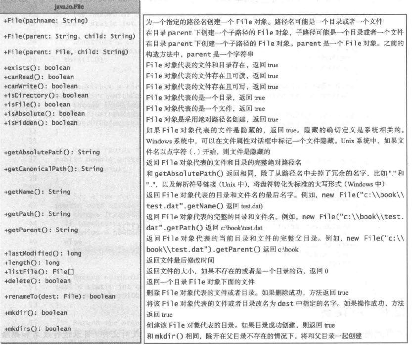


### Java的I/O类

#### `Scanner`类和`PrintWrite`类

##### `Scanner`类

- 一般是从`System.in`创建，但是也可以从字符串，文件创建
- 读完文件最好关闭，可以释放资源


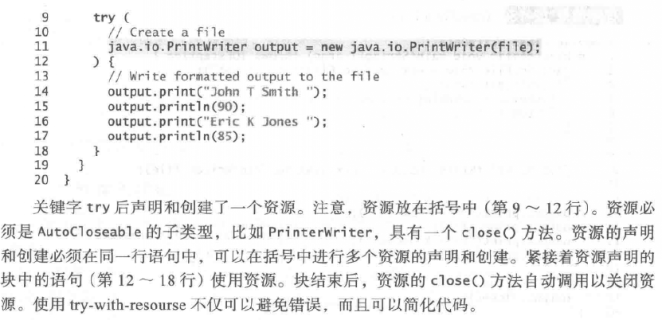


##### `PrintWrite`类

- 用来创建一个文件并向文件中写数据
- 如果文件存在，则会删除原有的内容
- 必须使用close方法关闭文件，不然文件不能正确保存

```java
import java.io.File;
import java.io.FileNotFoundException;
import java.io.PrintWriter;

public class WriteData {
    public static void main(String[] args) throws FileNotFoundException {
        File file = new File("data.txt");
        if(file.exists()){
            System.out.println("文件已存在");
            System.exit(0);
        }

        PrintWriter output = new PrintWriter(file);

        // 一些语句

        output.close();
    }
}
```


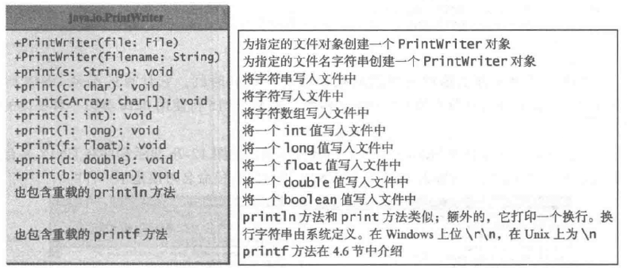


#### 二进制I/O

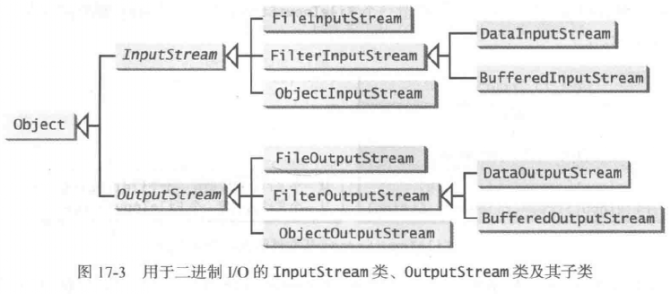


##### `FileInputStream`和`FileOutputStream`


##### `FilterInputStream`和`FilterOutputStream`


##### `DataInputStream`和`DataOutputStream`

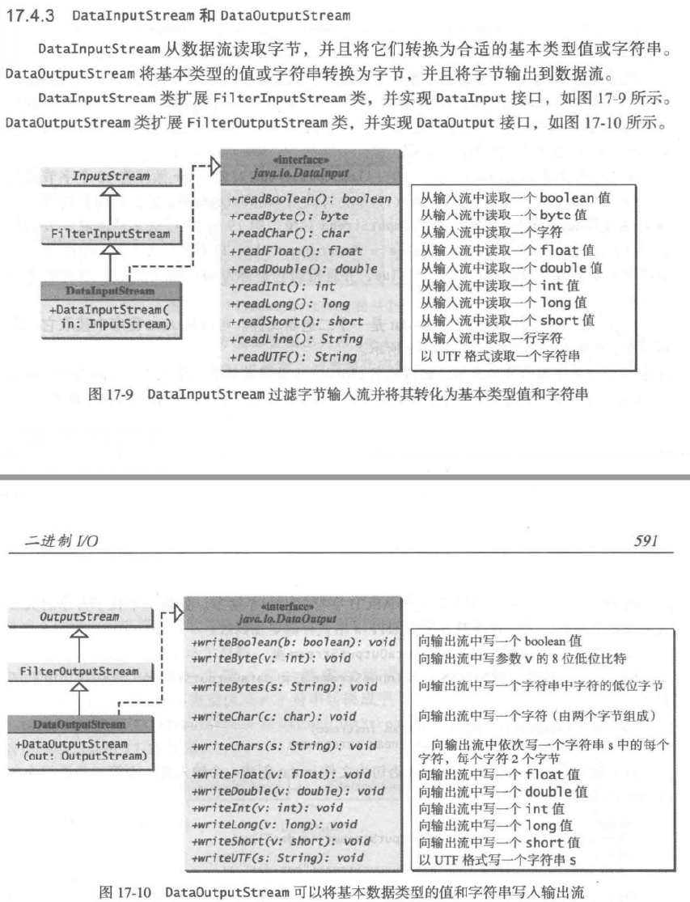


##### `BufferedInputStream`和`BufferedOutputStream`

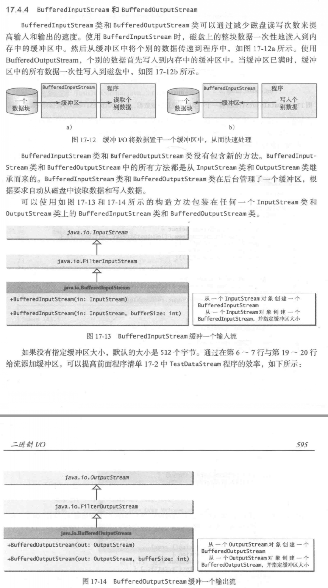


##### `ObjectlnputStream` 类和`ObjectOutputStream` 类

- ObjectlnputStream 类和ObjectOutputStream 类可以用于读/ 写可序列化的对象


##### `RandomAccessFile` 类

- 允许在文件的任意位置上进行读写

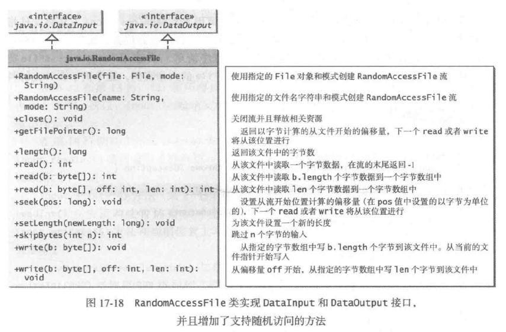


### `ArrayList`

- 存储不定个数的对象（弥补了数组一旦创建大小就固定的遗憾）
- 不能存储基本数据类型（那就用包装的类呗）
- 有很多使用的方法，比如contains方法


### 包装类

- 包装类没有无参构造
- 包装类的实例是不可变的


### `BigInteger`类和`BigDecimal`类

- 不可变的
- 可表示任意大小的数


## 关于对象的思考

### `this`引用

指向调用对象本身的引用

- 引用类的隐藏数据域（参数的变量名和数据域名相同，那数据域就被隐藏了）
- 让构造方法调用同一个类的另一个构造方法（this语句需要放在最前面）

### 类的设计原则

- 内聚性（单个职责）
- 一致性（设计风格一致，显式提供公共默认无参构造）
- 封装性（数据域私有）
- 清晰性
- 完整性
- 实例和静态
  - 某个方法如果不依赖具体的实例，那就应该是静态的
  - 不用构造方法初始化静态数据域，使用set方法设置


## 继承和多态

`Java`不支持多继承，想要多继承，就用接口

`super`关键字：调用父类的方法和构造方法

子类可以重写父类的方法，但是，方法名，返回值类型，参数类型都不能变

静态方法不能重写

可以使用`final`关键字声明某个类或者方法是不可被继承或者不能被重写的

### 多态

总是可以将子类的对象初始化基类的引用

### 动态绑定


## lambda表达式

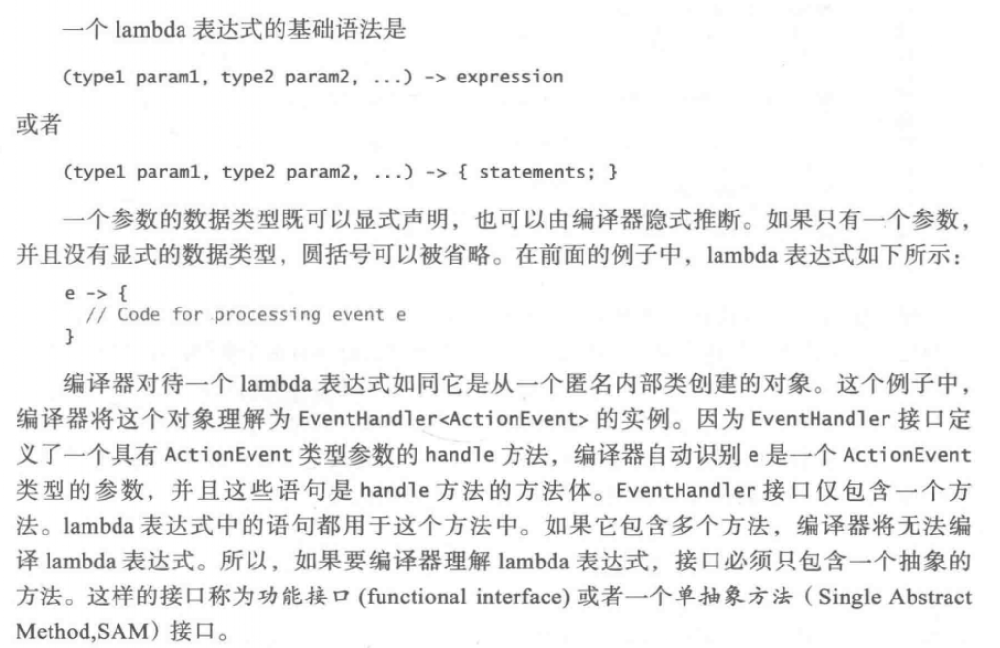


## 异常处理

```java
try{
    statements;
}
catch(Exception1 exVar1){
    statements;
}
catch(Exception2 exVar2){
    statements;
}
...
catch(ExceptionN exVarN){
    statements;
}
finally{
    
}
```


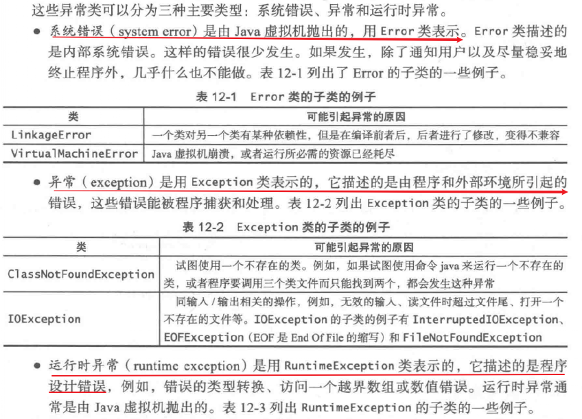


## 抽象类和接口

接口：为了定义多个类（尤其是不相关的类）的共同行为

抽象类：很抽象的类，只定义不实现

### 抽象类

- `abstract`关键字

  ```java
  public abstract class 类名{
      // 实现
  }
  ```

- 不能new对象

- 构造方法`ptotected`（因为只能被自己的子类用）

- 有抽象方法必为抽象类

- 可以有具体的方法，必有抽象方法

- 父类是具体的，但是子类可以是抽象的，如`Object`类和`GeometricObject`类

- 如果父类的方法是具体的，子类可以把方法重写为抽象的

- 抽象类可以作为一种数据类型


### 接口

- 只包含常量和抽象方法
- 数据域都是`public final static`，方法都是`public abstrat`
- 接口里面啥都没写叫**标记接口**，用来表示一个类有某个属性
- 接口可以继承其他接口


如果一个类实现了一个接口，这个接口就类似于该类的父类。

可以把接口当做数据类型使用，将接口类型的变量转换为它的子类。


## 泛型（E或T）

参数化类型

能在编译时检测出错误

泛型类型必须是引用类型


## Java集合框架

就是通用的数据结构

- 两大类：集合（collection)和图(map)


`Collection`


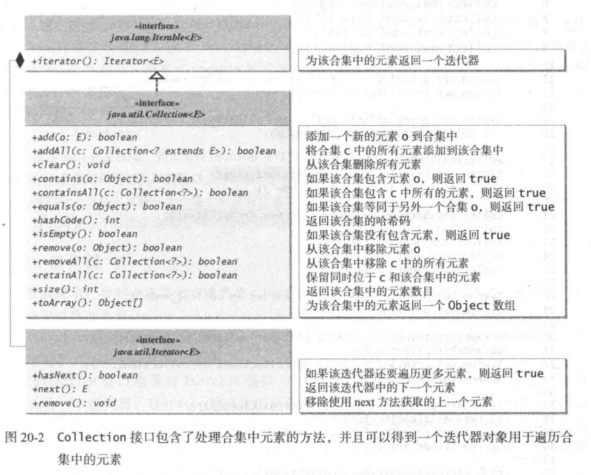

- 两个对象相同，则哈希码必定相同


**迭代器**

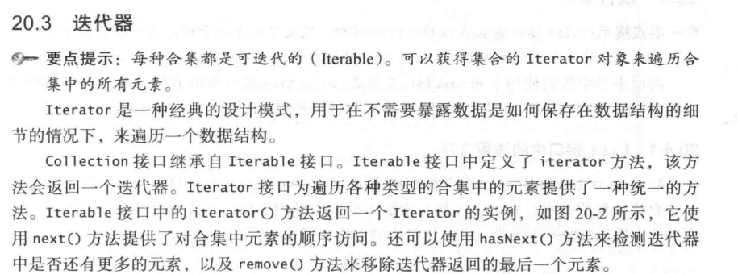


### `Set`接口

没有重复的元素


接口实现类：

- `HashSet`
  - 无序集合
  - 元素可以为null
  - 基于哈希表实现的，保证元素不重复
  - 单个元素操作O(1)
- `LinkedHashSet`
  - 链表实现
  - 有序集合，顺序是插入时的顺序
- `TresSet`
  - 有序的
  - 可以给元素强加一个顺序


### `List`接口

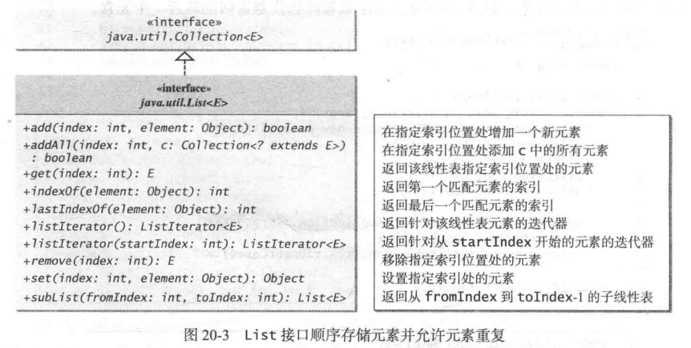


接口实现类：

- `ArrayList`
  - 使用数组存储元素，数组是动态创建的
  - 可变大小的数组
  - 通过下标访问，随机访问效率高
  - 不会在线性表的表头插入或者删除元素，用这个
  - 1.5倍扩容
- `LinkedList`
  - 链表实现
  - 可以从表两端操作元素


如果只是简单提取元素或者只是在线性表尾部插入删除，用`ArrayList`

任意位置插入删除元素，用`LinkedList`


集合和线性表的静态方法：


### `Queue`

`Queue`接口


接口实现类：

- `LinkedList`

  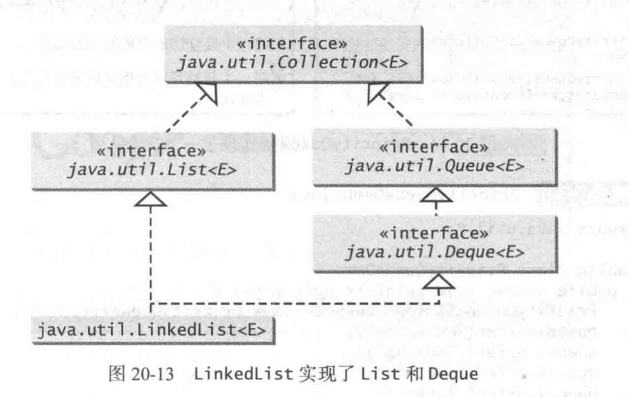

- `PriorityQueue`优先队列（最高优先级的先出队）

  - 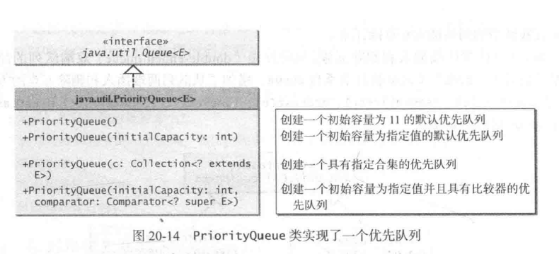
  - 就是个堆
  - 不允许null值
  - 线程不安全
  - 出入队时间复杂度O(log(n))
  - 元素默认升序排列
  - 最小数值的元素优先出队
  - 没有实现可克隆和可序列化接口


### `Vector`

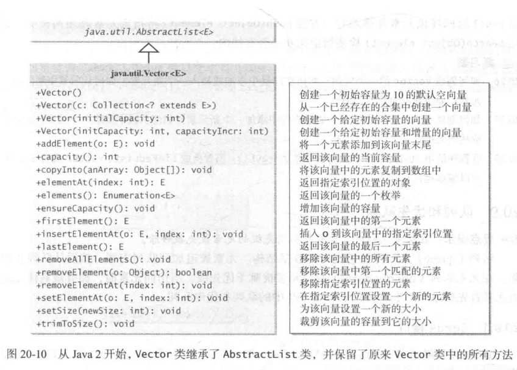

- 线程安全的，只要是关键性的操作，方法前面都加了synchronized关键字


### `Stack`

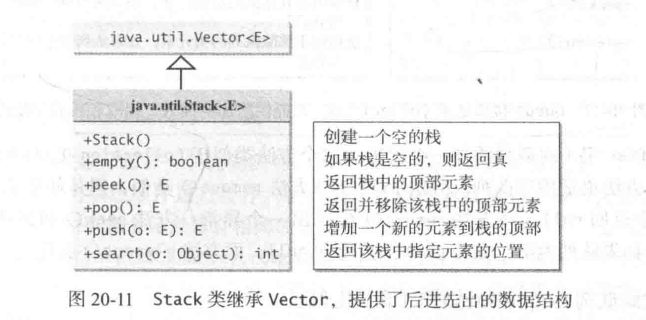


### `Map`接口

键可以是任意类型的对象

键是惟一的


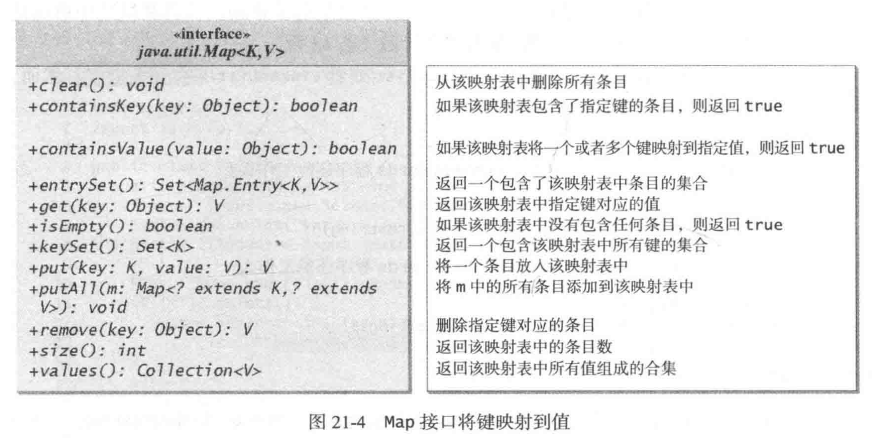


具体实现类：


初始顺序：插入时的顺序

访问顺序：被最后一次访问时的顺序


#### `HashMap`

- 无序

- 操作单个元素，很高效

- 非线程安全，并发情况下，HashMap进行put操作会引起死循环，导致CPU利用率接近100%

- 底层数据结构：数组+(链表、红黑树)，jdk8之前是用数组+链表的方式实现，jdk8引进了红黑树

- 默认初始长度是16，key和value都允许null

- 内部实现数组是Node[]数组，上面存放的是key-value键值对的节点。HashMap通过put和get方法存储和获取。

- jdk8中put方法：先计算key的哈希值，然后调用putVal方法==>先判断哈希表是否为空，为空就扩容，不为空计算出key在哈希表中的位置i，看table[i]是否为空，为空就直接新建一个节点放进去，不为空判断当前位置的hash值，key和要插入的是否相同，相同则根据要求看是否覆盖val，不相同就查看table[i]是否是红黑树节点，如果是的话就用红黑树直接插入键值对，如果不是开始遍历链表插入，如果遇到hash值,key相同的，根据要求看是否覆盖val，否则直接尾插法插入，如果链表长度大于8，转为红黑树结构，执行完成后看size是否大于阈值threshold，大于就扩容，否则直接结束

    ```java
    final V putVal(int hash, K key, V value, boolean onlyIfAbsent, boolean evict) {
      Node<K,V>[] tab; //节点表
      Node<K,V> p; //工作指针
      int n, i;
      //如果hash表未初始化，或者表的长度为0，则给一个默认的容量16，这里将n初始化为表的长度
      if ((tab = table) == null || (n = tab.length) == 0)
        n = (tab = resize()).length;
      //计算在hash表中的位置，如果这个位置为空，则插入这个节点
      if ((p = tab[i = (n - 1) & hash]) == null)
        tab[i] = newNode(hash, key, value, null);
      else {
        Node<K,V> e; 
        K k;
        //判断桶中第一个元素（可以认为是链表头）的hash值，key值和要插入的hash值，key值是否相同，相同就记录下来，根据条件看是否覆盖val值
        if (p.hash == hash && ((k = p.key) == key || (key != null && key.equals(k))))
          // 将第一个元素赋值给e，用e来记录
          e = p;
        //判断是否为红黑树节点
        else if (p instanceof TreeNode)
          e = ((TreeNode<K,V>)p).putTreeVal(this, tab, hash, key, value);
        //链表节点
        else {
          for (int binCount = 0; ; ++binCount) {
            //遍历链表，如果找到hash，key相同的，记录下这个节点，跳出循环，没找到就尾插，尾插之后判断是否需要转为红黑树
            //到达链表尾，插入这个节点
            if ((e = p.next) == null) {
              p.next = newNode(hash, key, value, null);
              //链表中节点的数量到达阈值8，变成红黑树
              if (binCount >= TREEIFY_THRESHOLD - 1) // -1 for 1st
                treeifyBin(tab, hash);
              break;
            }
            if (e.hash == hash && ((k = e.key) == key || (key != null && key.equals(k))))
              break;
            p = e;
          }
        }
        if (e != null) { // existing mapping for key
          V oldValue = e.value;
          // onlyIfAbsent为false或者旧值为null
          if (!onlyIfAbsent || oldValue == null)
            e.value = value;
          afterNodeAccess(e);
          return oldValue;
        }
      }
      ++modCount;
      if (++size > threshold)
        resize();
      afterNodeInsertion(evict);
      return null;
    }
    ```

    

- 如何扩容：第一步把数组长度变为原来的两倍，jdk8时，不用重新计算hash，只用看看原来的hash值新增的一位是零还是1，如果是1这个元素在新数组中的位置，是原数组的位置加原数组长度，如果是零就插入到原数组中。

#### `LinkedHashMap`

- 链表实现
- 支持排序

#### `TreeMap`

- 遍历排好序的键时很高效
- 底层数据结构是一个红黑树，每个key-value都作为一个红黑树的节点
- 在调用TreeMap的构造函数时没有指定比较器，则根据key执行自然排序


### 为什么HashMap中String、Integer这样的包装类适合作为key？

String、Integer等包装类的特性能够保证Hash值的不可更改性和计算准确性，能够有效的减少Hash碰撞的几率~

因为

- 它们都是final修饰的类，不可变性，保证key的不可更改性，不会存在获取hash值不同的情况~
- 它们内部已重写了equals()、hashCode()等方法，遵守了HashMap内部的规范


### 出ArrayList,LinkedList的存储性能和特性

这道面试题，跟ArrayList,LinkedList，就是换汤不换药的~

- ArrayList,使用数组方式存储数据，查询时，ArrayList是基于索引(index)的数据结构，可以直接映射到，速度较快；但是插入数据需要移动数据，效率就比LinkedList慢一点~
- LinkedList,使用双向链表实现存储,按索引数据需要进行前向或后向遍历，查询相对ArrayList慢一点；但是插入数据速度较快。
- LinkedList比ArrayList开销更大，因为LinkedList的节点除了存储数据，还需要存储引用。

### HashMap在JDK1.7和JDK1.8中有哪些不同？

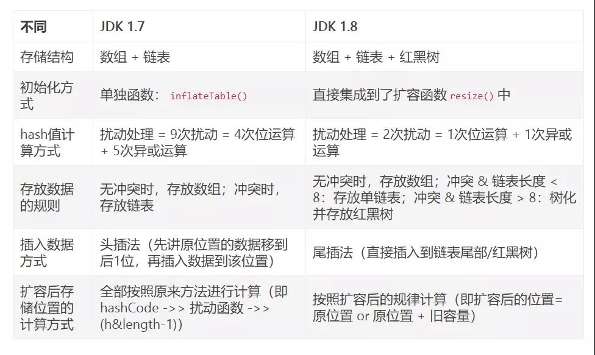

### ArrayList集合加入1万条数据，应该怎么提高效率

> 因为ArrayList的底层是数组实现,并且数组的默认值是10,如果插入10000条要不断的扩容,耗费时间,所以我们调用ArrayList的指定容量的构造器方法ArrayList(int size) 就可以实现不扩容,就提高了性能。

## 多线程

在java中，每个任务都是`Runnable`接口的一个实例，线程本质上是便于任务执行的对象

任务类：

- 必须实现`Runnable`接口（只包含一个`run`方法，需要程序员自己定义）
- 任务必须从线程运行

```java
public class TaskThreadDemo {

    public static void main(String[] args) {
        PrintChar printA = new PrintChar('a', 100000);
        PrintChar printB = new PrintChar('b', 100000);
        PrintNumber printNumber = new PrintNumber(6, 100000);

        Thread thread1 = new Thread(printA);
        Thread thread2 = new Thread(printNumber);
        Thread thread3 = new Thread(printB);

        thread1.run();
        thread2.run();
        thread3.run();
    }
}
```


### Thread类

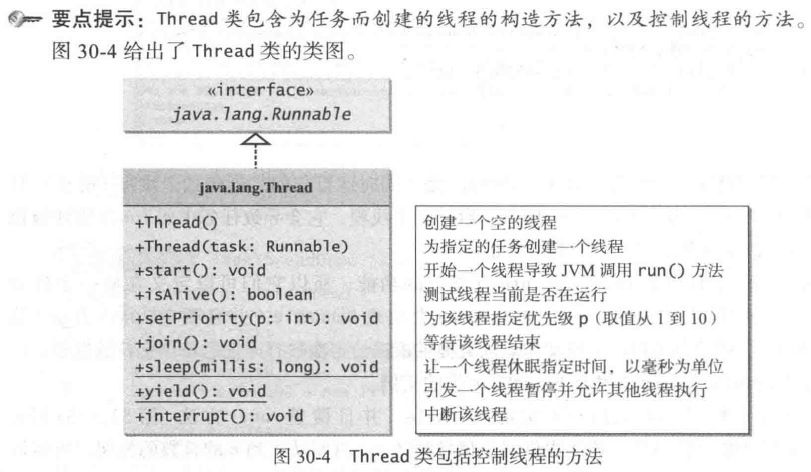


### 线程池

- 使用线程池可以高效执行任务
- 为每个任务开一个新线程可能会限制吞吐量并且造成性能降低

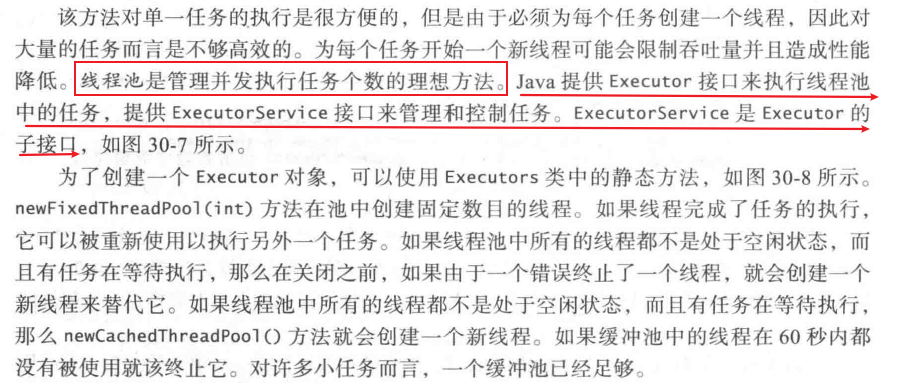

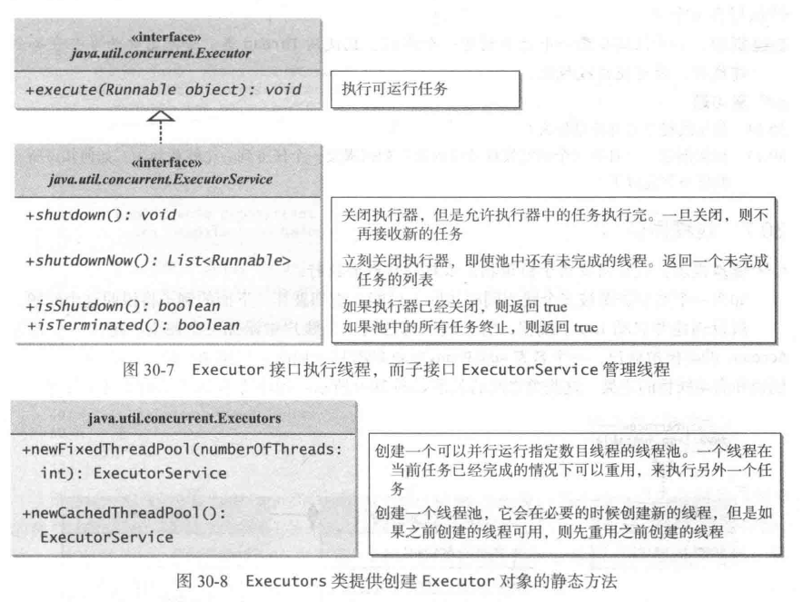

```java
public static void main(String[] args) {

        ExecutorService executor = Executors.newFixedThreadPool(3);

        executor.execute(new PrintChar('a', 100));
        executor.execute(new PrintChar('b', 100));
        executor.execute(new PrintNumber(5, 100));
        
        executor.shutdown();
    }
```


【注意】

- 如果只需要为一个任务创建一个线程，用Thread类
- 如果需要为多个任务创建线程，用线程池


## Javabean

最低要求：

- 公共类
- 必须有公共无参构造
- 实现`Serializable`接口


写的时候：

- 属性私有
- get和set方法

## 一些其他的知识点：

- 当编译一个 **.java** 文件时，**.java** 文件的每个类都会有一个输出文件。每个输出的文件名和 **.java** 文件中每个类的类名相同，只是后缀名是 **.class**。
- 在 Java 中，可运行程序是一组 **.class** 文件，它们可以打包压缩成一个 Java 文档文件（JAR，使用 **jar** 文档生成器）。Java 解释器负责查找、加载和解释这些文件。
- 如果你使用了 **package** 语句，它必须是文件中除了注释之外的第一行代码
- Java 包名按惯例一律小写，即使中间的单词也需要小写
- 按照惯例，**package** 名称是类的创建者的反顺序的 Internet 域名。
- 如果通过 ***** 导入了两个包含相同名字类名的类库 => 使用**全限定名**
- （学到多态）


