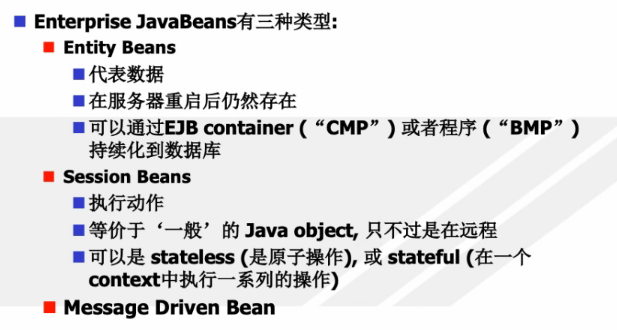
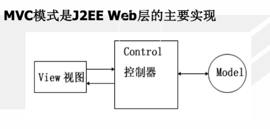
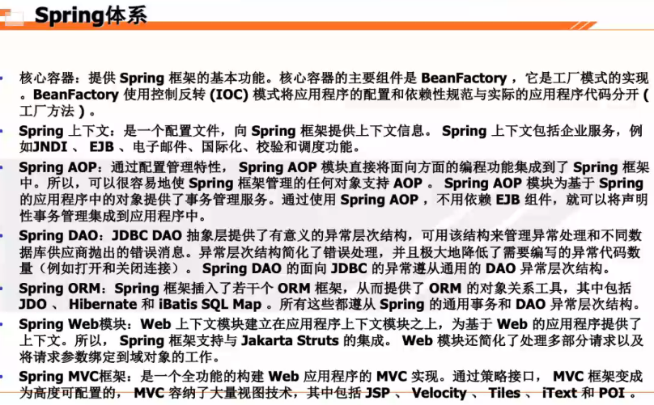
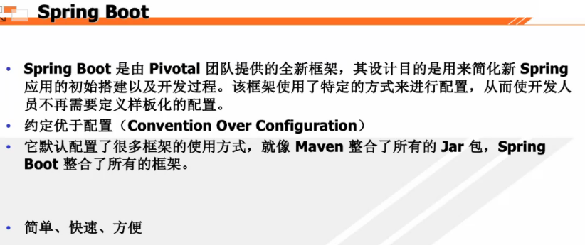

# Java杂项

## JNDI

JNDI(Java Naming and Directory Interface,Java命名和目录接口)是[SUN公司](https://baike.baidu.com/item/SUN公司)提供的一种标准的Java命名系统接口，JNDI提供统一的[客户端](https://baike.baidu.com/item/客户端/101081)API，通过不同的访问提供者接口JNDI服务供应接口(SPI)的实现，由管理者将JNDI API映射为特定的命名服务和目录系统，使得Java[应用程序](https://baike.baidu.com/item/应用程序/5985445)可以和这些命名服务和[目录服务](https://baike.baidu.com/item/目录服务/10413830)之间进行交互。

JNDI(Java Naming and Directory Interface)是一个[应用程序](https://baike.baidu.com/item/应用程序)设计的API，为开发人员提供了查找和访问各种命名和[目录服务](https://baike.baidu.com/item/目录服务/10413830)的通用、统一的接口

优点：

- 包含了大量的命名和[目录服务](https://baike.baidu.com/item/目录服务)，使用通用接口来访问不同种类的服务；

- 可以同时连接到多个命名或[目录服务](https://baike.baidu.com/item/目录服务)上；

- 建立起逻辑关联，允许把名称同Java[对象](https://baike.baidu.com/item/对象)或资源关联起来，而不必知道对象或资源的物理ID。

## EJB

就是Javabean！

EJB是的Enterprise Java Beans技术的简称, 又被称为企业Java Beans。

EJB (Enterprise Java Beans) 是基于分布式事务处理的企业级应用程序的组件。Sun公司发布的文档中对EJB的定义是：EJB是用于开发和部署多层结构的、分布式的、面向对象的Java应用系统的跨平台的构件体系结构。

需要EJB容器

类型：

实体bean：和数据库的表对应

session bean：和数据库交互的，分布式，事务

消息驱动bean：简化开发用的（比如我要买东西，我给它发个消息就行，你做好了告诉我，我不用干等着）

## 设计模式

工厂模式：通过一个方法动态获取对象实例

MVC模式：

代理模式：

## Spring框架

