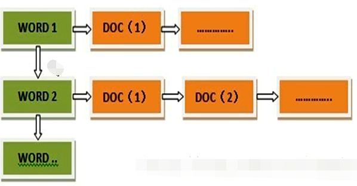

# Lucene知识

## 什么是Lucene？

是全文检索引擎工具，是一个工具包，让程序员可以自己构建搜索引擎或者是在自己的程序中加上全文搜索功能。


## 什么是全文检索？

扫描文章中的每一个词，对每一个词建立一个索引，指明该词在文章中出现的次数和位置，当用户查询时，就根据事先建立的索引进行查找，并将查找的结果反馈给用户的检索方式

## 1、索引

### 1.1 倒排索引

**倒排索引，顾名思义，它相反于一篇文章包含了哪些词，它从词出发，记载了这个词在哪些文档中出现过，由两部分组成——词典和倒排表。**

- 倒排表（很像使用拉链法的hash表）
  - 表头是单词(term)，后面是文档编号，出现的位置，出现的次数
  - 存储的时候可以对编号进行压缩（第一个不用修改，第二个改为第二个减第一个的值，依次类推）
- 构建索引的时候较为耗时且维护成本较高，但是搜索耗时短



### 1.2 正排索引

基本结构：

```text
“文档1”的ID > 单词1：出现次数，出现位置列表；单词2：出现次数，出现位置列表；…………。
“文档2”的ID > 此文档出现的关键词列表。
```


### 1.3 分块索引

- 块内无序，块间有序（后面一块关键字的最小值大于前面一块的最大值）

## 2、底层数据结构

Lucene3.0之前使用的也是跳跃表结构（结构简单、跳跃间隔、级数可控，模糊查询不好），后换成了FST（Finite State Transducer，有限状态转移机）。

FST有两个优点：

- 空间占用小。通过对词典中单词前缀和后缀的重复利用，压缩了存储空间；
- 查询速度快。


## 3、为什么Elasticsearch/Lucene检索可以比mysql快？

Mysql只有term dictionary这一层，是以b-tree排序的方式存储在磁盘上的。检索一个term需要若干次的random access的磁盘操作。

而Lucene在term dictionary的基础上添加了term index来加速检索，term index以树的形式缓存在内存中。从term index查到对应的term dictionary的block位置之后，再去磁盘上找term，大大减少了磁盘的random access次数。

## 4、那么什么是term dictionary 和 term index？

假设我们有很多个term，比如：

Carla,Sara,Elin,Ada,Patty,Kate,Selena

如果按照这样的顺序排列，找出某个特定的term一定很慢，因为term没有排序，需要全部过滤一遍才能找出特定的term。排序之后就变成了：

Ada,Carla,Elin,Kate,Patty,Sara,Selena

这样我们可以用二分查找的方式，比全遍历更快地找出目标的term。这个就是 term dictionary。有了term dictionary之后，可以用 logN 次磁盘查找得到目标。但是磁盘的随机读操作仍然是非常昂贵的（一次random access大概需要10ms的时间）。所以尽量少的读磁盘，有必要把一些数据缓存到内存里。但是整个term dictionary本身又太大了，无法完整地放到内存里。于是就有了term index。term index有点像一本字典的大的章节表。比如：

A开头的term ……………. Xxx页

C开头的term ……………. Xxx页

E开头的term ……………. Xxx页

## 5、为什么大数据量搜索快？

- 使用了索引
- 索引结构（倒排索引）比较优秀

## 6、优化

### 6.1. 解决大量磁盘IO

- config.setMaxBufferedDocs(100000); 控制写入一个新的segment前内存中保存的document的数目，设置较大的数目可以加快建索引速度。

  **数值越大索引速度越快, 但是会消耗更多的内存**

- indexWriter.forceMerge(文档数量); 设置N个文档合并为一个段
  **数值越大索引速度越快, 搜索速度越慢; 值越小索引速度越慢, 搜索速度越快**
  更高的值意味着索引期间更低的段合并开销，但同时也意味着更慢的搜索速度，因为此时的索引通常会包含更多的段。如果该值设置的过高，能获得更高的索引性能。但若在最后进行索引优化，那么较低的值会带来更快的搜索速度，因为在索引操作期间程序会利用并发机制完成段合并操作。故建议对程序分别进行高低多种值的测试，利用计算机的实际性能来告诉你最优值。

### 6.2. 选择合适的分词器

不同的分词器分词效果不同, 所用时间也不同

虽然StandardAnalyzer切分词速度快过IKAnalyzer, 但是由于StandardAnalyzer对中文支持不好, 所以为了追求好的分词效果, 为了追求查询时的准确率, 也只能用IKAnalyzer分词器, IKAnalyzer支持停用词典和扩展词典, 可以通过调整两个词典中的内容, 来提升查询匹配的精度

### 6.3.选择合适的位置存放索引库

| 类                | 写操作                   | 读操作                    | 特点                              |
| ----------------- | ------------------------ | ------------------------- | --------------------------------- |
| SimpleFSDirectory | java.io.RandomAccessFile | java.io.RandomAccessFile  | 简单实现，并发能力差              |
| NIOFSDirectory    | java.nio.FileChannel     | FSDirectory.FSIndexOutput | 并发能力强,windows平台下有重大bug |
| MMapDirectory     | 内存映射                 | FSDirectory.FSIndexOutput | 读取操作基于内存                  |

## 7、人为影响相关度

Lucene对查询关键字和索引文档的相关度进行打分，得分高的就排在前边。

Lucene是在用户进行检索时实时根据搜索的关键字计算出来的，分两步：

- 计算出词（Term）的权重

- 根据词的权重值，计算文档相关度得分。

明确索引的最小单位是一个Term(索引词典中的一个词)，搜索也是要从Term中搜索，再根据Term找到文档，Term对文档的重要性称为权重，影响Term权重有两个因素：

- Term Frequency (tf)： 指此Term在此文档中出现了多少次。tf 越大说明越重要。 词(Term)在文档中出现的次数越多，说明此词(Term)对该文档越重要，如“Lucene”这个词，在文档中出现的次数很多，说明该文档主要就是讲Lucene技术的。
- Document Frequency (df)： 指有多少文档包含次Term。df 越大说明越不重要。 比如，在一篇英语文档中，this出现的次数更多，就说明越重要吗？不是的，有越多的文档包含此词(Term), 说明此词(Term)太普通，不足以区分这些文档，因而重要性越低。


**boost**是一个加权值（默认加权值为1.0f），它可以影响权重的计算。

- 在索引时对某个文档中的field设置加权值高，在搜索时匹配到这个文档就可能排在前边。
- 在搜索时对某个域进行加权，在进行组合域查询时，匹配到加权值高的域最后计算的相关度得分就高。

设置boost是给域（field）或者Document设置的。