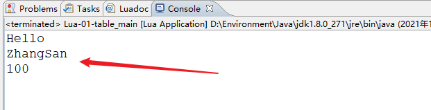

# Lua学习笔记

[TOC]

> 看到了迭代器

# 一、概述

>   百度百科：

Lua 是一个小巧的脚本语言，由标准C编写而成，几乎在所有操作系统和平台上都可以编译，运行。

其设计目的是为了通过灵活嵌入应用程序中从而为应用程序提供灵活的扩展和定制功能。

Lua并没有提供强大的库，这是由它的定位决定的。所以Lua不适合作为开发独立应用程序的语言。

Lua 有一个同时进行的JIT项目，提供在特定平台上的即时编译功能。

Lua脚本可以很容易的被C/C++ 代码调用，也可以反过来调用C/C++的函数，这使得Lua在应用程序中可以被广泛应用。不仅仅作为扩展脚本，也可以作为普通的配置文件，代替XML,ini等文件格式，并且更容易理解和维护。

官方文档：http://www.lua.org/manual/5.3/

## Lua 特性

-   **轻量级**: 它用标准C语言编写并以源代码形式开放，编译后仅仅一百余K，可以很方便的嵌入别的程序里。
-   **可扩展**: Lua提供了非常易于使用的扩展接口和机制：由宿主语言(通常是C或C++)提供这些功能，Lua可以使用它们，就像是本来就内置的功能一样。
-   其它特性
    -   支持面向过程(procedure-oriented)编程和函数式编程(functional programming)；
    -   自动内存管理；
    -   只提供了一种通用类型的表（table），用它可以实现数组，哈希表，集合，对象；
    -   语言内置模式匹配；
    -   闭包(closure)；
    -   函数也可以看做一个值；
    -   提供多线程（协同进程，并非操作系统所支持的线程）支持；
    -   通过闭包和table可以很方便地支持面向对象编程所需要的一些关键机制，比如数据抽象，虚函数，继承和重载等。

## Lua 应用场景

-   游戏开发
-   独立应用脚本
-   Web 应用脚本
-   扩展和数据库插件如：MySQL Proxy 和 MySQL WorkBench
-   安全系统，如入侵检测系统

## 下载安装

下载地址：

-   https://github.com/rjpcomputing/luaforwindows/releases
-   http://luadist.org/
-   https://luarocks.org/
-   https://github.com/luarocks/luarocks/wiki/Installation-instructions-for-Windows

# 二、基本语法

-   执行脚本 `lua xxx.lua`

-   编译脚本 `luac XXX.lua`，会产生一个.out 文件，可以使用 lua 命令执行这个文件

-   两个减号是单行注释

-   多行注释如下

    ```lua
    -- 我是单行注释
    
    --[[
     多行注释
     多行注释
     --]]
    ```

-   区分大小写

-   一般约定，以下划线开头连接一串大写字母的名字（比如 _VERSION）被保留用于 Lua 内部全局变量

-   默认情况下，变量总是认为是全局的

    -   访问一个没有初始化的全局变量也不会出错，只不过得到的结果是：nil
    -   想删除一个全局变量，只需要将变量赋值为nil
    -   当且仅当一个变量不等于nil时，这个变量即存在

-    8 个基本类型分别为：nil、boolean、number、string、userdata、function、thread 和 table

     -   number：精度类型的实浮点数
     -   userdata：表示任意存储在变量中的C数据结构
     -   thread：表示执行的独立线路，用于执行协同程序
     -   type 函数可以查看类型

-   打印一个没有赋值的变量，便会输出一个 nil 值

-   给全局变量或者 table 表里的变量赋一个 nil 值，等同于把它们删掉

-   nil 作比较时应该加上双引号 `type(X)=="nil"`

-   Lua 把 false 和 nil 看作是 false，其他的都为 true，数字 0 也是 true

-   可以用 2 个方括号 "[[]]" 来表示"一块"字符串

    ```lua
    html = [[
    <html>
    <head></head>
    <body>
        <a href="http://www.runoob.com/">菜鸟教程</a>
    </body>
    </html>
    ]]
    print(html)
    ```

-   字符串连接使用的是两个点` ..`

-   在对一个数字字符串上进行算术操作时，Lua 会尝试将这个数字字符串转成一个数字

-   使用 # 来计算字符串的长度，放在字符串前面` print(#字符串)`

-   Lua 里表的默认初始索引一般以 1 开始

-   table 不会固定长度大小，有新数据添加时 table 长度会自动增长，没初始的 table 都是 nil

-   函数可以存在变量里

-   局部变量用 local

-   加载某个文件`dofile("文件名")`

-   `//`除法运算符，向下取整

-   变量的默认值均为 nil

## 变量赋值

Lua 可以对多个变量同时赋值，变量列表和值列表的各个元素用逗号分开，赋值语句右边的值会依次赋给左边的变量。

```bash
a, b = 10, 2*x   # a=10; b=2*x
```

遇到赋值语句Lua会先计算右边所有的值然后再执行赋值操作，所以我们可以这样进行交换变量的值：

```bash
x, y = y, x # swap 'x' for 'y'
```

当变量个数和值的个数不一致时，Lua会一直以变量个数为基础采取以下策略：

```bash
a. 变量个数 > 值的个数             按变量个数补足nil
b. 变量个数 < 值的个数             多余的值会被忽略
```

多值赋值经常用来交换变量，或将函数调用返回给变量：

```
a, b = f()
```

f()返回两个值，第一个赋给a，第二个赋给b。

应该尽可能的使用局部变量，有两个好处：

-   避免命名冲突。
-   访问局部变量的速度比全局变量更快。


对 table 的索引使用方括号 []。Lua 也提供了 . 操作。

var.Name 这种语法只是一个语法糖，用来表示 var["Name"]

## 运算符

优先级

```lua
^
not    - (unary)
*      /       %
+      -
..
<      >      <=     >=     ~=     ==
and
or
```

## Numbers

5.2 版本之前，只有双精度浮点数。5.3 开始，有了64位整数

整数  1 和浮点数 1.0 比较是相同的

`math.type` 函数可以判断到底是整数还是浮点数

一个数字如果有后缀 p 加数字 x，表示 2^x  ，比如`p3` 等于8，然后拿 8 取乘前面的数字

```lua
> 0x1p-1               --> 0.5
> 0xa.bp2              --> 42.75
```

Lua can write numbers in this format using `string.format` with the `%a` option:

```lua
> string.format("%a", 419)       --> 0x1.a3p+8
> string.format("%a", 0.1)       --> 0x1.999999999999ap-4
```
尽管这种格式对人类不太友好，但它保留了任何浮点值的全部精度，而且这种转换比小数更快

x % k 返回的永远是 0~k-1，而且永远都是非负数

x - x % 0.01 保留两位小数,  x - x % 0.001 保留三位小数（仅用于实数）

**运算符**

`<   >   <=  >=  ==  ~=`

## String

字符串可以使用以下三种方式来表示：

- 单引号间的一串字符。
- 双引号间的一串字符。
- **[[** 与 **]]** 间的一串字符。


## Table

table 的创建是通过"构造表达式"来完成，最简单构造表达式是{}，用来创建一个空表。也可以在表里添加一些数据，直接初始化表

Lua 中的表（table）其实是一个"关联数组"（associative arrays），数组的索引可以是数字或者是字符串。

```bash
a = {}
a["key"] = "value"
key = 10
a[key] = 22
```


 Lua 里表的默认初始索引一般以 1 开始


```lua
-- 代码提示快捷键    alt+/

Config = {}-- 定义一个空表
Config.words = "Hello"-- 定义 k,v
Config.num = 100
Config["name"] = "ZhangSan"--也可以用中括号定义

print(Config["words"])-- 可以用中括号取值
print(Config.name)-- 也可以用点取值
print(Config.num)
```

运行结果：




```lua
> Config = {hello="Hello Lua"}
> print(Config.hello)

-- 输出：Hello Lua
```

## 循环

### 数值for循环

Lua 编程语言中数值 for 循环语法格式:

```
for var=exp1,exp2,exp3 do  
    <执行体>  
end  
```

var 从 exp1 变化到 exp2，每次变化以 exp3 为步长递增 var，并执行一次 **"执行体"**。exp3 是可选的，如果不指定，默认为1。

for的三个表达式在循环开始前一次性求值，以后不再进行求值

```lua
for key, var in pairs(Config) do
	print(key, var)
end

-- 运行结果
hello	Hello Lua
words	Hello
name	ZhangSan
num		100
```

### 泛型for循环

泛型 for 循环通过一个迭代器函数来遍历所有值，类似 java 中的 foreach 语句。

### repeat...until 循环

和 do-while 循环差不多

```lua
repeat
   statements
until( condition )
```

循环也有 break 和 goto 关键字

可以使用 goto 实现 continue 功能

goto 语法格式如下所示：

```
goto Label
```

Label 的格式为：

```
:: Label ::
```

## 数组——table实现

在 Lua 索引值是以 1 为起始，但你也可以指定 0 开始。

除此外我们还可以以负数为数组索引值

多维数组

```lua
-- 初始化数组
array = {}
for i=1,3 do
   array[i] = {}
      for j=1,3 do
         array[i][j] = i*j
      end
end

-- 访问数组
for i=1,3 do
   for j=1,3 do
      print(array[i][j])
   end
end
```


```lua
array = {}

for i= -2, 2 do
   array[i] = i *2
end

for i = -2,2 do
   print(array[i])
end
```


```lua
arr = {1, 2, 3, 4, "Hello"}

for key, var in pairs(arr) do
	print(key, var)
end

-- 运行结果：可以看到数组索引是从 1 开始的
1	1
2	2
3	3
4	4
5	Hello
----------------------------------------------------------
arr = {}
for var=1, 100 do
	table.insert(arr,1,var)--头插法
end

for key, var in pairs(arr) do
  print(key, var)
end
-- 运行结果：
1	100
2	99
。。。
95	6
96	5
97	4
98	3
99	2
100	1
----------------------------------------------------------------
-- 顺序插入
arr = {}
for var=1, 100 do
	table.insert(arr,var,var)--顺序插入
end
----------------------------------------------------------------
print(table.maxn(arr))-- 打印数组长度
```

## function

1、函数可以存在变量里

```lua
function factorial1(n)
    if n == 0 then
        return 1
    else
        return n * factorial1(n - 1)
    end
end
print(factorial1(5))
factorial2 = factorial1
print(factorial2(5))
```

2、function 可以以匿名函数（anonymous function）的方式通过参数传递

```lua
function testFun(tab,fun)
        for k ,v in pairs(tab) do
                print(fun(k,v));
        end
end


tab={key1="val1",key2="val2"};
testFun(tab,
function(key,val)--匿名函数
        return key.."="..val;
end
);
```

3、Lua函数可以返回多个结果值

4、Lua 函数可以接受可变数目的参数，和 C 语言类似，在函数参数列表中使用三点 ... 表示函数有可变的参数。

可能需要几个固定参数加上可变参数，固定参数必须放在变长参数之前

常在遍历变长参数的时候只需要使用 **{…}**，然而变长参数可能会包含一些 **nil**，那么就可以用 **select** 函数来访问变长参数了：**select('#', …)** 或者 **select(n, …)**
 - **select('#', …)** 返回可变参数的长度
 - **select(n, …)** 用于返回 **n** 到 **select('#',…)** 的参数

调用 select 时，必须传入一个固定实参 selector(选择开关) 和一系列变长参数。如果 selector 为数字 n，那么 select 返回 n 后所有的参数，否则只能为字符串 **#**，这样 select 返回变长参数的总数。

```lua
do  
    function foo(...)  
        for i = 1, select('#', ...) do  -->获取参数总数
            local arg = select(i, ...); -->读取参数
            print("arg", arg);  
        end  
    end  
 
    foo(1, 2, 3, 4);  
end
```


## thread（线程）

在 Lua 里，最主要的线程是协同程序（coroutine）。它跟线程（thread）差不多，拥有自己独立的栈、局部变量和指令指针，可以跟其他协同程序共享全局变量和其他大部分东西。

线程跟协程的区别：线程可以同时多个运行，而协程任意时刻只能运行一个，并且处于运行状态的协程只有被挂起（suspend）时才会暂停。

调用函数 [`coroutine.create`](https://www.runoob.com/manual/lua53doc/manual.html#pdf-coroutine.create) 可创建一个协程。 其唯一的参数是该协程的主函数。 `create` 函数只负责新建一个协程并返回其句柄 （一个 *thread* 类型的对象）； 而不会启动该协程。

调用 [`coroutine.resume`](https://www.runoob.com/manual/lua53doc/manual.html#pdf-coroutine.resume) 函数执行一个协程。 第一次调用 [`coroutine.resume`](https://www.runoob.com/manual/lua53doc/manual.html#pdf-coroutine.resume) 时，第一个参数应传入 [`coroutine.create`](https://www.runoob.com/manual/lua53doc/manual.html#pdf-coroutine.create) 返回的线程对象，然后协程从其主函数的第一行开始执行。 传递给 [`coroutine.resume`](https://www.runoob.com/manual/lua53doc/manual.html#pdf-coroutine.resume) 的其他参数将作为协程主函数的参数传入。 协程启动之后，将一直运行到它终止或 *让出*。

通过调用 [`coroutine.yield`](https://www.runoob.com/manual/lua53doc/manual.html#pdf-coroutine.yield) 使协程暂停执行，让出执行权。

当下次重启同一个协程时， 协程会接着从让出点继续执行。 

 [`coroutine.wrap`](https://www.runoob.com/manual/lua53doc/manual.html#pdf-coroutine.wrap) 函数也会创建一个协程。 不同之处在于，它不返回协程本身，而是返回一个函数。 调用这个函数将启动该协程

 [`coroutine.wrap`](https://www.runoob.com/manual/lua53doc/manual.html#pdf-coroutine.wrap) 不会捕获错误； 而是将任何错误都传播给调用者。


## userdata（自定义类型）

userdata 是一种用户自定义数据，用于表示一种由应用程序或 C/C++ 语言库所创建的类型，可以将任意 C/C++ 的任意数据类型的数据（通常是 struct 和 指针）存储到 Lua 变量中调用。

# 面向对象

## 简单OOP

```lua
-- 面向对象

function clone(tab)
  local ins = {}
  for key, var in pairs(tab) do
  	ins[key] = var
  end
  return ins
end

People = {}

function People.sayHi()
  print("People say Hi")
end

People.sayYes = function()
  print("People say Yes")
end

-- 定义实例
local p = clone(People)
p.sayHi()
p.sayYes()
-- 运行结果
People say Hi
People say Yes
```

## 构造函数

```lua
-- 构造函数

function clone(tab)
  local ins = {}
  for key, var in pairs(tab) do
  	ins[key] = var
  end
  return ins
end

People = {}

function People.sayHi(self)
  print("People say Hi: "..self.name)
end

People.sayYes = function()
  print("People say Yes")
end

-- 定义构造函数
People.new = function(name)
  local self = clone(People)
  self.name = name
  
  return self
end

-- 定义实例
--local p = clone(People)
--p.sayHi()
--p.sayYes()

local p = People.new("ZhangSan")
p.sayHi(p)-- 和下面这一句相同
p:sayHi()-- 默认会把实例当成方法的第一个参数传递进来
```

## 继承

通过复制表的方式实现继承

```lua
-- 面向对象

function clone(tab)
  local ins = {}
  for key, var in pairs(tab) do
  	ins[key] = var
  end
  return ins
end

function copy(dist, tab)
  for key, var in pairs(tab) do
  	dist[key] = var
  end
end

People = {}

function People.sayHi(self)
  print("People say Hi: "..self.name)
end

People.sayYes = function()
  print("People say Yes")
end

-- 定义构造函数
People.new = function(name)
  local self = clone(People)
  self.name = name
  
  return self
end

-- 定义实例
--local p = clone(People)
--p.sayHi()
--p.sayYes()

local p = People.new("ZhangSan")
--p.sayHi(p)-- 和下面这一句相同
--p:sayHi()-- 默认会把实例当成方法的第一个参数传递进来

-- 继承
Man = {}
Man.new = function (name)
	local self = People.new(name)--调用父类的构造函数
	-- 在父类的基础上附加功能或者字段
	copy(self, Man)
	return self
end

Man.sayOk = function()
  print("Man say say OK")
end

-- 重写父类的方法
Man.sayYes = function()
  print("Man say Yes")
end

Man.sayHi = function(self)
  print("Man say Hi: "..self.name)
end

local m = Man.new("LiSi")
m:sayHi()
m:sayYes()

-- 运行结果：
Man say Hi: LiSi
Man say Yes
```

## 函数闭包实现面向对象

```lua
-- 闭包 closure，效率稍低一点，但是更符合人的思维
-- 闭包就是能够读取其他函数内部变量的函数

function People(name)
  -- 下面这相当于无参构造
  local self = {}
  
--  -- 有参构造
--  local function init(name)
--    self.name = name
--  end

  -- 也可以这么写
  local function init()
    self.name = name
  end
  
  self.sayHi = function()
    print("Hello "..self.name)
  end
  
  -- init(name)
  init()
  return self
end

-- 继承

function Man(name)
  local self = People(name)
  
  -- 定义自己的功能
  self.sayHello = function()
    print("Man say Hello: "..self.name)
  end
  
  -- 闭包演示
  function init()
    self.sayHi()
  end
  
  init()
  
  return self
end

-- 定义实例
local p = People("tcmyxc")
--p:sayHi()

local man = Man("LiSi")
--man.sayHello()
--man:sayHi()
```


