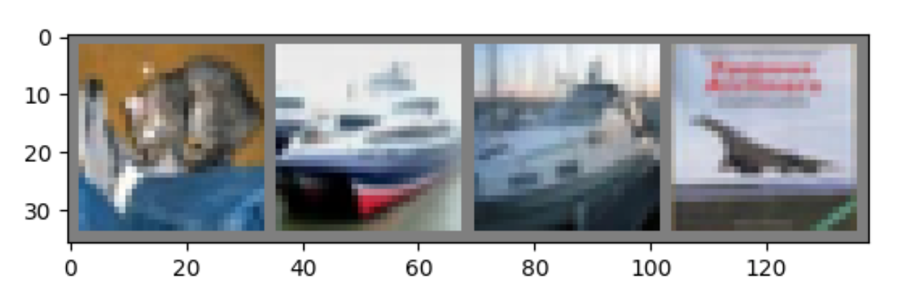

# Pytorch学习

# 1. Pytorch基本语法

## 1.1 认识Pytorch


### 学习目标

- 了解什么是Pytorch.
- 掌握Pytorch的基本元素操作.
- 掌握Pytorch的基本运算操作.

------


### 什么是Pytorch

- Pytorch是一个基于Numpy的科学计算包, 向它的使用者提供了两大功能.
  - 作为Numpy的替代者, 向用户提供使用GPU强大功能的能力.
  - 做为一款深度学习的平台, 向用户提供最大的灵活性和速度.

------

### Pytorch的基本元素操作

- Tensors张量: 张量的概念类似于Numpy中的ndarray数据结构, 最大的区别在于Tensor可以利用GPU的加速功能.
- 我们使用Pytorch的时候, 常规步骤是先将torch引用进来, 如下所示:


```python
from __future__ import print_function
import torch
```

------

- 创建矩阵的操作

> - 创建一个没有初始化的矩阵:


```python
x = torch.empty(5, 3)
print(x)
```

> - 输出结果:

```
tensor([[2.4835e+27, 2.5428e+30, 1.0877e-19],
        [1.5163e+23, 2.2012e+12, 3.7899e+22],
        [5.2480e+05, 1.0175e+31, 9.7056e+24],
        [1.6283e+32, 3.7913e+22, 3.9653e+28],
        [1.0876e-19, 6.2027e+26, 2.3685e+21]])
```

> - 创建一个有初始化的矩阵:

```python
x = torch.rand(5, 3)
print(x)
```

> - 输出结果:

```
tensor([[0.1368, 0.8070, 0.4567],
        [0.4369, 0.8278, 0.5552],
        [0.6848, 0.4473, 0.1031],
        [0.5308, 0.9194, 0.2761],
        [0.0484, 0.9941, 0.2227]])
```

> - 对比有无初始化的矩阵: 当声明一个未初始化的矩阵时, 它本身不包含任何确切的值. 当创建一个未初始化的矩阵时, 分配给矩阵的内存中有什么数值就赋值给了这个矩阵, 本质上是毫无意义的数据.

> - 创建一个全零矩阵并可指定数据元素的类型为long

```
x = torch.zeros(5, 3, dtype=torch.long)
print(x)
```

> - 输出结果:


```
tensor([[0, 0, 0],
        [0, 0, 0],
        [0, 0, 0],
        [0, 0, 0],
        [0, 0, 0]])
```

> - 直接通过数据创建张量

```
x = torch.tensor([2.5, 3.5])
print(x)
```

> - 输出结果:


```
tensor([2.5000, 3.3000])
```


> - 通过已有的一个张量创建相同尺寸的新张量


```
# 利用news_methods方法得到一个张量
x = x.new_ones(5, 3, dtype=torch.double)
print(x)

# 利用randn_like方法得到相同张量尺寸的一个新张量, 并且采用随机初始化来对其赋值
y = torch.randn_like(x, dtype=torch.float)
print(y)
```

------

> - 输出结果:


```
tensor([[1., 1., 1.],
        [1., 1., 1.],
        [1., 1., 1.],
        [1., 1., 1.],
        [1., 1., 1.]], dtype=torch.float64)

tensor([[-0.1497, -0.5832, -0.3805],
        [ 0.9001,  2.0637,  1.3299],
        [-0.8813, -0.6579, -0.9135],
        [-0.1374,  0.1000, -0.9343],
        [-1.1278, -0.9140, -1.5910]])
```

------

> - 得到张量的尺寸:


```
print(x.size())
```

------

> - 输出结果:


```
torch.Size([5, 3])
```

------

- 注意:
  - torch.Size函数本质上返回的是一个tuple, 因此它支持一切元组的操作.

------

### Pytorch的基本运算操作

- 加法操作:


```
y = torch.rand(5, 3)
print(x + y)
```

------

> - 输出结果:


```
tensor([[ 1.6978, -1.6979,  0.3093],
        [ 0.4953,  0.3954,  0.0595],
        [-0.9540,  0.3353,  0.1251],
        [ 0.6883,  0.9775,  1.1764],
        [ 2.6784,  0.1209,  1.5542]])
```

------

- 第二种加法方式:


```
print(torch.add(x, y))
```

------

> - 输出结果:


```
tensor([[ 1.6978, -1.6979,  0.3093],
        [ 0.4953,  0.3954,  0.0595],
        [-0.9540,  0.3353,  0.1251],
        [ 0.6883,  0.9775,  1.1764],
        [ 2.6784,  0.1209,  1.5542]])
```

------

- 第三种加法方式:


```
# 提前设定一个空的张量
result = torch.empty(5, 3)
# 将空的张量作为加法的结果存储张量
torch.add(x, y, out=result)
print(result)
```

------

> - 输出结果:


```
tensor([[ 1.6978, -1.6979,  0.3093],
        [ 0.4953,  0.3954,  0.0595],
        [-0.9540,  0.3353,  0.1251],
        [ 0.6883,  0.9775,  1.1764],
        [ 2.6784,  0.1209,  1.5542]])
```

------

- 第四种加法方式: in-place (原地置换)


```
y.add_(x)
print(y)
```

------

> - 输出结果:


```
tensor([[ 1.6978, -1.6979,  0.3093],
        [ 0.4953,  0.3954,  0.0595],
        [-0.9540,  0.3353,  0.1251],
        [ 0.6883,  0.9775,  1.1764],
        [ 2.6784,  0.1209,  1.5542]])
```

------

- 注意:
  - 所有in-place的操作函数都有一个下划线的后缀.
  - 比如x.copy_(y), x.add_(y), 都会直接改变x的值.

------

> - 用类似于Numpy的方式对张量进行操作:


```
print(x[:, 1])
```

------

> - 输出结果:


```
tensor([-2.0902, -0.4489, -0.1441,  0.8035, -0.8341])
```

------

> - 改变张量的形状: torch.view()


```
x = torch.randn(4, 4)
# tensor.view()操作需要保证数据元素的总数量不变
y = x.view(16)
# -1代表自动匹配个数
z = x.view(-1, 8)
print(x.size(), y.size(), z.size())
```

------

> - 输出结果:


```
torch.Size([4, 4]) torch.Size([16]) torch.Size([2, 8])
```

------

> - 如果张量中只有一个元素, 可以用.item()将值取出, 作为一个python number


```
x = torch.randn(1)
print(x)
print(x.item())
```

------

> - 输出结果:


```
tensor([-0.3531])
-0.3530771732330322
```

------

### 关于Torch Tensor和Numpy array之间的相互转换

- Torch Tensor和Numpy array共享底层的内存空间, 因此改变其中一个的值, 另一个也会随之被改变.


```
a = torch.ones(5)
print(a)
```

------

> - 输出结果:


```
tensor([1., 1., 1., 1., 1.])
```

------

> - 将Torch Tensor转换为Numpy array


```
b = a.numpy()
print(b)
```

------

> - 输出结果:


```
[1. 1. 1. 1. 1.]
```

------

> - 对其中一个进行加法操作, 另一个也随之被改变:


```
a.add_(1)
print(a)
print(b)
```

------

> - 输出结果:


```
tensor([2., 2., 2., 2., 2.])
[2. 2. 2. 2. 2.]
```

------

> - 将Numpy array转换为Torch Tensor:


```
import numpy as np
a = np.ones(5)
b = torch.from_numpy(a)
np.add(a, 1, out=a)
print(a)
print(b)
```

------

> - 输出结果:


```
[2. 2. 2. 2. 2.]
tensor([2., 2., 2., 2., 2.], dtype=torch.float64)
```

------

- 注意:
  - 所有在CPU上的Tensors, 除了CharTensor, 都可以转换为Numpy array并可以反向转换.

------

> - 关于Cuda Tensor: Tensors可以用.to()方法来将其移动到任意设备上.


```
# 如果服务器上已经安装了GPU和CUDA
if torch.cuda.is_available():
    # 定义一个设备对象, 这里指定成CUDA, 即使用GPU
    device = torch.device("cuda")
    # 直接在GPU上创建一个Tensor
    y = torch.ones_like(x, device=device)
    # 将在CPU上面的x张量移动到GPU上面
    x = x.to(device)
    # x和y都在GPU上面, 才能支持加法运算
    z = x + y
    # 此处的张量z在GPU上面
    print(z)
    # 也可以将z转移到CPU上面, 并同时指定张量元素的数据类型
    print(z.to("cpu", torch.double))
```

------

> - 输出结果:


```
tensor([0.6469], device='cuda:0')
tensor([0.6469], dtype=torch.float64)
```

------

### 小节总结

- 学习了什么是Pytorch.
  - Pytorch是一个基于Numpy的科学计算包, 作为Numpy的替代者, 向用户提供使用GPU强大功能的能力.
  - 做为一款深度学习的平台, 向用户提供最大的灵活性和速度.
- 学习了Pytorch的基本元素操作.
  - 矩阵的初始化:
    - torch.empty()
    - torch.rand(n, m)
    - torch.zeros(n, m, dtype=torch.long)
  - 其他若干操作:
    - x.new_ones(n, m, dtype=torch.double)
    - torch.randn_like(x, dtype=torch.float)
    - x.size()
- 学习了Pytorch的基本运算操作.
  - 加法操作:
    - x + y
    - torch.add(x, y)
    - torch.add(x, y, out=result)
    - y.add_(x)
  - 其他若干操作:
    - x.view()
    - x.item()
- 学习了Torch Tensor和Numpy Array之间的相互转换.
  - 将Torch Tensor转换为Numpy Array:
    - b = a.numpy()
  - 将Numpy Array转换为Torch Tensor:
    - b = torch.from_numpy(a)
  - 注意: 所有才CPU上的Tensor, 除了CharTensor, 都可以转换为Numpy Array并可以反向转换.
- 学习了任意的Tensors可以用.to()方法来将其移动到任意设备上.
  - x = x.to(device)

------

------

------

## 1.2 Pytorch中的autograd

------

### 学习目标

- 掌握自动求导中的Tensor概念和操作.
- 掌握自动求导中的梯度Gradients概念和操作.

------

- 在整个Pytorch框架中, 所有的神经网络本质上都是一个autograd package(自动求导工具包)
  - autograd package提供了一个对Tensors上所有的操作进行自动微分的功能.

------

### 关于torch.Tensor

- torch.Tensor是整个package中的核心类, 如果将属性.requires_grad设置为True, 它将追踪在这个类上定义的所有操作. 当代码要进行反向传播的时候, 直接调用.backward()就可以自动计算所有的梯度. 在这个Tensor上的所有梯度将被累加进属性.grad中.
- 如果想终止一个Tensor在计算图中的追踪回溯, 只需要执行.detach()就可以将该Tensor从计算图中撤下, 在未来的回溯计算中也不会再计算该Tensor.
- 除了.detach(), 如果想终止对计算图的回溯, 也就是不再进行方向传播求导数的过程, 也可以采用代码块的方式with torch.no_grad():, 这种方式非常适用于对模型进行预测的时候, 因为预测阶段不再需要对梯度进行计算.

------

- 关于torch.Function:
  - Function类是和Tensor类同等重要的一个核心类, 它和Tensor共同构建了一个完整的类, 每一个Tensor拥有一个.grad_fn属性, 代表引用了哪个具体的Function创建了该Tensor.
  - 如果某个张量Tensor是用户自定义的, 则其对应的grad_fn is None.

------

### 关于Tensor的操作


```
x1 = torch.ones(3, 3)
print(x1)

x = torch.ones(2, 2, requires_grad=True)
print(x)
```

------

> - 输出结果:


```
tensor([[1., 1., 1.],
        [1., 1., 1.],
        [1., 1., 1.]])

tensor([[1., 1.],
        [1., 1.]], requires_grad=True)
```

------

> - 在具有requires_grad=True的Tensor上执行一个加法操作


```
y = x + 2
print(y)
```

------

> - 输出结果:


```
tensor([[3., 3.],
        [3., 3.]], grad_fn=<AddBackward0>)
```

------

> - 打印Tensor的grad_fn属性:


```
print(x.grad_fn)
print(y.grad_fn)
```

------

> - 输出结果:


```
None
<AddBackward0 object at 0x10db11208>
```

------

> - 在Tensor上执行更复杂的操作:


```
z = y * y * 3
out = z.mean()
print(z, out)
```

------

> - 输出结果:


```
tensor([[27., 27.],
        [27., 27.]], grad_fn=<MulBackward0>) tensor(27., grad_fn=<MeanBackward0>)
```

------

> - 关于方法.requires_grad_(): 该方法可以原地改变Tensor的属性.requires_grad的值. 如果没有主动设定默认为False.


```
a = torch.randn(2, 2)
a = ((a * 3) / (a - 1))
print(a.requires_grad)
a.requires_grad_(True)
print(a.requires_grad)
b = (a * a).sum()
print(b.grad_fn)
```

------

> - 输出结果:


```
False
True
<SumBackward0 object at 0x7f191afd6be0>
```

------

### 关于梯度Gradients

- 在Pytorch中, 反向传播是依靠.backward()实现的.


```
out.backward()
print(x.grad)
```

------

> - 输出结果:


```
tensor([[4.5000, 4.5000],
        [4.5000, 4.5000]])
```

------

> - 关于自动求导的属性设置: 可以通过设置.requires_grad=True来执行自动求导, 也可以通过代码块的限制来停止自动求导.


```
print(x.requires_grad)
print((x ** 2).requires_grad)

with torch.no_grad():
    print((x ** 2).requires_grad)
```

------

> - 输出结果:


```
True
True
False
```

------

> - 可以通过.detach()获得一个新的Tensor, 拥有相同的内容但不需要自动求导.


```
print(x.requires_grad)
y = x.detach()
print(y.requires_grad)
print(x.eq(y).all())
```

------

> - 输出结果:


```
True
False
tensor(True)
```

------

### 小节总结

- 学习了torch.Tensor类的相关概念.
  - torch.Tensor是整个package中的核心类, 如果将属性.requires_grad设置为True, 它将追踪在这个类上定义的所有操作. 当代码要进行反向传播的时候, 直接调用.backward()就可以自动计算所有的梯度. 在这个Tensor上的所有梯度将被累加进属性.grad中.
  - 执行.detach()命令, 可以将该Tensor从计算图中撤下, 在未来的回溯计算中不会再计算该Tensor.
  - 采用代码块的方式也可以终止对计算图的回溯:
    - with torch.no_grad():
- 学习了关于Tensor的若干操作:
  - torch.ones(n, n, requires_grad=True)
  - x.grad_fn
  - a.requires_grad_(True)
- 学习了关于Gradients的属性:
  - x.grad
  - 可以通过.detach()获得一个新的Tensor, 拥有相同的内容但不需要自动求导.


# 2. Pytorch初步应用

## 2.1 使用Pytorch构建一个神经网络

------

### 学习目标

- 掌握用Pytorch构建神经网络的基本流程.
- 掌握用Pytorch构建神经网络的实现过程.

------

- 关于torch.nn:
  - 使用Pytorch来构建神经网络, 主要的工具都在torch.nn包中.
  - nn依赖于autograd来定义模型, 并对其自动求导.

------

- 构建神经网络的典型流程:

> - 定义一个拥有可学习参数的神经网络
> - 遍历训练数据集
> - 处理输入数据使其流经神经网络
> - 计算损失值
> - 将网络参数的梯度进行反向传播
> - 以一定的规则更新网络的权重

------

> - 我们首先定义一个Pytorch实现的神经网络:


```
# 导入若干工具包
import torch
import torch.nn as nn
import torch.nn.functional as F


# 定义一个简单的网络类
class Net(nn.Module):

    def __init__(self):
        super(Net, self).__init__()
        # 定义第一层卷积神经网络, 输入通道维度=1, 输出通道维度=6, 卷积核大小3*3
        self.conv1 = nn.Conv2d(1, 6, 3)
        # 定义第二层卷积神经网络, 输入通道维度=6, 输出通道维度=16, 卷积核大小3*3
        self.conv2 = nn.Conv2d(6, 16, 3)
        # 定义三层全连接网络
        self.fc1 = nn.Linear(16 * 6 * 6, 120)
        self.fc2 = nn.Linear(120, 84)
        self.fc3 = nn.Linear(84, 10)

    def forward(self, x):
        # 在(2, 2)的池化窗口下执行最大池化操作
        x = F.max_pool2d(F.relu(self.conv1(x)), (2, 2))
        x = F.max_pool2d(F.relu(self.conv2(x)), 2)
        x = x.view(-1, self.num_flat_features(x))
        x = F.relu(self.fc1(x))
        x = F.relu(self.fc2(x))
        x = self.fc3(x)
        return x

    def num_flat_features(self, x):
        # 计算size, 除了第0个维度上的batch_size
        size = x.size()[1:]
        num_features = 1
        for s in size:
            num_features *= s
        return num_features


net = Net()
print(net)
```

------

> - 输出结果:


```
Net(
  (conv1): Conv2d(1, 6, kernel_size=(3, 3), stride=(1, 1))
  (conv2): Conv2d(6, 16, kernel_size=(3, 3), stride=(1, 1))
  (fc1): Linear(in_features=576, out_features=120, bias=True)
  (fc2): Linear(in_features=120, out_features=84, bias=True)
  (fc3): Linear(in_features=84, out_features=10, bias=True)
)
```

------

- 注意:
  - 模型中所有的可训练参数, 可以通过net.parameters()来获得.


```
params = list(net.parameters())
print(len(params))
print(params[0].size())
```

------

> - 输出结果:


```
10
torch.Size([6, 1, 3, 3])
```

------

> - 假设图像的输入尺寸为32 * 32:


```
input = torch.randn(1, 1, 32, 32)
out = net(input)
print(out)
```

------

> - 输出结果:


```
tensor([[ 0.1242,  0.1194, -0.0584, -0.1140,  0.0661,  0.0191, -0.0966,  0.0480,
          0.0775, -0.0451]], grad_fn=<AddmmBackward>)
```

------

> - 有了输出张量后, 就可以执行梯度归零和反向传播的操作了.


```
net.zero_grad()
out.backward(torch.randn(1, 10))
```

------

- 注意:
  - torch.nn构建的神经网络只支持mini-batches的输入, 不支持单一样本的输入.
  - 比如: nn.Conv2d 需要一个4D Tensor, 形状为(nSamples, nChannels, Height, Width). 如果你的输入只有单一样本形式, 则需要执行input.unsqueeze(0), 主动将3D Tensor扩充成4D Tensor.

------

### 损失函数

- 损失函数的输入是一个输入的pair: (output, target), 然后计算出一个数值来评估output和target之间的差距大小.
- 在torch.nn中有若干不同的损失函数可供使用, 比如nn.MSELoss就是通过计算均方差损失来评估输入和目标值之间的差距.

------

- 应用nn.MSELoss计算损失的一个例子:


```
output = net(input)
target = torch.randn(10)

# 改变target的形状为二维张量, 为了和output匹配
target = target.view(1, -1)
criterion = nn.MSELoss()

loss = criterion(output, target)
print(loss)
```

------

> - 输出结果:


```
tensor(1.1562, grad_fn=<MseLossBackward>)
```

------

> - 关于方向传播的链条: 如果我们跟踪loss反向传播的方向, 使用.grad_fn属性打印, 将可以看到一张完整的计算图如下:


```
input -> conv2d -> relu -> maxpool2d -> conv2d -> relu -> maxpool2d
      -> view -> linear -> relu -> linear -> relu -> linear
      -> MSELoss
      -> loss
```

------

> - 当调用loss.backward()时, 整张计算图将对loss进行自动求导, 所有属性requires_grad=True的Tensors都将参与梯度求导的运算, 并将梯度累加到Tensors中的.grad属性中.


```
print(loss.grad_fn)  # MSELoss
print(loss.grad_fn.next_functions[0][0])  # Linear
print(loss.grad_fn.next_functions[0][0].next_functions[0][0])  # ReLU
```

------

> - 输出结果:


```
<MseLossBackward object at 0x7fdba3216da0>
<AddmmBackward object at 0x7fdba3216f28>
<AccumulateGrad object at 0x7fdba3216f28>
```

------

### 反向传播(backpropagation)

- 在Pytorch中执行反向传播非常简便, 全部的操作就是loss.backward().
- 在执行反向传播之前, 要先将梯度清零, 否则梯度会在不同的批次数据之间被累加.

------

- 执行一个反向传播的小例子:


```
# Pytorch中执行梯度清零的代码
net.zero_grad()

print('conv1.bias.grad before backward')
print(net.conv1.bias.grad)

# Pytorch中执行反向传播的代码
loss.backward()

print('conv1.bias.grad after backward')
print(net.conv1.bias.grad)
```

------

> - 输出结果:


```
conv1.bias.grad before backward
tensor([0., 0., 0., 0., 0., 0.])
conv1.bias.grad after backward
tensor([-0.0002,  0.0045,  0.0017, -0.0099,  0.0092, -0.0044])
```

------

### 更新网络参数

- 更新参数最简单的算法就是SGD(随机梯度下降).
- 具体的算法公式表达式为: weight = weight - learning_rate * gradient

------

- 首先用传统的Python代码来实现SGD如下:


```
learning_rate = 0.01
for f in net.parameters():
    f.data.sub_(f.grad.data * learning_rate)
```

------

> - 然后使用Pytorch官方推荐的标准代码如下:


```
# 首先导入优化器的包, optim中包含若干常用的优化算法, 比如SGD, Adam等
import torch.optim as optim

# 通过optim创建优化器对象
optimizer = optim.SGD(net.parameters(), lr=0.01)

# 将优化器执行梯度清零的操作
optimizer.zero_grad()

output = net(input)
loss = criterion(output, target)

# 对损失值执行反向传播的操作
loss.backward()
# 参数的更新通过一行标准代码来执行
optimizer.step()
```

------

### 小节总结

- 学习了构建一个神经网络的典型流程:
  - 定义一个拥有可学习参数的神经网络
  - 遍历训练数据集
  - 处理输入数据使其流经神经网络
  - 计算损失值
  - 将网络参数的梯度进行反向传播
  - 以一定的规则更新网络的权重
- 学习了损失函数的定义:
  - 采用torch.nn.MSELoss()计算均方误差.
  - 通过loss.backward()进行反向传播计算时, 整张计算图将对loss进行自动求导, 所有属性requires_grad=True的Tensors都将参与梯度求导的运算, 并将梯度累加到Tensors中的.grad属性中.
- 学习了反向传播的计算方法:
  - 在Pytorch中执行反向传播非常简便, 全部的操作就是loss.backward().
  - 在执行反向传播之前, 要先将梯度清零, 否则梯度会在不同的批次数据之间被累加.
    - net.zero_grad()
    - loss.backward()
- 学习了参数的更新方法:
  - 定义优化器来执行参数的优化与更新.
    - optimizer = optim.SGD(net.parameters(), lr=0.01)
  - 通过优化器来执行具体的参数更新.
    - optimizer.step()

------

------

------

## 2.2 使用Pytorch构建一个分类器

------

### 学习目标

- 了解分类器的任务和数据样式
- 掌握如何用Pytorch实现一个分类器

------

### 分类器任务和数据介绍

- 构造一个将不同图像进行分类的神经网络分类器, 对输入的图片进行判别并完成分类.
- 本案例采用CIFAR10数据集作为原始图片数据.

------

> - CIFAR10数据集介绍: 数据集中每张图片的尺寸是3 * 32 * 32, 代表彩色3通道
> - CIFAR10数据集总共有10种不同的分类, 分别是"airplane", "automobile", "bird", "cat", "deer", "dog", "frog", "horse", "ship", "truck".

------

> - CIFAR10数据集的样例如下图所示:


------

### 训练分类器的步骤

- 1: 使用torchvision下载CIFAR10数据集
- 2: 定义卷积神经网络
- 3: 定义损失函数
- 4: 在训练集上训练模型
- 5: 在测试集上测试模型

------

- 1: 使用torchvision下载CIFAR10数据集

> - 导入torchvision包来辅助下载数据集


```
import torch
import torchvision
import torchvision.transforms as transforms
```

------

> - 下载数据集并对图片进行调整, 因为torchvision数据集的输出是PILImage格式, 数据域在[0, 1]. 我们将其转换为标准数据域[-1, 1]的张量格式.


```
transform = transforms.Compose(
    [transforms.ToTensor(),
     transforms.Normalize((0.5, 0.5, 0.5), (0.5, 0.5, 0.5))])

trainset = torchvision.datasets.CIFAR10(root='./data', train=True,
                                        download=True, transform=transform)
trainloader = torch.utils.data.DataLoader(trainset, batch_size=4,
                                          shuffle=True, num_workers=2)

testset = torchvision.datasets.CIFAR10(root='./data', train=False,
                                       download=True, transform=transform)
testloader = torch.utils.data.DataLoader(testset, batch_size=4,
                                         shuffle=False, num_workers=2)

classes = ('plane', 'car', 'bird', 'cat',
           'deer', 'dog', 'frog', 'horse', 'ship', 'truck')
```

------

> - 输出结果:


```
Downloading https://www.cs.toronto.edu/~kriz/cifar-10-python.tar.gz to ./data/cifar-10-python.tar.gz
Extracting ./data/cifar-10-python.tar.gz to ./data
Files already downloaded and verified
```

------

- 注意:
  - 如果你是在Windows系统下运行上述代码, 并且出现报错信息 "BrokenPipeError", 可以尝试将torch.utils.data.DataLoader()中的num_workers设置为0.

------

> - 展示若干训练集的图片


```
# 导入画图包和numpy
import matplotlib.pyplot as plt
import numpy as np

# 构建展示图片的函数
def imshow(img):
    img = img / 2 + 0.5
    npimg = img.numpy()
    plt.imshow(np.transpose(npimg, (1, 2, 0)))
    plt.show()


# 从数据迭代器中读取一张图片
dataiter = iter(trainloader)
images, labels = dataiter.next()

# 展示图片
imshow(torchvision.utils.make_grid(images))
# 打印标签label
print(' '.join('%5s' % classes[labels[j]] for j in range(4)))
```

------

> - 输出图片结果:


------

> - 输出标签结果:


```
bird truck   cat   cat
```

------

- 2: 定义卷积神经网络

> - 仿照2.1节中的类来构造此处的类, 唯一的区别是此处采用3通道3-channel


```
import torch.nn as nn
import torch.nn.functional as F


class Net(nn.Module):
    def __init__(self):
        super(Net, self).__init__()
        self.conv1 = nn.Conv2d(3, 6, 5)
        self.pool = nn.MaxPool2d(2, 2)
        self.conv2 = nn.Conv2d(6, 16, 5)
        self.fc1 = nn.Linear(16 * 5 * 5, 120)
        self.fc2 = nn.Linear(120, 84)
        self.fc3 = nn.Linear(84, 10)

    def forward(self, x):
        x = self.pool(F.relu(self.conv1(x)))
        x = self.pool(F.relu(self.conv2(x)))
        x = x.view(-1, 16 * 5 * 5)
        x = F.relu(self.fc1(x))
        x = F.relu(self.fc2(x))
        x = self.fc3(x)
        return x


net = Net()
```

------

- 3: 定义损失函数

> - 采用交叉熵损失函数和随机梯度下降优化器.


```
import torch.optim as optim

criterion = nn.CrossEntropyLoss()
optimizer = optim.SGD(net.parameters(), lr=0.001, momentum=0.9)
```

------

- 4: 在训练集上训练模型

> - 采用基于梯度下降的优化算法, 都需要很多个轮次的迭代训练.


```
for epoch in range(2):  # loop over the dataset multiple times

    running_loss = 0.0
    for i, data in enumerate(trainloader, 0):
        # data中包含输入图像张量inputs, 标签张量labels
        inputs, labels = data

        # 首先将优化器梯度归零
        optimizer.zero_grad()

        # 输入图像张量进网络, 得到输出张量outputs
        outputs = net(inputs)

        # 利用网络的输出outputs和标签labels计算损失值
        loss = criterion(outputs, labels)

        # 反向传播+参数更新, 是标准代码的标准流程
        loss.backward()
        optimizer.step()

        # 打印轮次和损失值
        running_loss += loss.item()
        if (i + 1) % 2000 == 0:
            print('[%d, %5d] loss: %.3f' %
                  (epoch + 1, i + 1, running_loss / 2000))
            running_loss = 0.0

print('Finished Training')
```

------

> - 输出结果:


```
[1,  2000] loss: 2.227
[1,  4000] loss: 1.884
[1,  6000] loss: 1.672
[1,  8000] loss: 1.582
[1, 10000] loss: 1.526
[1, 12000] loss: 1.474
[2,  2000] loss: 1.407
[2,  4000] loss: 1.384
[2,  6000] loss: 1.362
[2,  8000] loss: 1.341
[2, 10000] loss: 1.331
[2, 12000] loss: 1.291
Finished Training
```

------

> - 保存模型:


```
# 首先设定模型的保存路径
PATH = './cifar_net.pth'
# 保存模型的状态字典
torch.save(net.state_dict(), PATH)
```

------

- 5: 在测试集上测试模型

> - 第一步, 展示测试集中的若干图片


```
dataiter = iter(testloader)
images, labels = dataiter.next()

# 打印原始图片
imshow(torchvision.utils.make_grid(images))
# 打印真实的标签
print('GroundTruth: ', ' '.join('%5s' % classes[labels[j]] for j in range(4)))
```

------

> - 输出图片结果:





------

> - 输出标签结果:


```
GroundTruth:    cat  ship  ship plane
```

------

> - 第二步, 加载模型并对测试图片进行预测


```
# 首先实例化模型的类对象
net = Net()
# 加载训练阶段保存好的模型的状态字典
net.load_state_dict(torch.load(PATH))

# 利用模型对图片进行预测
outputs = net(images)

# 共有10个类别, 采用模型计算出的概率最大的作为预测的类别
_, predicted = torch.max(outputs, 1)

# 打印预测标签的结果
print('Predicted: ', ' '.join('%5s' % classes[predicted[j]] for j in range(4)))
```

------

> - 输出结果:


```
Predicted:    cat  ship  ship plane
```

------

> - 接下来看一下在全部测试集上的表现


```
correct = 0
total = 0
with torch.no_grad():
    for data in testloader:
        images, labels = data
        outputs = net(images)
        _, predicted = torch.max(outputs.data, 1)
        total += labels.size(0)
        correct += (predicted == labels).sum().item()

print('Accuracy of the network on the 10000 test images: %d %%' % (
    100 * correct / total))
```

------

> - 输出结果:


```
Accuracy of the network on the 10000 test images: 53 %
```

------

> - 分析结果: 对于拥有10个类别的数据集, 随机猜测的准确率是10%, 模型达到了53%, 说明模型学到了真实的东西.

------

> - 为了更加细致的看一下模型在哪些类别上表现更好, 在哪些类别上表现更差, 我们分类别的进行准确率计算.


```
class_correct = list(0. for i in range(10))
class_total = list(0. for i in range(10))
with torch.no_grad():
    for data in testloader:
        images, labels = data
        outputs = net(images)
        _, predicted = torch.max(outputs, 1)
        c = (predicted == labels).squeeze()
        for i in range(4):
            label = labels[i]
            class_correct[label] += c[i].item()
            class_total[label] += 1


for i in range(10):
    print('Accuracy of %5s : %2d %%' % (
        classes[i], 100 * class_correct[i] / class_total[i]))
```

------

> - 输出结果:


```
Accuracy of plane : 62 %
Accuracy of   car : 62 %
Accuracy of  bird : 45 %
Accuracy of   cat : 36 %
Accuracy of  deer : 52 %
Accuracy of   dog : 25 %
Accuracy of  frog : 69 %
Accuracy of horse : 60 %
Accuracy of  ship : 70 %
Accuracy of truck : 48 %
```

------

### 在GPU上训练模型

- 为了真正利用Pytorch中Tensor的优秀属性, 加速模型的训练, 我们可以将训练过程转移到GPU上进行.

------

> - 首先要定义设备, 如果CUDA是可用的则被定义成GPU, 否则被定义成CPU.


```
device = torch.device("cuda:0" if torch.cuda.is_available() else "cpu")

print(device)
```

------

> - 输出结果:


```
cuda:0
```

------

> - 当训练模型的时候, 只需要将模型转移到GPU上, 同时将输入的图片和标签页转移到GPU上即可.


```
# 将模型转移到GPU上
net.to(device)

# 将输入的图片张量和标签张量转移到GPU上
inputs, labels = data[0].to(device), data[1].to(device)
```

------

### 小节总结

- 学习了分类器的任务和数据样式.
  - 将不同图像进行分类的神经网络分类器, 对输入的图片进行判别并完成分类.
  - 采用CIFAR10数据集作为原始图片数据, CIFAR10数据集拥有10个类别的3 * 32 * 32彩色图片.
- 学习了训练分类器的步骤:
  - 使用torchvision下载CIFAR10数据集.
  - 定义卷积神经网络.
  - 定义损失函数.
  - 在训练集上训练模型.
  - 在测试集上测试模型.
- 学习了在GPU上训练模型.
  - 首先需要定义设备, CPU和GPU二选一:
    - device = torch.device("cuda:0" if torch.cuda.is_available() else "cpu")
  - 然后将模型转移到GPU上去:
    - net.to(device)
  - 最后在迭代训练的过程中, 每一步都将图片和标签张量转移到GPU上去:
    - inputs, labels = data[0].to(device), data[1].to(device)


