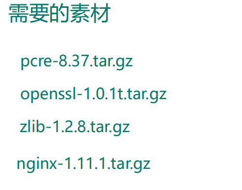
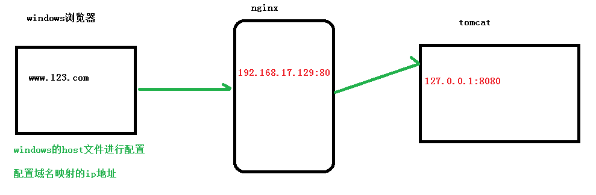
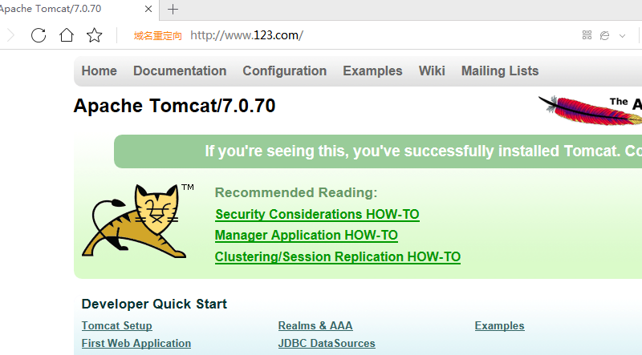
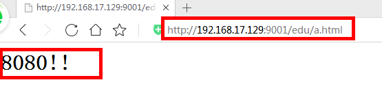
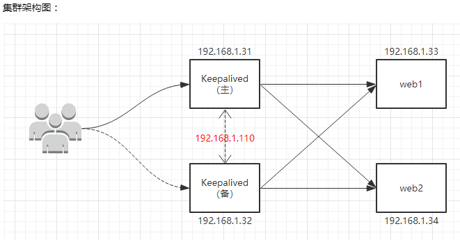

# 1、 nginx 简介

## （1）什么是 nginx 

Nginx (engine x) 是一个轻量级的、高性能的HTTP和反向代理web服务器

专为性能优化而开发，性能是其最重要的考量，实现上非常注重效率 ，能经受高负载的考验 有报告表明能支持高达 50,000 个并发连接数。

<!-- more -->

## （2）可以做什么

反向代理、负载均衡、动静分离

### 反向代理

Nginx不仅可以做反向代理，实现负载均衡。还能用作正向代理来进行上网等功能。

正向代理：如果把局域网外的 Internet 想象成一个巨大的资源库，则局域网中的客户端要访问 Internet ，则需要通过代理服务器来访问，这种代理服务就称为正向代理。


反向代理，将请求发送到反向代理服务器，由反向代理服务器去选择目标服务器获取数据后，再返回给客户端。此时反向代理服务器和目标服务器对外就是一个服务器，暴露的是代理服务器地址，隐藏了真实服务器 IP 地址。

客户端不需要任何配置


### 负载均衡

将请求分发到多个服务器上，将负载分发到不同的服务器，也就是我们所说的负载均衡


### 动静分离

为了加快网站的解析速度，可以把动态页面和静态页面由不同的服务器来解析，加快解析速度。降低原来单个服务器的压力。


简单来说就是把动态跟静态请求分开，不能理解成只是单纯的把动态页面和静态页面物理分离。严格意义上说应该是动态请求跟静态请求分开，可以理解成使用Nginx 处理静态页面，Tomcat处理动态页面。

动静分离从目前实现角度来讲大致分为两种：

 一种是纯粹把静态文件独立成单独的域名，放在独立的服务器上，也是目前主流推崇的方案； 

另外一种方法就是动态跟静态文件混合在一起发布，通过 nginx 来分开。 

通过 location 指定不同的后缀名实现不同的请求转发。通过 expires 参数设置，可以使浏览器缓存过期时间，减少与服务器之前的请求和流量。

具体 Expires 定义：是给一个资源设定一个过期时间，也就是说无需去服务端验证，直接通过浏览器自身确认是否过期即可，所以不会产生额外的流量。此种方法非常适合不经常变动的资源。（如果经常更新的文件，不建议使用 Expires 来缓存），我这里设置 3d，表示在这 3 天之内访问这个 URL，发送一个请求，比对服务器该文件最后更新时间没有变化，则不会从服务器抓取，返回状态码 304，如果有修改，则直接从服务器重新下载，返回状态码 200。

# 2、 Nginx 的安装



安装省略，可以参考另外一篇笔记

# 3、 Nginx 的常用命令和配置文件

## 常用命令

在/usr/local/nginx/sbin 目录下执行命令

```bash
# 启动
./nginx

# 查看版本号
./nginx -v

# 停止
./nginx -s stop

# 重新加载
./nginx -s reload
```

## 配置文件

```bash
worker_processes  1;# nginx 处理并发的数量

events {
    worker_connections  1024;# 最大连接数
}

http {
    include       mime.types;
    default_type  application/octet-stream;
    sendfile        on; 
    keepalive_timeout  65;
    server {
        listen       80;
        server_name  localhost;
        location / {
            root   html;
            index  index.html index.htm;
        }
        error_page   500 502 503 504  /50x.html;
        location = /50x.html {
            root   html;
        }
    }
}
```

### 第一部分：全局块

 从配置文件开始到 events 块之间的内容，主要会设置一些影响nginx 服务器整体运行的配置指令，主要包括配置运行 Nginx 服务器的用户（组）、允许生成的 worker process 数，进程 PID 存放路径、日志存放路径和类型以及配置文件的引入等。

### 第二部分：events块

events 块涉及的指令主要影响 Nginx 服务器与用户的网络连接，常用的设置包括是否开启对多 work process 下的网络连接进行序列化，是否允许同时接收多个网络连接，选取哪种事件驱动模型来处理连接请求，每个 word process 可以同时支持的最大连接数等。 上述例子就表示每个 work process 支持的最大连接数为 1024. 

这部分的配置对 Nginx 的性能影响较大，在实际中应该灵活配置。

### 第三部分：http块

代理、缓存和日志定义等绝大多数功能和第三方模块的配置都在这里。 需要注意的是：http 块也可以包括 http全局块、server 块。 

#### （1） http 全局块

http全局块配置的指令包括文件引入、MIME-TYPE 定义、日志自定义、连接超时时间、单链接请求数上限等。

#### （2）server 块

和虚拟主机有密切关系。

虚拟主机从用户角度看，和一台独立的硬件主机是完全一样的，该技术的产生是为了节省互联网服务器硬件成本。

 每个 http 块可以包括多个 server 块，而每个 server 块就相当于一个虚拟主机。 

而每个 server 块也分为全局 server 块，以及可以同时包含多个 locaton 块。

 1、全局 server 块 

最常见的配置是本虚拟机主机的监听配置和本虚拟主机的名称或IP配置。 

2、location 块 

一个 server 块可以配置多个 location 块。 

这块的主要作用是基于 Nginx 服务器接收到的请求字符串（例如 server_name/uri-string），对虚拟主机名称（也可以是IP别名）之外的字符串（例如 前面的 /uri-string）进行匹配，对特定的请求进行处理。地址定向、数据缓存和应答控制等功能，还有许多第三方模块的配置也在这里进行。

# 4、反向代理实例

## 实例1



本机 host 文件添加

```bash
192.168.17.129 www.123.com
```

Nginx 配置文件


测试



## 实例2

### 实现效果

使用 nginx 反向代理，根据访问的路径跳转到不同端口的服务中
nginx 监听端口为 9001

访问 http:// 192.168.17.129 :9001/edu/ 直接跳转到 127.0.0.1:808 0
访问 http:// 192.168.17.129 :9001/vod/ 直接跳转到 127.0.0.1:808 1

### Nginx 配置修改

再添加一个 server 块，添加配置


### 测试




# 5、负载均衡实例

## 负载均衡配置


## 负载均衡的策略

轮询、加权、iphash、fair

### 轮询（默认）

每个请求按时间顺序逐一分配到不同的后端服务器，如果后端服务器 down 掉，能自动剔除。

### weight

weigh t 代表权重默认为 1, 权重越高被分配的客户端越多

```bash
upstream server_pool{ 
	server 192.168.5.21 weight=5; 
	server 192.168.5.22 weight=10; 
}
```

### ip_hash

每个请求按访问 ip 的 hash 结果分配，这样每个访客固定访问一个后端服务器，可以解决session的问题

```bash
upstream server_pool{ 
    ip_hash; 
    server 192.168.5.21:80; 
    server 192.168.5.22:80; 
}
```


### fair （第三方）

按后端服务器的响应时间来分配请求，响应时间短的优先分配。

# 6、 动静分离实例

这里 `www` 和 `image` 是静态目录


# 7、配置高可用集群

## 主从



1. 需要两台 **nginx** 服务器
2. 需要 安装**keepalived**
3. 需要虚拟 **ip**


> https://www.bilibili.com/video/BV1zJ411w7SV?p=14&spm_id_from=pageDriver


# 8、Nginx 原理


## work 是如何工作的


## 一个 master 和多个 woker 有什么好处

1 ）可以使用 `nginx -s reload` 热部署

2 ）每个 woker 是独立的进程，如果有其中的一个 woker 出现问题，其他 woker 因为是独立的，继续进行争抢，实现请求过程，不会造成服务中断

## 设置多少个 woker 合适

worker 数和服务器的 cpu 数相等是最为适宜的

## 连接数 worker_connection

第一个：发送请求，占用了 woker 的几个连接数？

答案： 2 或者 4 个

一来一回是两个，如果只是静态资源，2个；如果访问了动态资源（比如访问了数据库），4个

第二个： nginx 有一 个 master ，有四个 woker ，每个 woker 支持最大的连接数 1024 ，支持的最大并发数是多少？

- 普通的静态访问最大并发数是： `worker_connections * worker_processes / 2`
- 而如果是 HTTP 作 为反向代理来说，最大并发数量应该是 `worker_connections * worker_processes / 4`


# 问题

## session 丢失如何解决？

（1）使用容器扩展插件来实现

（2）使用Nginx负载均衡的ip_hash策略

（3）使用框架的会话管理工具——比如Spring session

# 参考文献

> 1. https://www.bilibili.com/video/BV1zJ411w7SV