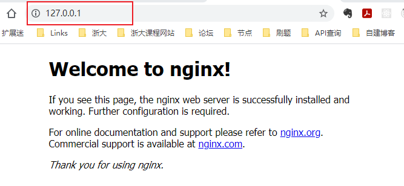
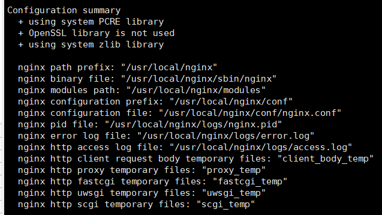
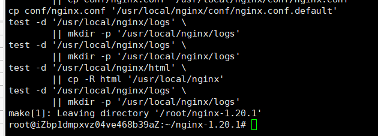
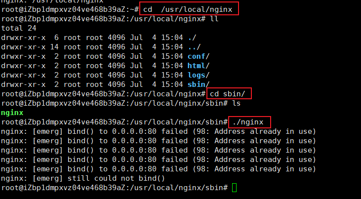
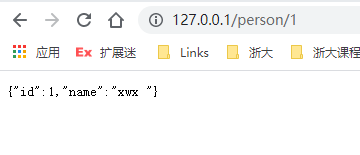

# Nginx是什么？

Nginx (engine x) 是一个轻量级的、高性能的HTTP和反向代理web服务器，第一个公开版本0.1.0发布于2004年10月4日。

因它的稳定性、丰富的功能集、简单的配置文件和低系统资源的消耗而闻名。

其特点是占有内存少，并发能力强，事实上nginx的并发能力在同类型的网页服务器中表现较好，中国大陆使用nginx网站用户有：百度、京东、新浪、网易、腾讯、淘宝等。

对于新建站点，建议使用最新稳定版作为生产版本

Nginx 既可以在内部直接支持 Rails 和 PHP 程序对外进行服务，也可以支持作为 HTTP代理服务对外进行服务。Nginx采用C进行编写

能够不间断服务的情况下进行软件版本的升级

> 以上来自百度百科

<!-- more -->

没有什么是加一层是解决不了的

# Nginx作用

> Http代理，反向代理，负载均衡（轮训和加权轮训）

正向代理：代理客户端

反向代理：代理服务器

iphash 对客户端请求的 ip 进行 hash 操作，然后根据 hash 结果将同一个客户端的 ip 请求发给同一台服务器进行处理

动静分离：样式那些静态文件可以单独提出来，将其做缓存操作，提高资源的响应速度

# 安装步骤

## Windows下安装

1、下载解压


2、直接运行


3、浏览器直接输：127.0.0.1:80（或者你改的其他端口）



## Linux 下安装

1、下载解压


2、手动编译安装

```bsh
./configure
make 
make install
```







提示缺少 库

```tex
./configure: error: the HTTP rewrite module requires the PCRE library.
You can either disable the module by using --without-http_rewrite_module
option, or install the PCRE library into the system, or build the PCRE library
statically from the source with nginx by using --with-pcre=<path> option.
```

解决方法：

```bash
sudo apt-get install libpcre3 libpcre3-dev -y
```

其他错误

```tex
./configure: error: the HTTP gzip module requires the zlib library.
You can either disable the module by using --without-http_gzip_module
option, or install the zlib library into the system, or build the zlib library
statically from the source with nginx by using --with-zlib=<path> option.
```

```bash
sudo apt-get install ruby
sudo apt-get install zlib1g
sudo apt-get install zlib1g-dev
```


3、查看是否安装成功

```bash
whereis nginx
```


4、进入 `bin` 目录启动




这里说明 80 端口被占用

看了一下确实被占用了


解决方法：

修改端口

```bash
server {
        listen       8499;

```


再次执行


# 常用命令

```bash
cd /usr/local/nginx/sbin

./nginx # 启动
./nginx -s stop # 停止
./nginx -s reload # 自动重新加载新的配置文件
./nginx -s quit # 安全退出
```

# 实战演示

以 `dropwizard` 项目为例

## 1、开启两个服务

```bash
 java -jar Nginx-Dropwizard-1.0-SNAPSHOT.jar serve hello.yml
```


修改配置文件的端口号之后开启第二个服务

```xml
server:
  applicationConnectors:
    - type: http
      port: 8500 # 在同一台服务器开启多个服务需要修改端口号
  adminConnectors:
  - type: http
    port: 8082 # 在同一台服务器开启多个服务需要修改端口号
```


测试：


## 2、使用 Nginx

```tex
# 增加下面两行
upstream 127.0.0.1 {
    server 127.0.0.1:8499 weight=1;# 配置权重
    server 127.0.0.1:8500 weight=1;
}

    server {
    listen       80;
    server_name  localhost;

    #charset koi8-r;

    #access_log  logs/host.access.log  main;

    location / {
    root   html;
    index  index.html index.htm;
    proxy_pass   http://127.0.0.1; # 添加这一行
    }
```

出现的问题：

1、无法重新加载配置文件

解决方法：找到对应的进程，杀掉重开服务

2、upstream 位置写错了

## 3、测试



# 配置详解

```bash
########### 每个指令必须有分号结束。#################
#user administrator administrators;  #配置用户或者组，默认为nobody nobody。
#worker_processes 2;  #允许生成的进程数，默认为1
#pid /nginx/pid/nginx.pid;   #指定nginx进程运行文件存放地址
error_log log/error.log debug;  #制定日志路径，级别。这个设置可以放入全局块，http块，server块，级别以此为：debug|info|notice|warn|error|crit|alert|emerg
events {
    accept_mutex on;   #设置网路连接序列化，防止惊群现象发生，默认为on
    multi_accept on;  #设置一个进程是否同时接受多个网络连接，默认为off
    #use epoll;      #事件驱动模型，select|poll|kqueue|epoll|resig|/dev/poll|eventport
    worker_connections  1024;    #最大连接数，默认为512
}
http {
    include       mime.types;   #文件扩展名与文件类型映射表
    default_type  application/octet-stream; #默认文件类型，默认为text/plain
    #access_log off; #取消服务日志    
    log_format myFormat '$remote_addr–$remote_user [$time_local] $request $status $body_bytes_sent $http_referer $http_user_agent $http_x_forwarded_for'; #自定义格式
    access_log log/access.log myFormat;  #combined为日志格式的默认值
    sendfile on;   #允许sendfile方式传输文件，默认为off，可以在http块，server块，location块。
    sendfile_max_chunk 100k;  #每个进程每次调用传输数量不能大于设定的值，默认为0，即不设上限。
    keepalive_timeout 65;  #连接超时时间，默认为75s，可以在http，server，location块。

    upstream mysvr {   
      server 127.0.0.1:7878;
      server 192.168.10.121:3333 backup;  #热备
    }
    error_page 404 https://www.baidu.com; #错误页
    server {
        keepalive_requests 120; #单连接请求上限次数。
        listen       4545;   #监听端口
        server_name  127.0.0.1;   #监听地址       
        location  ~*^.+$ {       #请求的url过滤，正则匹配，~为区分大小写，~*为不区分大小写。
           #root path;  #根目录
           #index vv.txt;  #设置默认页
           proxy_pass  http://mysvr;  #请求转向mysvr 定义的服务器列表
           deny 127.0.0.1;  #拒绝的ip
           allow 172.18.5.54; #允许的ip           
        } 
    }
}
```


# 参考文献

> 1. 百度百科
> 2. https://www.bilibili.com/video/BV1F5411J7vK
> 3. https://www.runoob.com/w3cnote/nginx-setup-intro.html


