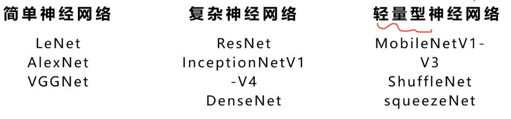
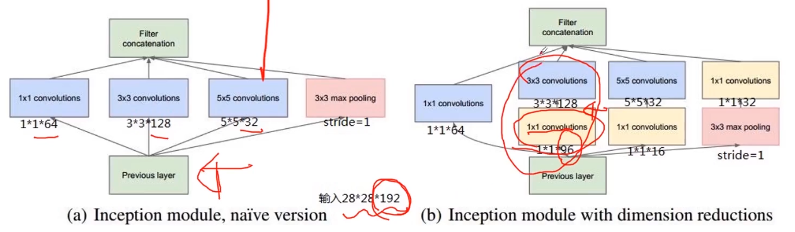
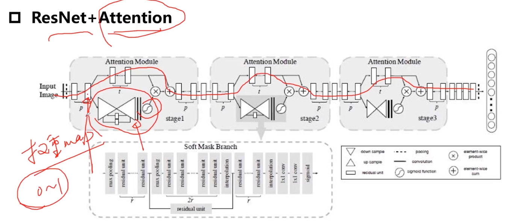
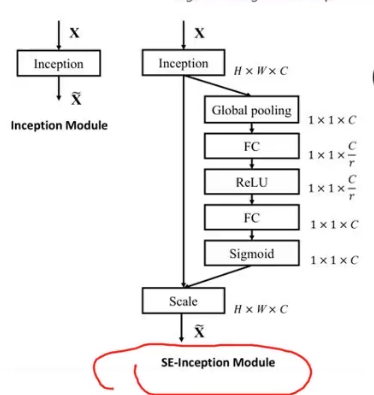

# 经典卷积神经网络介绍

## 串联结构的典型代表

- LeNet
- AlexNet
- VGGNet（提取特征）

## 跳跃连接

- ResNet
- DenseNet

## 并行结构

- InceptionV1 - V4

## 轻量级网络

**MobileNetV1**

- 适用于移动端的网络
- 深度可分离卷积代替传统的卷积 

## 多分支网络结构

处理相似性问题（人脸识别）

- 孪生神经网络
- TripletNet

## Attention结构

> 本质上就是加权

1、对于全局信息，注意力机制会重点关注一些特殊的目标区域也就是所谓的注意力焦点，进而利用有限的注意力资源对信息进行筛选，提高信息处理的准确性和效率

2、one-hot分布或者soft的软分布

3、Soft-Attention或者Hard-Attention

4、可以作用在特征图上，尺度空间上，channel尺度上，不同时刻历史特征上等

> 上半部分是ResNet，下半部分进行下采样之后上采样，拿到权重图，之后用S函数归一化到(0, 1)之间，作为权重矩阵

