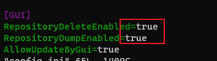
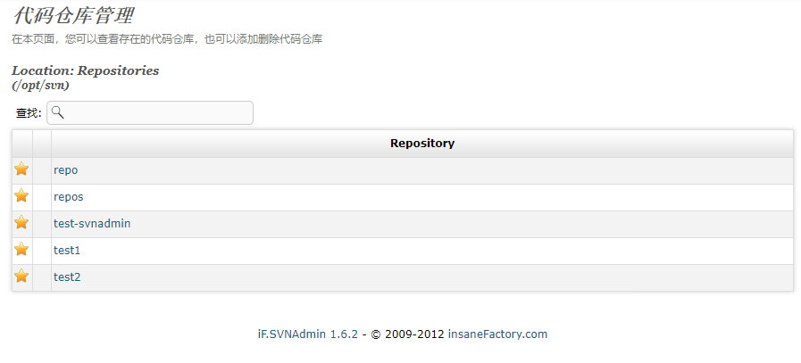
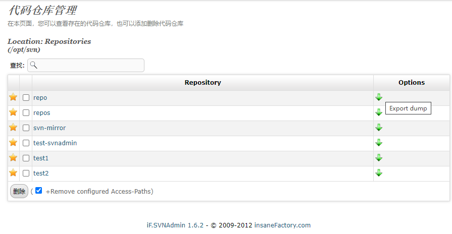

# IF.svnadmin被隐藏的代码库删除按钮显示的恢复方式

以我的电脑为例，我把这个软件部署在了 `/usr/local/apache2/htdocs/` 路径下，我们进入

`/usr/local/apache2/htdocs/svnadmin/data` 路径

我们修改一下 `config.ini`文件，修改内容如下图：

第一个是显示删除按钮，第二个是允许在该页面备份仓库

修改前后对比：

修改前：

修改后：

