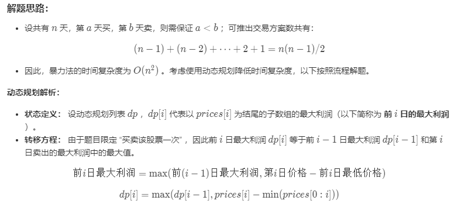

# [面试题63. 股票的最大利润](https://leetcode-cn.com/problems/gu-piao-de-zui-da-li-run-lcof/)

难度中等

假设把某股票的价格按照时间先后顺序存储在数组中，请问买卖该股票一次可能获得的最大利润是多少？


**示例 1:**

```
输入: [7,1,5,3,6,4]
输出: 5
解释: 在第 2 天（股票价格 = 1）的时候买入，在第 5 天（股票价格 = 6）的时候卖出，最大利润 = 6-1 = 5 。
     注意利润不能是 7-1 = 6, 因为卖出价格需要大于买入价格。
```

**示例 2:**

```
输入: [7,6,4,3,1]
输出: 0
解释: 在这种情况下, 没有交易完成, 所以最大利润为 0。
```


**限制：**

```
0 <= 数组长度 <= 10^5
```


==解题思路：==




代码：


```c
class Solution {
public:
    int maxProfit(vector<int>& prices) {
        int minCost = 10000000;
        int profit = 0;
        // 动态规划
        for(int i=0; i<prices.size(); i++){
            minCost = min(minCost, prices[i]);// 前i天最小价格
            profit = max(profit, prices[i]-minCost);
        }

        return profit;
    }
};
```
