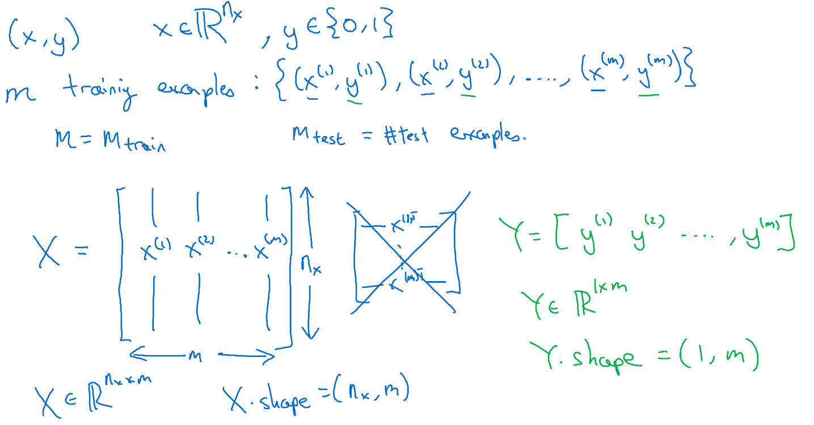

# 神将网络和深度学习

只要有足够多的数据，神经网络能够很好地拟合出一个反映 $x$ 和 $y$ 映射关系的函数

结构稍有不同的神经网络在不同的应用领域都非常的有用

- 多层感知机（标准神经网络，全连接的神经网络）
- CNN（图像）
- RNN，GRU， LSTM（时序数据）
- 其他变体

## 二分类

**逻辑回归**

给定一些训练数据，我们想让预测值 $\hat{y}^{i}$ 和真实值 $y^{i}$ 尽可能接近

样本 $x$ 按列拼起来在深度学习中更好用

输出：
$$
\hat{y}=\sigma(w^{T}x+b)
$$
代价函数：二元交叉熵
$$
单个样本：\mathcal{L}(\hat{y}, y)=-(y \log \hat{y}+(1-y) \log (1-\hat{y}))
$$

$$
\begin{aligned}
整个数据集：{J(w, b)} &= -\frac{1}{m} \sum_{i=1}^{m} \mathcal{L}\left(\hat{y}^{(i)}, y^{(i)}\right) \\
&= -\frac{1}{m}\left(\sum_{i=1}^{m} y^{(i)} \log \hat{y}^{(i)}+\left(1-y^{(i)}\right) \log \left(1-\hat{y}^{(i)}\right)\right)
\end{aligned}
$$

**梯度下降**

函数在一点沿梯度方向的变化率最大
$$
w:=w-\alpha \frac{dJ(w, b)}{dw}\\
b:=b-\alpha \frac{dJ(w, b)}{db}
$$
