# OS

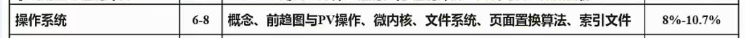

<!-- more -->

## 进程状态转换图

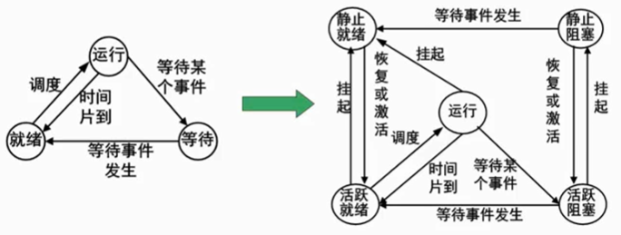

## 前趋图

类似拓扑排序，不做赘述

## 进程的同步和互斥

互斥：不能同时执行

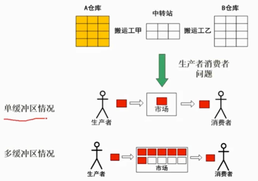

## PV操作

临界资源：诸进程间需要互斥方式对其进行共享的资源，如打印机、磁带机等

临界区：每个进程中访问临界资源的那段代码称为临界区

信号量：是一种特殊的变量


P操作：申请资源，$S=S-1$，小于0则自旋

V操作：释放资源，$S=S+1$，先判断再减

> 成对出现


使用二值信号量解决生产者消费者问题

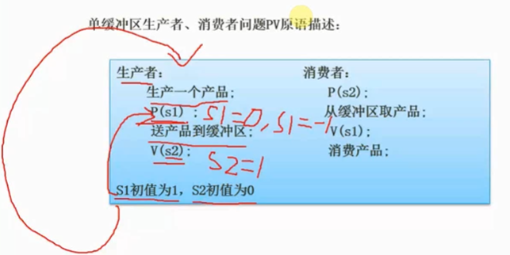

**例题1**

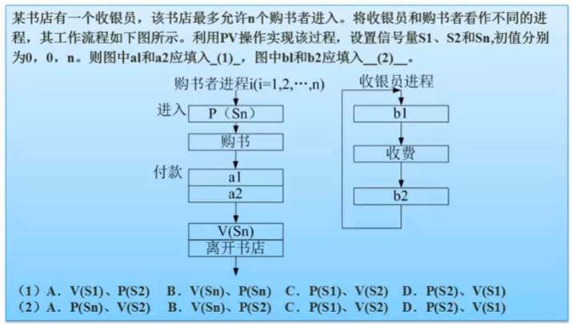

答案：$ A, C$

**例题2**

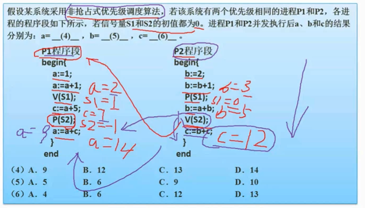

> 由于是非抢占，所以P2在唤醒P1之后，自己先执行，然后才是P1

## 死锁

进程管理是操作系统的核心，但如果设计不当，就会出现死锁的问题。如果一个进程在等待一件不可能发生的事，则进程就死锁了。而如果一个或多个进程产生死锁，就会造成系统死锁。

四个条件：

- 互斥
- 占用并等待
- 不可剥夺
- 循环等待


分为两种：

- 死锁预防：打破四大条件（考察不多）
- 死锁避免：资源有序分配、银行家算法

**例1**

系统有3个进程: A、B、C。这3个进程都需要5个系统资源。如果系统至少有多少个资源，则不可能发生死锁。

解析：先都给4个，然后再多1个就行，一共13个

$k%=$ 个进程，每个需要 $n$ 个资源，则一共需要 $ k * (n-1) + 1 $

## 银行家算法

迪杰斯特拉发明的

安全状态：如果存在一个由系统中所有进程构成的安全序列$P1，…，Pn$，则系统处于安全状态。安全状态一定是没有死锁发生。

不安全状态：不存在一个安全序列。不安全状态不一定导致死锁。

算法描述：允许进程动态地申请资源，但系统在进行资源分配之前，应先计算此次分配资源的安全性，若分配不会导致系统进入不安全状态，则分配，否则等待。为实现银行家算法，系统必须设置若干数据结构。

**例题**


```tex
R1 R2 R3 剩余 2 1 0
```


|      | 各个进程对资源的需求 |
| ---- | -------------------- |
| P1   | 5 3 1                |
| P2   | 0 1 0                |
| P3   | 6 0 1                |
| P4   | 0 0 1                |
| P5   | 2 3 1                |

一目了然，只能先执行P2，然后P2执行完，释放自己占有的所有资源

选 B

## 段页式存储

### 页式存储

页面大小固定，一般是 4k

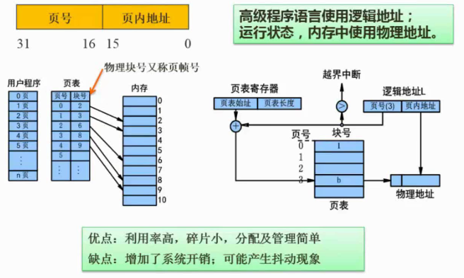

高频：逻辑地址和物理地址的转换

**例题**

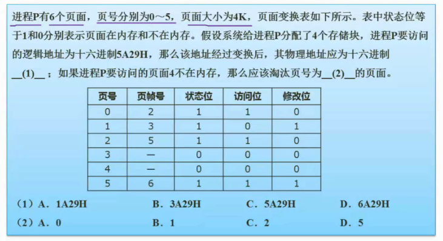

解析：

$ 4k = 2^{12} $，页面大小占后十二位，5对应的6

淘汰没有被访问的，淘汰1

### 段式存储

段大小不固定

段表的每个条目都有段基地址和段界限 

逻辑地址 = 段号s + 段偏移d，偏移量不能超过段界限


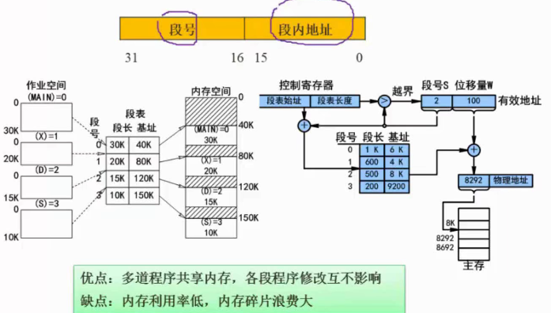


### 段页式存储

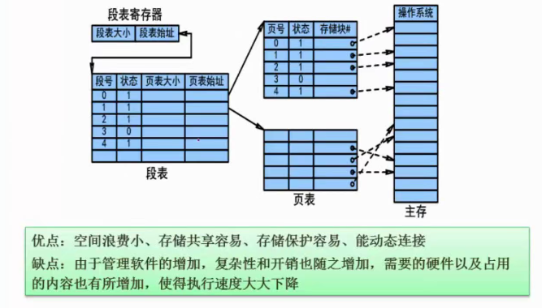

### 快表

快表是一块小容量的相联存储器（Associative Memory)，由高速缓存器组成.速度快，并且可以从硬件上保证按内容并行查找，一般用来存放当前访问最频繁的少数活动页面的页号。

## 页面置换算法

- 最优(Optimal，OPT)算法（理论最优，难以实现，因为要知道未来的访问顺序，但这在实际中是不可能的）：选择离当前位置最远的那个（置换最长时间不会使用的页面）
- 随机(RAND)算法
- 先进先出（FIFO）算法：有可能产生“抖动”。例如，432143543215序列,用3个页面,比4个缺页要少
- 最近最少使用(LRU)算法：不会“抖动”

一般考后两种

“抖动”，也称 Belady 异常，指刚刚换出就要访问

**例题**

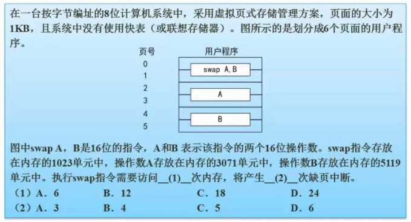

解析：

没有快表，每次访问都有先访问内存的页表，然后访问具体的内存块，总共 $2*6=12$

指令只产生一次中断（约定），操作数是每个两次，总共5

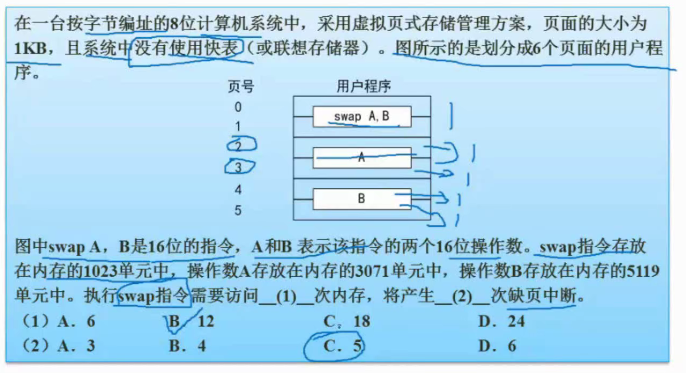

## 索引文件结构

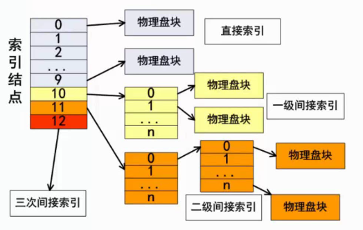

没有说明就是13个节点

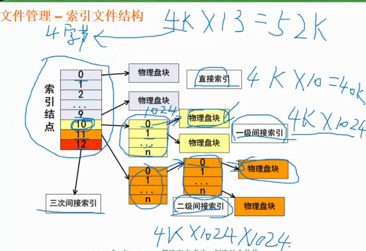

**例题**

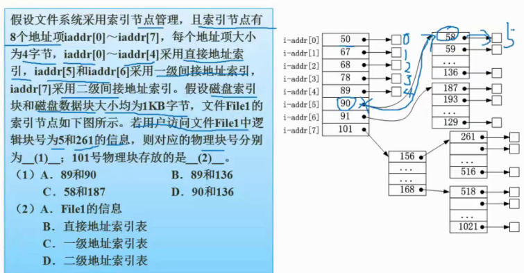

逻辑地址从0开始，5对应58,261对应187

二级索引表

## 树形文件结构

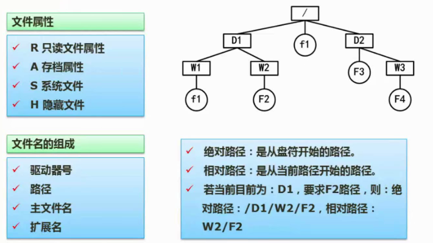

主要靠绝对路径和相对路径

## 位式图法

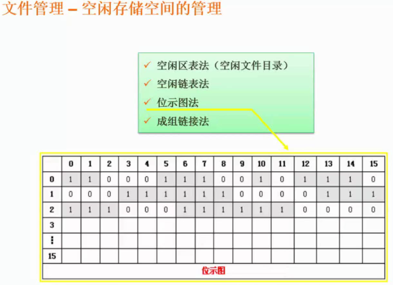


**例题**

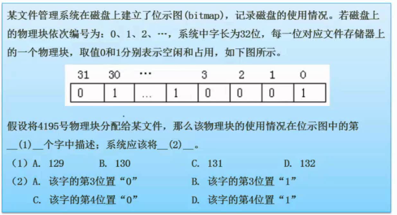

从0开始编号，$ (4195+1)/32=131.125$，所以在132

$131*32=4192$，所以第132字，0位置是4192，3位置是4195

第几个字从1开始算

第几个位置，第几号从0开始

## 数据传输控制方式

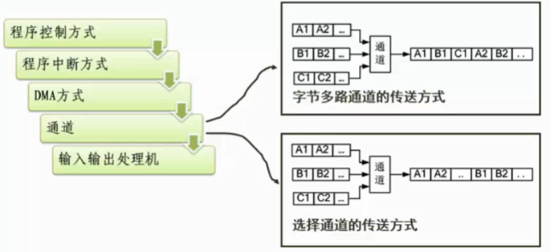

后两个是专用的，一般不考

##  微内核操作系统

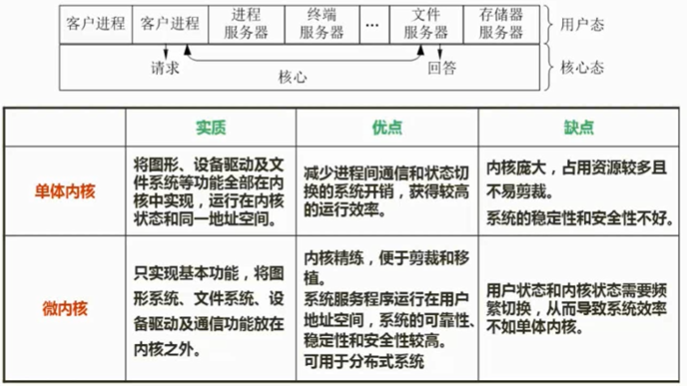

