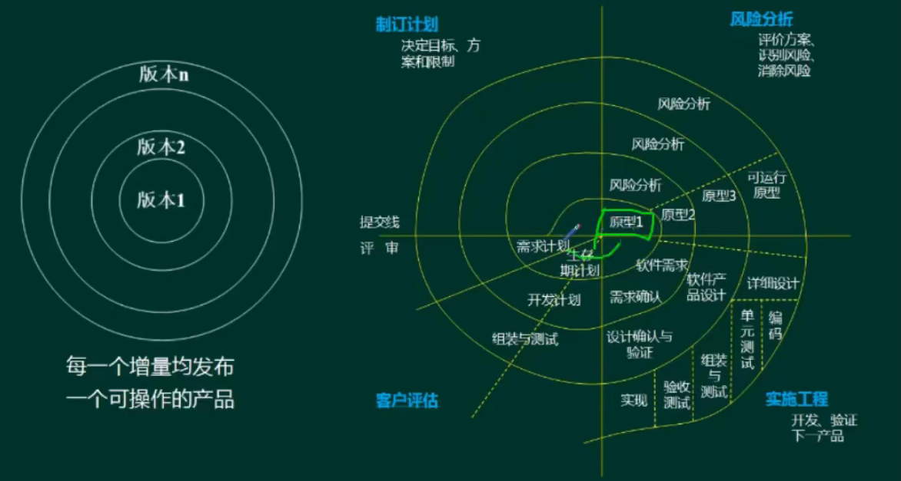
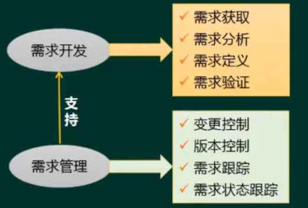

# 软件工程


<!-- more -->

## 软件开发方法

结构化法
- 用户至上
- 严格区分工作阶段，每阶段有任务与成果
- 强调系统开发过程的整体性和全局性
- 系统开发过程工程化，文档资料标准化
- 自顶向下，逐步分解(求精)

原型法
- 适用于**需求不明确**的开发
- 包括抛弃型原型和进化型原型

面向对象方法
- 更好的复用性
- 关键在于建立一个全面、合理、统一的模型
- 分析、设计、实现三个阶段，界限不明确

面向服务的方法
- SO方法有三个主要的抽象级别:操作、服务、业务流程
- SOAD分为三个层次:基础设计层（底层服务构件)、应用结构层（服务之间的接口和服务级协定）和业务组织层（业务流程建模和服务流程编排)
- 服务建模:分为服务发现、服务规约和服务实现三个阶段

## 软件开发模型


### 瀑布模型


需求分析阶段会产生SRS需求说明书

每个阶段都需要评审

结构化方法的展现

适合需求明确的项目

### 其他经典模型


快速原型：原型被抛弃了

### 增量模型与螺旋模型



螺旋适合大型系统，有风险分析

### V模型


V模型：测试计划提前做

RAD（快速应用开发）：瀑布 + 基于构件的开发


强大的构件库，快、省成本、可靠性高

构件库的积累是很花时间的（可以直接用现成的）

### 统一过程


```tex
初始 -> 细化 -> 构建 -> 交付
```


### 敏捷方法


小步快跑的模式，适用小型项目开发

大项目拆成小项目，也就成了敏捷开发

勇气：应对变更的勇气

测试先行：先写测试计划、测试用例


XP (Extreme Programming，极限编程)在所有的敏捷型方法中，XP是最引人瞩目的。它源于Smalltalk圈子，特别是Kent Beck和Ward Cunningham在20世纪80年代末的密切合作。XP在一些对**费用控制严格的公司中的使用**，已经被证明是**非常有效**的。

Cockburn的水晶系列方法，水晶系列方法是由Alistair Cockburn提出的。它与XP方法一样，都有以人为中心的理念，但在实践上有所不同。Alistair考虑到人们一般很难严格遵循一个纪律约束很强的过程，因此，与XP的高度纪律性不同，Alistair探索了用**最少纪律约束而仍能成功的方法**，从而在产出效率与易于运作上达到一种平衡。也就是说，虽然水晶系列不如XP那样的产出效率，但会有更多的人能够接受并遵循它。

开放式源码，这里提到的开放式源码指的是开放源码界所用的一种运作方式。开放式源码项目有一个特别之处，就是**程序开发人员在地域上分布很广**，这使得它和其他敏捷方法不同，因为一般的敏捷方法都强调项目组成员在同一地点工作。开放源码的一个突出特点就是查错排障(debug)的高度并行性，任何人发现了错误都可将改正源码的“补丁”文件发给维护者。然后由维护者将这些“补丁”或是新增的代码并入源码库。

SCRUM。SCRUM己经出现很久了，像前面所论及的方法一样，该方法强调这样一个事实，即**明确定义了的可重复的方法过程**只限于在明确定义了的可重复的环境中，为明确定义了的可重复的人员所用，去解决明确定义了的可重复的问题。

Coad的功用驱动开发方法(FDD-Feature Driven Development)

- FDD是由Jeff De Luca和大师Peter Coad提出来的。像其他方法一样，它致力于短时的迭代阶段和可见可用的功能。在FDD中，一个迭代周期一般是两周。
- 在FDD中，编程开发人员分成两类：**首席程序员和“类”程序员**(class owner)。首席程序员是最富有经验的开发人员，他们是项目的协调者、设计者和指导者，而“类”程序员则主要做源码编写。

ASD方法，ASD (Adaptive Software Development)方法由Jim Highsmith提出，其核心是三个非线性的、重叠的开发阶段：**猜测、合作与学习**。


### 逆向工程


### 净室软件工程

净室即无尘室、洁净室。也就是一个受控污染级别的环境。

使用盒结构规约（或形式化方法）进行分析和设计建模，并且强调将正确性验证，而不是测试，作为发现和消除错误的主要机制。

使用统计的测试来获取认证被交付的软件的可靠性所必需的出错率信息。

## 需求工程

软件需求是指用户对系统在功能、行为、性能、设计约束等方面的期望。
软件需求是指用户解决问题或达到目标所需的条件或能力，是系统或系统部件要满足合同、标准、规范或其他正式规定文档所需具有的条件或能力，以及反映这些条件或能力的文档说明。



需求获取

需求分析

UML4+1视图

UML图

UML关系
