# 企业信息化战略与实施

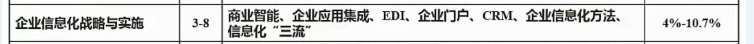

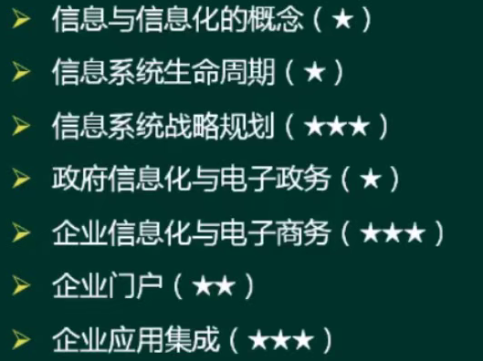

<!-- more -->

## 信息的概念及特点

### 信息的定义

- 香农：信息就是不确定性的减少。

- 维纳：信息就是信息，既不是物质，也不是能量。

### 信息的特点

- 客观性（真伪性）∶也叫事实性，不符合事实的信息不仅没价值，还有副作用

- 动态性：信息随着时间的变化而变化。

- 层次性：信息可分为战略级、管理级和操作级。

- 传递性：信息在**时间上的传递即是存储**;在**空间上的传递即是转移或扩散**。
- 滞后性：信息是数据加工后的产物，所以相对数据有滞后性。

- 扩压性：信息和实物不同，它可以扩散也可以压缩。

- 分享性：信息可以分享，这和物质不同，并且信息分享具有非零和性。

### 信息化的概念

信息化是从**工业社会到信息社会的演进与变革**。

信息化的主体是全体社会成员（政府、企业、团体和个人），时域是一个长期过程空域是经济和社会的一切领域，手段是先进社会生产工具。

### 信息化对组织的意义

组织的结构创新：如虚拟企业、虚拟社区。

组织的管理创新：实施电子政务、建立电子政府、建立电子社区以提升管理水平。

组织经营创新：利用信息化将经营和管理融为一体。

造就信息化的人才队伍：三类人才(IT专业人才，业务人才，专家型人才)。

### 信息化标准、法律等

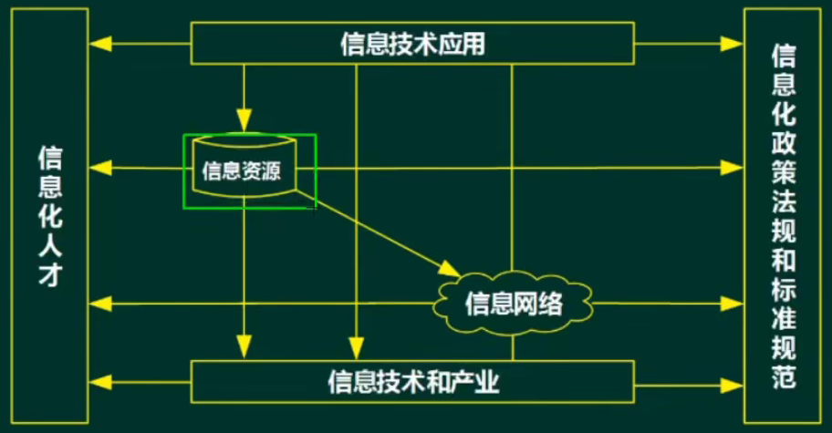

## 信息系统战略规划

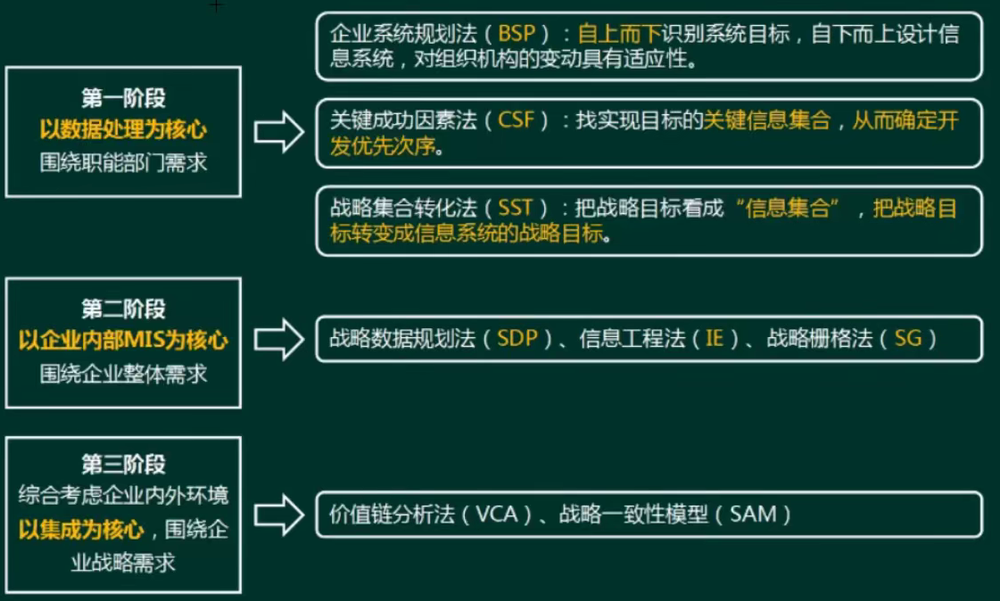

各个阶段的核心，方法论

## 生命周期

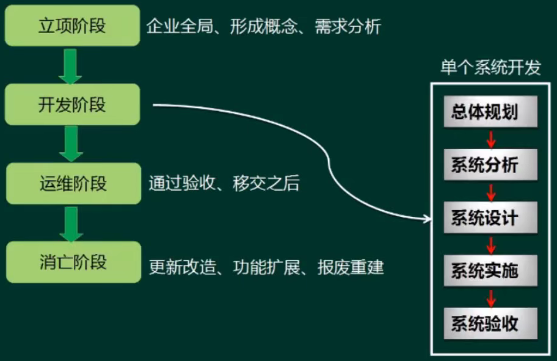

运维是持续时间最长的

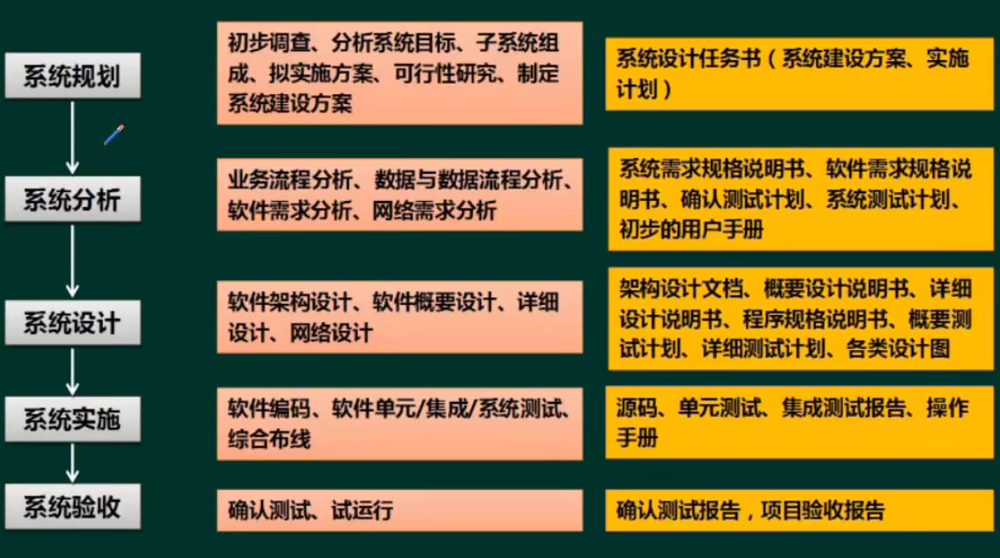

分析：解决做什么的问题

设计：怎么做的问题

（了解即可）

## 政府信息化与电子政务

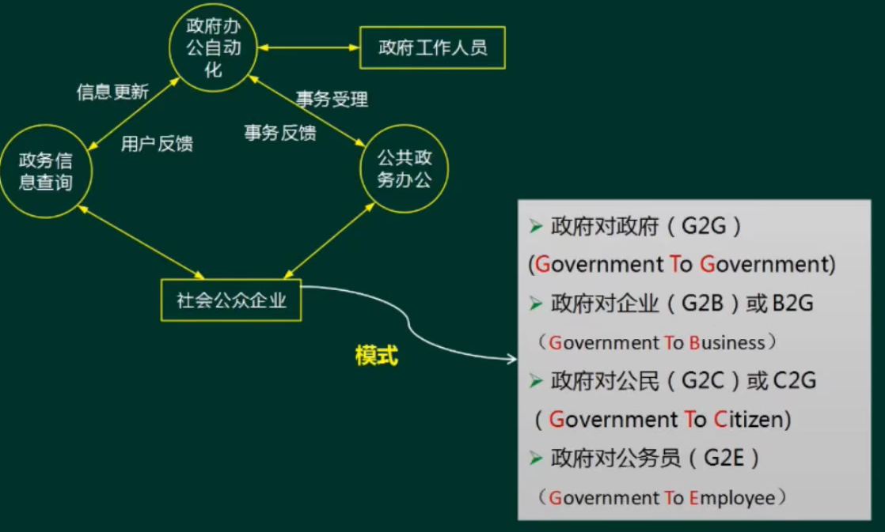

## 企业信息化与电子政务

1. 企业资源计划（ERP）
2. 客户关系管理（CRM）
3. 供应链管理（SCM）
4. 产品数据管理
5. 商业智能（BI）
6. 决策支持系统（DSS）
7. 知识管理
8. 业务流程重组（BPR)

### 企业资源计划（ERP）

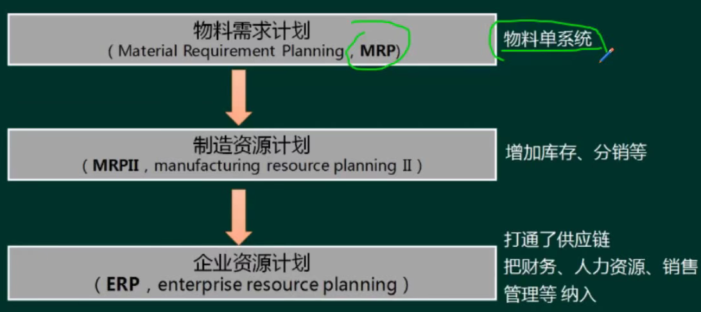

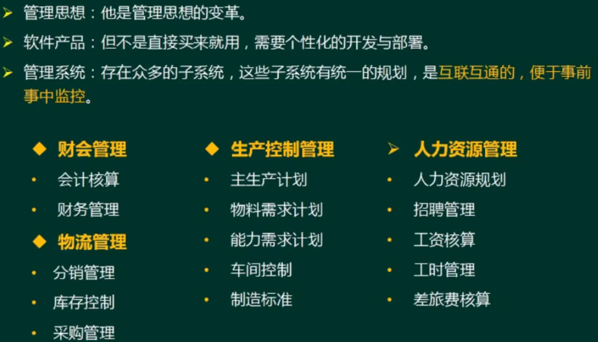

### 客户关系管理（CRM）

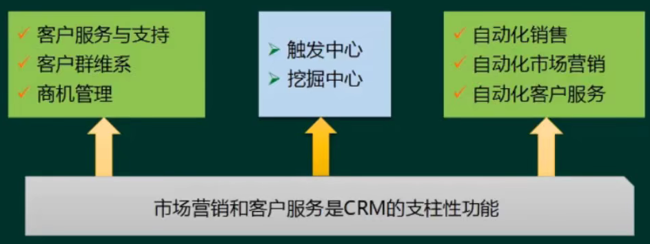

通过维护客户关系让企业获利

### 供应链管理（SCM）

信息的互联互通

**信息流是核心**

### 商业智能（BI）

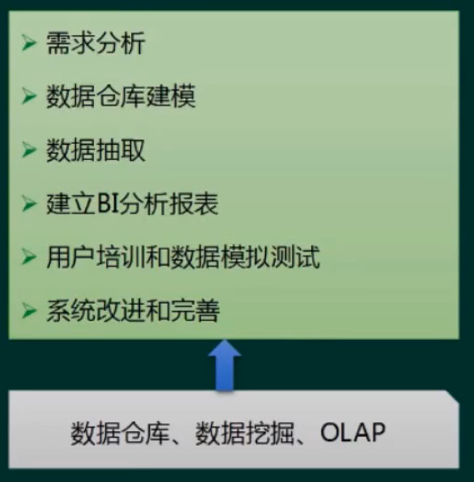

一个打包的解决方案

OLAP：联机分析处理

OLTP：联机事务处理

**数据仓库**的特点：

- 面向主题：数据按主题组织。

- 集成的：消除了源数据中的不一致性，提供整个企业的一致性全局信息。

- 相对稳定的(非易失的)︰主要进行查询操作，只有少量的修改和删除操作（或是不删除)。

- 反映历史变化(随着时间变化)：记录了企业从过去某一时刻到当前各个阶段的信息，可对发展历程和未来趋势做定量分析和预测。

**数据挖掘**

方法：

决策树（构建树结构进行分析)

神经网络（类似统计学中的判别、回归、聚类等功能)

遗传算法(三个基本过程：繁殖（选择)、交叉（重组)、变异（突变）)

关联规则挖掘算法(关联规则是描述数据之间存在关系的规则)

分类：

关联分析：挖掘出隐藏在数据间的相互关系。

序列模式分析：侧重点是分析数据间的前后关系（因果关系)

分类分析：为每一个记录赋予一个标记再按标记分类。

聚类分析：分类分析法的逆过程。

### 数据湖

数据湖是一个存储企业的各种各样原始数据的大型仓库，其中的数据可供存取、处理、分析及传输。

数据湖从企业的多个数据源获取原始数据，并且针对不同的目的，同一份原始数据还可能有多种满足特定内部模型格式的数据副本。因此，数据湖中被处理的数据可能是任意类型的信息，从结构化数据到完全非结构化数据。

数据仓库仅支持分析处理；数据湖既支持分析处理，也支持事务处理。

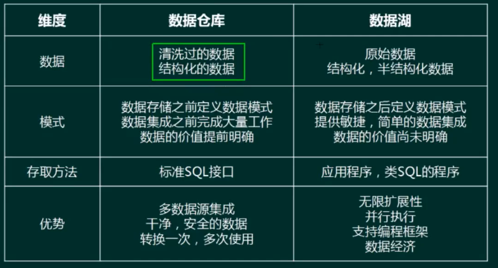

### 决策支持系统（DSS）

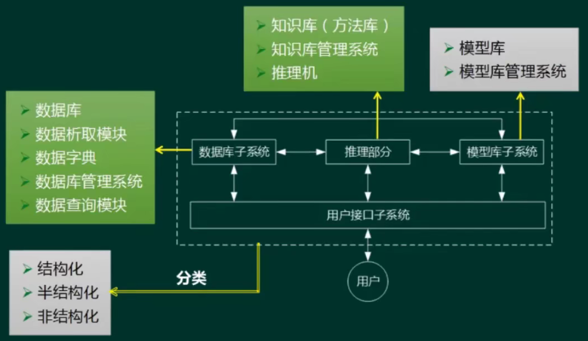

### 业务流程重组（BPR)

BPR是对企业的业务流程进行**根本性**的再思考和**彻底性**的再设计，从而获得可以用诸如成本、质量、服务和速度等方面的业绩来衡量的显著性的成就。

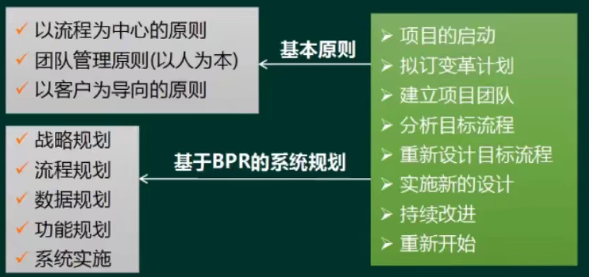

业务流程管理（BPM）

BPM是一种以**规范化**的构造端到端的卓越业务**流程**为中心，以**持续的**提高组织业务绩为
目的的**系统化**方法。

PDCA闭环的管理过程（又称戴明环）

- 明确业务流程所欲获取的成果

- 开发和计划系统的方法，实现以上成果

- 系统地部署方法，确保全面实施

- 根据对业务的检查和分析以及持续的学习活动，评估和审查所执行的方法。并进一步提出计划和实施改进措施

BPM与BPR管理思想最根本的不同就在于流程管理并不要求对所有的流程进行再造。构造卓越的业务流程并不是流程再造，而是根据现有流程的具体情况，对流程进行规范化的设计

流程管理包含三个层面：规范流程、优化流程和再造流程

BPR比BPM改动大

### 企业门户

企业网站：注重单向信息传递，缺互动。

企业信息门户 （EIP)：把各种应用系统、数据资源和互联网资源统一集成到企业门户之下。

企业知识门户（EKP )：企业网站的基础上增加**知识性内容**。

企业应用门户 (EAP)：实际上是对企业业务流程的集成。它以**业务流程和企业应用**为核心，把业务流程中功能不同的应用模块通过门户技术集成在一起。

企业通用门户：集以上四者于一身。

### 企业应用集成

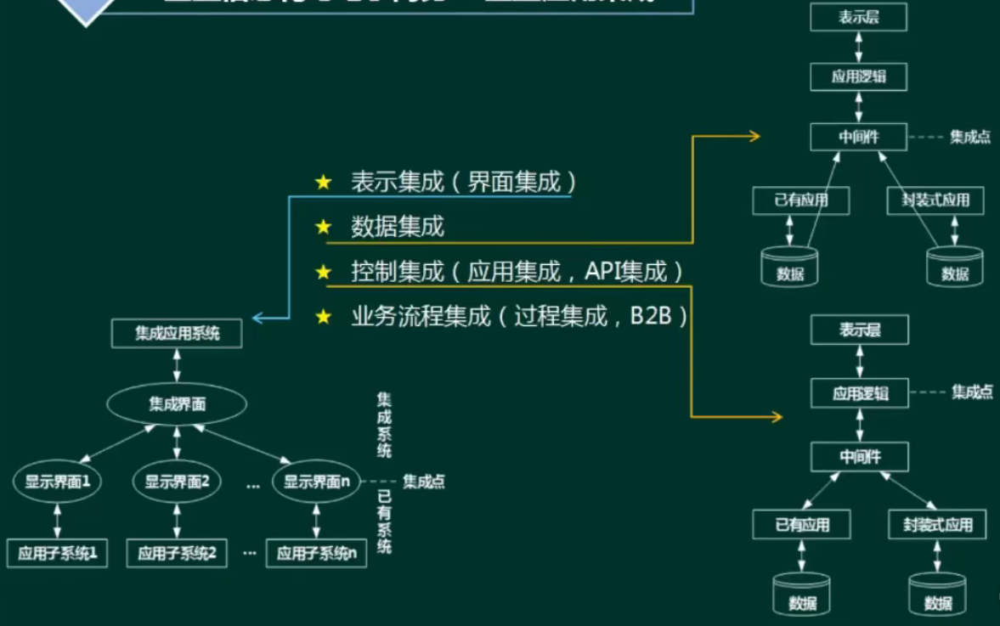

控制集成：A调用B的接口

界面集成：把各应用系统的界面集成起来，统一入口，产生“整体”感觉。

数据集成：数据集成是应用集成和业务过程集成的基础。把不同来源、格式、特点性质的数据在逻辑上或物理上有机地集中，从而为企业提供全面的数据共享。ETL、数据仓库、联邦数据库都可视为数据集成。

控制集成（功能集成、应用集成)：业务逻辑层次集成，可以借助于远程过程调用或远程方法调用、面向消息的中间件等技术。

业务流程集成（过程集成)︰进行业务流程集成时，企业必须对各种业务信息的交换进行定义、授权和管理，以便改进操作、减少成本、提高响应速度。

消息集成：适用于数据量小、但要求频繁地、立即地、**异步地**数据交换场合。

共享数据库：实时性强、可以频繁交互，数据的交换属于**同步方式**。

文件传输：适用于数据量大、**交换频度小**、即时性要求低的情况。

### 电子商务

B2C（京东）、B2B（阿里）、C2C（咸鱼）、O2O（线上对线下，如团购）

## 参考文献

> 1. https：//www.bilibili.com/video/BV12o4y1k7Vi