# 计算机网络

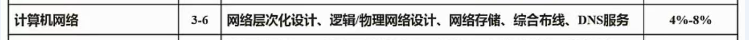

<!-- more -->

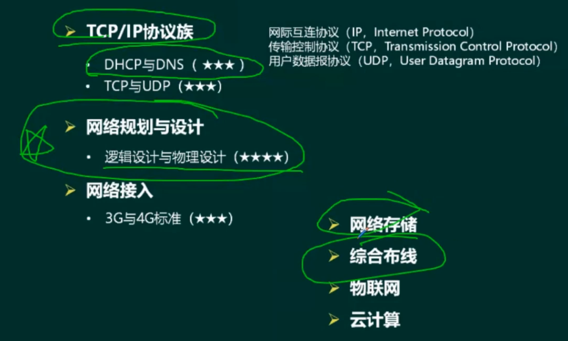

## DHCP协议

动态主机配置协议（DHCP，Dynamic Host Configuration Protocol）

1、客户机/服务器模型

2、租约默认为8天

3、当租约过半时，客户机需要向DHCP服务器申请续租;

4、当租约超过87.5%时，如果仍然没有和当初提供IP的DHCP服务器联系上，则开始联系其他的DHCP服务器。

5、固定分配、动态分配和手动（自动）分配。

6、169.254.X.X和0.0.0.0（无效的IP，忽悠你的）

## DNS协议

递归查询：服务器必需回答目标P与域名的映射关系。

迭代查询：服务器收到一次迭代查询回复一次结果，这个结果不一定是目标IP与域名的映射关系，也可以是其它DNS服务器的地址。

主机向本地域名服务器的查询采用递归查询。

本地域名服务器向根域名服务器的查询通常采用迭代查询。

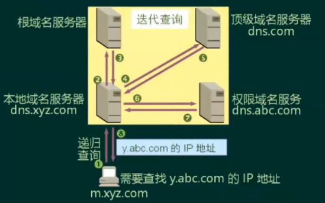

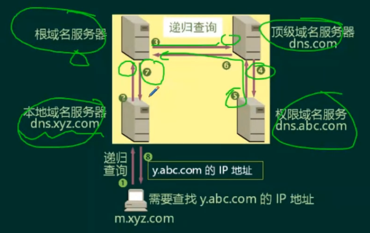

## 网络规划与设计

需求分析：功能需求、通信需求、性能需求、可靠性需求、安全需求、运行与维护需求、管理需求

网络规划原则：实用性原则、开放性原则、先进性原则

网络设计任务：确定网络总体目标、确定总体设计原则、通信子网设计、资源子网设计、设备选型、网络操作系统与服务器资源设备、网络安全设计

网络实施原则：可靠性原则、安全性原则、高效性原则、可扩展性原则

网络实施步骤：工程实施计划、网络设备到货验收、设备安装、系统测试、系统试运行、用户培训、系统转换

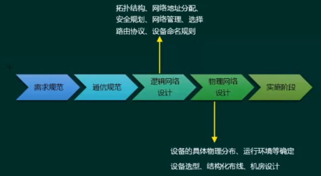

### 逻辑网络设计

利用需求分析和现有网络体系分析的结果来设计逻辑网络结构，最后得到一份逻辑网络设计文档，输出内容包括以下几点：

- 逻辑网络设计图
- IP地址方案
- 安全方案
- 招聘和培训网络员工的具体说明
- 对软硬件、服务、员工和培训的费用初步估计

### 物理网络设计

物理网络设计是对逻辑网络设计的物理实现，通过对**设备的具体物理分布、运行环境**等确定，确保网络的物理连接符合逻辑连接的要求。输出如下内容：

- **网络物理结构图和布线方案**
- **设备和部件的详细列表清单**
- 软硬件和安装费用的估算
- 安装日程表，详细说明服务的时间以及期限
- 安装后的测试计划
- 用户的培训计划

### 分层设计

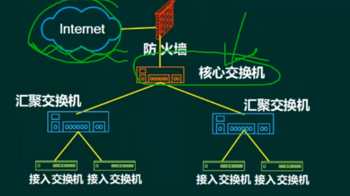

接入层：用户接入、计费管理、MAC地址认证、收集用户信息

汇聚层：网络访问策略控制、数据包处理、过滤、寻址

核心层：高速数据交换，常用冗余机制

## 网络接入技术

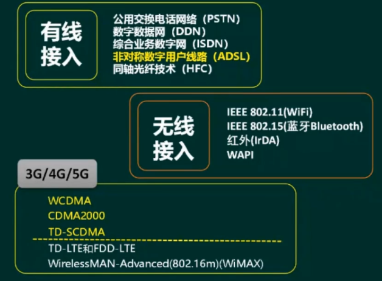

协议和标准

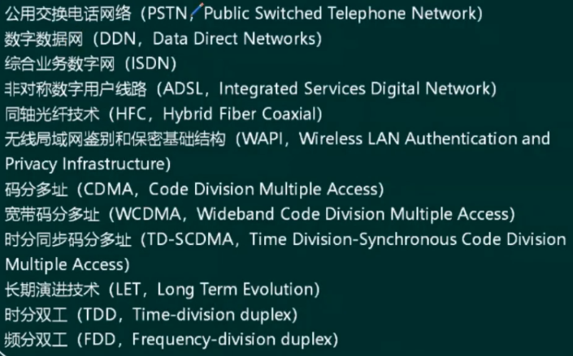

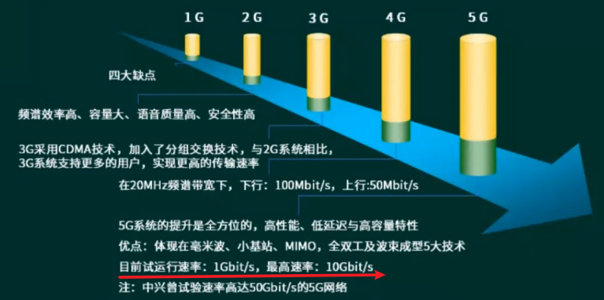

## 网络存储技术

### 分类

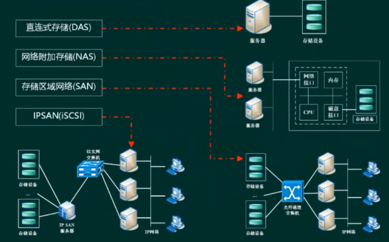

### Raid

Raid0(条块)：性能最高，并行处理，无冗余，损坏无法恢复

Raid1(镜像结构)：可用性，可修复性好，仅有50%利用率

Raid0+ 1(Raid10)： Raid0与Raid1长处的结合，高效也可靠

Raid3(年偶校验并行传送)：N+1模式，有固定的校验盘，坏一个盘可恢复

Raid5(分布式奇偶校验的独立磁盘)：N+1模式，无固定的校验盘，坏一个盘可恢复

Raid6(两种存储的奇偶校验)：N+2模式，无固定的校验盘，坏两个盘可恢复

## IPV6

IPv6是设计用于替代现行版本IP协议(IPv4)的下一代IP协议。

（1）IPv6地址长度为128位，地址空间增大了296倍;

（2）灵活的IP报文头部格式。使用一系列固定格式的扩展头部取代了IPv4中可变长度的选项字段。IPv6中选项部分的出现方式也有所变化，使路由器可以简单路过选项而不做任何处理，加快了报文处理速度;

（3）IPv6简化了报文头部格式，字段只有8个，加快报文转发，提高了吞吐量;

（4）提高安全性。身份认证和隐私权是IPv6的关键特性;

（5）支持更多的服务类型;

（6）允许协议继续演变，增加新的功能，使之适应未来技术的发展;

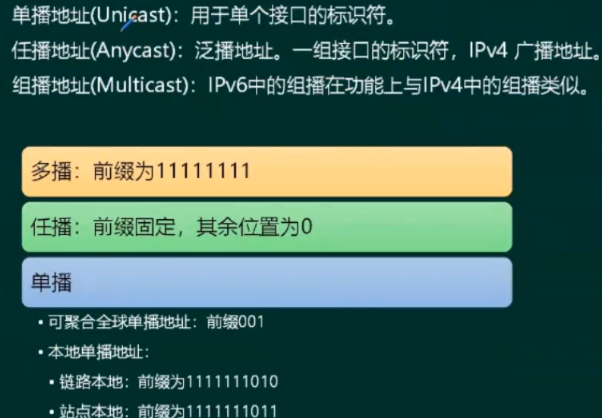

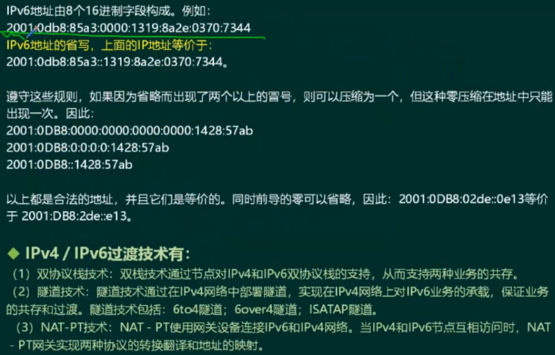

- 高位0可省略
- 一段全为0记为1个0
- 多段0直接省略为 `::`，但是只能用一次

## 综合布线系统

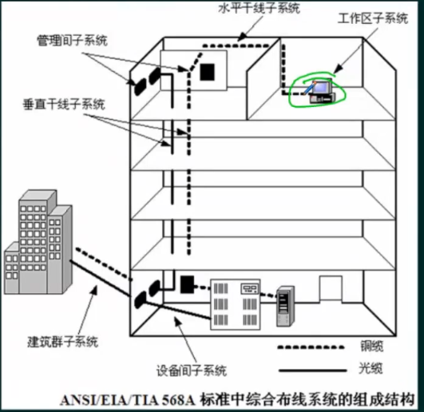

## 物联网

物联网(The Internet of Things）是实现物物相连的互联网络，其内涵包含两个方面:第一，物联网的核心和基础仍然是互联网，是在互联网基础上延伸和扩展的网络;第二，其用户端延伸和扩展到了任何物体与物体之间，使其进行信息交换和通信

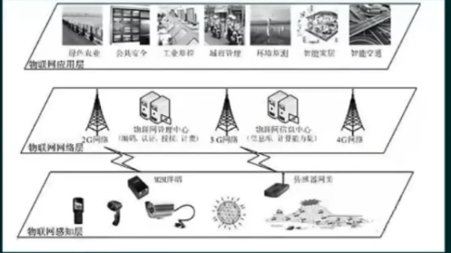

感知层：识别物体、采集信息。如二维码、RFID、摄像头、传感器（温度、湿度)

网络层：传递信息和处理信息。通信网与互联网的融合网络、网络管理中心、信息中心和智能处理中心等

应用层：解决信息处理和人机交互的问题

### RFID

射频识别技术(Radio Frequency ldentification，RFID)，又称电子标签,是一种通信技术，可通过无线电讯号识别特定目标并读写相关数据，而无需识别系统与特定目标之间建立机械或光学接触。该技术是物联网的一项核心技术，很多物联网应用都离不开它

RFID的基本组成部分通常包括：标签、阅读器、天线。

### 二维码

二维码是用某种特定的几何图形按一定规律在平面（二维方向上）分布的黑白相间的图形记录数据符号信息的。在代码编制上巧妙地利用构成计算机内部逻辑基础的“0”、“1”比特流的概念，使用若干个与二进制相对应的几何形体来表示文字数值信息，通过图象输入设备或光电扫描设备自动识读以实现信息自动处理

二维条码中，常用的码制有：Data Matrix，Maxi Code，Aztec，QR Code,Vericode，PDF417，Ultracode，Code 49，Code 16K

- 若采用扩展的字母数字压缩格式，可容纳1850个字符

- 若采用二进制/ASCIl格式，可容纳1108个字节

- 若采用数字压缩格式，可容纳2710个数字

## 云计算

云计算是一种基于互联网的计算方式，通过这种方式，共享的软硬件资源和信息可以按需提供给计算机和其他设备。云其实是网络、互联网的一种比喻说法。云计算的核心思想，是将大量用网络连接的计算资源统一管理和调度，构成一个计算资源池向用户按需服务。提供资源的网络被称为“云”。狭义云计算指IT基础设施的交付和使用模式，指通过网络以按需、易扩展的方式获得所需资源;广义云计算指服务的交付和使用模式，指通过网络以按需、易扩展的方式获得所需服务。这种服务可以是IT和软件、互联网相关，也可是其他服务

特点：

- 集合了大量计算机，规模达到成干上万
- 多种软硬件技术相结合
- 对客户端设备的要求低
- 规模化效应

软件即服务(Saas，Software-as-a-Service)：打包应用软件，提供给用户，比如客服机器人，百度翻译

平台即服务(PaaS，Platform-As-A-Service)：提供平台，需要二次开发

基础设施即服务(Iaas，Infrastructure-As-A-Service)：提供设备

