# 数据库

<!-- more -->

## 三级模式两级映射

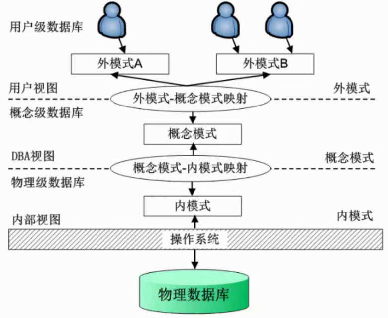

选择常考

内模式关注数据存放

概念模式类似于数据库的表

外模式类似于数据库的视图

## 数据库设计过程

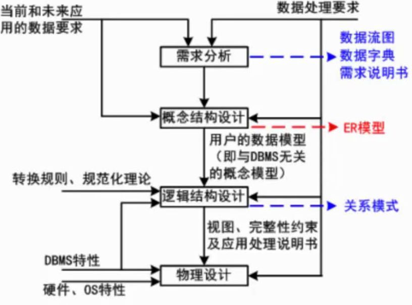

## ER模型

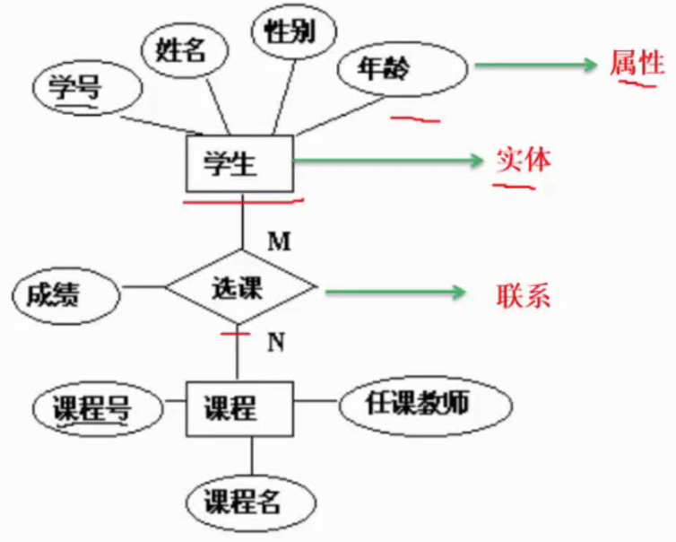

集成的方法：
- 多个局部E-R图一次集成。
- 逐步集成，用累加的方式一次集成两个局部E-R。

集成产生的冲突及解决办法：
- 属性冲突：包括属性域冲突和属性取值冲突。
- 命名冲突：包括同名异义和异名同义。
- 结构冲突：包括同一对象在不同应用中具有不同的抽象，以及同一实体在不同局部E-R图中所包含的属性个数和属性排列次序不完全相同。

一个实体型转换为一个关系模式

1对1：最少2个（联系可以放到其中一个实体里）

1对多：最少2个

多对多：最少3个，多对多的联系必须要转成一个实体

三个以上实体间的一个多元联系

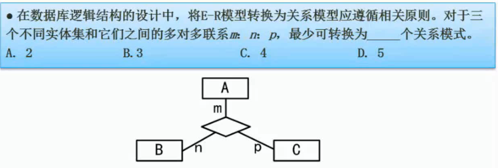

4个

## 关系代数

并、交、差、笛卡尔积、投影、选择、联接

投影：$\pi$

选择：$\sigma$

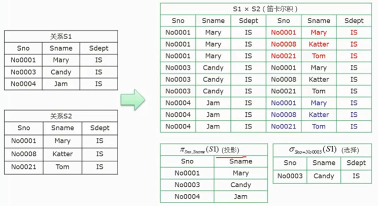

联接

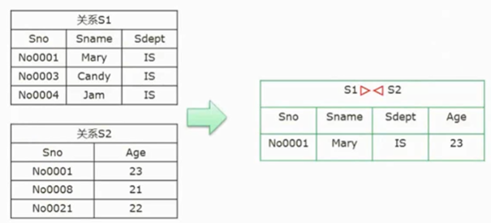

## 函数依赖

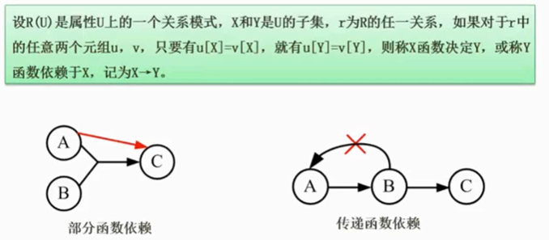

部分依赖：主键是两个以上的组合，主键中的一部分可以确定某个属性

## 规范化理论的价值和用途

非规范化的关系模式，可能存在的问题包括：数据冗余、更新异常、插入异常、删除异常

## 求候选关键字

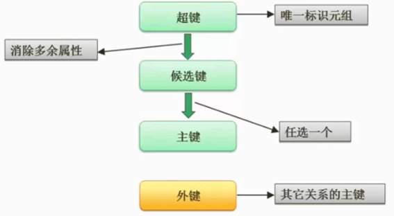

超键存在多余属性，候选键没有

将关系模式的函数依赖关系用“有向图”的方式表示
找**入度为0**的属性，并以该属性集合为起点，尝试遍历有向图，若能正常遍历图中所有结点，则该属性集即为关系模式的候选键
若入度为0的属性集不能遍历图中所有结点，则需要尝试性的将一些中间结点（既有入度，也有出度的结点）并入入度为0的属性集中，直至该集合能遍历所有结点，集合为候选键

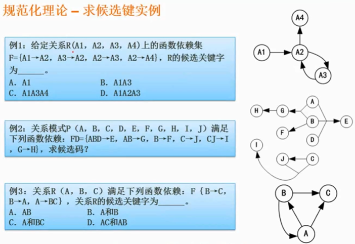

例1：A

例2：ABCD

（1）只在右部出现的属性，不属于候选码;
（2）只在左部出现的属性，一定存在于某候选码当中;
（3）外部属性一定存在于任何候选码当中;
（4）其他属性逐个与2，3的属性组合，求属性闭包，直至X的闭包等于U,若等于U,则X为候选码。

例3：B

## 范式

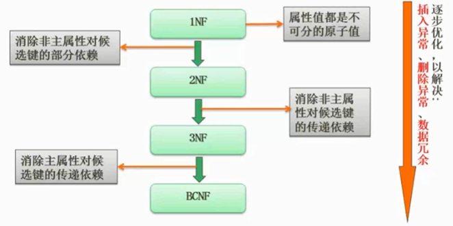

必考

第一范式（1NF)：在关系模式R中，当且仅当所有域只包含原子值，即每个分量都是不可再分的数据项，则称R是第一范式。

第二范式(2NF)：当且仅当R是1NF，且每一个非主属性完全依赖主键（不存在部分依赖）时，则称R是第二范式。

第二范式会存在那些问题？

数据冗余、更新异常、插入异常、删除异常等

第三范式（3NF)：当且仅当R是1NF，且E中没有非主属性传递依赖于码时，则称R是第三范式。

BC范式（BCNF)：设R是一个关系模式，F是它的依赖集，R属于BCNF当且仅当其F中每个依赖的决定因素必定包含R的某个候选码。

ST和SJ都是候选键

**例题**

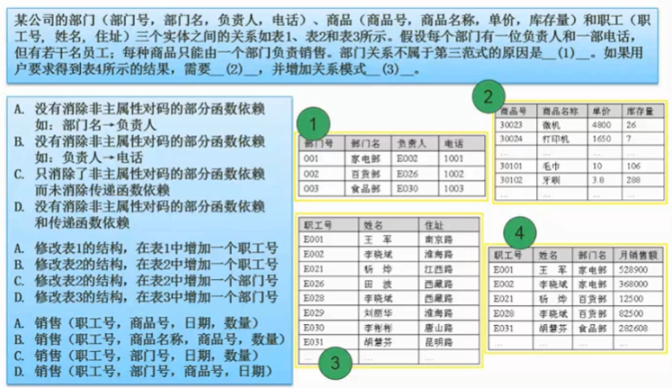

消除部分依赖，主键必须是多个的组合键，但是部门号可以当主键，所以消除了部分依赖，但未消除传递

C、D（一对多在多的那边加）、A

## 模式分解

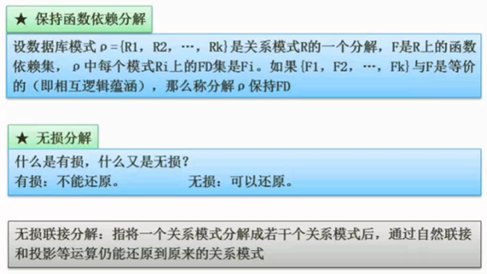

保持：分解之前有的函数依赖分解之后还有（冗余的函数依赖不需要保留）

**例题**

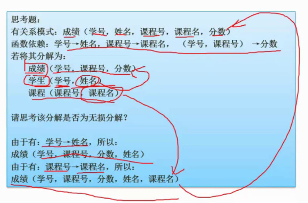

这是一种无损分解

**例题**

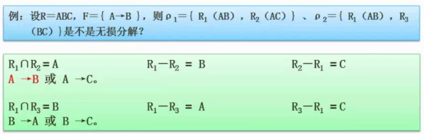

## 并发控制

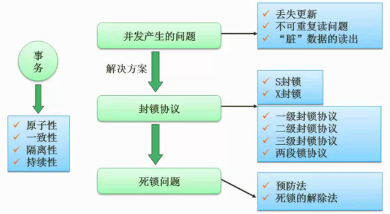

并发会提高效率

（1）一级封锁协议。事务T在修改数据R之前必须先对其加X锁，直到事务结束才释放。可防止丢失修改
（2）二级封锁协议。一级封锁协议加上事务T在读取数据R之前先对其加S锁，读完后即可释放S锁。可防止丢失修改，还可防止读“脏”数据
（3）三级封锁协议。一级封锁协议加上事务T在读取数据R之前先对其加S锁，直到事务结束才释放。可防止丢失修改、防止读“脏”数据与防止数据重复读
（4）两段锁协议。可串行化的。可能发生死锁

## 完整性约束

- 实体完整性
- 参照完整性
- 用户自定义完整性

为了提高数据的可靠性，但是只能应对简单情况

触发器就是脚本，可以应对复杂情况

## 安全

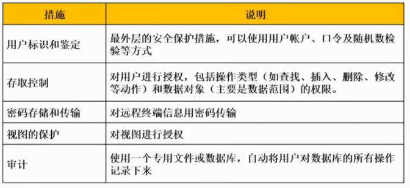

审计是一种事后操作

## 备份和恢复

冷备份也称为静态备份，是将数据库正常关闭，**在停止状态下**，将数据库的文件全部备份(复制)下来。
热备份也称为动态备份，是利用备份软件，在数据库**正常运行的状态下**，将数据库中的数据文件备份出来。

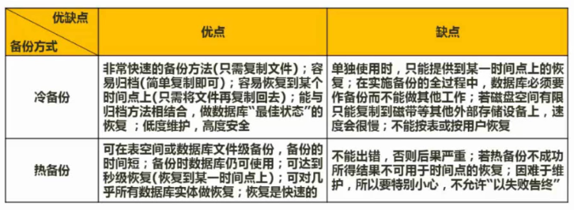

**备份：**

完全备份：备份所有数据

差量备份：仅备份上一次完全备份之后变化的数据

增量备份：备份上一次备份之后变化的数据

**转储：**

（1）静态海量转储∶在系统中无运行事务时进行，每次转储全部数据库。

（2）静态增量转储：在系统中无运行事务时进行，每次只转储上一次转储后更新过的数据。

（3）动态海量转储：转储期间允许对数据库进行存取或修改，每次转储全部数据库。

（4）动态增量转储∶转储期间允许对数据库进行存取或修改，每次只转储上一次转储后更新过的数据。

**日志：**

日志文件：事务日志是针对数据库改变所做的记录，它可以记录针对数据库的任何操作，并将记录结果保存在独立的文件中

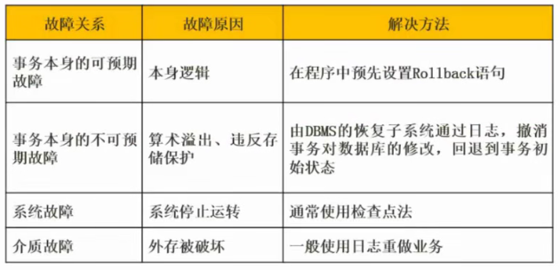

## 分布式数据库

体系结构：

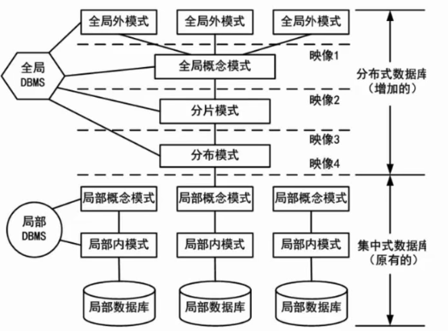

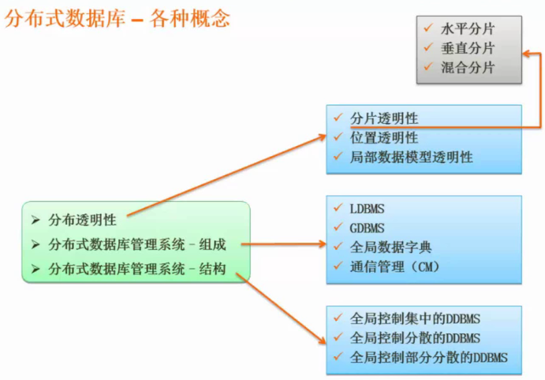

水平：分库

垂直：分表

## 数据库优化

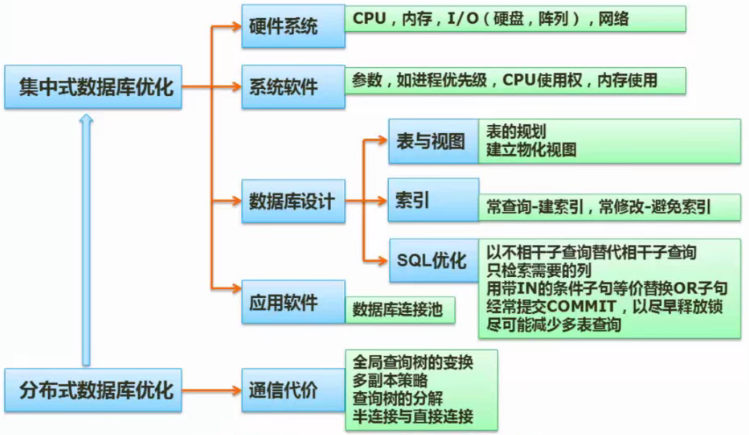

## 数据仓库和数据挖掘

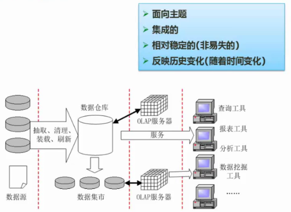

 

## 参考文献

> 1. https：//www.bilibili.com/video/BV1fv411V7dH

