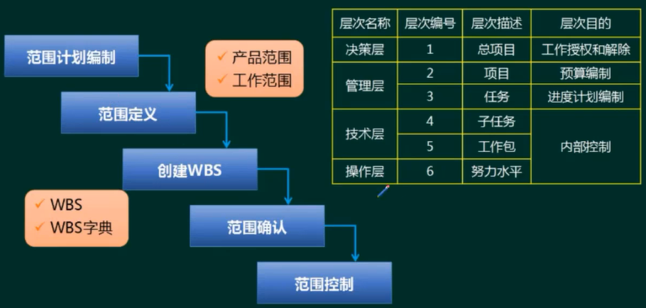
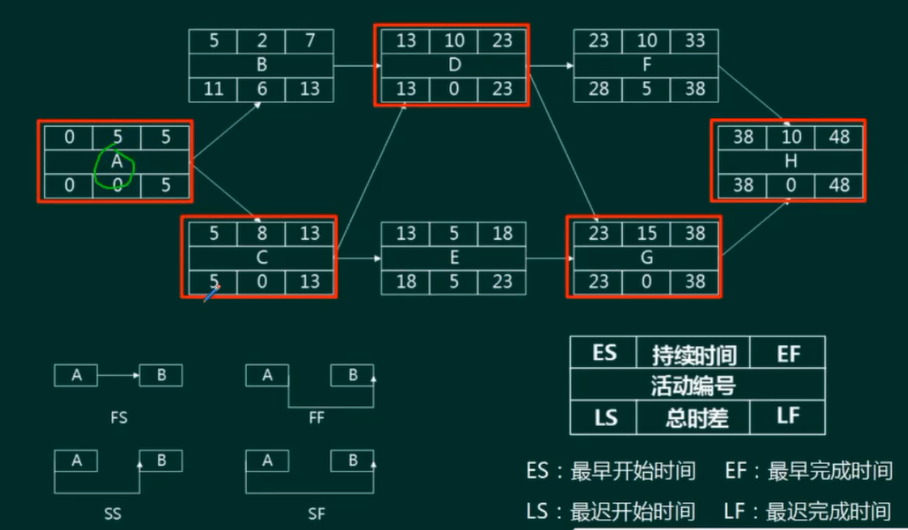
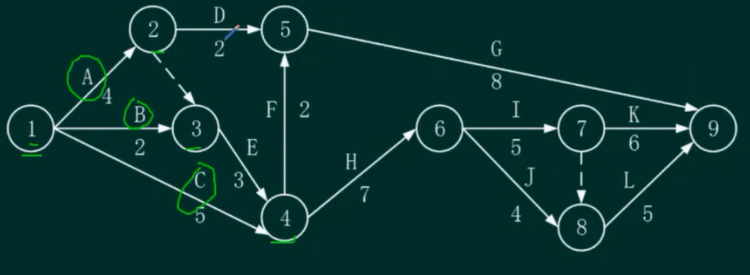
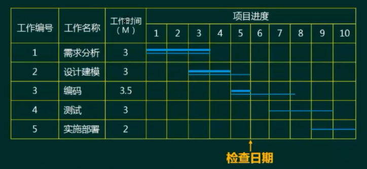
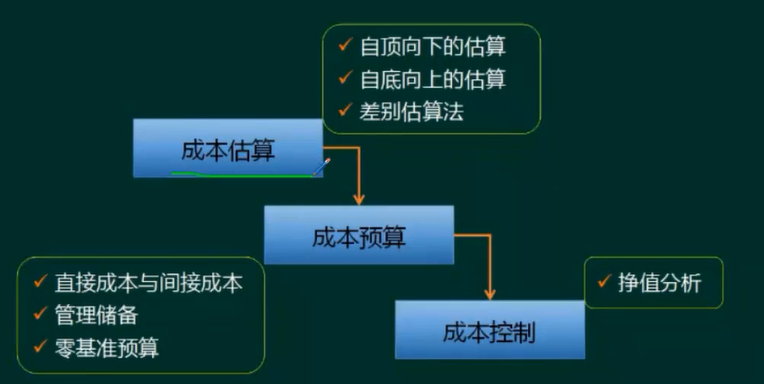
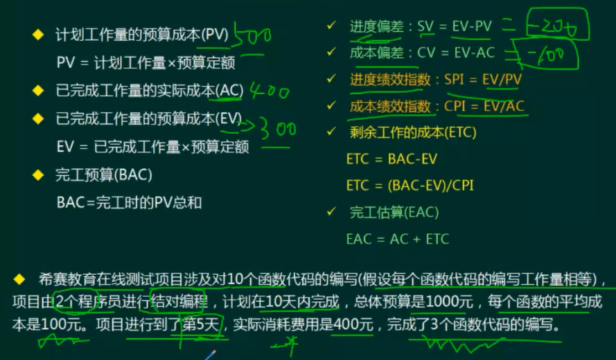
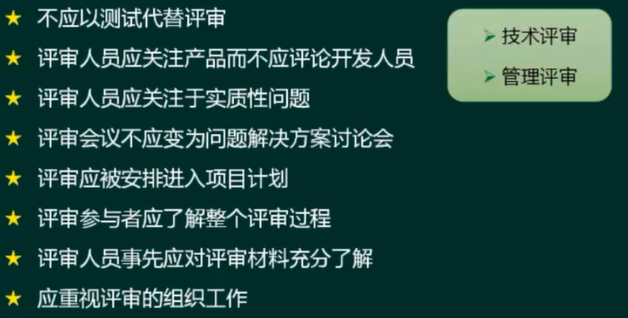
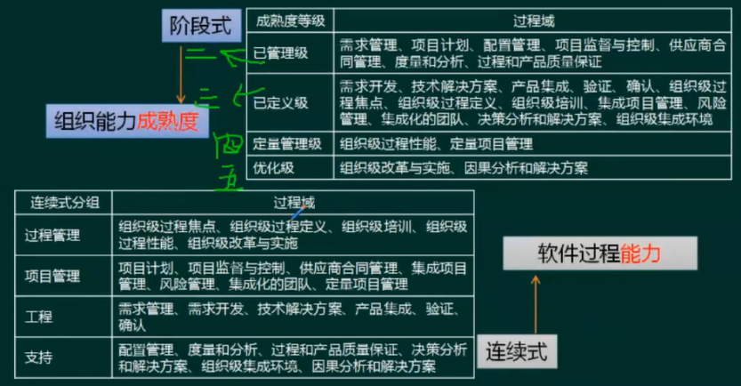
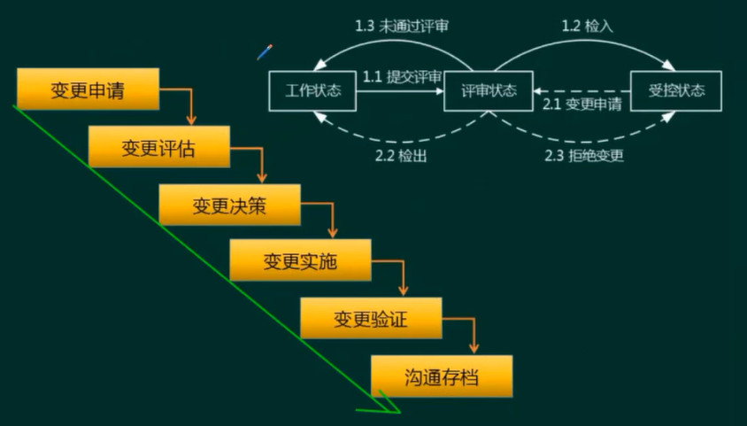
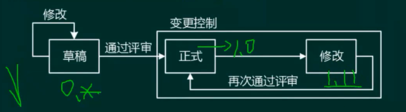

# 项目管理

大题、论文也会考，特别是时间管理的计算题

<!-- more -->

## 范围管理（★★）

范围管理：确定项目的边界，即哪些工作是项目应该做的，哪些工作不应该包括在项目中。

WBS：工作分解结果

## 时间管理（★★★★）

### 前导图法（单代号网络图，PDM，PERT）

最早完工时间，找关键路径（总时差为0）

最长路径对应最短工期

### 双代号

> 节点代表时间，事件在横线上
>
> 虚线代表虚活动，既不占时间，也不占资源
>
> 有可能关键路径就在虚活动上

### 关键路径法

关键路径法是在制订进度计划时使用的一种进度网络分析技术。关键路线法沿着项目进度网络路线进行正向与反向分析，从而计算出所有计划活动理论上的最早开始与完成日期、最迟开始与完成日期，不考虑任何资源限制

总时差（松弛时间）：在不延误总工期的前提下，该活动的机动时间。活动的总时差等于该活动最迟完成时间与最早完成时间之差，或该活动最迟开始时间与最早开始时间之差

自由时差：在不影响紧后活动的最早开始时间前提下，该活动的机动时间。

- 对于有紧后活动的活动，其自由时差等于所有紧后活动最早开始时间减本活动最早完成时间所得之差的最小值

- 对于没有紧后活动的活动，也就是以网络计划终点节点为完成节点的活动，其自由时差等于计划工期与本活动最早完成时间之差

对于网络计划中以终点节点为完成节点的活动，其自由时差与总时差相等。此外，由于活动的自由时差是其总时差的构成部分，所以，当活动的总时差为零时，其自由时差必然为零，可不必进行专门计算

### 甘特图（Gantt）

优点：甘特图直观、简单、容易制作，便于理解，能很清晰地标识出直到每一项任务的起始与结束时间，一般适用比较简单的小型项目，可用于WBS的任何层次、进度控制、资源优化、编制资源和费用计划。

缺点：不能系统地表达一个项目所包含的各项工作之间的复杂关系，难以进行定量的计算和分析，以及计划的优化等。

## 成本管理（★）

（十年考一次）

成本管理：在整个项目的实施过程中，为确保项目在批准的预算条件下尽可能保质按期完成，而对所需的各个过程进行管理与控制。

### 挣值管理

> 先看AC，再算EV

## 软件质量管理（★★）

**质量保证**一般是每隔一定时间（例如，每个阶段末）进行的，主要通过系统的质量审计和过程分析来保证项目的质量。独特工具包括：**质量审计和过程分析。**

**质量控制**是实时监控项目的具体结果，以判断它们是否符合相关质量标准，制订有效方案，以消除产生质量问题的原因。

一定时间内质量控制的结果也是质量保证的质量审计对象。质量保证的成果又可以指导下一阶段的质量工作，包括质量控制和质量改进

### 软件评审

### 软件过程改进

## 软件配置管理（★★）

（主要考概念）

关于配置项

- 配置项是构成产品配置的主要元素，配置项主要有以下两大类：
  - 属于**产品组成部分的工作成果**：如需求文档、设计文档、源代码和测试用例等;
  - 属于**项目管理和机构支撑过程域产生的文档**：如工作计划、项目质量报告和项目跟踪报告等。这些文档虽然不是产品的组成部分，但是值得保存。
- 设备清单、CASE工具操作手册等**不属于配置项**。
- 每个配置项的主要属性有：名称、标识符、文件状态、版本、作者和日期等。所有配置项都被保存在配置库里，确保不会混淆、丢失。配置项及其历史记录反映了软件的演化过程。

关于配置库

- 开发库（动态库、程序员库、工作库)：可以随意修改。
- 受控库（主库、系统库）：必须先申请，申请通过才有权限修改。
- 产品库（备份库、静态库)：不能修改。

### 变更控制

### 版本控制

处于草稿状态的配置项的版本号格式为：0.YZ，其中YZ数字范围为01~99。随着草稿的不断完善，YZ的取值应递增。YZ的初值和增幅由开发者自己把握。

处于正式发布状态的配置项的版本号格式为：X.Y。其中X为主版本号，取值范围为1~9；Y为次版本号，取值范围为1～9。配置项第一次正式发布时，版本号为1.0。

如果配置项的版本升级幅度比较小，一般只增大Y值，X值保持不变。只有当配置项版本升级幅度比较大时，才允许增大X值。

处于正在修改状态的配置项的版本号格式为:X.YZ。在修改配置项时，一般只增大Z值，X.Y值保持不变。

## 风险管理（★）

关心未来、关心变化、关心选择

- 风险存在的客观性和普遍性
- 某一具体风险发生的偶然性和大量风险发生的必然性
- 风险的可变性
- 风险的多样性和多层次性
- 基本属性：随机性和相对性

### 分类

项目风险

- 潜在的预算、进度、人员和组织、资源、用户和需求问题
- 项目复杂性、规模和结构的不确定性

技术风险

- 潜在的设计、实现、接口、测试和维护方面的问题
- 规格说明的多义性、技术上的不确定性、技术陈旧、最新技术（不成熟)

商业风险

- 市场风险：系统虽然很优秀但不是市场真正所想要的
- 策略风险：系统不再符合企业的信息系统战略
- 销售风险：开发了销售部门不清楚如何推销的系统
- 管理风险：由于重点转移或人员变动而失去上级支持
- 预算风险：开发过程没有得到预算或人员的保证

### 风险曝光度

风险曝光度（Risk Exposure )：计算方法是风险出现的概率乘以风险可能造成的损失。

假设正在开发的软件项目可能存在一个未被发现的错误，而这个错误出现的概率是0.5%给公司造成的损失将是1000000元，那么这个错误的风险曝光度就应为100000O×0.5%=5000元。

风险爆光度=风险景影响*概率

### 项目管理工具

能做什么(项目管理相关的工作辅助）：任务调度、成本估算、资源分配、预算跟踪、人时统计、配置控制，确定关键路径、松弛时间、超前时间和滞后时间，生成一定格式的报表和报告。

不能做什么（开发技术相关辅助工作）：不能指导软件设计人员按软件生存周期各个阶段的适用技术进行设计工作。

