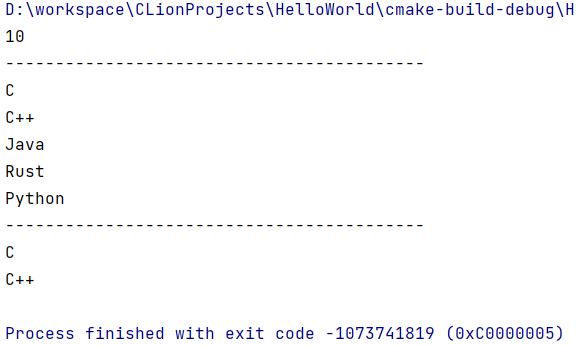

# 补充部分

## 智能指针

`unique_ptr`，`shared_ptr`，`weak_ptr`，`auto_ptr`

> `auto_ptr` 在 C++11 中被废弃

### auto_ptr

`new` 语句创建的对象，在 `auto_ptr` 指针销毁的时候，指针指向的对象也会被销毁

所有权转移： `pa` 是一个 `auto_ptr` 指针，指向对象 `obj`。现在一个新的 `auto_ptr` 指针 `pb` 指向对象 `obj`，则 `pa` 指针会失效（变成 `nullptr`）

> 原理：在拷贝（赋值）过程中，直接剥夺原对象对内存的控制权，转交给新对象，然后将原指针置为 `nullptr` 
>
> 实际上就是把原来的指针变成 NULL，然后新建一个指针


```c++
int main() {
    auto_ptr<int> p(new int(10));
    cout << *p << endl;
    printf("------------------------------------------\n");

    auto_ptr<string> lang[5] = {
            auto_ptr<string>(new string("C")),
            auto_ptr<string>(new string("C++")),
            auto_ptr<string>(new string("Java")),
            auto_ptr<string>(new string("Rust")),
            auto_ptr<string>(new string("Python"))
    };

    for(int i=0; i<5; i++){
        cout << *lang[i] << endl;
    }
    printf("------------------------------------------\n");

    auto_ptr<string> pa;
    pa = lang[2];// 剥夺所有权
    for(int i=0; i<5; i++){
        cout << *lang[i] << endl;
    }

    return 0;
}
```





