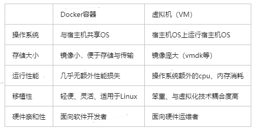
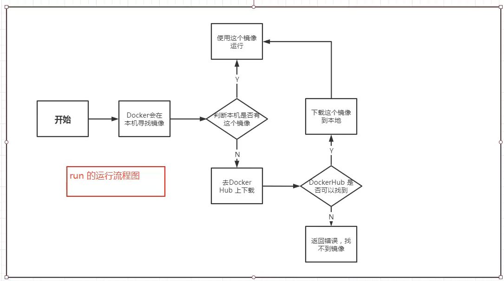
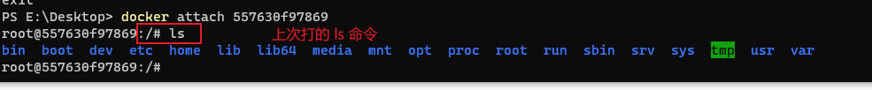
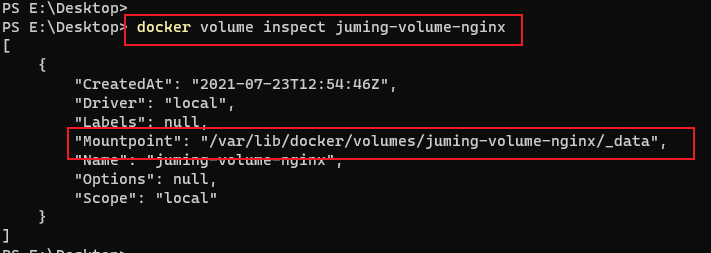
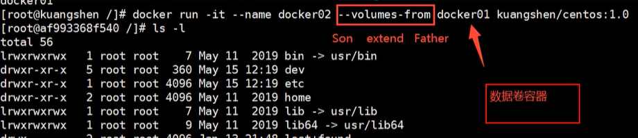

# Docker学习笔记

> 参考文献：
>
> [1]B站小狂神视频：https://www.bilibili.com/video/BV1og4y1q7M4
>
> [2]百度百科


# 概述

## 官网和百度百科介绍

官网：https://www.docker.com/

文档：https://docs.docker.com/

Docker 是一个开源的应用容器引擎，让开发者可以打包他们的应用以及依赖包到一个可移植的容器中,然后发布到任何流行的Linux机器或Windows 机器上,也可以实现虚拟化,容器是完全使用沙箱机制,相互之间不会有任何接口。

基于 Go 语言 并遵从 Apache2.0 协议开源。

<!-- more -->

## 什么是容器？

容器是打包代码及其所有依赖项的软件的标准单元，因此应用程序可以从一个计算环境快速可靠地运行到另一个计算环境。

Docker容器映像是轻巧的，独立的，可执行的软件软件包，其中包括运行应用程序所需的一切：代码，运行时，系统工具，系统库和设置。

容器映像在运行时成为容器，对于Docker容器，映像在容器[Docker Engine](https://www.docker.com/products/container-runtime)上运行时成为容器。不论基础架构如何，容器化软件都可用于基于Linux和Windows的应用程序，始终运行相同。容器将软件与其环境隔离开来，并确保尽管开发和登台之间存在差异，但软件仍可以均匀运行。

在Docker Engine上运行的Docker容器：

- **标准：** Docker创建了容器的行业标准，因此它们可以在任何地方移植
- **轻巧：**容器共享计算机的OS系统内核，因此不需要每个应用程序都具有OS，从而提高了服务器效率，并降低了服务器和许可成本
- **安全：**容器中的应用程序更安全，Docker提供业界最强大的默认隔离功能

## Docker架构

Docker 使用客户端-服务器 (C/S) 架构模式，使用远程API来管理和创建Docker容器。

Docker*客户端*与Docker*守护进程*进行对话，该*守护进程*完成了构建，运行和分发Docker容器的繁重工作。

Docker客户端和守护程序*可以* 在同一系统上运行，或者您可以将Docker客户端连接到远程Docker守护程序。

Docker客户端和守护程序在UNIX套接字或网络接口上使用REST API进行通信。另一个Docker客户端是Docker Compose，它使您可以处理由一组容器组成的应用程序。

Docker Hub是任何人都可以使用的公共注册表，并且Docker配置为默认在Docker Hub上查找映像

Docker 容器通过 Docker 镜像来创建。容器与镜像的关系类似于面向对象编程中的对象与类

一个完整的Docker有以下几个部分组成：

（1）Client客户端：客户端（`docker`）是许多Docker用户与Docker交互的主要方式。

（2）Daemon守护进程：守护程序（`dockerd`）侦听Docker API请求并管理Docker对象，例如图像，容器，网络和卷。守护程序还可以与其他守护程序通信以管理Docker服务。

（3）Image镜像：模板

（4）Container容器 ：基于模板的实例


 

> https://www.docker.com/resources/what-container

## Docker能干嘛

- 更快地交付和部署程序
- 更便捷的升级和扩缩容
- 更简单的系统运维
- 更高效的计算资源利用（在同一硬件上运行更多工作负载）

## 底层技术

Docker用[Go编程语言](https://golang.org/)编写，并利用Linux内核的多个功能来交付其功能。

Docker使用一种称为`namespaces`的技术来提供称为*容器*的隔离工作区。

运行容器时，Docker会为该容器创建一组 *名称空间*。这些名称空间提供了一层隔离。容器的每个方面都在单独的名称空间中运行，并且对其的访问仅限于该名称空间。

## docker为什么比虚拟机快

1.Docker有着比虚拟机更少的抽象层。Docker不需要实现硬件资源虚拟化，Docker容器上的程序直接使用的都是实际物理机的硬件资源，因此在CPU、内存利用率上Docker将会在效率上有明显优势。

2.Docker利用的是宿主机的内核，而不需要Guest OS，因此，当新建一个容器时，Docker不需要和虚拟机一样重新加载一个操作系统，避免了引导、加载操作系统内核这个比较费时费资源的过程，当新建一个虚拟机时，虚拟机软件需要加载Guest OS，这个新建过程是分钟级别的，而Docker由于直接利用宿主机的操作系统则省略了这个过程，因此新建一个Docker容器只需要几秒钟。



# 安装步骤

## 官方文档走下来

1、卸载旧版本

```bash
sudo apt-get remove docker docker-engine docker.io containerd runc
```

2、我们使用仓库来安装

```bash
$ sudo apt-get update

$ sudo apt-get install \
    apt-transport-https \
    ca-certificates \
    curl \
    gnupg \
    lsb-release \
    software-properties-common

$ curl -fsSL https://download.docker.com/linux/ubuntu/gpg | sudo apt-key add - # 官方
 
$ curl -fsSL https://mirrors.aliyun.com/docker-ce/linux/ubuntu/gpg | sudo apt-key add - # 国内

# 设置国内的仓库
$ sudo add-apt-repository "deb [arch=amd64] https://mirrors.aliyun.com/docker-ce/linux/ubuntu $(lsb_release -cs) stable"
  
# 更新包索引
$ sudo apt-get update
# 下载
sudo apt-get install docker-ce docker-ce-cli containerd.io
# 查看版本
$ docker version
# 测试
$ sudo docker run hello-world
################################一长串输出######################
Unable to find image 'hello-world:latest' locally
latest: Pulling from library/hello-world
0e03bdcc26d7: Pull complete 
Digest: sha256:95ddb6c31407e84e91a986b004aee40975cb0bda14b5949f6faac5d2deadb4b9
Status: Downloaded newer image for hello-world:latest

Hello from Docker!
This message shows that your installation appears to be working correctly.

To generate this message, Docker took the following steps:
 1. The Docker client contacted the Docker daemon.
 2. The Docker daemon pulled the "hello-world" image from the Docker Hub.
    (amd64)
 3. The Docker daemon created a new container from that image which runs the
    executable that produces the output you are currently reading.
 4. The Docker daemon streamed that output to the Docker client, which sent it
    to your terminal.

To try something more ambitious, you can run an Ubuntu container with:
 $ docker run -it ubuntu bash

Share images, automate workflows, and more with a free Docker ID:
 https://hub.docker.com/

For more examples and ideas, visit:
 https://docs.docker.com/get-started/
 
 # 查看镜像
$ docker images
## 输出 ##
REPOSITORY    TAG       IMAGE ID       CREATED         SIZE
hello-world   latest    bf756fb1ae65   13 months ago   13.3kB

```

## 卸载步骤

```bash
$ sudo apt-get purge docker-ce docker-ce-cli containerd.io
$ sudo rm -rf /var/lib/docker

# /var/lib/docker -->  docker 的默认工作目录
```

## 基本流程




# 常用命令

```bash
docker version
docker info
docker 命令 --help
```

官网：https://docs.docker.com/reference/

## 镜像命令

```bash
docker images：查看镜像

docker search：搜索镜像
	--filter=STARS=3000 # 标星大于3000
	
docker pull：下载镜像
	docker pull [OPTIONS] NAME[:TAG|@DIGEST]
	
docker rmi：删除镜像
	- 根据镜像 ID 删除即可
	- docker rmi -f $(docker images -aq) # 递归删除全部

```

## 容器命令

**运行容器**

```bash
docker pull ubuntu:18.04 # 下载一个ubuntu18

# 运行容器
docker run [OPTIONS] IMAGE [COMMAND] [ARG...]
# option
--name：容器名字
-d：后台运行
-it：交互方式运行，进入容器查看内容
-p：指定端口 
    -p ip：主机端口：容器端口
    -p 主机端口:容器端口
    -p 容器端口
-P：随机端口

# 启动并进入容器
docker run -it ubuntu:18.04 /bin/bash

# 显示运行的容器
docker ps
```

**退出容器**

```bash
exit # 停止容器并退出
Ctrl + P + Q # 后台运行容器并退出
```

**删除容器**

```bash
docker rm 容器ID
docker rm -f $(docker ps -aq)
docker ps -aq |xargs docker rm # xargs 捕获一个命令的输出，然后传递给另外一个命令
```

**启动和停止容器的操作**

```bash
docker start 容器ID
docker restart 容器ID
docker stop 容器ID
docker kill 容器ID
```

## 常用的的其他命令

**后台启动容器**

```bash
docker run -d 镜像名
# docker 容器后台运行的时候必须要有一个前台进程
# 容器启动后发现自己没有提供服务，就好立即停止
```

**查看日志**

```bash
docker logs
```

**查看容器中运行的进程**

```bash
docker top 容器ID
```

**查看容器元数据**

```bash
docker inspect 容器ID
```

**进入容器**

```bash
docker exec -it 容器ID 默认shell # 启动一个新终端
# 示例：docker exec -it 557630f97869 /bin/bash

# 方式2
docker attach 容器ID # 进入正在使用的终端
```



**容器本地对拷文件**

```bash
docker cp [OPTIONS] CONTAINER:SRC_PATH DEST_PATH|- # 从容器拷贝到本机
docker cp [OPTIONS] SRC_PATH|- CONTAINER:DEST_PATH # 从本机拷贝到容器
```


运行 `docker --help`

```bash
Commands:
  attach      Attach local standard input, output, and error streams to a running container
  build       Build an image from a Dockerfile
  commit      Create a new image from a container's changes
  cp          Copy files/folders between a container and the local filesystem
  create      Create a new container
  diff        Inspect changes to files or directories on a container's filesystem
  events      Get real time events from the server
  exec        Run a command in a running container
  export      Export a container's filesystem as a tar archive
  history     Show the history of an image
  images      List images
  import      Import the contents from a tarball to create a filesystem image
  info        Display system-wide information
  inspect     Return low-level information on Docker objects
  kill        Kill one or more running containers
  load        Load an image from a tar archive or STDIN
  login       Log in to a Docker registry
  logout      Log out from a Docker registry
  logs        Fetch the logs of a container
  pause       Pause all processes within one or more containers
  port        List port mappings or a specific mapping for the container
  ps          List containers
  pull        Pull an image or a repository from a registry
  push        Push an image or a repository to a registry
  rename      Rename a container
  restart     Restart one or more containers
  rm          Remove one or more containers
  rmi         Remove one or more images
  run         Run a command in a new container
  save        Save one or more images to a tar archive (streamed to STDOUT by default)
  search      Search the Docker Hub for images
  start       Start one or more stopped containers
  stats       Display a live stream of container(s) resource usage statistics
  stop        Stop one or more running containers
  tag         Create a tag TARGET_IMAGE that refers to SOURCE_IMAGE
  top         Display the running processes of a container
  unpause     Unpause all processes within one or more containers
  update      Update configuration of one or more containers
  version     Show the Docker version information
  wait        Block until one or more containers stop, then print their exit codes
```

# Docker 镜像讲解

## UnionFS（联合文件系统）

docker run -it

一种分层、轻量级并且高性能的文件系统，它支持对文件系统的修改作为一次提交来一层层的叠加，同时可以将不同目录挂载到同一个虚拟文件系统下。

不同 Docker 容器就可以共享一些基础的文件系统层，同时再加上自己独有的改动层，大大提高了存储的效率。

## Docker镜像加载原理

docker的镜像实际上由一层一-层的文件系统组成,这种层级的文件系统UnionFS。

bootfs(boot file system)主要包含bootloader和kernel, bootloader主要是引导加载kernel, Linux刚启动时会加载bootfs文件系统,在Docker镜像的最底层是bootfs。这一层与我们典型的Linux/Unix系统是一样的,包含boo加载器和内核。当boot加载完成之后整个内核就都在内存中了,此时内存的使用权已由bootfs转交给内核,此时系统也会卸载bootfs。

rootfs (root file system) , 在bootfs之上。包含的就是典型Linux系统中的/dev, /proc, /bin, /etc等标准目录和文件。rootfs就是各种不同的操作系统发行版,比如Ubuntu , Centos等等。

对于一个精简的OS , rootfs 可以很小,只需要包含最基本的命令,工具和程序库就可以了,因为底层直接用Hostkernel,自己只需要提供rootfs就可以了。由此可见对于不同的linux发行版, bootfs基本是一致的，rootfs会有差别,因此不同的发行版可以公用bootfs。

**特点**

镜像是只读的，容器启动的时候，会在镜像顶部加一个可写层（也称容器层）

我们可以把这一层和镜像层合在一起打包，就变成了自己独有的镜像

## 提交镜像

```bash
docker commit [OPTIONS] CONTAINER [REPOSITORY[:TAG]]

Create a new image from a container's changes

Options:
  -a, --author string    Author (e.g., "John Hannibal Smith
                         <hannibal@a-team.com>")
  -c, --change list      Apply Dockerfile instruction to the created image
  -m, --message string   Commit message
  -p, --pause            Pause container during commit (default true)
```

# 容器数据卷

## 定义

当我们在使用docker容器的时候，会产生一系列的数据文件，这些数据文件在我们删除 docker 容器时是会消失的，但是其中产生的部分内容我们是希望能够把它给保存起来另作用途的，Docker将应用与运行环境打包成容器发布，我们希望在运行过程钟产生的部分数据是可以持久化的的，而且容器之间我们希望能够实现数据共享。

通俗地来说，docker容器数据卷可以看成使我们生活中常用的u盘，它存在于一个或多个的容器中，由docker挂载到容器，但不属于联合文件系统，Docker不会在容器删除时删除其挂载的数据卷。

特点：

1、可以在容器之间共享或重用数据

2、数据卷中的更改可以直接生效

3、数据卷中的更改不会包含在镜像的更新中

4、数据卷的生命周期一直持续到没有容器使用它为止

**方式1**：使用命令挂载

```bash
docker run -it -v 本地目录：容器目录 # 指定路径挂载
```

## 具名挂载和匿名挂载

```bash
# 匿名挂载
-v 容器内路径

# 具名挂载
-v 卷名：容器内路径
# 示例：
$ docker run -d -P --name myNginx -v juming-volume-nginx:/etc/nginx nginx
$ docker volume ls
DRIVER    VOLUME NAME
local     juming-volume-nginx
```

容器内的卷，没有指定目录的话都在 `/var/lib/docker/volumes/xxx/_data`



```bash
$ docker run -d -P --name myNginx -v juming-volume-nginx:/etc/nginx:ro nginx # ro 只读
$ docker run -d -P --name myNginx -v juming-volume-nginx:/etc/nginx:rw nginx

# ro 只能操作宿主机来改变，容器内无法改变
```


数据卷共享




# Dockerfile

## 是什么？

用来构建 docker 镜像

1、写一个 dockerfile，建议名字就叫 `Dockerfile `

2、使用命令生成镜像（镜像名不能大写）

```bash
$  docker build -f /path/to/a/Dockerfile -t shykes/myapp:1.0.2 . # 最后有个点
```

3、运行镜像

4、发布镜像


看一个 Ubuntu18 的官方 Dockerfile

```bash
FROM scratch
ADD ubuntu-bionic-oci-amd64-root.tar.gz /
CMD ["bash"]
```

## 基础命令

> 1. 指令是一个一个执行的
> 2. 每条指令都是独立运行的
> 3. 只要有可能，Docker 就会使用构建缓存来加速该过程
> 4. 指令不区分大小写。但是，约定是将它们大写，以便更容易地将它们与参数区分开来
> 5. 解析器指令不区分大小写。但是，约定是小写的。约定还包括在任何解析器指令之后包含一个空行。解析
> 6. 指令不支持换行符。
> 7. 必须以 `FROM` 指令开始（注释、全局变量、解析器指令除外）
> 8. 以 # 开头的行视为注释


### FROM

FROM 指令指定您正在构建的父映像。 FROM 之前只能有一个或多个 ARG 指令，这些指令声明在 Dockerfile 的 FROM 行中使用的参数。

### 声明变量 ENV


