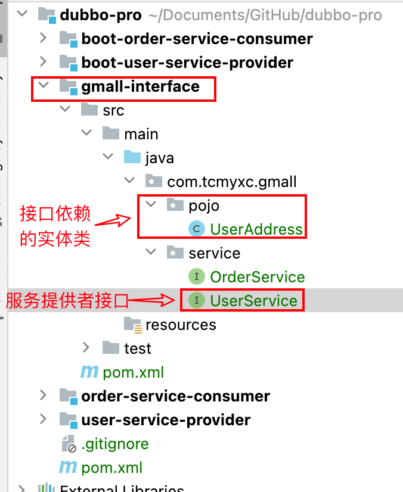
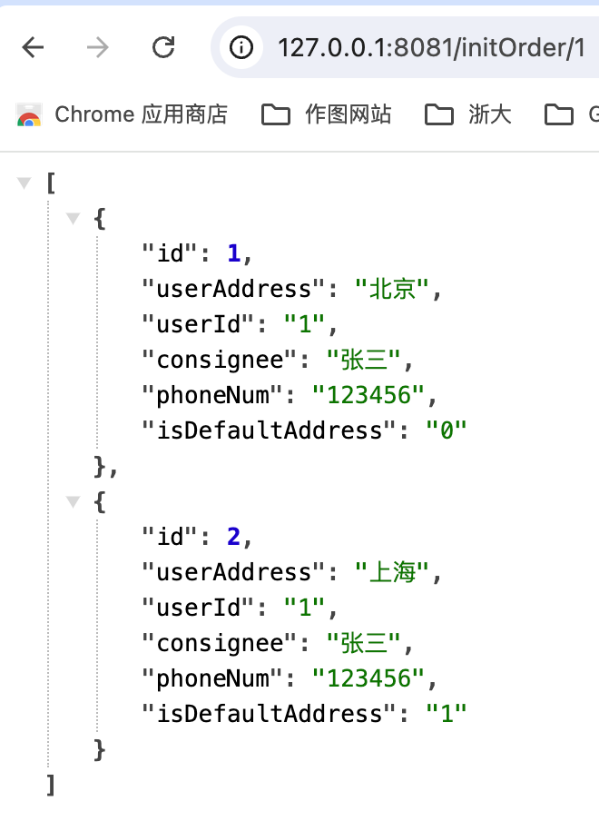

# Dubbo学习笔记

## 1、是什么？

### 1.1 定义

一款易用、高性能的 WEB 和 RPC 框架，于解决微服务架构下的服务治理与通信问题

功能：为构建企业级微服务提供服务发现、流量治理、可观测、认证鉴权等功能

2.x文档：https://cn.dubbo.apache.org/zh-cn/docsv2.7/user/


### 1.2 特点

- 服务提供者和消费者只在启动时与注册中心交互，**注册中心不转发请求**
- **消费者**向注册中心获取服务提供者地址列表，并根据负载算法**直接调用提供者**
- 注册中心和监控中心全部宕机，不影响已运行的提供者和消费者，消费者在本地缓存了提供者列表
- 注册中心和监控中心都是可选的，服务消费者可以直连服务提供者


## 2、简单使用

分析：本地调用一般在A这个service中注入B service，然后调用B这个service中提供的各种方法，但是现在要远程调用（RPC）

### 2.1 定义服务接口

【思路】把B服务的接口放到公共的地方，然后A服务引入该依赖，B服务的具体实现想在哪在哪，只需要后续能够找到具体的实现就行。




服务接口：

```java
public interface UserService {

    List<UserAddress> getUserAddressList(String userId);
}
```

接口依赖的实体类：

```java
@Data
@NoArgsConstructor
@AllArgsConstructor
public class UserAddress implements Serializable {

    private Integer id;
    private String userAddress;
    private String userId;
    /**
     * 收件人
     */
    private String consignee;
    private String phoneNum;
    /**
     * 是否默认地址
     */
    private String isDefaultAddress;
}
```

pom文件依赖：

```xml
<dependency>
    <groupId>org.projectlombok</groupId>
    <artifactId>lombok</artifactId>
    <version>1.18.30</version>
</dependency>
```

### 2.2 服务提供方对接口进行具体实现

#### 2.2.1 Spring方式

具体实现：

```java
public class UserServiceImpl implements UserService {
    @Override
    public List<UserAddress> getUserAddressList(String userId) {
        UserAddress userAddress1 = new UserAddress(1, "北京", "1", "张三", "123456", "0");
        UserAddress userAddress2 = new UserAddress(2, "上海", "1", "张三", "123456", "1");

        return Arrays.asList(userAddress1, userAddress2);

    }
}
```

写xml配置，一般命名为`provider.xml` 

```xml
<?xml version="1.0" encoding="UTF-8"?>
<beans xmlns:xsi="http://www.w3.org/2001/XMLSchema-instance"
       xmlns:dubbo="http://code.alibabatech.com/schema/dubbo"
       xmlns="http://www.springframework.org/schema/beans"
       xsi:schemaLocation="http://www.springframework.org/schema/beans http://www.springframework.org/schema/beans/spring-beans-2.5.xsd
       http://code.alibabatech.com/schema/dubbo http://code.alibabatech.com/schema/dubbo/dubbo.xsd">

    <!-- provider's application name, used for tracing dependency relationship -->
    <dubbo:application name="user-service-provider"/>

    <!-- use zk registry center to export service -->
    <dubbo:registry address="zookeeper://127.0.0.1:2181"/>

    <!-- 指定通信协议和端口号 -->
    <dubbo:protocol name="dubbo" port="20880"/>

    <!-- service implementation, as same as regular local bean -->
    <bean id="userService" class="com.tcmyxc.gmall.service.impl.UserServiceImpl"/>

    <!-- 声明需要暴露的服务（写接口名），ref指向真正的服务 -->
    <dubbo:service interface="com.tcmyxc.gmall.service.UserService" ref="userService"/>

</beans>
```

pom文件依赖：

```xml
<!-- 定义接口的坐标  -->
<dependency>
    <groupId>com.tcmyxc</groupId>
    <artifactId>gmall-interface</artifactId>
    <version>1.0-SNAPSHOT</version>
</dependency>

<!-- Dubbo -->
<dependency>
    <groupId>com.alibaba</groupId>
    <artifactId>dubbo</artifactId>
    <version>${dubbo.version}</version>
</dependency>

<!-- zkclient -->
<dependency>
    <groupId>com.101tec</groupId>
    <artifactId>zkclient</artifactId>
    <version>0.10</version>
</dependency>
```


启动代码：

```java
public class Provider {
    public static void main(String[] args) throws Exception {
        ClassPathXmlApplicationContext context = new ClassPathXmlApplicationContext(new String[]{"provider.xml"});
        context.start();

        System.in.read(); // press any key to exit
    }
}
```


#### 2.2.2 SpringBoot方式

pom依赖（springboot 版本 2.6.13）

```xml
<dependency>
    <groupId>org.springframework.boot</groupId>
    <artifactId>spring-boot-starter</artifactId>
</dependency>

<dependency>
    <groupId>org.springframework.boot</groupId>
    <artifactId>spring-boot-starter-test</artifactId>
    <scope>test</scope>
</dependency>

<dependency>
    <groupId>com.tcmyxc</groupId>
    <artifactId>gmall-interface</artifactId>
    <version>1.0-SNAPSHOT</version>
</dependency>

<!-- dubbo，里面自带了zk的客户端 -->
<dependency>
    <groupId>com.alibaba.boot</groupId>
    <artifactId>dubbo-spring-boot-starter</artifactId>
    <version>0.2.0</version>
</dependency>
```

【注意】Dubbo 支持 zkclient 和 curator 两种 Zookeeper 客户端实现

> dubbo-spring-boot-starter 0.2.0 自带 curator 客户端

配置文件 `application.yml` 

```yaml
dubbo:
  application:
    name: boot-user-service-provider
  registry:
    protocol: zookeeper
    address: 127.0.0.1:2181
  protocol:
    name: dubbo
    port: 20880
```


具体实现：

```java
@Component
@Service // dubbo的注解
public class UserServiceImpl implements UserService {
    @Override
    public List<UserAddress> getUserAddressList(String userId) {
        UserAddress userAddress1 = new UserAddress(1, "北京", "1", "张三", "123456", "0");
        UserAddress userAddress2 = new UserAddress(2, "上海", "1", "张三", "123456", "1");

        return Arrays.asList(userAddress1, userAddress2);

    }
}
```


启动类:

```java
@Component
@Service // dubbo的注解
public class UserServiceImpl implements UserService {
    @Override
    public List<UserAddress> getUserAddressList(String userId) {
        UserAddress userAddress1 = new UserAddress(1, "北京", "1", "张三", "123456", "0");
        UserAddress userAddress2 = new UserAddress(2, "上海", "1", "张三", "123456", "1");

        return Arrays.asList(userAddress1, userAddress2);

    }
}
```


### 2.3 服务消费者调用服务

#### 2.3.1 Spring方式

pom文件依赖

```xml
<dependency>
    <groupId>com.tcmyxc</groupId>
    <artifactId>gmall-interface</artifactId>
    <version>1.0-SNAPSHOT</version>
</dependency>

<!-- Dubbo -->
<dependency>
    <groupId>com.alibaba</groupId>
    <artifactId>dubbo</artifactId>
    <version>${dubbo.version}</version>
</dependency>

<!-- zkclient -->
<dependency>
    <groupId>com.101tec</groupId>
    <artifactId>zkclient</artifactId>
    <version>0.10</version>
</dependency>
```


xml配置文件:

```xml
<beans xmlns:xsi="http://www.w3.org/2001/XMLSchema-instance"
       xmlns:dubbo="http://code.alibabatech.com/schema/dubbo"
       xmlns="http://www.springframework.org/schema/beans"
       xsi:schemaLocation="http://www.springframework.org/schema/beans http://www.springframework.org/schema/beans/spring-beans-2.5.xsd
       http://code.alibabatech.com/schema/dubbo http://code.alibabatech.com/schema/dubbo/dubbo.xsd">

    <!-- 应用名 -->
    <dubbo:application name="order-service-consumer"/>

    <!-- 注册中心地址 -->
    <dubbo:registry address="zookeeper://127.0.0.1:2181"/>

    <!-- 声明想调用的远程服务接口；生成远程服务代理 -->
    <dubbo:reference id="userService"
                     interface="com.tcmyxc.gmall.service.UserService"
                     check="false"
    />

</beans>
```


消费者代码：

```java
public class OrderServiceImpl implements OrderService {

    @Autowired
    UserService userService;
    @Override
    public List<UserAddress> initOrder(String userId) {
        // 1、查询用户的收货地址
        List<UserAddress> userAddressList = userService.getUserAddressList(userId);
        userAddressList.forEach(System.out::println);
        return userAddressList;
    }
}
```


测试代码：

```java
public class Consumer {

    public static void main(String[] args) throws Exception {
        ClassPathXmlApplicationContext context = new ClassPathXmlApplicationContext(new String[]{"consumer.xml"});
        context.start();
        // Obtaining a remote service proxy
        UserService userService = (UserService) context.getBean("userService");
        // Executing remote methods
        List<UserAddress> userAddressList = userService.getUserAddressList("1");
        userAddressList.forEach(System.out::println);
    }
}
```


#### 2.3.2 SpringBoot方式

pom依赖

```xml
<dependency>
    <groupId>org.springframework.boot</groupId>
    <artifactId>spring-boot-starter-web</artifactId>
</dependency>

<dependency>
    <groupId>org.springframework.boot</groupId>
    <artifactId>spring-boot-starter-test</artifactId>
    <scope>test</scope>
</dependency>

<dependency>
    <groupId>com.tcmyxc</groupId>
    <artifactId>gmall-interface</artifactId>
    <version>1.0-SNAPSHOT</version>
</dependency>

<!-- dubbo -->
<dependency>
    <groupId>com.alibaba.boot</groupId>
    <artifactId>dubbo-spring-boot-starter</artifactId>
    <version>0.2.0</version>
</dependency>
```


`application.yml` 配置文件：

```yaml
dubbo:
  application:
    name: boot-order-service-consumer
  registry:
    protocol: zookeeper
    address: 127.0.0.1:2181
server:
  port: 8081
```


消费者代码

```java
@Service // spring的注解
public class OrderServiceImpl implements OrderService {

    @Reference // dubbo的注解
    UserService userService;
    @Override
    public List<UserAddress> initOrder(String userId) {
        // 1、查询用户的收货地址
        List<UserAddress> userAddressList = userService.getUserAddressList(userId);
        // userAddressList.forEach(System.out::println);
        return userAddressList;
    }
}
```


```java
@RestController
public class OrderController {

    @Autowired
    private OrderService orderService;


    @GetMapping("/initOrder/{userId}")
    public List<UserAddress> initOrder(@PathVariable String userId){
        return orderService.initOrder(userId);
    }
}
```


```java
@EnableDubbo
@SpringBootApplication
public class BootOrderServiceConsumerApplication {

    public static void main(String[] args) {
        SpringApplication.run(BootOrderServiceConsumerApplication.class, args);
    }

}
```





## 3、特性

### 服务重试

调用一次之后，如出现非业务异常(服务突然不可用、超时等)，Dubbo 默认会进行额外的最多2次重试

### 启动时检查

缺省会在启动时检查依赖的服务是否可用，不可用时会抛出异常。可以关闭

比如：

```xml
<!-- 声明想调用的远程服务接口；生成远程服务代理 -->
<dubbo:reference id="userService"
                 interface="com.tcmyxc.gmall.service.UserService"
/>
```

此时 `UserService` 未启动，消费者启动时会直接报错：

```
Exception in thread "main" org.springframework.beans.factory.BeanCreationException: Error creating bean with name 'userService': FactoryBean threw exception on object creation; nested exception is java.lang.IllegalStateException: Failed to check the status of the service com.tcmyxc.gmall.service.UserService. No provider available for the service com.tcmyxc.gmall.service.UserService
```


如果你在启动的时候不关心想要调用的服务是否可用，可以通过 `check="false"` 关闭检查

> 这种方式只是让消费者正常启动了，如何后续调用想用的接口，但是该接口的服务提供者一个都没有上线，会报调用错误 `com.alibaba.dubbo.rpc.RpcException`

### 负载均衡

策略：

- 随机（dubbo默认策略）
- 轮询
- **最少活跃调用数**，相同活跃数的随机。
    - 活跃数指调用前后计数差。
    - 使慢的提供者收到更少请求，因为越慢的提供者的调用前后计数差会越大。
- **一致性 Hash**。
    - 相同参数的请求总是发到同一提供者。
    - 当某一台提供者挂时，原本发往该提供者的请求，基于虚拟节点，平摊到其它提供者，不会引起剧烈变动。


服务级别、方法级别均可配置

> Dubbo 提供的是客户端负载均衡，即由 Consumer 通过负载均衡算法得出需要将请求提交到哪个 Provider 实例。


### 点对点直连

- 绕过注册中心，只测试指定服务提供者。
- 以接口为单位进行配置，这时接口A将会忽略注册中心返回的服务提供者列表
- 接口直接互不影响，A接口配置接口直连并不会影响B接口

【建议】只在测试中使用该功能


在消费者的 `properties` 配置文件中配置即可

```properties
com.alibaba.xxx.XxxService=dubbo://localhost:20890
```

也可以使用注解的方式，比如：

```java
@Reference(url = "127.0.0.1:20881") // dubbo的注解，直连服务提供者
UserService userService;
```


