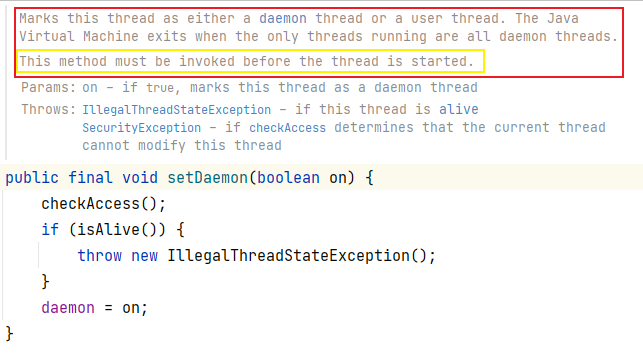

# 用户线程和守护线程

一般都是用户线程

## 用户线程（user thread)

是系统的工作线程，它会完成这个程序需要完成的业务操作。

## 守护线程（daemon thread)

一种特殊的线程，**为其它线程服务**，在后台默默地完成一些系统性的服务，比如垃圾回收线程就是最典型的例子

守护线程作为一个服务线程，没有服务对象就没有必要继续运行了，如果用户线程全部结束了，意味着程序需要完成的业务操作已经结束了，系统可以退出了。所以假如当系统只剩下守护线程的时候，java 虚拟机会自动退出。

## 源码

```java
/**
     * Tests if this thread is a daemon thread.
     *
     * @return  <code>true</code> if this thread is a daemon thread;
     *          <code>false</code> otherwise.
     * @see     #setDaemon(boolean)
     */
public final boolean isDaemon() {
    return daemon;
}
```


线程类有一个属性 `daemon` ，如果是 `true` 则是守护线程，反之是用户线程 

## 代码演示

```java
public static void main(String[] args) {
    Thread t1 = new Thread(() -> {
        System.out.println(Thread.currentThread().getName() + "\t 开始运行，" +
                           (Thread.currentThread().isDaemon() ? "守护线程" : "用户线程"));
        while (true){

        }
    }, "t1");
    t1.start();

    try {
        TimeUnit.SECONDS.sleep(3);
    } catch (InterruptedException e) {
        e.printStackTrace();
    }

    System.out.println(Thread.currentThread().getName() + "\t ---end 主线程");
}
```


输出：

```tex
t1	 开始运行，用户线程
main	 ---end 主线程
```


程序不会退出

> 用户线程 t1 是死循环，不会退出，导致程序无法退出


【修改】

将 `t1` 设置为守护线程

```java
t1.setDaemon(true);// 必须在 start() 之前设置，否则会报 线程状态非法 的异常
t1.start();
```


输出：

```
t1	 开始运行，守护线程
main	 ---end 主线程
```


程序正常退出

> 虽然守护线程 t1 是死循环，但是正常的用户线程已经结束了，守护线程就会随着 JVM 一同结束工作


【总结】

1、如果用户线程全部结束意味着程序需要完成的业务操作已经结束了，守护线程随着 JVM 一同结束工作

2、`setDaemon(true)` 方法必须在 `start()` 之前设置，否则报 `IllegalThreadStateException` 异常。

> 线程开始工作之后然后再设置为守护线程，我不认！！！


源码补充：




