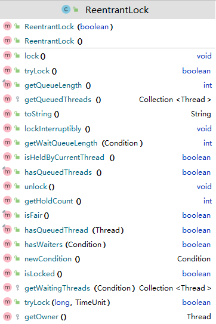

# Java中的各种锁

## 乐观锁和悲观锁

### 悲观锁

认为自己在使用数据的时候一定有别的线程来修改数据，因此在获取数据的时候会**先加锁**，确保数据不会被别的线程修改。

- 适合写操作多的情况
- 先加锁，然后再操作数据

`synchronized` 关键字和 `Lock` 的实现类**都是悲观锁**

### 乐观锁

认为自己使用数据的时候没别的线程来修改数据，不用加锁

在Java中是通过使用无锁编程来实现，只是在更新数据的时候去判断，之前有没有别的线程更新了这个数据。

- 如果这个数据没有被更新，当前线程将自己修改的数据成功写入。

- 如果这个数据已经被其它线程更新，则根据不同的实现方式执行不同的操作，比如放弃修改、重试抢锁等等

判断规则：

- 版本号机制Version（只要修改了数据，版本号就会加1）
- 最常采用的是CAS（compare and swap）算法，Java原子类中的递增操作就通过CAS自旋实现的。


适合读操作多的场景，因为不加锁，所以性能较高

## `synchronized` 锁

- 悲观锁
- `synchronized` 加在普通方法上锁的是当前对象 `this`，是对象锁
- 如果是同步方法块，锁的是 `synchronized` 括号内的对象
- 静态 `synchronized` 方法锁的是整个类，锁的是当前类的 `Class` 对象，是类锁
- 加在类上面，也是锁整个类，类锁
- 所用的静态同步方法使用的是同一把锁
- 同一个对象的普通同步方法也用的是同一把锁
- 静态同步方法和普通同步方法之间不会有竞争

### 八锁案例

#### 案例1：标准访问，a，b 两个线程，先打印邮件还是短信？

```java
class Phone{// 资源类
    public synchronized void sendEmail(){
        System.out.println("==> send email");
    }

    public synchronized void sendSMS(){
        System.out.println("==> send SMS");
    }

    public void sayHello(){
        System.out.println("Hello");
    }
}


public static void main(String[] args) {
    Phone phone = new Phone();

    new Thread(() -> {phone.sendEmail();}, "a").start();
	
    // 暂定200毫秒，确保 a 线程先启动
    try { TimeUnit.MILLISECONDS.sleep(200); } catch (InterruptedException e) { e.printStackTrace(); }

    new Thread(() ->{phone.sendSMS();}, "b").start();

}
```

```
==> send email
==> send SMS
```

#### 案例2：在 `sendEmail` 中暂定3秒，先打印谁？

```diff
class Phone{// 资源类
    public synchronized void sendEmail(){
+		try { TimeUnit.SECONDS.sleep(3); } catch (InterruptedException e) { e.printStackTrace(); }
        System.out.println("==> send email");
    }

    public synchronized void sendSMS(){
        System.out.println("==> send SMS");
    }

    public void sayHello(){
        System.out.println("Hello");
    }
}

public static void main(String[] args) {
    Phone phone = new Phone();

    new Thread(() -> {phone.sendEmail();}, "a").start();

	// 暂定200毫秒，确保 a 线程先启动
    try { TimeUnit.MILLISECONDS.sleep(200); } catch (InterruptedException e) { e.printStackTrace(); }

    new Thread(() ->{phone.sendSMS();}, "b").start();

}
```

```
==> send email
==> send SMS
```


结论：`synchronized` 加在方法上锁的是当前对象 `this`

类 `A` 有一个对象 `a`，如果一个线程通过对象 `a` 调用了该类的 `synchronized` 方法，则其他线程通过对象 `a` 调用其他 `synchronized` 方法时会阻塞


#### 案例3：调用普通方法，先打印邮件还是hello？

```java
class Phone{
    public synchronized void sendEmail(){
        try { TimeUnit.SECONDS.sleep(3); } catch (InterruptedException e) { e.printStackTrace(); }
        System.out.println("==> send email");
    }

    public synchronized void sendSMS(){
        System.out.println("==> send SMS");
    }

    public void sayHello(){
        System.out.println("Hello");
    }
}

public static void main(String[] args) {
    Phone phone = new Phone();

    new Thread(() -> {phone.sendEmail();}, "a").start();

    // 暂定200毫秒，确保 a 线程先启动
    try { TimeUnit.MILLISECONDS.sleep(200); } catch (InterruptedException e) { e.printStackTrace(); }

    new Thread(() ->{phone.sayHello();}, "b").start();

}
```

```java
Hello
==> send email
```

#### 案例4，两个手机，先打印哪个？

```java
class Phone{
    public synchronized void sendEmail(){
        try { TimeUnit.SECONDS.sleep(3); } catch (InterruptedException e) { e.printStackTrace(); }
        System.out.println("==> send email");
    }

    public synchronized void sendSMS(){
        System.out.println("==> send SMS");
    }

    public void sayHello(){
        System.out.println("Hello");
    }
}

public static void main(String[] args) {
    Phone phone = new Phone();
    Phone phone2 = new Phone();

    new Thread(() -> {phone.sendEmail();}, "a").start();

    // 暂定200毫秒，确保 a 线程先启动
    try { TimeUnit.MILLISECONDS.sleep(200); } catch (InterruptedException e) { e.printStackTrace(); }
    
    new Thread(() ->{phone2.sendSMS();}, "b").start();

}
```

```
==> send SMS
==> send email
```


结论：

- 加普通方法之后，是和同步锁无关的
- 如果是两个对象，对不同的对象加锁，是不会相互影响的

#### 案例5：如果是两个静态同步方法，一部手机，先打印哪个？

```java
class Phone{
    public static synchronized void sendEmail(){
        try { TimeUnit.SECONDS.sleep(3); } catch (InterruptedException e) { e.printStackTrace(); }
        System.out.println("==> send email");
    }

    public static synchronized void sendSMS(){
        System.out.println("==> send SMS");
    }

    public void sayHello(){
        System.out.println("Hello");
    }
}

public static void main(String[] args) {
    Phone phone = new Phone();

    new Thread(() -> {phone.sendEmail();}, "a").start();

    // 暂定200毫秒，确保 a 线程先启动
    try { TimeUnit.MILLISECONDS.sleep(200); } catch (InterruptedException e) { e.printStackTrace(); }

    new Thread(() ->{phone.sendSMS();}, "b").start();

}
```

```
==> send email
==> send SMS
```

#### 案例6：如果是两个静态同步方法，两部手机，先打印哪个？

```diff
class Phone{
    public static synchronized void sendEmail(){
        try { TimeUnit.SECONDS.sleep(3); } catch (InterruptedException e) { e.printStackTrace(); }
        System.out.println("==> send email");
    }

    public static synchronized void sendSMS(){
        System.out.println("==> send SMS");
    }

    public void sayHello(){
        System.out.println("Hello");
    }
}


public static void main(String[] args) {
    Phone phone = new Phone();
+	Phone phone2 = new Phone();

    new Thread(() -> {phone.sendEmail();}, "a").start();

    // 暂定200毫秒，确保 a 线程先启动
    try { TimeUnit.MILLISECONDS.sleep(200); } catch (InterruptedException e) { e.printStackTrace(); }
    
-	new Thread(() ->{phone.sendSMS();}, "b").start();
+	new Thread(() ->{phone2.sendSMS();}, "b").start();

}
```

```
==> send email
==> send SMS
```


结论：

- 静态 `synchronized` 方法锁的是整个类，是类锁

#### 案例7：一个静态同步方法，一个普通同步方法，同一个手机，先打印哪个？

```java
class Phone{
    public static synchronized void sendEmail(){// 类锁
        try { TimeUnit.SECONDS.sleep(3); } catch (InterruptedException e) { e.printStackTrace(); }
        System.out.println("==> send email");
    }

    public synchronized void sendSMS(){// 对象锁
        System.out.println("==> send SMS");
    }

    public void sayHello(){
        System.out.println("Hello");
    }
}

public static void main(String[] args) {
    Phone phone = new Phone();

    new Thread(() -> {phone.sendEmail();}, "a").start();

    // 暂定200毫秒，确保 a 线程先启动
    try { TimeUnit.MILLISECONDS.sleep(200); } catch (InterruptedException e) { e.printStackTrace(); }

    new Thread(() ->{phone.sendSMS();}, "b").start();

}
```

```
==> send SMS
==> send email
```

锁的对象不同，一个锁的是 `Class` 对象，一个是当前对象，所以先打印短信

#### 案例8：一个静态同步方法，一个普通同步方法，两个手机，先打印哪个？

```diff
class Phone{
    public static synchronized void sendEmail(){
        try { TimeUnit.SECONDS.sleep(3); } catch (InterruptedException e) { e.printStackTrace(); }
        System.out.println("==> send email");
    }

    public synchronized void sendSMS(){
        System.out.println("==> send SMS");
    }

    public void sayHello(){
        System.out.println("Hello");
    }
}

public static void main(String[] args) {
    Phone phone = new Phone();
+	Phone phone2 = new Phone();

    new Thread(() -> {phone.sendEmail();}, "a").start();

    // 暂定200毫秒，确保 a 线程先启动
    try { TimeUnit.MILLISECONDS.sleep(200); } catch (InterruptedException e) { e.printStackTrace(); }

-	new Thread(() ->{phone.sendSMS();}, "b").start();
+   new Thread(() ->{phone2.sendSMS();}, "b").start();

}
```

```
==> send SMS
==> send email
```

分析同案例7

### synchronized 使用场景

- 普通同步方法
- 静态同步方法
- 同步代码块
- 修饰一个类


【面试题】为什么任何一个对象都可以作为同步代码块的锁？

任何一个对象天生就带有一个对象监视器，每一个被锁的对象都会和 monitor 联系起来

> monitor，管程（监视器）
>
> 方法级的同步是隐式的，无须通过字节码指令来控制，它实现在方法调用和返回操作之中。
>
> 虚拟机可以从方法常量池中的方法表结构中的`ACC_SYNCHRONIZED` 访问标志得知一个方法是否被声明为同步方法。
>
> 当方法调用时，调用指令将会检查方法的`ACC_SYNCHRONIZED`访问标志是否被设置，如果设置了，**执行线程就要求先成功持有管程，然后才能执行方法，最后当方法完成（无论是正常完成还是非正常完成）时释放管程**。
>
> **在方法执行期间，执行线程持有了管程，其他任何线程都无法再获取到同一个管程。**
>
> 如果一个同步方法执行期间抛出了异常，并且在方法内部无法处理此异常，那这个同步方法所持有的管程将在异常抛到同步方法边界之外时自动释放。

## 公平锁和非公平锁

### `ReentrantLock`



#### 非公平锁代码示例

```java
class Ticket{
    private int number = 50;
    ReentrantLock lock = new ReentrantLock();// 非公平锁

    public void sale(){
        lock.lock();
        try {
            if(number > 0){
                System.out.println(Thread.currentThread().getName() 
                        + " 卖出了第: " + (number--) + " 张票，" 
                        + "还剩： " + number + " 张票");
            }
        }
        finally {
            lock.unlock();
        }
    }
}
public class ReentrantLockDemo {

    public static void main(String[] args) {

        Ticket ticket = new Ticket();


        new Thread(() -> {for (int i = 0; i < 55; i++) {ticket.sale();}}, "a").start();

        new Thread(() -> {for (int i = 0; i < 55; i++) {ticket.sale();}}, "b").start();

        new Thread(() -> {for (int i = 0; i < 55; i++) {ticket.sale();}}, "c").start();
    }
}
```


存在所有的票被一个售票员卖光的情况，吃相难看

#### 公平锁代码示例

可以使用同名构造方法，让锁变为公平的

```java
class Ticket{
    private int number = 50;
    ReentrantLock lock = new ReentrantLock(true);// 公平锁

    public void sale(){
        lock.lock();
        try {
            if(number > 0){
                System.out.println(Thread.currentThread().getName()
                        + " 卖出了第: " + (number--) + " 张票，"
                        + "还剩： " + number + " 张票");
            }
        }
        finally {
            lock.unlock();
        }
    }
}
public class ReentrantLockDemo {

    public static void main(String[] args) {

        Ticket ticket = new Ticket();


        new Thread(() -> {for (int i = 0; i < 55; i++) {ticket.sale();}}, "a").start();

        new Thread(() -> {for (int i = 0; i < 55; i++) {ticket.sale();}}, "b").start();

        new Thread(() -> {for (int i = 0; i < 55; i++) {ticket.sale();}}, "c").start();
    }
}
```


除了最开始，后面基本上就是公平的了

公平锁存在线程切换开销大的问题

【启示】

- 如果要更高的吞吐量，用非公平锁
- 如果要公平，则公平锁

## 可重入锁（递归锁）

指在同一个线程在外层方法获取锁的时候，再进入该线程的内层方法会自动获取锁(前提，锁对象得是同一个对象)，不会因为之前已经获取过还没释放而阻塞。

如果是1个有 synchronized 修饰的递归调用方法，程序第2次进入被自己阻塞了岂不是天大的笑话，出现了作茧自缚。

所以Java中ReentrantLock和synchronized都是可重入锁，可重入锁的一个优点是可一定程度避免死锁。

### 同步代码块

```java
Object obj = new Object();
new Thread(() -> {
    synchronized (obj){
        System.out.println(Thread.currentThread().getName() + " 外层调用");
        synchronized (obj){
            System.out.println(Thread.currentThread().getName() + " 中间层调用");
            synchronized (obj){
                System.out.println(Thread.currentThread().getName() + " 内层调用");
            }
        }
    }
}).start();
```

```
Thread-0 外层调用
Thread-0 中间层调用
Thread-0 内层调用
```

同一个线程，同一把锁，可以重新获得这把锁

### 同步方法

几个同步方法 m1，m2，m3，m1调用m2，m2调用m3，还是同一把锁

### 显示锁ReentrantLock

加几次锁，就需要手动释放几次

## 死锁及其排查

死锁四个条件：互斥、占有并等待、资源不可剥夺、循环等待

### 如何排查死锁？

- 命令行：使用 `jps` 和 `jstack` 排查
- 图形化界面：使用 `jconsole` 排查


