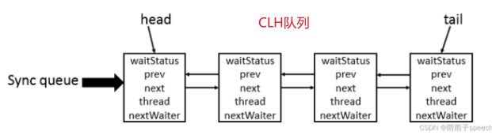

# AQS原理

## 概述

全称是 `AbstractQueuedSynchronizer`，是阻塞式锁和相关的同步器工具的框架

本质上是一个抽象类，主要用来**构建锁和同步器**

核心思想：

- 如果被请求的共享资源空闲，则将当前请求资源的线程设置为有效的工作线程，并且将共享资源设置为锁定状态。

- 如果被请求的共享资源被占用，那么就需要一套线程阻塞等待以及被唤醒时锁分配的机制（CLH锁）


CLH 锁是对自旋锁的一种改进，是一个虚拟的双向队列（虚拟的双向队列即不存在队列实例，仅存在结点之间的关联关系），暂时获取不到锁的线程将被加入到该队列中。AQS 将每条请求共享资源的线程封装成一个 CLH 队列锁的一个结点（Node）来实现锁的分配。在 CLH 队列锁中，一个节点表示一个线程，它保存着线程的引用（thread）、 当前节点在队列中的状态（waitStatus）、前驱节点（prev）、后继节点（next）




AQS 使用 int 成员变量 `state` 表示同步状态，通过内置的 线程等待队列 来完成获取资源线程的排队工作。

`state` 变量由 `volatile` 修饰，用于展示当前临界资源的获锁情况。

```java
// 共享变量，使用volatile修饰保证线程可见性
private volatile int state;
```

另外，状态信息 `state` 可以通过 `protected` 类型的 `getState()、setState()`和 `compareAndSetState()`  进行操作。这几个方法都是 `final` 修饰的，**在子类中无法被重写**。

```java
//返回同步状态的当前值
protected final int getState() {
     return state;
}
 // 设置同步状态的值
protected final void setState(int newState) {
     state = newState;
}
//原子地（CAS操作）将同步状态值设置为给定值update如果当前同步状态的值等于expect（期望值）
protected final boolean compareAndSetState(int expect, int update) {
      return unsafe.compareAndSwapInt(this, stateOffset, expect, update);
}
```

<br/>

特点:

- 用state属性来表示资源的状态（分独占模式和共享模式)，子类需要定义如何维护这个状态，控制如何获取锁和释放锁
	- getState - 获取state状态 
	- setState - 设置state状态
	- compareAndSetState -乐观锁机制设置state状态
	- 独占模式是只有一个线程能够访问资源，而共享模式可以允许多个线程访问资源
- 提供了基于FIFO的等待队列，类似于Monitor的 EntryList
- 条件变量来实现等待、唤醒机制，支持多个条件变量，类似于Monitor的 WaitSet

<br/>

子类主要实现这样一些方法（默认抛出UnsupportedOperationException)

- tryAcquire
- tryRelease
- tryAcquireShared 
- tryReleaseShared
- isHeldExclusively

获取锁：

```java
// 如果获取锁失败
if(!tryAcquire(arg)){
    // 入队, 可以选择阻塞当前线程
    // 使用
}
```


释放锁：

```java
// 如果释放锁成功
if(tryRelease(arg)){
    // 让阻塞线程恢复运行
}
```


