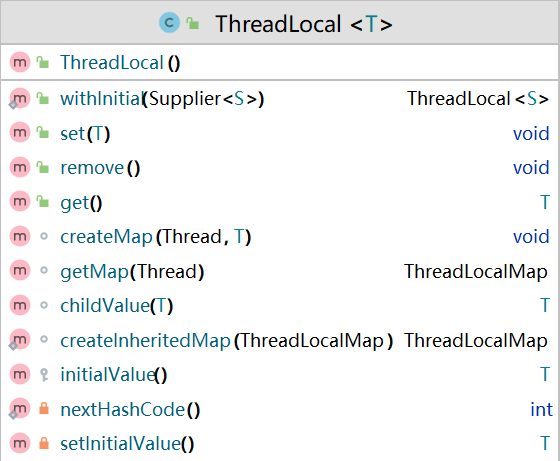
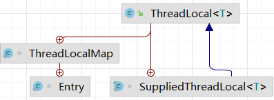
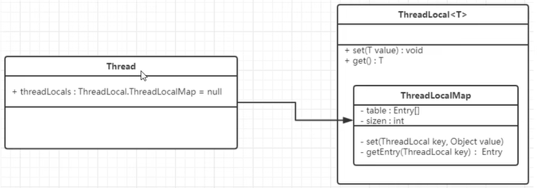
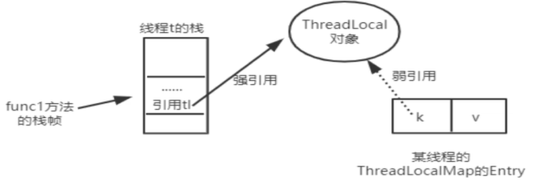

# ThreadLocal

翻译：线程局部变量

## 是什么？

ThreadLocal 提供线程局部变量。

这些变量与正常的变量不同，因为每一个线程在访问 ThreadLocal 实例的时候都有自己的、独立初始化的变量副本

ThreadLocal 实例通常是类中的私有静态字段，使用它的目的是希望将状态（例如，用户ID或事务ID）与线程关联起来。

## 有什么用？

让每一个线程都有自己专属的本地变量副本

让每个线程绑定自己的值，通过使用 `get()` 和 `set()`方法，获取默认值或将其值更改为当前线程所存的副本的值，从而**避免了线程安全问题**。

> 排队用电话卡打电话和人手一步电话的区别

## 具体的API



### 源码

```java
// 返回当前线程的线程局部变量副本中的值。
// 如果当前线程的变量没有值，它将首先被初始化为通过调用 initialValue 方法返回的值。
public T get() {
    Thread t = Thread.currentThread();
    ThreadLocalMap map = getMap(t);
    if (map != null) {
        ThreadLocalMap.Entry e = map.getEntry(this);
        if (e != null) {
            T result = (T)e.value;
            return result;
        }
    }
    return setInitialValue();
}
```

如果在当前线程之前没有调用过 set 方法，或者之前的值已被 remove 移除，那么在首次调用 get 方法时，会通过 initialValue 方法设置一个初始值。

如果 initialValue 方法未被重写，或者返回的值是null，那么在第一次调用get方法时，变量的值将为null。如果希望线程局部变量在没有显式设置值的情况下具有特定的初始值，需要在使用ThreadLocal变量之前，通过子类化ThreadLocal并重写initialValue方法，来自定义初始值。

【阿里巴巴规范]】：必须回收自定义的 ThreadLocal 变量记录的当前线程的值，尤其在线程池场景下，线程经常会
被复用，如果不清理自定义的 ThreadLocal 变量，可能会影响后续业务逻辑和造成内存泄露等问题。尽量在代码中使用 `try-finally` 块进行回收

```java
objectThreadLocal.set(userInfo);
try {
// ...
} finally {
	objectThreadLocal.remove();
}
```

### 面试题

#### Thread，ThreadLocal 和 ThreadLocalMap 的关系





```java
public
class Thread implements Runnable {
    // 省略其他部分代码

    /* ThreadLocal values pertaining to this thread. This map is maintained
     * by the ThreadLocal class. */
    ThreadLocal.ThreadLocalMap threadLocals = null;

    /*
     * InheritableThreadLocal values pertaining to this thread. This map is
     * maintained by the InheritableThreadLocal class.
     */
    ThreadLocal.ThreadLocalMap inheritableThreadLocals = null;
}
```

```java
static class ThreadLocalMap {

    /**
     * The entries in this hash map extend WeakReference, using
     * its main ref field as the key (which is always a
     * ThreadLocal object).  Note that null keys (i.e. entry.get()
     * == null) mean that the key is no longer referenced, so the
     * entry can be expunged from table.  Such entries are referred to
     * as "stale entries" in the code that follows.
     */
    static class Entry extends WeakReference<ThreadLocal<?>> {
        /** The value associated with this ThreadLocal. */
        Object value;

        Entry(ThreadLocal<?> k, Object v) {
            super(k);
            value = v;
        }
    }
    
    private Entry[] table;
}
```


- ThreadLocalMap 是 ThreadLocal 的静态内部类
- Thread 类里面使用了 ThreadLocalMap
- ThreadLocalMap 底层使用了哈希表，表里面存放的是以 threadLocal 实例为 key，任意对象为 value 的 Entry 对象（map）

```java
void createMap(Thread t, T firstValue) {
    t.threadLocals = new ThreadLocalMap(this, firstValue);
}

ThreadLocalMap getMap(Thread t) {
    return t.threadLocals;
}

public T get() {
    Thread t = Thread.currentThread();
    ThreadLocalMap map = getMap(t);
    if (map != null) {
        ThreadLocalMap.Entry e = map.getEntry(this);
        if (e != null) {
            T result = (T)e.value;
            return result;
        }
    }
    return setInitialValue();
}

public void set(T value) {
    Thread t = Thread.currentThread();
    ThreadLocalMap map = getMap(t);
    if (map != null)
        map.set(this, value);
    else
        createMap(t, value);
}

private T setInitialValue() {
    T value = initialValue();
    Thread t = Thread.currentThread();
    ThreadLocalMap map = getMap(t);
    if (map != null)
        map.set(this, value);
    else
        createMap(t, value);
    return value;
}

// 此方法需要被子类重写
protected T initialValue() {
    return null;
}
```

#### 为什么使用弱引用

```java
public void function01(){
    ThreadLocal<String> tl = new ThreadLocal<>();//line1
    tl.set("zzyybs@126.com");//line2
    tl.get();//line3
}
```

line1 新建了一个 ThreadLocal 对象，t1 是强引用指向这个对象;

line2 调用 set() 方法后新建一个 Entry，通过源码可知 Entry 对象里的k是弱引用指向这个对象。



当functiono1方法执行完毕后，栈帧销毁强引用tl也就没有了。但此时线程的ThreadLocalMap里某个entry的key引用还指向这个对象

若这个key引用是强引用，就会导致key指向的ThreadLocal对象及v指向的对象不能被gc回收，造成内存泄漏

若这个key引用是弱引用就大概率会减少内存泄漏的问题。

使用弱引用，就可以使 ThreadLocal 对象在方法执行完毕后顺利被回收且 Entry 的 key 引用指向为 null。

如果 key 的引用为 null，对应的 entry 也是应该被回收的，不然还是会内存泄露

解决方法：手动调用 `remove` 方法

> remove 方法最终会调用 expungeStaleEntry 方法，这个方法会 rehash 整张哈希表，把遇到的过时的 entry （key 为 null 的entry）清除
>
> set 和 get 方法在遇到 key 为 null 的时候也会调用 expungeStaleEntry 方法


【补充知识】

内存泄露：内存没有及时回收（占着茅坑不拉屎）

内存溢出：没有足够的内存了

弱引用可以保证，当垃圾回收的时候，这部分对象一定会被回收

假如有一个应用需要读取大量的本地图片:

- 如果每次读取图片都从硬盘读取则会严重影响性能

- 如果一次性全部加载到内存中又可能造成内存溢出。

此时使用软引用可以解决这个问题。

设计思路是：用一个HashMap来保存图片的路径和相应图片对象关联的软引用之间的映射关系，在内存不足时,JVM会自动回收这些缓存图片对象所占用的空间，从而有效地避免了OOM的问题。

```java
Map<Stringr SoftReference<Bitmap>> imageCache = new HashMap<String,SoftReference<Bitmap>>();
```

## 最佳实践

- 使用的时候记得初始化： `ThreadLocal.withInitial(() -> 初始值)`
- ThreadLocal 变量建议修饰为静态变量
- 用完记得手动 remove


