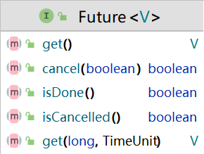
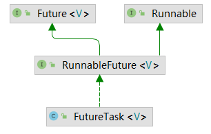
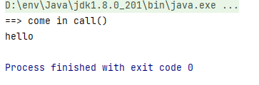
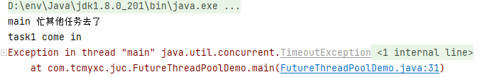
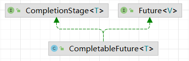

# CompletableFuture

## Future接口理论知识




Future接口定义了操作异步作务执行一些方法，如获取异步任务的执行结果、取消任务的执行判断任务是否被取消、判断任务执行是否完毕等。

比如主线程让一个子线程去执行任务，子线程可能比较耗时，启动子线程开始执行任务后，主线程就去做其他事情了，忙其它事情或者先执行完，过了一会才去获取子任务的执行结果或变更的任务状态。

【总结】：Future接口可以为主线程开一个分支任务，专门为主线程处理耗时和费力的复杂业务，**提供了异步并行计算的功能**

## FutureTask异步任务

### 特点

多线程、有返回值、异步任务

- 多线程 --> 实现了`Runnable`接口
- 异步任务 --> 实现了 `Future` 接口
- 有返回值 --> 构造器注入 `Callable` 接口

```java
// 只有两个构造函数

public FutureTask(Callable<V> callable)  // 构造注入
    
public FutureTask(Runnable runnable, V result)  // 后续还是使用了 Callable 接口
```



### 代码实战

#### 基本使用

```java
import java.util.concurrent.Callable;
import java.util.concurrent.ExecutionException;
import java.util.concurrent.FutureTask;

public class Main {
    public static void main(String[] args) throws ExecutionException, InterruptedException {
        FutureTask<String> futureTask = new FutureTask<>(new MyThread());

        Thread t1 = new Thread(futureTask, "t1");
        // 运行线程
        t1.start();
        // 获取返回值
        String result = futureTask.get();
        System.out.println(result);
    }

}

class MyThread implements Callable<String>{

    @Override
    public String call() throws Exception {
        System.out.println("==> come in call()");
        return "hello";
    }
}
```

运行结果截图：



#### 结合线程池

假设有三个任务，只有一个线程main来处理，每个任务耗时分别为 500，300，200毫秒，假设任务按照顺序执行：

```java
public static void main(String[] args) {
    long startTime = System.currentTimeMillis();


    try {
        TimeUnit.MILLISECONDS.sleep(500);
    } catch (InterruptedException e) {
        e.printStackTrace();
    }

    try {
        TimeUnit.MILLISECONDS.sleep(300);
    } catch (InterruptedException e) {
        e.printStackTrace();
    }

    try {
        TimeUnit.MILLISECONDS.sleep(200);
    } catch (InterruptedException e) {
        e.printStackTrace();
    }

    long endTime = System.currentTimeMillis();
    System.out.println("==> 耗费时间:" + (endTime -startTime) + " 毫秒");
}
```

```
==> 耗费时间:1033 毫秒
```


【改进】使用多线程，同时结合线程池，减少线程创建、销毁的开销

```java
public static void main(String[] args) throws ExecutionException, InterruptedException {
    ExecutorService threadPool = Executors.newFixedThreadPool(3);

    long startTime = System.currentTimeMillis();
    FutureTask<String> futureTask1 = new FutureTask<>(() -> {
        try {
            TimeUnit.MILLISECONDS.sleep(500);
        } catch (InterruptedException e) {
            e.printStackTrace();
        }
        return "task1 over";
    });
    // 不要自己 new 线程
    //Thread task1 = new Thread(futureTask1, "task1");
    //task1.start();

    threadPool.submit(futureTask1);

    FutureTask<String> futureTask2 = new FutureTask<>(() -> {
        try {
            TimeUnit.MILLISECONDS.sleep(300);
        } catch (InterruptedException e) {
            e.printStackTrace();
        }
        return "task2 over";
    });
    threadPool.submit(futureTask2);

    System.out.println(futureTask1.get());
    System.out.println(futureTask2.get());

    // 主线程认领第3个任务
    try {
        TimeUnit.MILLISECONDS.sleep(200);
    } catch (InterruptedException e) {
        e.printStackTrace();
    }

    // 关闭资源
    threadPool.shutdown();

    long endTime = System.currentTimeMillis();
    System.out.println("==> 耗费时间:" + (endTime -startTime) + " 毫秒");


}
```

```
task1 over
task2 over
==> 耗费时间:755 毫秒
```

如果不掉用 `FutureTask` 的 `get` 方法，那么本质上只是调用一下接口，不需要管方法的返回值。输出如下：

```
==> 耗费时间:249 毫秒
```

#### `get`方法阻塞示例

```java
public static void main(String[] args) throws ExecutionException, InterruptedException {

    FutureTask<String> futureTask1 = new FutureTask<>(() -> {
        System.out.println(Thread.currentThread().getName() + " come in");
        try {
            TimeUnit.SECONDS.sleep(5);
        } catch (InterruptedException e) {
            e.printStackTrace();
        }
        return "task1 over";
    });
    Thread task1 = new Thread(futureTask1, "task1");
    task1.start();

    // 放到这里会阻塞主线程
    System.out.println(futureTask1.get());

    System.out.println(Thread.currentThread().getName() + " 忙其他任务去了");

    // 正常位置
    // System.out.println(futureTask1.get());
}
```

```java
task1 come in
task1 over
main 忙其他任务去了
```

可以看到，调用 `get` 方法之后，会一直等返回结果，甚至阻塞主线程。

【启示】在最后面调用 `get` 方法

可以使用同名的重载方法，设置超时时间，如果超时，我就过时不候（遇到超时异常做止损处理）

```java
// 放在代码最后
System.out.println(futureTask1.get(3, TimeUnit.SECONDS));
```

直接会超时异常



#### `isDone`方法轮询

```java
public static void main(String[] args) throws ExecutionException, InterruptedException, TimeoutException {

    FutureTask<String> futureTask1 = new FutureTask<>(() -> {
        System.out.println(Thread.currentThread().getName() + " come in");
        try {
            TimeUnit.SECONDS.sleep(5);
        } catch (InterruptedException e) {
            e.printStackTrace();
        }
        return "task1 over";
    });
    Thread task1 = new Thread(futureTask1, "task1");
    task1.start();


    System.out.println(Thread.currentThread().getName() + " 忙其他任务去了");

    while (true){
        if(futureTask1.isDone()){
            System.out.println("任务完成");
            System.out.println(futureTask1.get());
            break;
        }
        else {
            try {
                TimeUnit.MILLISECONDS.sleep(1000);
            } catch (InterruptedException e) {
                e.printStackTrace();
            }
            System.out.println("睡醒了，继续轮询");
        }
    }

}
```

```
main 忙其他任务去了
task1 come in
睡醒了，继续轮询
睡醒了，继续轮询
睡醒了，继续轮询
睡醒了，继续轮询
睡醒了，继续轮询
任务完成
task1 over
```

缺点：轮询的方法会耗费CPU资源，不见得能够及时得到结果

> 如果想异步获取结果，一般使用轮询的方式，尽量不要使用阻塞方法

### 优缺点分析

优点：Future 和线程池配合使用，能够实现异步多线程，可以显著提高程序的运行效率

缺点：获取结果或阻塞、或轮询，不友好

## CompletableFuture对Future接口的改进

### 为什么出现？

异步任务的处理，我们真正想要的是：我调用一下你，你好了“踢”我一下。

> 对于真正的异步处理我们希望是可以通过传入回调函数，在Future结束时自动调用该回调函数，这样，我们就不用等待结果。
>
> 阻塞的方式和异步编程的设计理念相违背，而轮询的方式会耗费无谓的CPU资源。

CompletableFuture 提供了一种类似观察者模式的机制，可以让任务执行完之后通知监听的一方。

### 源码探究

```java
public class CompletableFuture<T> implements Future<T>, CompletionStage<T>{}
```



- JDK 8 引入，实现了Future和CompletionStaqe接口
- 提供了非常强大的Future的扩展功能，可以帮助我们简化异步编程的复杂性，并且提供了函数式编程的能力，可以通过回调的方式处理计算结果，也提供了转换和组合CompletableFuture的方法
- 它可能代表一个明确完成的Future，也有可能代表一个完成阶段（CompletionStage )，它支持在计算完成以后触发一些函数或执行某些动作
- 减少阻塞和轮询，可以传入回调对象，当异步任务完成或者发生异常时，自动调用回调对象的回调方法

### 如何得到一个CompletableFuture对象

#### 构造方法（不推荐）

```java
/**
 * Creates a new incomplete CompletableFuture.
 */
public CompletableFuture() {}
```

- 只有一个空参构造函数
- 不推荐使用这个空参构造

#### 静态方法

##### 无返回值的方法

```java
public static CompletableFuture<Void> runAsync(Runnable runnable) {
    return asyncRunStage(asyncPool, runnable);
}

public static CompletableFuture<Void> runAsync(Runnable runnable, 
                                               Executor executor// 线程池
                                              ) {
    return asyncRunStage(screenExecutor(executor), runnable);
}
```

##### 有返回值的方法（常用）

```java
public static <U> CompletableFuture<U> supplyAsync(Supplier<U> supplier) {
    return asyncSupplyStage(asyncPool, supplier);
}

public static <U> CompletableFuture<U> supplyAsync(Supplier<U> supplier,
                                                   Executor executor) {
    return asyncSupplyStage(screenExecutor(executor), supplier);
}
```


`Executor executor` 参数：如果没有指定 `Executor ` 的方法，则默认使用 `ForkJoinPool.commonPool()` 作为他的线程池

### 示例代码

#### 无返回值

不指定线程池

```java
public static void main(String[] args) throws ExecutionException, InterruptedException, TimeoutException {

    CompletableFuture<Void> completableFuture = CompletableFuture.runAsync(() -> {
        System.out.println(Thread.currentThread().getName());
        try { TimeUnit.SECONDS.sleep(1); } catch (InterruptedException e) { e.printStackTrace(); }
    });
    System.out.println(completableFuture.get());

}
```

```
ForkJoinPool.commonPool-worker-9
null
```


如果指定了线程池

```java
ExecutorService threadPool = Executors.newFixedThreadPool(3);

CompletableFuture<Void> completableFuture = CompletableFuture.runAsync(() -> {
    System.out.println(Thread.currentThread().getName());
    try { TimeUnit.SECONDS.sleep(1); } catch (InterruptedException e) { e.printStackTrace(); }
}, threadPool);// 指定线程池
System.out.println(completableFuture.get());

// 关闭资源
threadPool.shutdown();
```

```
pool-1-thread-1
null
```

#### 有返回值

```java
ExecutorService threadPool = Executors.newFixedThreadPool(3);

CompletableFuture<String> completableFuture = CompletableFuture.supplyAsync(() -> {
    System.out.println(Thread.currentThread().getName());
    try { TimeUnit.SECONDS.sleep(1); } catch (InterruptedException e) { e.printStackTrace(); }
    return "supplyAsync";
}, threadPool);// 指定线程池
System.out.println(completableFuture.get());

// 关闭资源
threadPool.shutdown();
```

### 怎么减少阻塞和轮询？

异步任务结束时，会自动回调某个对象的方法;

主线程设置好回调后，不再关心异步任务的执行，异步任务之间可以顺序执行

异步任务出错时，会自动回调某个对象的方法;

```java
CompletableFuture.supplyAsync(() -> {
    System.out.println(Thread.currentThread().getName() + " come in");
    int result = ThreadLocalRandom.current().nextInt(10);
    try { TimeUnit.SECONDS.sleep(1); } catch (InterruptedException e) { e.printStackTrace(); }
    System.out.println("==> 1 秒后得到计算结果: " + result);
    return result;
}).whenComplete((v, e) -> {
    if(e == null){
        System.out.println("计算完成, 计算结果为: " + v);
    }
}).exceptionally(e -> {
    e.printStackTrace();
    System.out.println("异常信息: " + e.getCause() + "\t" + e.getMessage());
    return null;
});

System.out.println(Thread.currentThread().getName() + " 线程先去忙其他任务");

// 主线程如果立刻结束，CompletableFuture 默认使用的线程池会立刻关闭，不会打印异步线程的结果
try { TimeUnit.SECONDS.sleep(3); } catch (InterruptedException e) { e.printStackTrace(); }
```

```
ForkJoinPool.commonPool-worker-9 come in
main 线程先去忙其他任务
==> 1 秒后得到计算结果: 2
计算完成, 计算结果为: 2
```

> 每次都需要等待，太麻烦。
>
> 可以使用自定义线程池的方式

优化之后的代码：

```java
ExecutorService threadPool = Executors.newFixedThreadPool(3);

CompletableFuture.supplyAsync(() -> {
    System.out.println(Thread.currentThread().getName() + " come in");
    int result = ThreadLocalRandom.current().nextInt(10);
    try { TimeUnit.SECONDS.sleep(1); } catch (InterruptedException e) { e.printStackTrace(); }
    System.out.println("==> 1 秒后得到计算结果: " + result);
    return result;
}, threadPool).whenComplete((v, e) -> {
    if(e == null){
        System.out.println("计算完成, 计算结果为: " + v);
    }
}).exceptionally(e -> {
    e.printStackTrace();
    System.out.println("异常信息: " + e.getCause() + "\t" + e.getMessage());
    return null;
});

System.out.println(Thread.currentThread().getName() + " 线程先去忙其他任务");

// 关闭资源
threadPool.shutdown();
```

```
pool-1-thread-1 come in
main 线程先去忙其他任务
==> 1 秒后得到计算结果: 4
计算完成, 计算结果为: 4
```


## 案例精讲

## 常用方法