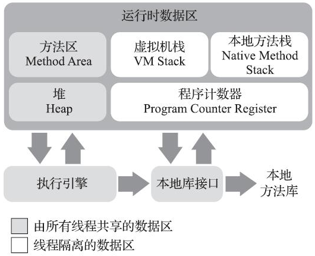

## 运行时数据区

线程私有：虚拟机栈、本地方法栈、PC

线程共享：堆、方法区

### 程序计数器

1. 存的是字节码指令地址。
2. 唯一一个在《Java虚拟机规范》中没有规定任何`OutOfMemoryError`情况的区域。

> 字节码解释器工作时就是通过改变这个计数器的值来选取下一条需要执行的字节码指令，它是程序控制流的指示器，分支、循环、跳转、异常处理、线程恢复等基础功能都需要依赖这个计数器来完成。

#### 为什么是线程私有的？

线程调度一般是时间片轮转算法，每个线程都需要保存自己的上下文

> Java虚拟机的多线程是通过线程轮流切换、分配处理器执行时间的方式来实现的，在任何一个确定的时刻，一个处理器（对于多核处理器来说是一个内核）都只会执行一条线程中的指令。因此，为了线程切换后能恢复到正确的执行位置，每条线程都需要有一个独立的程序计数器，各条线程之间计数器互不影响，独立存储

#### PC的值是什么？

如果线程正在执行的是一个Java方法，则是正在执行的虚拟机字节码指令的地址；

如果正在执行的是本地（Native）方法，则应为空（Undefined）

### 虚拟机栈

- 生命周期与线程相同。

- 描述的是Java方法执行的线程内存模型

> 每个方法被执行的时候，Java虚拟机都会同步创建一个栈帧（Stack Frame）用于存储局部变量表、操作数栈、动态连接、方法出口等信息。每一个方法被调用直至执行完毕的过程，就对应着一个栈帧在虚拟机栈中从入栈到出栈的过程。

#### 局部变量表存放了什么？

1. **编译期可知的各种Java虚拟机基本数据类型**（boolean、byte、char、short、int、float、long、double）
2. **对象引用**（reference类型，它并不等同于对象本身，可能是一个指向对象起始地址的引用指针，也可能是指向一个代表对象的句柄或者其他与此对象相关的位置）
3. **returnAddress类型**（指向了一条字节码指令的地址）

>上面的数据类型在局部变量表中的存储空间以**局部变量槽**（Slot）来表示，其中64位长度的long和double类型的数据会占用两个变量槽，其余的数据类型只占用一个。
>
>局部变量表所需的内存空间在**编译期间**完成分配，当进入一个方法时，这个方法需要在栈帧中分配多大的局部变量空间是完全确定的，在方法**运行期间不会改变局部变量表的大小**。请读者注意，这里说的“大小”是指变量槽的数量

### 本地方法栈

为虚拟机使用到的本地（Native）方法服务。

> Hot-Spot虚拟机直接就把本地方法栈和虚拟机栈合二为一

**虚拟机栈**和**本地方法栈**会在栈深度溢出或者栈扩展失败时分别抛出`StackOverflowError`和`OutOfMemoryError`异常

### Java堆

特点：

1. 虚拟机所管理的内存中最大的，垃圾收集器管理的内存区域
2. 被所有线程共享
3. 在虚拟机启动时创建
4. 此内存区域的唯一目的就是存放对象实例，Java世界里“几乎”所有的对象实例都在这里分配内存
5. 可以处于物理上不连续的内存空间中
6. 可以被实现成固定大小的，也可以是可扩展的（参数-Xmx和-Xms）

> 不过无论从什么角度，无论如何划分，都不会改变Java堆中存储内容的共性，无论是哪个区域，存储的都只能是对象的实例，将Java堆细分的目的只是为了更好地回收内存，或者更快地分配内存。

如果在Java堆中没有内存完成实例分配，并且堆也无法再扩展时，Java虚拟机将会抛出`OutOfMemoryError`异常

### 方法区

特点：

1. 线程共享
2. 存储已被虚拟机加载的类型信息、常量、静态变量、即时编译器编译后的代码缓存等数据
3. 不需要连续的内存
4. 可以选择固定大小或者可扩展
5. 可以选择不实现垃圾收集。相对而言，垃圾收集行为在这个区域的确是比较少出现的
6. 内存回收目标主要是针对常量池的回收和对类型的卸载

>JDK 8 之前，使用了永久代来实现方法区
>
>JDK 7的HotSpot，把原本放在永久代的字符串常量池、静态变量等移出
>
>JDK 8，完全废弃了永久代的概念，改用与JRockit、J9一样在本地内存中实现的**元空间**（Meta-space）来代替

如果方法区无法满足新的内存分配需求时，将抛出`OutOfMemoryErro`r异常。

### 运行时常量池

特点：

1. 方法区的一部分
2. 存放常量池表：编译期生成的各种字面量与符号引用，也存放由符号引用翻译出来的直接引用
3. 具备动态性：编译期可以放，运行期间也可以将新的常量放入池中

### 直接内存

特点：

1. 并不是虚拟机运行时数据区的一部分
2. 不是《Java虚拟机规范》中定义的内存区域
3. 这部分内存也被频繁地使用，而且也可能导致`OutOfMemoryError`异常出现

### 内存堆转储快照获取

通过参数`-XX：+HeapDumpOnOutOf-MemoryError`可以让虚拟机在出现内存溢出异常的时候Dump出当前的内存堆转储快照以便进行事后分析。
