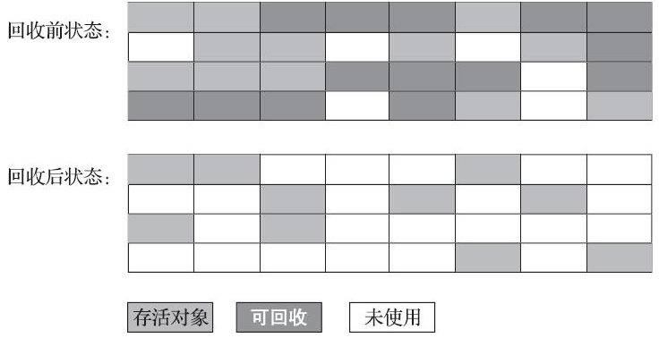
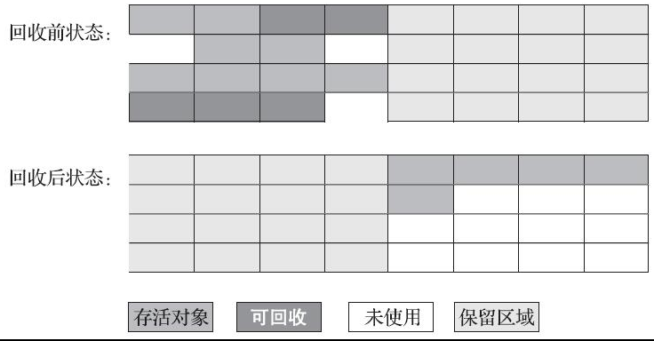
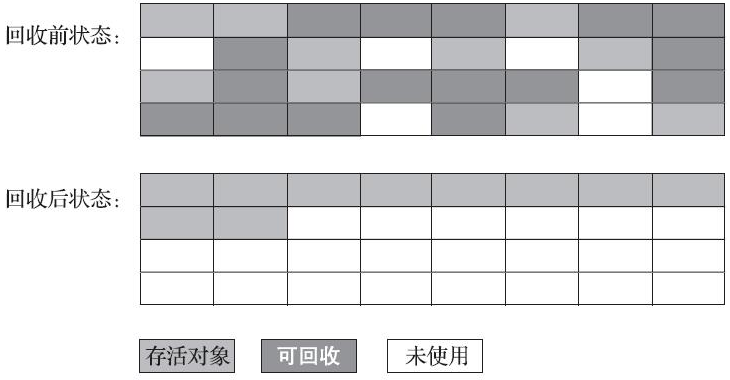

## 垃圾收集收集的是哪里的空间？

堆和方法区

> 程序计数器、虚拟机栈、本地方法栈3个区域随线程而生，随线程而灭，栈中的栈帧随着方法的进入和退出而有条不紊地执行着出栈和入栈操作。每一个栈帧中分配多少内存基本上是在类结构确定下来时就已知的，因此这几个区域的内存分配和回收都具备确定性，在这几个区域内就不需要过多考虑如何回收的问题，当方法结束或者线程结束时，内存自然就跟随着回收了。
>
> Java堆和方法区这两个区域则有着很显著的不确定性：一个接口的多个实现类需要的内存可能会不一样，一个方法所执行的不同条件分支所需要的内存也可能不一样，只有处于运行期间，我们才能知道程序究竟会创建哪些对象，创建多少个对象，这部分内存的分配和回收是动态的

## 如何判断对象是否存活？

1、引用计数法

2、可达性分析法

引用计数法：在对象中添加一个引用计数器，每当有一个地方引用它时，计数器值就加一；当引用失效时，计数器值就减一；任何时刻计数器为零的对象就是不可能再被使用的。

可达性分析：通过一系列称为“GC Roots”的根对象作为起始节点集，从这些节点开始，根据引用关系向下搜索，搜索过程所走过的路径称为“引用链”，如果某个对象到GC Roots间没有任何引用链相连，或者用图论的话来说就是从GC Roots到这个对象不可达时，则证明此对象是不可能再被使用的。

## 可作为GC Roots的对象

固定可作为GC Roots的对象包括以下几种：

- 在虚拟机栈（栈帧中的本地变量表）中引用的对象，譬如各个线程被调用的方法堆栈中使用到的参数、局部变量、临时变量等
- 在方法区中类静态属性引用的对象，譬如Java类的引用类型静态变量
- 在方法区中常量引用的对象，譬如字符串常量池（String Table）里的引用
- 在本地方法栈中JNI（即通常所说的Native方法）引用的对象
- Java虚拟机内部的引用，如基本数据类型对应的Class对象，一些常驻的异常对象（比如NullPointExcepiton、OutOfMemoryError）等，还有系统类加载器
- 所有被同步锁（synchronized关键字）持有的对象
- 反映Java虚拟机内部情况的JMXBean、JVMTI中注册的回调、本地代码缓存等

## 四种引用

强引用（Strongly Re-ference）、软引用（Soft Reference）、弱引用（Weak Reference）和虚引用（Phantom Reference）4种，这4种引用强度依次逐渐减弱。

- 强引用是最传统的“引用”的定义，是指在程序代码之中普遍存在的引用赋值，即类似`Object obj=new Object()`这种引用关系。无论任何情况下，只要强引用关系还存在，垃圾收集器就永远不会回收掉被引用的对象。

- 软引用是用来描述一些**还有用，但非必须**的对象。只被软引用关联着的对象，在系统将要发生内存溢出异常前，会把这些对象列进回收范围之中进行第二次回收，如果这次回收还没有足够的内存，才会抛出内存溢出异常。在JDK 1.2版之后提供了SoftReference类来实现软引用。

- 弱引用也是用来描述那些**非必须**对象，但是它的强度比软引用更弱一些，被弱引用关联的对象只能生存到下一次垃圾收集发生为止。当垃圾收集器开始工作，无论当前内存是否足够，都会回收掉只被弱引用关联的对象。在JDK 1.2版之后提供了WeakReference类来实现弱引用。

- 虚引用也称为“幽灵引用”或者“幻影引用”，它是**最弱的一种引用**关系。一个对象是否有虚引用的存在，完全不会对其生存时间构成影响，也无法通过虚引用来取得一个对象实例。为一个对象设置虚引用关联的唯一目的只是为了能在这个对象被收集器回收时收到一个系统通知。在JDK 1.2版之后提供了PhantomReference类来实现虚引用

## 对象死亡的条件

真正宣告一个对象死亡，至少要经历**两次标记**过程：如果对象在进行可达性分析后发现没有与GC Roots相连接的引用链，那它将会被第一次标记，随后进行一次筛选，筛选的条件是此对象是否有必要执行finalize()方法。假如对象没有覆盖finalize()方法，或者finalize()方法已经被虚拟机调用过，那么虚拟机将这两种情况都视为“没有必要执行”。

如果这个对象被判定为确有必要执行finalize()方法，那么该对象将会被放置在一个名为F-Queue的队列之中，并在稍后由一条由虚拟机自动建立的、低调度优先级的Finalizer线程去执行它们的finalize()方法。finalize()方法是对象逃脱死亡命运的最后一次机会，稍后收集器将对F-Queue中的对象进行第二次小规模的标记，如果对象要在finalize()中成功拯救自己——只要重新与引用链上的任何一个对象建立关联即可，譬如把自己（this关键字）赋值给某个类变量或者对象的成员变量，那在第二次标记时它将被移出“即将回收”的集合；如果对象这时候还没有逃脱，那基本上它就真的要被回收了。

> 任何一个对象的finalize()方法都只会被系统自动调用一次，如果对象面临下一次回收，它的finalize()方法不会被再次执行
>
> finalize()能做的所有工作，使用try-finally或者其他方式都可以做得更好、更及时

## 方法区回收的内容是什么？

废弃的常量和不再使用的类型

## 类被回收的条件？

- 该类所有的实例都已经被回收，也就是Java堆中不存在该类及其任何派生子类的实例。
- 加载该类的类加载器已经被回收，这个条件除非是经过精心设计的可替换类加载器的场景，如OSGi、JSP的重加载等，否则通常是很难达成的。
- 该类对应的`java.lang.Class`对象没有在任何地方被引用，无法在任何地方通过反射访问该类的方法。

> Java虚拟机被允许对满足上述三个条件的无用类进行回收，这里说的仅仅是“被允许”，而并不是和对象一样，没有引用了就必然会回收。

## 垃圾回收算法

>下面所有算法均属于追踪式垃圾收集的范畴

### 分代收集理论

两个分代假说：

1）弱分代假说（Weak Generational Hypothesis）：绝大多数对象都是朝生夕灭的。

2）强分代假说（Strong Generational Hypothesis）：熬过越多次垃圾收集过程的对象就越难以消亡。

设计原则：收集器应该将Java堆划分出不同的区域，然后将回收对象依据其年龄（年龄即对象熬过垃圾收集过程的次数）分配到不同的区域之中存储。

一般至少会把Java堆划分为新生代（Young Generation）和老年代（Old Generation）两个区域。

第三条经验法则：

3）跨代引用假说（Intergenerational Reference Hypothesis）：跨代引用相对于同代引用来说仅占极少数。

定义：

部分收集（Partial GC）：指目标不是完整收集整个Java堆的垃圾收集，其中又分为：

- 新生代收集（Minor GC/Young GC）：指目标只是新生代的垃圾收集。
- 老年代收集（Major GC/Old GC）：指目标只是老年代的垃圾收集。目前只有CMS收集器会有单独收集老年代的行为。
- 混合收集（Mixed GC）：指目标是收集整个新生代以及部分老年代的垃圾收集。目前只有G1收集器会有这种行为。

整堆收集（Full GC）：收集整个Java堆和方法区的垃圾收集。

### 标记-清除算法

首先标记出所有需要回收的对象，在标记完成后，统一回收掉所有被标记的对象

**缺点**：

（1）**执行效率不稳定**。如果Java堆中包含大量对象，而且其中大部分是需要被回收的，这时必须进行大量标记和清除的动作，导致标记和清除两个过程的执行效率都随对象数量增长而降低

（2）**内存空间的碎片化问题**。标记、清除之后会产生大量不连续的内存碎片，空间碎片太多可能会导致当以后在程序运行过程中需要分配较大对象时无法找到足够的连续内存而不得不提前触发另一次垃圾收集动作

### 标记-复制算法

将可用内存按容量划分为大小相等的两块，每次只使用其中的一块。当这一块的内存用完了，就将还存活着的对象复制到另外一块上面，然后再把已使用过的内存空间一次清理掉。多用来回收新生代。

> 如果内存中多数对象都是存活的，这种算法将会产生大量的内存间复制的开销，但对于多数对象都是可回收的情况，算法需要复制的就是占少数的存活对象，而且每次都是针对整个半区进行内存回收，分配内存时也就不用考虑有空间碎片的复杂情况，只要移动堆顶指针，按顺序分配即可。这样实现简单，运行高效，不过其缺陷也显而易见，这种复制回收算法的代价是将可用内存缩小为了原来的一半，空间浪费未免太多了一点。

优化的半区复制分代策略（“Appel式回收”）。

**Appel式回收**的具体做法是把新生代分为一块较大的Eden空间和两块较小的Survivor空间，每次分配内存只使用Eden和其中一块Survivor。发生垃圾搜集时，将Eden和Survivor中仍然存活的对象一次性复制到另外一块Survivor空间上，然后直接清理掉Eden和已用过的那块Survivor空间。HotSpot虚拟机默认Eden和Survivor的大小比例是8∶1，也即每次新生代中可用内存空间为整个新生代容量的90%（Eden的80%加上一个Survivor的10%），只有一个Survivor空间，即10%的新生代是会被“浪费”的。

Appel式回收还有一个充当罕见情况的“逃生门”的安全设计，当Survivor空间不足以容纳一次Minor GC之后存活的对象时，就需要依赖其他内存区域（实际上大多就是老年代）进行分配担保。

内存的分配担保：如果另外一块Survivor空间没有足够空间存放上一次新生代收集下来的存活对象，这些对象便将通过分配担保机制直接进入老年代

> HotSpot虚拟机的Serial、ParNew等新生代收集器均采用了这种策略来设计新生代的内存布局。

### 标记-整理算法

标记过程仍然与“标记-清除”算法一样，但后续步骤不是直接对可回收对象进行清理，而是让所有存活的对象都向内存空间一端移动，然后直接清理掉边界以外的内存

CMS：让虚拟机平时多数时间都采用标记-清除算法，暂时容忍内存碎片的存在，直到内存空间的碎片化程度已经大到影响对象分配时，再采用标记-整理算法收集一次，以获得规整的内存空间

