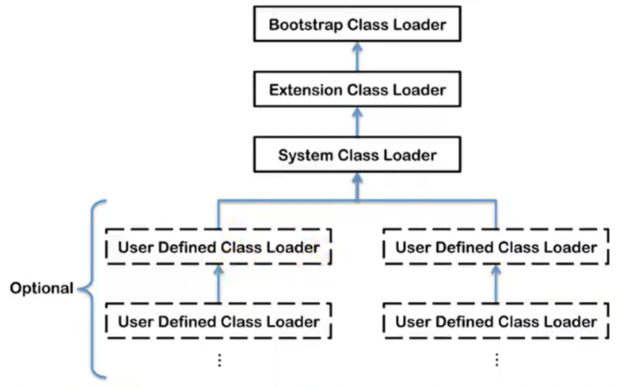

## 类加载器子系统

如果自己手写一个JVM，主要考虑那些结构？

类加载器和执行引擎

## 类加载器与加载过程


### 类加载器的作用

- 加载 Class 文件（来源可以是文件系统或者网络），Class 文件开头有特定的文件标识
- 只负责加载，不负责执行（执行引擎负责执行）
- 加载的类信息放在方法区。
  - 方法区放：类信息，运行时常量池信息，字符串字面量和数字常量（这部分是 Class 文件中常量池部分的内存映射）

> 运行时常量池：常量池加载到内存里面就是 运行时常量池


### 加载过程


#### 加载

- 通过类的全限定名获取定义该类的二进制字节流
- 将字节流代表的静态存储结构转化为方法区的运行时数据结构
- 在内存中生成这个类对应的 Class 对象，作为方法区这个类的各种数据的访问入口


补充：加载 `.class` 文件的方式

- 本地系统加载
- 通过网络获取（Web Applet）
- 从 zip 压缩包中获取（jar，war 格式的基础）
- 运行时计算生成，比如动态代理技术
- 从其他文件生成，如 JSP 应用
- 从专有的数据库提取
- 从加密文件中提取（防止被反编译）

### 链接过程

**验证(Verify)**

- 确保class文件的字节流中包含信息符合当前虚拟机要求，保证被加载类的正确性，不会危害虚拟机自身安全
- 主要包括四种验证，文件格式验证，元数据验证，字节码验证，符号引用验证。

**准备(Prepare)** 

为类变量分配内存并且设置该类变量的默认初始值，即零值。

这里不包含用final修饰的static变量，因为final在编译的时候就会分配了，准备阶段会显式初始化;

这里不会为实例变量分配初始化，类变量会分配在方法区中，而实例变量是会随着对象一起分配到Java堆中。

**解析(Resolve) :**

将常量池内的符号引用转换为直接引用的过程。

事实上，解析操作往往会伴随着JVM在执行完初始化之后再执行。

符号引用就是一组符号来描述所引用的目标。符号引用的字面量形式明确定义在《java虚拟机规范》的class文件格式中。直接引用就是直接指向目标的指针、相对偏移量或一个间接定位到目标的句柄。

解析动作主要针对类或接口、字段、类方法、接口方法、方法类型等。对应常量池中的 CONSTANT class info、CONSTANT_Fieldref_info、CONSTANT_Methodref_info等。

### 初始化

- 就是执行类构造器方法 `<clinit>()` 的过程
- 此方法不需定义，是javac编译器自动收集类中的所有类变量的赋值动作和静态代码块中的语句合并而来
- 构造器方法中指令按语句在源文件中出现的顺序执行。
- `<clinit> ()`不同于类的构造器。(关联：构造器是虚拟机视角下的`<init>()` )
- 若该类具有父类，JVM会保证子类的`<clinit>()`执行前，父类的`<clinit>()`已经执行完毕。
- 虚拟机必须保证一个类的`<clinit> ()`方法在多线程下被同步加锁（一个类只能被加载一次）

> 类变量也称为静态变量，在类中以 static 关键字声明，但必须在方法之外


注意：如果没有类变量和静态代码块，就不会生成 `<clinit>()` 方法

验证的例子：

```java
// 没有静态变量和静态代码块
public class ClinitTest {

    private int a = 1;

    public static void main(String[] args) {
        int b = 2;
    }
}
```

Class 文件截图（使用 `jclasslib bytecode viewer` 软件查看）


如果加上一个静态变量

```java
private static int c = 2;
```

再次查看：


## 类加载器的分类




四者是包含关系，不是上层下层，也不是父子类的继承关系

### 分类

一共有两类：

- 引导类加载器（使用 C 语言编写的）
- 自定义类加载器（所有派生于抽象类 `ClassLoader` 的类加载器都是自定义的）

#### 例子

```java
public class ClassLoaderTest {

    public static void main(String[] args) {
        // 获取系统类加载器
        ClassLoader systemClassLoader = ClassLoader.getSystemClassLoader();
        System.out.println(systemClassLoader);// sun.misc.Launcher$AppClassLoader@18b4aac2

        // 获取其上层：拓展类加载器
        ClassLoader extClassLoader = systemClassLoader.getParent();
        System.out.println(extClassLoader);// sun.misc.Launcher$ExtClassLoader@1b6d3586

        // 试图获取上层：获取不到
        ClassLoader bootstrapClassLoader = extClassLoader.getParent();
        System.out.println(bootstrapClassLoader);// null

        // 用户自定义类：默认使用系统类加载器进行加载
        ClassLoader classLoader = ClassLoaderTest.class.getClassLoader();
        System.out.println(classLoader);// sun.misc.Launcher$AppClassLoader@18b4aac2

        // String 类：使用 引导类加载器 加载的  ---> Java 核心类库都是 引导类加载器 加载的
        ClassLoader stringClassLoader = String.class.getClassLoader();
        System.out.println(stringClassLoader);// null
    }
}
```


### 引导类加载器

-  C 语言实现，嵌套在JVM内部

- 用来加载Java的核心库（JAVA_HOME/jre/ lib/rt.jar、resources.jar或sun.boot.class.path路径下的内容），用于提供JVM自身需要的类
- 并不继承自`java.lang.ClassLoader`，没有父加载器。
- 加载扩展类和应用程序类加载器，并指定为他们的父类加载器。
- 出于安全考虑，Bootstrap启动类加载器只加载包名为java、javax、sun 开头的类

### 拓展类加载器

- Java语言编写，由`sun.misc.Launcher$ExtClassLoader` 实现（内部类）
- 派生于 ClassLoader 类
- 父加载器是引导类加载器
- 从java.ext.dirs系统属性所指定的目录中加载类库，或从JDK的安装目录的jre/lib/ext子目录（扩展目录）下加载类库。如果用户创建的JAR放在此目录下，也会自动由扩展类加载器加载。

### 应用程序类（系统类）加载器

- Java编写，由`sun.misc.Launcher$AppClassLoader`实现
- 派生于 ClassLoader 类
- 父加载器是拓展类加载器
- 加载环境变量 `classpath`或系统属性`java.class.path`指定路径下的类库
- 程序中默认的类加载器，一般来说，Java应用的类都是由它来完成加载
- 通过`ClassLoader#getSystemClassLoader()`方法可以获取到该类加载器

### 用户自定义类加载器

一般来说上面三个够用了

#### 什么时候自己定义呢？

- 隔离加载类
- 修改类加载的方式
- 拓展加载源
- 防止源码泄露

#### 实现步骤

1、可以继承抽象类java.lang.classLoader，实现自己的类加载器

2、在JDK1.2之前，在自定义类加载器时，总会去继承classLoader类并重写loadClass ()方法，从而实现自定义的类加载类，但是在JDK1.2之后已不再建议用户去覆盖loadclass ()方法，而是建议把自定义的类加载逻辑写在findclass ()方法中

3、在编写自定义类加载器时，如果没有太过于复杂的需求，可以直接继承URLClassLoader类，这样就可以避免自己去编写findclass ()方法及其获取字节码流的方式，使自定义类加载器编写更加简洁。

### ClassLoader抽象类


### 获取加载器的方式


## 双亲委派机制（面试常问）

class 字节码文件是按需加载的

### 工作原理

（1）如果一个类加载器收到了类加载请求，它并不会自己先去加载，而是把这个请求委托给父类的加载器去执行;

（2）如果父类加载器还存在其父类加载器，则进一步向上委托，依次递归，请求最终将到达顶层的启动类加载器;

（3）如果父类加载器可以完成类加载任务，就成功返回，倘若父类加载器无法完成此加载任务，子加载器才会尝试自己去加载，这就是双亲委派模式。


### 优势

- 避免类的重复加载
- 保护程序安全，防止核心 API 被篡改
  - 比如你自己定义一个 `java.lang.String`

### 沙箱安全机制

自定义string类，但是在加载自定义string类的时候会率先使用引导类加载器加载，而引导类加载器在加载的过程中会先加载jdk自带的文件(rt.jar包中`java\lang \String.class`)，报错信息说没有main方法就是因为加载的是rt.jar包中的string类。这样可以保证对java核心源代码的保护，这就是沙箱安全机制。

## 补充内容

### 两个class对象是否为同一个类

在JVM中表示两个class对象是否为同一个类存在两个必要条件:

- 类的完整类名必须一致，包括包名。
- 加载这个类的classLoader(指classLoader实例对象)必须相同。

换句话说，在JVM中，即使这两个类对象(class对象)来源同一个class文件，被同一个虚拟机所加载，但只要加载它们的classLoader实例对象不同，那么这两个类对象也是不相等的。


### 对类加载器的引用

JVM必须知道一个类型是由启动加载器加载的还是由用户类加载器加载的。

如果一个类型是由用户类加载器加载的，那么JVM会将这个类加载器的一个引用作为类型信息的一部分保存在方法区中。当解沂一个类型到另一个类型的引用的时候，JVM需要保证这两个类型的类加载器是相同的。


### 类的主动和被动使用

主动使用，又分为七种情况:

（1）创建类的实例

（2）访问某个类或接口的静态变量，或者对该静态变量赋值

（3）调用类的静态方法

（4）反射（比如:Class.forName ( "com.atguigu . Test" ) )

（5）初始化一个类的子类

（6）Java虚拟机启动时被标明为启动类的类

（7）JDK 7 开始提供的动态语言支持

- java . lang. invoke.MethodHandle实例的解析结果
- REF_getstatic、REF_putstatic、REF_invokestatic句柄对应的类没有初始化，则初始化


除了以上七种情况，其他使用Java类的方式都被看作是对类的被动使用，都**不会**导致类的初始化。


