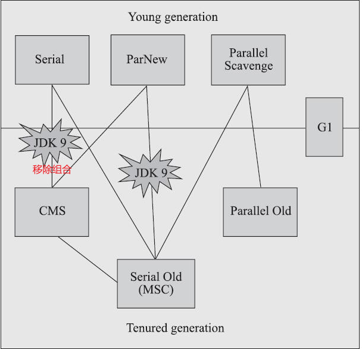
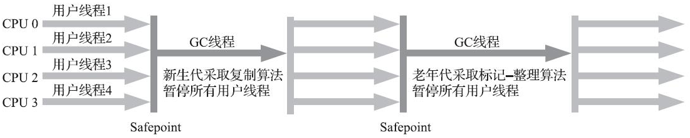
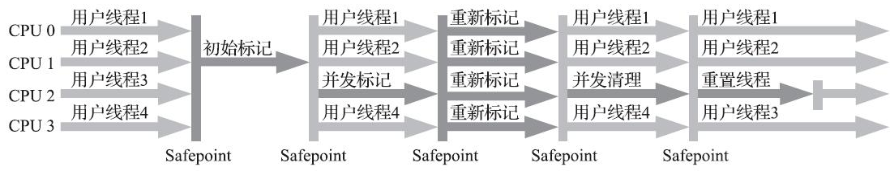
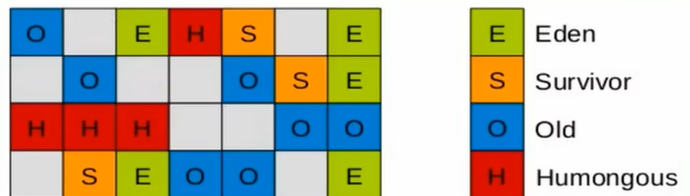
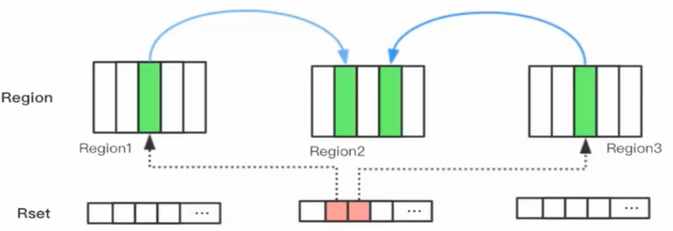
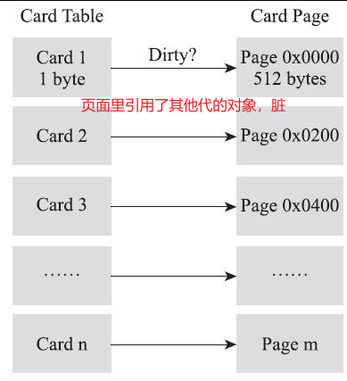

# 经典垃圾收集器



## Serial收集器

- 新生代收集器
- 一个单线程工作的收集器
- “Stop The World”：它进行垃圾收集时，必须暂停其他所有工作线程，直到它收集结束
- HotSpot虚拟机运行客户端模式下的默认新生代收集器
- 复制算法，串行回收，“Stop The World”
- 简单而高效
	- 对于内存资源受限的环境，它是所有收集器里额外内存消耗最小的
	- 对于单核处理器或处理器核心数较少的环境来说，Serial收集器由于没有线程交互的开销，专心做垃圾收集自然可以获得最高的单线程收集效率




> Serial/Serial Old收集器运行示意图


## Serial Old收集器

- 老年代收集器
- 单线程，标记-整理算法，“Stop The World”
- 供客户端模式下的HotSpot虚拟机使用

> 如果在服务端模式下，它也可能有两种用途：
>
> （1）在JDK 5以及之前的版本中与Parallel Scavenge收集器搭配使用
>
> （2）作为CMS收集器发生失败时的后备预案，在并发收集发生Concurrent Mode Failure时使用

## ParNew收集器

- 新生代收集器，标记-复制算法，Stop The World，Serial 收集器的多线程并行版本
- 新生代并行，老年代串行。新生代回收次数频繁，并行更高效；老年代不频繁，串行节省切换线程的资源
- 默认开启的收集线程数与处理器核心数量相同
- 不少运行在服务端模式下的HotSpot虚拟机，尤其是JDK 7之前默认的新生代收集器：除了Serial收集器外，目前只有它能与CMS收集器配合工作
- 激活 CMS 后（使用 `-XX:+UseConcMarkSweepGC` 选项）的默认新生代收集器
- 自JDK 9开始，ParNew加CMS收集器的组合就不再是官方推荐的服务端模式下的收集器解决方案了


> ParNew/Serial Old收集器运行示意图

> 在JDK 5中使用CMS来收集老年代的时候，新生代只能选择ParNew或者Serial收集器中的一个

【面试题】

由于ParNew收集器是基于并行回收，那么是否可以断定ParNew收集器的回收效率在任何场景下都会比serial收集器更高效?

- ParNew收集器运行在多CPU的环境下，由于可以充分利用多CPU、多核心等物理硬件资源优势，可以更快速地完成垃圾收集，提升程序的吞吐量。

- 但是在单个CPu的环境下，ParNew收集器不比serial收集器更高效。虽然serial收集器是基于串行回收，但是由于CPU不需要频繁地做任务切换，因此可以有效避免多线程交互过程中产生的一些额外开销

```tex
`-XX:ParallelGCThreads` 限制垃圾收集的线程数
`-XX:+/-UseParNewGC` 强制指定或者禁用ParNew
```


## Parallel Scavenge收集器

- 新生代收集器，“吞吐量优先收集器”
- 基于标记-复制算法，能够并行收集的多线程收集器
- 收集器的目标则是达到一个可控制的吞吐量
- 本身有自适应的策略：虚拟机会根据当前系统的运行情况收集性能监控信息，动态调整这些参数以提供最合适的停顿时间或者最大的吞吐量（`-XX:+UseAdaptiveSizePolicy`）

$$
吞吐量=\frac{运行用户代码的时间}{处理器总消耗时间}=\frac{运行用户代码的时间}{运行用户代码时间+运行垃圾收集时间}
$$


## Parallel Old收集器

- 老年代收集器（Parallel Scavenge收集器的老年代版本）
- 支持多线程并发收集，基于标记-整理算法实现，“Stop The World”
- 在注重吞吐量或者处理器资源较为稀缺的场合，都可以优先考虑 Parallel Scavenge 加 Parallel Old 收集器这个组合（JDK 8 的默认选择）


> Parallel Scavenge/Parallel Old收集器运行示意图

```bash
-XX+UseParallelGC  # 手动指定年轻代使用 Parallel 并行收集器
-XX+UseParallelOldGC  # 手动指定老年代使用 Parallel 并行收集器。两个是相互的，开启一个，默认开启另外一个
-XX:ParallelGCThreads  # 指定垃圾收集的线程数
```


## CMS（Concurrent Mark Sweep）收集器

> 标记三次再清除

- 以获取最短回收停顿时间为目标的收集器
- 标记-清除算法、并发收集、低延迟（低停顿），也会“Stop The World”
- 适用场景：希望系统停顿时间尽可能短，以给用户带来良好的交互体验



> Concurrent Mark Sweep收集器运行示意图

### 收集过程

1）初始标记

2）并发标记

3）重新标记

4）并发清除

> 初始标记、重新标记这两个步骤仍然需要“Stop The World”
>
> 初始标记仅标记一下GC Roots能**直接关联**到的对象，速度很快
>
> 并发标记阶段就是从GC Roots的直接关联对象开始遍历整个对象图的过程，这个过程耗时较长但是不需要停顿用户线程，可以与垃圾收集线程一起并发运行
>
> 重新标记阶段则是为了**修正**并发标记期间，因用户程序继续运作而导致**标记产生变动**的那一部分对象的标记记录，这个阶段的停顿时间通常会比初始标记阶段稍长一些，但也远比并发标记阶段的时间短
>
> 并发清除阶段，清理删除掉标记阶段判断的已经死亡的对象，由于不需要移动存活对象，所以这个阶段也是可以与用户线程同时并发的。

### 特点和弊端

#### 特点

- 整体回收是低延迟的。
	- 耗时最长的并发标记和并发清除阶段中，垃圾收集器线程都可以与用户线程一起工作
	- 初始标记、重新标记这两个步骤虽然需要“Stop The World”，但是速度很快
- CMS默认启动的回收线程数是（处理器核心数量+3）/4，也就是说，如果处理器核心数在四个或以上，并发回收时垃圾收集线程只占用不超过25%的处理器运算资源，并且会随着处理器核心数量的增加而下降。但是当处理器核心数量不足四个时，CMS对用户程序的影响就可能变得很大。如果应用本来的处理器负载就很高，还要分出一半的运算能力去执行收集器线程，就可能导致用户程序的执行速度忽然大幅降低。

#### 弊端

- CMS **回收的时候需要保证应用线程有足够的内存可用**
	- 因为垃圾回收的时候用户线程没有中断，如果内存满了再收集，垃圾收集的时候用户线程还在申请内存，就会OOM。这个时候会启动应急方案：临时使用 Serial Old收集器重新进行一次垃圾收集
	- 当堆内存使用率达到一定的阈值，就可以回收了
		- JDK 5 及之前，68%
		- JDK 6 开始，92%
- 基于“标记-清除”算法，会**产生内存碎片**
	- 碎片过多时，将会给大对象分配带来很大麻烦。
	- 会出现老年代还有很多剩余空间，但就是无法找到足够大的连续空间来分配当前对象，而不得不提前触发一次Full GC的情况
- **无法处理“浮动垃圾”**
	- 在CMS的并发标记和并发清理阶段，用户线程是还在继续运行的，程序在运行自然就还会伴随有新的垃圾对象不断产生。这部分垃圾对象是出现在标记过程结束以后，CMS无法在当次收集中处理掉它们，只好留待下一次垃圾收集时再清理掉。这一部分垃圾就称为“浮动垃圾
- **对 CPU 资源非常敏感**。在并发阶段，它虽然不会导致用户停顿，但是会因为占用了一部分线程而导致应用程序变慢，总吞吐量会降低。


【面试题】既然Mark Sweep会造成内存碎片,那么为什么不把算法换成Mark Compact呢?

- 因为当并发清除的时候，用compact整理内存的话，原来的用户线程使用对象地址会变化，显然是不合理的。Mark compact更适合“stop the World”这种场景下使用

## Garbage First（G1）收集器

- 全功能收集器，基于分区算法，优先回收那些回收收益最大的区域
- 开创了收集器面向局部收集的设计思路和基于Region的内存布局形式
- 主要面向服务端应用，JDK 9 默认收集器（`-XX:+UseG1GC`）
- 可以面向堆内存任何部分来组成回收集进行回收，衡量标准不再是它属于哪个分代，而是哪块内存中存放的垃圾数量最多，回收收益最大，这就是G1收集器的**Mixed GC**模式
- Region是单次回收的最小单元，即每次收集到的内存空间都是Region大小的整数倍，可以有计划地避免在整个Java堆中进行全区域的垃圾收集


> JDK 9发布之日，G1宣告取代Parallel Scavenge加Parallel Old组合，成为服务端模式下的默认垃圾收集器
>
> 把连续的Java堆划分为多个大小相等的独立区域（Region），每一个Region都可以根据需要，扮演新生代的Eden空间、Survivor空间，或者老年代空间。收集器能够对扮演不同角色的Region采用不同的策略去处理，这样无论是新创建的对象还是已经存活了一段时间、熬过多次收集的旧对象都能获取很好的收集效果。
>
> Region中还有一类特殊的Humongous区域，专门用来存储大对象。G1认为只要大小超过了一个Region容量一半的对象即可判定为大对象。对于那些**超过了整个Region容量的超级大对象，将会被存放在N个连续的Humongous Region之中**，G1的大多数行为都把Humongous Region作为老年代的一部分来进行看待
>
> 让G1收集器去**跟踪**各个**Region**里面的垃圾堆积的**“价值”**大小，价值即回收所获得的空间大小以及回收所需时间的经验值，然后在后台**维护**一个**优先级列表**，每次根据用户设定允许的收集停顿时间（使用参数`-XX:MaxGCPauseMillis`指定，默认值是200毫秒），优先处理回收价值收益最大的那些Region，这也就是“Garbage First”名字的由来。这种使用Region划分内存空间，以及具有优先级的区域回收方式，保证了G1收集器在有限的时间内获取尽可能高的收集效率。

【面试题】为什么还会出现G1？

- 业务原来越复杂，用户越来越多
- 为了适应不断扩大的内存和CPU中处理器的数量

### 回收步骤

#### JVM书本上的步骤

- **初始标记**：仅仅只是标记一下GC Roots能直接关联到的对象，并且修改TAMS（Top at Mark Start）指针的值，让下一阶段用户线程并发运行时，能正确地在可用的Region中分配新对象。这个阶段需要停顿线程，但耗时很短，而且是借用进行Minor GC的时候同步完成的，所以G1收集器在这个阶段实际并没有额外的停顿。
- **并发标记**：从GC Root开始对堆中对象进行可达性分析，递归扫描整个堆里的对象图，找出要回收的对象，这阶段耗时较长，但可与用户程序并发执行。当对象图扫描完成以后，还要重新处理SATB记录下的在并发时有引用变动的对象。
- **最终标记**：对用户线程做另一个短暂的暂停，用于处理并发阶段结束后仍遗留下来的最后那少量的SATB记录。
- **筛选回收**：负责更新Region的统计数据，对各个Region的回收价值和成本进行排序，根据用户所期望的停顿时间来制定回收计划，可以自由选择任意多个Region构成回收集，然后把决定回收的那一部分Region的存活对象复制到空的Region中，再清理掉整个旧Region的全部空间。这里的操作涉及存活对象的移动，是必须暂停用户线程，由多条收集器线程并行完成的。

#### 尚硅谷讲解

应用程序分配内存，**当年轻代的Eden区用尽时开始年轻代回收过程**

- G1的年轻代收集阶段是一个**并行**的**独占式**收集器。
- 在年轻代回收期，G1 GC**暂停所有应用程序线程**，启动多线程执行年轻代回收。然后从年轻代区间移动存活对象到Survivor区间或者老年区间，也有可能是两个区间都会涉及。

当堆内存使用达到一定值（默认45%)时，开始老年代并发标记过程。

标记完成马上开始混合回收过程。对于一个混合回收期，G1 GC从老年区间移动存活对象到空闲区间，这些空闲区间也就成为了老年代的一部分。和年轻代不同，老年代的G1回收器和其他GC不同，**G1的老年代回收器不需要整个老年代被回收，一次只需要扫描/回收一小部分老年代的Region就可以了**。同时，这个老年代Region是和年轻代一起被回收的。

### 特点

- 并行与并发

	- 并行性：G1在回收期间，可以用多个GC线程同时工作。此时用户线程STW
	- 并发：G1和应用程序可以交替执行，部分工作可以同时执行

- 分代收集

	- 虽然属于分代型垃圾收集器，但是不要求新生代和老年代的内存区域是连续的

	- 分区思想，存放逻辑上的新生代和老年代。每个区要么只放新生代，要么只放老年代

- 空间整合

	- 避免内存碎片。从整体来看是基于“标记-整理”算法实现的收集器，但从局部（两个Region之间）上看又是基于“标记-复制”算法实现。

- 可预测的时间延迟。
	- 跟踪每个区域垃圾回收的价值，配合优先级队列，收集效率高
	- 可以只回收部分区域，可以很好地控制全局停顿

### 缺点

- 不具备全方位，压倒性的优势
- 内存占用大，小内存场景不如 CMS（小于6~8GB用CMS）

### 适用场景

- 服务端应用，大内存，多核处理器
- CMS 升级选择
- 延迟要求低的场景

### 分区region




- 把堆划分成2048块，一块在1~32MB之间（可以设置块大小）
- 一个区在同一时刻只能有一个角色。被回收后，再次被分配可以有其他角色
- 一个对象超过1.5个分区，就放到H区。大对象占用多个连续的区


【面试题】为什么有H区的存在？

堆中的大对象，默认直接分配到老年代，但是如果这个对象存活时间很短，就会对垃圾收集造成负面影响。为了解决这个问题，引入H区。如果一个对象超过了一个H区，就会寻找连续的H区。这个时候可能会启动 Full GC。G1的大多数行为都把Humongous Region作为老年代的一部分来进行看待

### 记忆集

一种用于记录从非收集区域指向收集区域的指针集合的抽象数据结构，解决跨代引用问题。

一个Region不可能是孤立的，一个Region中的对象可能被其他任意Region中对象引用,判断对象存活时，是否需要扫描整个Java堆才能保证准确?

在其他的分代收集器，也存在这样的问题（而G1更突出)

回收新生代也不得不同时扫描老年代?

样的话会降低Minor Gc的效率;

> 在垃圾收集的场景中，收集器只需要通过记忆集**判断出某一块非收集区域是否存在有指向了收集区域的指针**就可以了

<br/>

解决方法：

- 无论61还是其他分代收集器，JVM都是使用Remembered Set来避免全局扫描
- 每个Region都有一个对应的Remembered set
- 每次Reference类型数据写操作时，都会产生一个write Barrier暂时中断操作；然后检查将要写入的引用指向的对象是否和该Reference类型数据在不同的Region(其他收集器：检查老年代对象是否引用了新生代对象）
- 如果不同，通过CardTable把相关引用信息记录到引用指向对象的所在Region对应的Remembered set中
- 当进行垃圾收集时，在GC根节点的枚举范围加入Remembered Set；就可以保证不进行全局扫描，也不会有遗漏




记忆集的实现方式是卡表，具体如下：




### 垃圾回收详细过程

#### 年轻代GC

JVM启动时，G1先准备好Eden区，程序在运行过程中不断创建对象到Eden区，当Eden空间耗尽时，G1会启动一次年轻代垃圾回收过程。

年轻代垃圾回收只会回收Eden区和survivor区。

YGC时，首先G1停止应用程序的执行(Stop-The-world） ，G1创建回收集（collection set)，回收集是指需要被回收的内存分段的集合，年轻代回收过程的回收集包含年轻代Eden区和survivor区所有的内存分段。

然后开始如下回收过程：

第一阶段，扫描根。根是指static变量指向的对象，正在执行的方法调用链条上的局部变量等。根引用连同RSet记录的外部引用作为扫描存活对象的入口。

第二阶段，更新RSet。处理dirty card queue中的card，更新RSet。此阶段完成后，RSet可以准确的反映老年代对所在的内存分段中对象的引用。

第三阶段，处理RSet。识别被老年代对象指向的Eden中的对象，这些被指向的Eden中的对象被认为是存活的对象。

第四阶段，复制对象。此阶段，对象树被遍历，Eden区内存段中存活的对象会被复制到survivor区中空的内存分段survivor区内存段中存活的对象如果年龄未达阈值，年龄会加1，达到阀值会被会被复制到old区中空的内存分段。如果Survivor空间不够，Eden空间的部分数据会直接晋升到老年代空间。

第五阶段,处理引用。处理Soft，Weak，Phantom，Final，JNI weak 等引用。最终Eden空间的数据为空，GC停止工作，而目标内存中的对象都是连续存储的，没有碎片，所以复制过程可以达到内存整理的效果，减少碎片。

#### 并发标记过程

**初始标记阶段**：标记从根节点直接可达的对象。这个阶段是STW的，并且会触发一次年轻代Gc。

**根区域扫描**（(Root Region Scanning) ：G1 GC扫描survivor区直接可达的老年代区域对象，并标记被引用的对象。这一过程必须在young GC之前完成。

**并发标记**(Concurrent Marking)：在整个堆中进行并发标记(和应用程序并发执行)，此过程可能被young GC中断。在并发标记阶段，**若发现区域对象中的所有对象都是垃圾，那这个区域会被立即回收**。同时，并发标记过程中，会计算每个区域的对象活性(区域中存活对象的比例)。

**再次标记**(Remark)：由于应用程序持续进行，需要修正上一次的标记结果。是STW的。G1中采用了比CMS更快的初始快照算法:snapshot-at-the-beginning (SATB)。

**独占清理**(cleanup)：计算各个区域的存活对象和GC回收比例，并进行排序，识别可以混合回收的区域。为下阶段做铺垫。是STW的。这个阶段并不会实际上去做垃圾的收集

**并发清理**阶段：识别并清理完全空闲的区域。

#### 混合回收阶段

当越来越多的对象晋升到老年代oldregion时，为了避免堆内存被耗尽，虚拟机会触发一个混合的垃圾收集器,即Mixed GC，该算法并不是一个old GC，除了**回收整个Young Region,还会回收一部分的old Region**。

这里需要注意：是一部分老年代，而不是全部老年代。可以选择哪些oldRegion进行收集，从而可以对垃圾回收的耗时时间进行控制。也要注意的是Mixed GC并不是Full GC。

>  如果上述方式不能正常工作，会使用单线程的内存回收算法进行Full GC（兜底策略）

