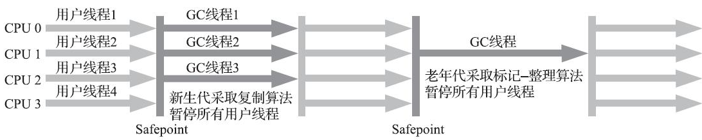
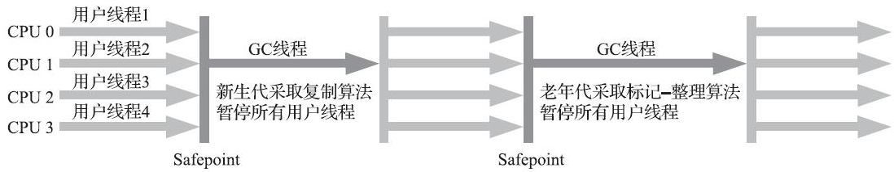
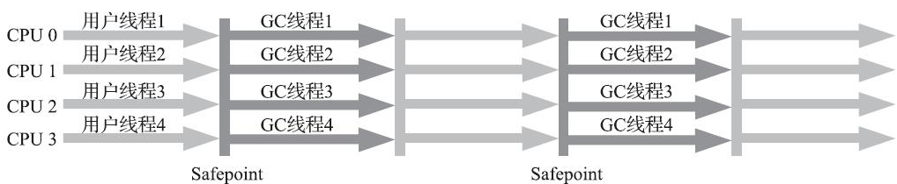
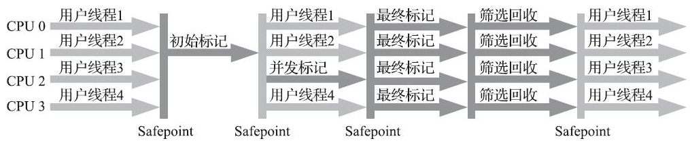

## Serial收集器

- 新生代收集器
- 一个单线程工作的收集器
- 它进行垃圾收集时，必须暂停其他所有工作线程，直到它收集结束
- HotSpot虚拟机运行在客户端模式下的默认新生代收集器
- 简单而高效
- 对于内存资源受限的环境，它是所有收集器里额外内存消耗最小的
- 对于单核处理器或处理器核心数较少的环境来说，Serial收集器由于没有线程交互的开销，专心做垃圾收集自然可以获得最高的单线程收集效率

## ParNew收集器

- 新生代收集器
- Serial收集器的多线程并行版本
- 默认开启的收集线程数与处理器核心数量相同
- 不少运行在服务端模式下的HotSpot虚拟机，尤其是JDK 7之前的遗留系统中首选的新生代收集器
- 除了Serial收集器外，目前只有它能与CMS收集器配合工作

> 在JDK 5中使用CMS来收集老年代的时候，新生代只能选择ParNew或者Serial收集器中的一个

## Parallel Scavenge收集器

- 新生代收集器
- 基于标记-复制算法，能够并行收集的多线程收集器
- 收集器的目标则是达到一个可控制的吞吐量

$$
吞吐量=\frac{运行用户代码的时间}{处理器总消耗时间}=\frac{运行用户代码的时间}{运行用户代码时间+运行垃圾收集时间}
$$

## Serial Old收集器

- 老年代收集器
- 单线程，标记-整理算法
- 供客户端模式下的HotSpot虚拟机使用

> 如果在服务端模式下，它也可能有两种用途：
>
> （1）在JDK 5以及之前的版本中与Parallel Scavenge收集器搭配使用
>
> （2）作为CMS收集器发生失败时的后备预案，在并发收集发生Concurrent Mode Failure时使用

## Parallel Old收集器

- 老年代收集器
- 支持多线程并发收集，基于标记-整理算法实现

> 在注重吞吐量或者处理器资源较为稀缺的场合，都可以优先考虑Parallel Scavenge加Parallel Old收集器这个组合

## CMS（Concurrent Mark Sweep）收集器

- 一种以获取最短回收停顿时间为目标的收集器
- 适用场景：希望系统停顿时间尽可能短，以给用户带来良好的交互体验
- 标记-清除算法
- 并发收集、低停顿

### 收集过程

1）初始标记

2）并发标记

3）重新标记

4）并发清除

> 初始标记仅仅只是标记一下GC Roots能直接关联到的对象，速度很快
>
> 并发标记阶段就是从GC Roots的直接关联对象开始遍历整个对象图的过程，这个过程耗时较长但是不需要停顿用户线程，可以与垃圾收集线程一起并发运行
>
> 重新标记阶段则是为了修正并发标记期间，因用户程序继续运作而导致标记产生变动的那一部分对象的标记记录，这个阶段的停顿时间通常会比初始标记阶段稍长一些，但也远比并发标记阶段的时间短
>
> 并发清除阶段，清理删除掉标记阶段判断的已经死亡的对象，由于不需要移动存活对象，所以这个阶段也是可以与用户线程同时并发的。

## G1收集器

- 开创了收集器面向局部收集的设计思路和基于Region的内存布局形式
- 主要面向服务端应用
- 可以面向堆内存任何部分来组成回收集进行回收，衡量标准不再是它属于哪个分代，而是哪块内存中存放的垃圾数量最多，回收收益最大，这就是G1收集器的Mixed GC模式

> JDK 9发布之日，G1宣告取代Parallel Scavenge加Parallel Old组合，成为服务端模式下的默认垃圾收集器
>
> G1不再坚持固定大小以及固定数量的分代区域划分，而是把连续的Java堆划分为多个大小相等的独立区域（Region），每一个Region都可以根据需要，扮演新生代的Eden空间、Survivor空间，或者老年代空间。收集器能够对扮演不同角色的Region采用不同的策略去处理，这样无论是新创建的对象还是已经存活了一段时间、熬过多次收集的旧对象都能获取很好的收集效果。
>
> Region中还有一类特殊的Humongous区域，专门用来存储大对象。G1认为只要大小超过了一个Region容量一半的对象即可判定为大对象。对于那些超过了整个Region容量的超级大对象，将会被存放在N个连续的Humongous Region之中，G1的大多数行为都把Humongous Region作为老年代的一部分来进行看待

### 回收步骤

- 初始标记：仅仅只是标记一下GC Roots能直接关联到的对象，并且修改TAMS指针的值，让下一阶段用户线程并发运行时，能正确地在可用的Region中分配新对象。这个阶段需要停顿线程，但耗时很短，而且是借用进行Minor GC的时候同步完成的，所以G1收集器在这个阶段实际并没有额外的停顿。
- 并发标记：从GC Root开始对堆中对象进行可达性分析，递归扫描整个堆里的对象图，找出要回收的对象，这阶段耗时较长，但可与用户程序并发执行。当对象图扫描完成以后，还要重新处理SATB记录下的在并发时有引用变动的对象。
- 最终标记：对用户线程做另一个短暂的暂停，用于处理并发阶段结束后仍遗留下来的最后那少量的SATB记录。
- 筛选回收：负责更新Region的统计数据，对各个Region的回收价值和成本进行排序，根据用户所期望的停顿时间来制定回收计划，可以自由选择任意多个Region构成回收集，然后把决定回收的那一部分Region的存活对象复制到空的Region中，再清理掉整个旧Region的全部空间。这里的操作涉及存活对象的移动，是必须暂停用户线程，由多条收集器线程并行完成的。

