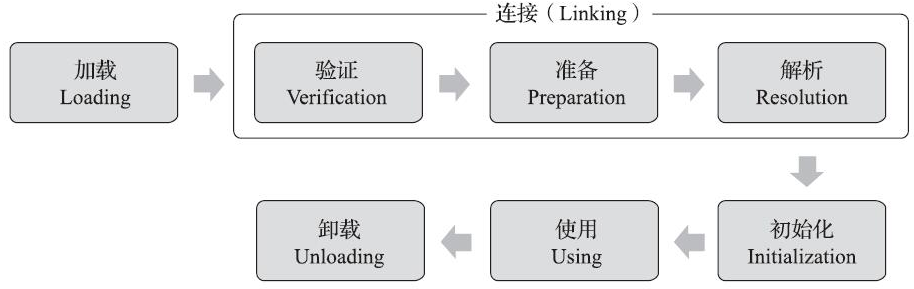

## 类生命周期

加载、验证、准备、初始化和卸载这五个阶段的顺序是确定的，类型的加载过程必须按照这种顺序按部就班地**开始**

解析阶段则不一定：它在某些情况下可以在初始化阶段之后再开始，这是为了支持Java语言的运行时绑定特性

## 必须立即对类初始化的情况

- 遇到new、getstatic、putstatic或invokestatic这四条字节码指令时，如果类型没有进行过初始化，则需要先触发其初始化阶段
  - 使用new关键字实例化对象的时候
  - 读取或设置一个类型的静态字段（被final修饰、已在编译期把结果放入常量池的静态字段除外）的时候
  - 调用一个类型的静态方法的时候
- 使用java.lang.reflect包的方法对类型进行反射调用的时候，如果类型没有进行过初始化，则需要先触发其初始化
- 当初始化类的时候，如果发现其父类还没有进行过初始化，则需要先触发其父类的初始化
- 当虚拟机启动时，用户需要指定一个要执行的主类（包含main()方法的那个类），虚拟机会先初始化这个主类
- 当使用JDK 7新加入的动态语言支持时，如果一个java.lang.invoke.MethodHandle实例最后的解析结果为REF_getStatic、REF_putStatic、REF_invokeStatic、REF_newInvokeSpecial四种类型的方法句柄，并且这个方法句柄对应的类没有进行过初始化，则需要先触发其初始化
- 当一个接口中定义了JDK 8新加入的默认方法（被default关键字修饰的接口方法）时，如果有这个接口的实现类发生了初始化，那该接口要在其之前被初始化

这六种场景中的行为称为对一个类型进行主动引用

除此之外，所有引用类型的方式都不会触发初始化，称为被动引用

对于静态字段，只有直接定义这个字段的类才会被初始化，因此通过其子类来引用父类中定义的静态字段，只会触发父类的初始化而不会触发子类的初始化

接口与类真正有所区别的是前面讲述的六种“有且仅有”需要触发初始化场景中的第三种：当一个类在初始化时，要求其父类全部都已经初始化过了，但是一个接口在初始化时，并不要求其父接口全部都完成了初始化，只有在真正使用到父接口的时候（如引用接口中定义的常量）才会初始化。

## 类的主动和被动使用

主动使用，又分为七种情况:

（1）创建类的实例

（2）访问某个类或接口的静态变量，或者对该静态变量赋值

（3）调用类的静态方法

（4）反射（比如:Class.forName ( "com.atguigu . Test" ) )

（5）初始化一个类的子类

（6）Java虚拟机启动时被标明为启动类的类

（7）JDK 7 开始提供的动态语言支持

- java . lang. invoke.MethodHandle实例的解析结果
- REF_getstatic、REF_putstatic、REF_invokestatic句柄对应的类没有初始化，则初始化

除了以上七种情况，其他使用Java类的方式都被看作是对类的被动使用，都**不会**导致类的初始化。

