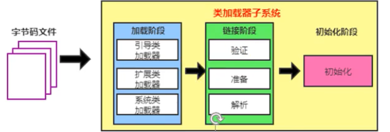
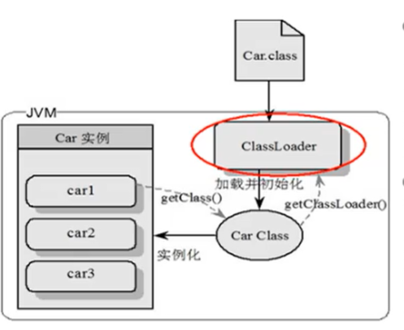

## 类加载器子系统

如果自己手写一个JVM，主要考虑那些结构？

类加载器和执行引擎

## 类加载器与加载过程





### 类加载器的作用

- 加载 Class 文件（来源可以是文件系统或者网络），Class 文件开头有特定的文件标识
- 只负责加载，不负责执行（执行引擎负责执行）
- 加载的类信息放在方法区。
  - 方法区放：类信息，运行时常量池信息，字符串字面量和数字常量（这部分是 Class 文件中常量池部分的内存映射）

> 运行时常量池：常量池加载到内存里面就是 运行时常量池



### 加载过程


#### 加载

- 通过类的全限定名获取定义该类的二进制字节流
- 将字节流代表的静态存储结构转化为方法区的运行时数据结构
- 在内存中生成这个类对应的 Class 对象，作为方法区这个类的各种数据的访问入口


加载阶段结束后，Java虚拟机外部的二进制字节流就按照虚拟机所设定的格式存储在方法区之中了

类型数据妥善安置在方法区之后，会在Java堆内存中实例化一个java.lang.Class类的对象，这个对象将作为程序访问方法区中的类型数据的外部接口


补充：加载 `.class` 文件的方式

- 本地系统加载
- 通过网络获取（Web Applet）
- 从 zip 压缩包中获取（jar，war 格式的基础）
- 运行时计算生成，比如动态代理技术
- 从其他文件生成，如 JSP 应用
- 从专有的数据库提取
- 从加密文件中提取（防止被反编译）


> 加载阶段既可以使用Java虚拟机里内置的引导类加载器来完成，也可以由用户自定义的类加载器去完成，开发人员通过定义自己的类加载器去控制字节流的获取方式（重写一个类加载器的findClass()或loadClass()方法），实现根据自己的想法来赋予应用程序获取运行代码的动态性

数组类本身不通过类加载器创建，它是由Java虚拟机直接在内存中动态构造出来的

数组类的元素类型（Element Type，指的是数组去掉所有维度的类型）最终还是要靠类加载器来完成加载

### 链接过程

#### 验证(Verify)

- 确保class文件的字节流中包含信息符合当前虚拟机要求，保证被加载类的正确性，不会危害虚拟机自身安全
- 主要包括四种验证，文件格式验证，元数据验证，字节码验证，符号引用验证

第一阶段要验证字节流是否符合Class文件格式的规范，并且能被当前版本的虚拟机处理

第二阶段是对字节码描述的信息进行语义分析，以保证其描述的信息符合《Java语言规范》的要求

第三阶段是整个验证过程中最复杂的一个阶段，主要目的是通过数据流分析和控制流分析，确定程序语义是合法的、符合逻辑的

> 如果一个类型中有方法体的字节码没有通过字节码验证，那它肯定是有问题的；但如果一个方法体通过了字节码验证，也仍然不能保证它一定就是安全的。

最后一个阶段的校验行为发生在虚拟机将符号引用转化为直接引用的时候，这个转化动作将在连接的第三阶段——解析阶段中发生

> 验证阶段对于虚拟机的类加载机制来说，是一个非常重要的、但却不是必须要执行的阶段，因为验证阶段只有通过或者不通过的差别，只要通过了验证，其后就对程序运行期没有任何影响了。如果程序运行的全部代码（包括自己编写的、第三方包中的、从外部加载的、动态生成的等所有代码）都已经被反复使用和验证过，在生产环境的实施阶段就可以考虑使用-Xverify：none参数来关闭大部分的类验证措施，以缩短虚拟机类加载的时间。

#### 准备(Prepare) 

为类变量（即静态变量，被static修饰的变量）分配内存并且设置该类变量的默认初始值，即零值。

这里不包含用final修饰的static变量，因为final在编译的时候就会分配了，准备阶段会显式初始化;

这里不会为实例变量分配初始化，类变量会分配在方法区中，而实例变量是会随着对象一起分配到Java堆中。

#### 解析(Resolve) 

将常量池内的符号引用转换为直接引用的过程。

事实上，解析操作往往会伴随着JVM在执行完初始化之后再执行。

符号引用就是一组符号来描述所引用的目标。符号引用的字面量形式明确定义在《java虚拟机规范》的class文件格式中。直接引用就是直接指向目标的指针、相对偏移量或一个间接定位到目标的句柄。

解析动作主要针对类或接口、字段、类方法、接口方法、方法类型等。对应常量池中的 CONSTANT class info、CONSTANT_Fieldref_info、CONSTANT_Methodref_info等。

### 初始化

- 就是执行类构造器方法 `<clinit>()` 的过程
- 此方法不需定义，是javac编译器自动收集类中的所有类变量的赋值动作和静态代码块中的语句合并而来
- 构造器方法中指令按语句在源文件中出现的顺序执行。
- `<clinit> ()`不同于类的构造器。(关联：构造器是虚拟机视角下的`<init>()` )
- 若该类具有父类，JVM会保证子类的`<clinit>()`执行前，父类的`<clinit>()`已经执行完毕。
- 虚拟机必须保证一个类的`<clinit> ()`方法在多线程下被同步加锁（一个类只能被加载一次）

> 类变量也称为静态变量，在类中以 static 关键字声明，但必须在方法之外


注意：如果没有类变量和静态代码块，就不会生成 `<clinit>()` 方法

验证的例子：

```java
// 没有静态变量和静态代码块
public class ClinitTest {

    private int a = 1;

    public static void main(String[] args) {
        int b = 2;
    }
}
```

Class 文件截图（使用 `jclasslib bytecode viewer` 软件查看）


如果加上一个静态变量

```java
private static int c = 2;
```

再次查看：


