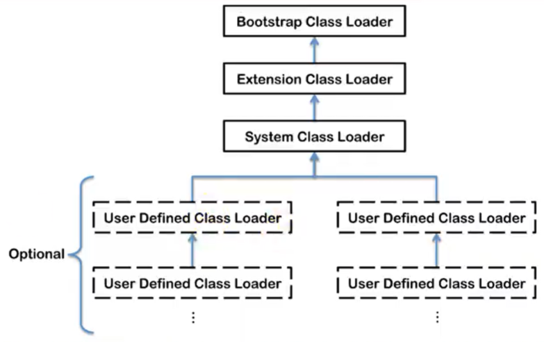

## 类加载器的分类




四者是包含关系，不是上层下层，也不是父子类的继承关系

### 分类

一共有两类：

- 引导类加载器（使用 C 语言编写的）
- 自定义类加载器（所有派生于抽象类 `ClassLoader` 的类加载器都是自定义的）

#### 例子

```java
public class ClassLoaderTest {

    public static void main(String[] args) {
        // 获取系统类加载器
        ClassLoader systemClassLoader = ClassLoader.getSystemClassLoader();
        System.out.println(systemClassLoader);// sun.misc.Launcher$AppClassLoader@18b4aac2

        // 获取其上层：拓展类加载器
        ClassLoader extClassLoader = systemClassLoader.getParent();
        System.out.println(extClassLoader);// sun.misc.Launcher$ExtClassLoader@1b6d3586

        // 试图获取上层：获取不到
        ClassLoader bootstrapClassLoader = extClassLoader.getParent();
        System.out.println(bootstrapClassLoader);// null

        // 用户自定义类：默认使用系统类加载器进行加载
        ClassLoader classLoader = ClassLoaderTest.class.getClassLoader();
        System.out.println(classLoader);// sun.misc.Launcher$AppClassLoader@18b4aac2

        // String 类：使用 引导类加载器 加载的  ---> Java 核心类库都是 引导类加载器 加载的
        ClassLoader stringClassLoader = String.class.getClassLoader();
        System.out.println(stringClassLoader);// null
    }
}
```


### 引导类加载器

-  C 语言实现，嵌套在JVM内部

-  用来加载Java的核心库（JAVA_HOME/jre/ lib/rt.jar、resources.jar或sun.boot.class.path路径下的内容），用于提供JVM自身需要的类
-  并不继承自`java.lang.ClassLoader`，没有父加载器。
-  加载扩展类和应用程序类加载器，并指定为他们的父类加载器。
-  出于安全考虑，Bootstrap启动类加载器只加载包名为java、javax、sun 开头的类

### 拓展类加载器

- Java语言编写，由`sun.misc.Launcher$ExtClassLoader` 实现（内部类）
- 派生于 ClassLoader 类
- 父加载器是引导类加载器
- 从java.ext.dirs系统属性所指定的目录中加载类库，或从JDK的安装目录的jre/lib/ext子目录（扩展目录）下加载类库。如果用户创建的JAR放在此目录下，也会自动由扩展类加载器加载。

### 应用程序类（系统类）加载器

- Java编写，由`sun.misc.Launcher$AppClassLoader`实现
- 派生于 ClassLoader 类
- 父加载器是拓展类加载器
- 加载环境变量 `classpath`或系统属性`java.class.path`指定路径下的类库
- 程序中默认的类加载器，一般来说，Java应用的类都是由它来完成加载
- 通过`ClassLoader#getSystemClassLoader()`方法可以获取到该类加载器

### 用户自定义类加载器

一般来说上面三个够用了

#### 什么时候自己定义呢？

- 隔离加载类
- 修改类加载的方式
- 拓展加载源
- 防止源码泄露

#### 实现步骤

1、可以继承抽象类java.lang.classLoader，实现自己的类加载器

2、在JDK1.2之前，在自定义类加载器时，总会去继承classLoader类并重写loadClass ()方法，从而实现自定义的类加载类，但是在JDK1.2之后已不再建议用户去覆盖loadclass ()方法，而是建议把自定义的类加载逻辑写在findclass ()方法中

3、在编写自定义类加载器时，如果没有太过于复杂的需求，可以直接继承URLClassLoader类，这样就可以避免自己去编写findclass ()方法及其获取字节码流的方式，使自定义类加载器编写更加简洁。

### ClassLoader抽象类


### 获取加载器的方式


## 补充内容

### 两个class对象是否为同一个类

在JVM中表示两个class对象是否为同一个类存在两个必要条件:

- 类的完整类名必须一致，包括包名。
- 加载这个类的classLoader(指classLoader实例对象)必须相同。

换句话说，在JVM中，即使这两个类对象(class对象)来源同一个class文件，被同一个虚拟机所加载，但只要加载它们的classLoader实例对象不同，那么这两个类对象也是不相等的。

对于任意一个类，都必须由加载它的类加载器和这个类本身一起共同确立其在Java虚拟机中的唯一性，每一个类加载器，都拥有一个独立的类名称空间

### 对类加载器的引用

JVM必须知道一个类型是由启动加载器加载的还是由用户类加载器加载的。

如果一个类型是由用户类加载器加载的，那么JVM会将这个类加载器的一个引用作为类型信息的一部分保存在方法区中。当解沂一个类型到另一个类型的引用的时候，JVM需要保证这两个类型的类加载器是相同的。


