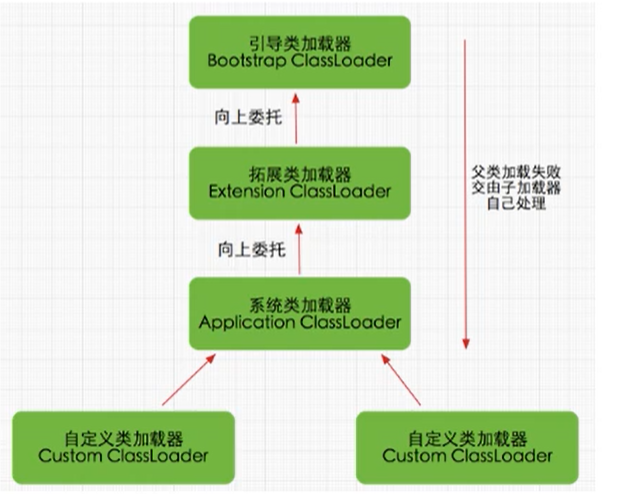

## 双亲委派机制（面试常问）

class 字节码文件是按需加载的

### 工作原理

（1）如果一个类加载器收到了类加载请求，它并不会自己先去加载，而是把这个请求委托给父类的加载器去执行;

（2）如果父类加载器还存在其父类加载器，则进一步向上委托，依次递归，请求最终将到达顶层的启动类加载器;

（3）如果父类加载器可以完成类加载任务，就成功返回，倘若父类加载器无法完成此加载任务，子加载器才会尝试自己去加载，这就是双亲委派模式。



### 优势

- 避免类的重复加载
- 保护程序安全，防止核心 API 被篡改
  - 比如你自己定义一个 `java.lang.String`

### 沙箱安全机制

自定义string类，但是在加载自定义string类的时候会率先使用引导类加载器加载，而引导类加载器在加载的过程中会先加载jdk自带的文件(rt.jar包中`java\lang \String.class`)，报错信息说没有main方法就是因为加载的是rt.jar包中的string类。这样可以保证对java核心源代码的保护，这就是沙箱安全机制。

### 代码示例

```java
protected synchronized Class<?> loadClass(String name, boolean resolve) 
    throws ClassNotFoundException
{
    // 首先，检查请求的类是否已经被加载过了
    Class c = findLoadedClass(name);
    // 若没有则调用父加载器的loadClass()方法
    if (c == null) {
        try {
        if (parent != null) {
            c = parent.loadClass(name, false);
        } else {
            // 若父加载器为空则默认使用启动类加载器作为父加载器
            c = findBootstrapClassOrNull(name);
        }
        } catch (ClassNotFoundException e) {
            // 如果父类加载器抛出ClassNotFoundException
            // 说明父类加载器无法完成加载请求
        }
        if (c == null) {
            // 在父类加载器无法加载时
            // 再调用本身的findClass方法来进行类加载
            c = findClass(name);
        }
    }
    if (resolve) {
        resolveClass(c);
    }
    return c;
}
```

