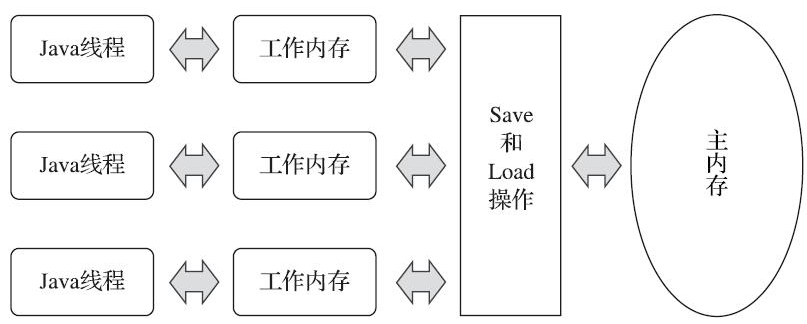

## 关键节点

JDK 5（实现了JSR-133）发布后，Java内存模型才终于成熟、完善

Java内存模型的主要目的是定义程序中各种变量的访问规则，即关注在虚拟机中把变量值存储到内存和从内存中取出变量值这样的底层细节

## 主内存和工作内存

Java内存模型规定了所有的变量都存储在主内存（Main Memory）中（此处的主内存与介绍物理硬件时提到的主内存名字一样，两者也可以类比，但物理上它仅是虚拟机内存的一部分）

每条线程还有自己的工作内存（Working Memory），线程的工作内存中保存了被该线程使用的变量的主内存副本，线程对变量的所有操作（读取、赋值等）都必须在工作内存中进行，而不能直接读写主内存中的数据。

不同的线程之间也无法直接访问对方工作内存中的变量，线程间变量值的传递均需要通过主内存来完成

主内存直接对应于物理硬件的内存，而为了获取更好的运行速度，虚拟机（或者是硬件、操作系统本身的优化措施）可能会让工作内存优先存储于寄存器和高速缓存中，因为程序运行时主要访问的是工作内存

## 内存交互

一个变量如何从主内存拷贝到工作内存、如何从工作内存同步回主内存这一类的实现细节，Java内存模型中定义了以下8种操作来完成。Java虚拟机实现时必须保证下面提及的每一种操作都是原子的、不可再分的（对于double和long类型的变量来说，load、store、read和write操作在某些平台上允许有例外）。

- lock（锁定）：作用于主内存的变量，它把一个变量标识为一条线程独占的状态
- unlock（解锁）：作用于主内存的变量，它把一个处于锁定状态的变量释放出来，释放后的变量才可以被其他线程锁定
- read（读取）：作用于主内存的变量，它把一个变量的值从主内存传输到线程的工作内存中，以便随后的load动作使用。
- load（载入）：作用于工作内存的变量，它把read操作从主内存中得到的变量值放入工作内存的变量副本中
- use（使用）：作用于工作内存的变量，它把工作内存中一个变量的值传递给执行引擎，每当虚拟机遇到一个需要使用变量的值的字节码指令时将会执行这个操作
- assign（赋值）：作用于工作内存的变量，它把一个从执行引擎接收的值赋给工作内存的变量，每当虚拟机遇到一个给变量赋值的字节码指令时执行这个操作
- store（存储）：作用于工作内存的变量，它把工作内存中一个变量的值传送到主内存中，以便随后的write操作使用
- write（写入）：作用于主内存的变量，它把store操作从工作内存中得到的变量的值放入主内存的变量中

>如果要把一个变量从主内存拷贝到工作内存，那就要按顺序执行read和load操作
>
>如果要把变量从工作内存同步回主内存，就要按顺序执行store和write操作。
>
>注意，Java内存模型只要求上述两个操作必须按顺序执行，但不要求是连续执行。也就是说read与load之间、store与write之间是可插入其他指令的，如对主内存中的变量a、b进行访问时，一种可能出现的顺序是read a、read b、load b、load a
>
>
>
>允许虚拟机将没有被volatile修饰的64位数据的读写操作划分为两次32位的操作来进行，即允许虚拟机实现自行选择是否要保证64位数据类型的load、store、read和write这四个操作的原子性，这就是所谓的“long和double的非原子性协定”

8种操作必须满足的规则：

- 不允许read和load、store和write操作之一单独出现，即不允许一个变量从主内存读取了但工作内存不接受，或者工作内存发起回写了但主内存不接受的情况出现
- 不允许一个线程丢弃它最近的assign操作，即变量在工作内存中改变了之后必须把该变化同步回主内存
- 不允许一个线程无原因地（没有发生过任何assign操作）把数据从线程的工作内存同步回主内存中
- 一个新的变量只能在主内存中“诞生”，不允许在工作内存中直接使用一个未被初始化（load或assign）的变量，换句话说就是对一个变量实施use、store操作之前，必须先执行assign和load操作
- 一个变量在同一个时刻只允许一条线程对其进行lock操作，但lock操作可以被同一条线程重复执行多次，多次执行lock后，只有执行相同次数的unlock操作，变量才会被解锁
- 如果对一个变量执行lock操作，那将会清空工作内存中此变量的值，在执行引擎使用这个变量前，需要重新执行load或assign操作以初始化变量的值
- 如果一个变量事先没有被lock操作锁定，那就不允许对它执行unlock操作，也不允许去unlock一个被其他线程锁定的变量
- 对一个变量执行unlock操作之前，必须先把此变量同步回主内存中（执行store、write操作）

## volatile变量的特殊规则

Java虚拟机提供的最轻量级的同步机制

当一个变量被定义成volatile之后，它将具备两项特性：

第一项是保证此变量对所有线程的可见性，这里的“可见性”是指当一条线程修改了这个变量的值，新值对于其他线程来说是可以立即得知的

第二个语义是禁止指令重排序优化

由于volatile变量只能保证可见性，在不符合以下两条规则的运算场景中，我们仍然要通过加锁（使用synchronized、java.util.concurrent中的锁或原子类）来保证原子性：

- 运算结果并不依赖变量的当前值，或者能够确保只有单一的线程修改变量的值
- 变量不需要与其他的状态变量共同参与不变约束

除了volatile之外，Java还有两个关键字能实现可见性，它们是synchronized和final

同步块的可见性是由“对一个变量执行unlock操作之前，必须先把此变量同步回主内存中（执行store、write操作）”这条规则获得的

final关键字的可见性是指：被final修饰的字段在构造器中一旦被初始化完成，并且构造器没有把“this”的引用传递出去（this引用逃逸是一件很危险的事情，其他线程有可能通过这个引用访问到“初始化了一半”的对象），那么在其他线程中就能看见final字段的值

## 先行发生原则

先行发生是Java内存模型中定义的两项操作之间的偏序关系，比如说操作A先行发生于操作B，其实就是说在发生操作B之前，操作A产生的影响能被操作B观察到，“影响”包括修改了内存中共享变量的值、发送了消息、调用了方法等

Java内存模型下一些“天然的”先行发生关系。如果两个操作之间的关系不在此列，并且无法从下列规则推导出来，则它们就没有顺序性保障，虚拟机可以对它们随意地进行重排序

- 程序次序规则（Program Order Rule）：在一个线程内，**按照控制流顺序**，书写在前面的操作先行发生于书写在后面的操作。注意，这里说的是控制流顺序而不是程序代码顺序，因为要考虑分支、循环等结构
- 管程锁定规则（Monitor Lock Rule）：一个unlock操作先行发生于后面对同一个锁的lock操作。这里必须强调的是“同一个锁”，而“后面”是指时间上的先后
- volatile变量规则（Volatile Variable Rule）：对一个volatile变量的写操作先行发生于后面对这个变量的读操作，这里的“后面”同样是指时间上的先后
- 线程启动规则（Thread Start Rule）：Thread对象的start()方法先行发生于此线程的每一个动作
- 线程终止规则（Thread Termination Rule）：线程中的所有操作都先行发生于对此线程的终止检测，我们可以通过Thread::join()方法是否结束、Thread::isAlive()的返回值等手段检测线程是否已经终止执行
- 线程中断规则（Thread Interruption Rule）：对线程interrupt()方法的调用先行发生于被中断线程的代码检测到中断事件的发生，可以通过Thread::interrupted()方法检测到是否有中断发生
- 对象终结规则（Finalizer Rule）：一个对象的初始化完成（构造函数执行结束）先行发生于它的finalize()方法的开始
- 传递性（Transitivity）：如果操作A先行发生于操作B，操作B先行发生于操作C，那就可以得出操作A先行发生于操作C的结论

