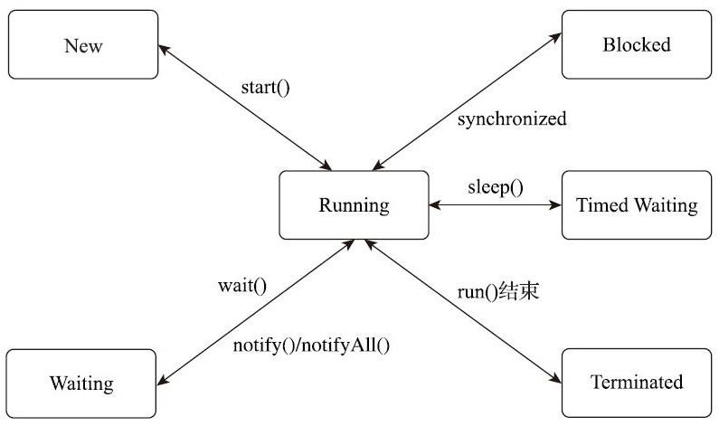

以HotSpot为例，它的每一个Java线程都是直接映射到一个操作系统原生线程来实现的，而且中间没有额外的间接结构，所以HotSpot自己是不会去干涉线程调度的（可以设置线程优先级给操作系统提供调度建议），全权交给底下的操作系统去处理，所以何时冻结或唤醒线程、该给线程分配多少处理器执行时间、该把线程安排给哪个处理器核心去执行等，都是由操作系统完成的，也都是由操作系统全权决定的

## 线程调度

线程调度是指系统为线程分配处理器使用权的过程，调度主要方式有两种，分别是协同式（Cooperative Threads-Scheduling）线程调度和抢占式（Preemptive Threads-Scheduling）线程调度。

如果使用协同式调度的多线程系统，线程的执行时间由线程本身来控制，线程把自己的工作执行完了之后，要主动通知系统切换到另外一个线程上去。协同式多线程的最大好处是实现简单，而且由于线程要把自己的事情干完后才会进行线程切换，切换操作对线程自己是可知的，所以一般没有什么线程同步的问题。它的坏处也很明显：线程执行时间不可控制，甚至如果一个线程的代码编写有问题，一直不告知系统进行线程切换，那么程序就会一直阻塞在那里

如果使用抢占式调度的多线程系统，那么每个线程将由系统来分配执行时间，线程的切换不由线程本身来决定

## 状态转换

Java语言定义了6种线程状态，在任意一个时间点中，一个线程只能有且只有其中的一种状态，并且可以通过特定的方法在不同状态之间转换。这6种状态分别是：

**新建**（New）：创建后尚未启动的线程处于这种状态

**运行**（Runnable）：包括操作系统线程状态中的Running和Ready，也就是处于此状态的线程有可能正在执行，也有可能正在等待着操作系统为它分配执行时间

**无限期等待**（Waiting）：处于这种状态的线程不会被分配处理器执行时间，它们要等待被其他线程显式唤醒。以下方法会让线程陷入无限期的等待状态：

- 没有设置Timeout参数的Object::wait()方法；

- 没有设置Timeout参数的Thread::join()方法；

- LockSupport::park()方法。

**限期等待**（Timed Waiting）：处于这种状态的线程也不会被分配处理器执行时间，不过无须等待被其他线程显式唤醒，在一定时间之后它们会由系统自动唤醒。以下方法会让线程进入限期等待状态：

- Thread::sleep()方法；

- 设置了Timeout参数的Object::wait()方法；

- 设置了Timeout参数的Thread::join()方法；

- LockSupport::parkNanos()方法；

- LockSupport::parkUntil()方法。

**阻塞**（Blocked）：线程被阻塞了，“阻塞状态”与“等待状态”的区别是“阻塞状态”在等待着获取到一个排它锁，这个事件将在另外一个线程放弃这个锁的时候发生；而“等待状态”则是在等待一段时间，或者唤醒动作的发生。在程序等待进入同步区域的时候，线程将进入这种状态。

**结束**（Terminated）：已终止线程的线程状态，线程已经结束执行。

