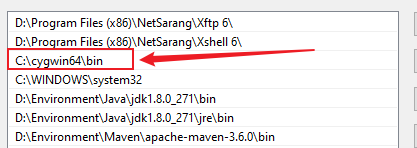
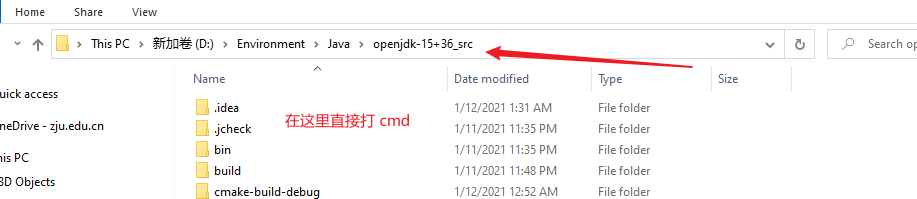
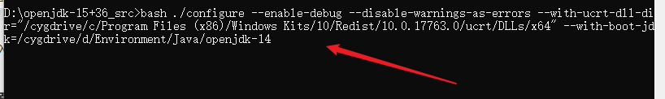
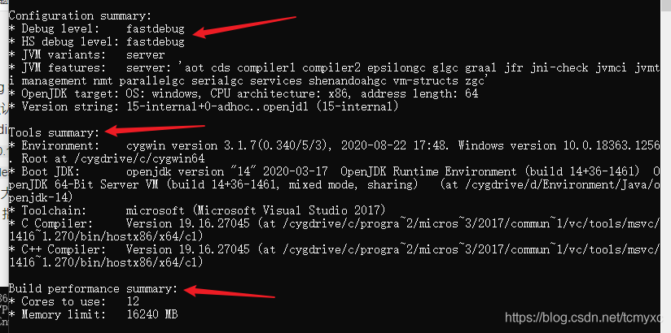

# Win10环境下编译openjdk15

# 前言
这篇文章写于2021年1月份。

我在Windows 和 Linux 平台上都试着编译过 openjdk，Linux 平台上的一般按照周大大的步骤来，不会有什么问题，不过还是给个建议：**使用 Ubuntu18 最佳**，因为这样你不需要手动更改 GCC 的版本（Ubuntu18 的 GCC 版本是 7.x，刚好和官方的要求符合），给自己省了点麻烦。当然，如果你是 Linux 使用高手，可以忽略我这一点建议。

在 Windows 平台的建议是：直接编译 openjdk15，原因如下：

1. 自身实践。我尝试编译了 openjdk8 到 openjdk15，只有 openjdk15 的编译不需要修改官方的脚本，openjdk13 ，12 都需要修改 `make\autoconf\toolchain_windows.m4`这个文件，具体可参考[这篇文章](https://blog.csdn.net/weixin_45040801/article/details/102612042)
2. 不需要安装过多的依赖或者软件。只需要 vs2017 英文版（注意是英文版）和 cygwin64，具体原因看[这篇文章](https://blog.csdn.net/weixin_45040801/article/details/102542213?utm_medium=distribute.pc_relevant_t0.none-task-blog-BlogCommendFromBaidu-1.control&depth_1-utm_source=distribute.pc_relevant_t0.none-task-blog-BlogCommendFromBaidu-1.control)。很多博客会说需要 `freetype` 这个依赖，但是我在编译的时候并没有用过，在这里供大家参考。

# 准备工作
## 软件以及源代码
- openjdk14（下载解压即可，不需要配置环境变量）
- openjdk15 源代码
- vs2017 英文版
- cygwin64

具体下载地址我不再给出，请自行下载

## 依赖包安装
cygwin64 安装的时候选择即可，至少需要安装：
- autoconf
- zip
- unzip
- make
- tar

其他的依赖可以参考源码下的 `doc/building.html` 文档

## 小技巧
1. 可以把 cygwin64 加入环境变量，这样可以在 Windows 的 CMD 窗口直接使用 Linux 命令，不过要放在 `C:\WINDOWS\system32` 之前。如下图：

2. 把自己电脑的语言设置成英文，这样你会少看到一些 warning，有强迫症的同志甚至可以把国家和地区改一下

# 编译
如果你在上文和我一下配置了 cygwin64 的环境变量，那你可以直接在源代码目录下这么干

这样你就直接进入了命令行窗口

## 生成配置文件
```bash
bash ./configure --enable-debug --disable-warnings-as-errors --with-ucrt-dll-dir="/cygdrive/c/Program Files (x86)/Windows Kits/10/Redist/10.0.17763.0/ucrt/DLLs/x64" --with-boot-jdk=/cygdrive/d/Environment/Java/openjdk-14
```
说明：

- –enable-debug 等价于 --with-debug-level=fastdebug，此外还有 release、slowdebug 两个参数，他们是编译级别，默认是 release（发布版）
- --with-ucrt-dll-dir 是指定 DLL 目录，具体为：`"/cygdrive/c/Program Files (x86)/Windows Kits/10/Redist/10.0.17763.0/ucrt/DLLs/x64"`，这里是一个映射，`/cygdrive/c/Program Files (x86)` 就是 Windows 的 `C:\Program Files (x86)`目录，具体的目录是我们安装好 VS2017 之后产生的目录，版本号` 10.0.17763.0` 可能会有不同，大家自行修改成自己的
- –with-boot-jdk 指定引导 jdk 的安装目录，改成自己的目录即可

截图如下：

如果一切良好，会看到类似于这样的：

如果出现了其他问题，可以参考错误信息，结合官方文档以及合理度娘来解决问题。

## 编译
按需编译，或者 `make all`，编译时间在半个小时到一个小时之间

# 结语
等于学习了《深入理解 Java 虚拟机》第一章，希望不要努力了两天的成果在硬盘里面吃灰。

# 参考文献
-   [1] https://blog.csdn.net/weixin_45040801/article/details/102542213?utm_medium=distribute.pc_relevant_t0.none-task-blog-BlogCommendFromBaidu-1.control&depth_1-utm_source=distribute.pc_relevant_t0.none-task-blog-BlogCommendFromBaidu-1.control
-   [2] https://blog.csdn.net/weixin_45040801/article/details/102612042
-   [3] https://www.cnblogs.com/zhoujun007/archive/2004/01/13/13406716.html
-   [4] 深入理解 Java 虚拟机（第三版）