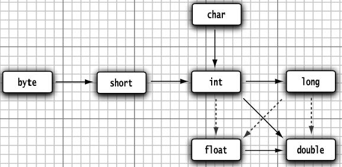

# 基本程序设计结构

## 命名规范

- 类名是以大写字母开头的名词。如果名字由多个单词组成，每个单词的第一个字母都应该大写
- 源代码的文件名必须与公共类的名字相同，并用`.java`作为扩展名
- 逐一声明每一个变量可以提高程序的可读性
- 常量名使用全大写
- 不能在嵌套的两个块中声明同名的变量

## 其他要点

1. Java区分大小写
2. 为了代码能够执行，在类的源文件中必须包含一个`main`方法，且必须声明为`public`，必须是静态的
3. 对于一个方法，即使没有参数也需要使用空括号
4. Java中的注释不会出现在可执行程序中
5. 必须为每一个变量声明一种类型
6. 在Java中，所有的数值类型所占据的字节数量与平台无关
7. 整型值和布尔值之间不能进行相互转换
8. 声明一个变量之后，必须用赋值语句对变量进行显式初始化
9. 变量的声明尽可能地靠近变量第一次使用的地方
10. 利用关键字`final`指示常量
11. 可以使用关键字`static final`设置一个类常量
12. 在`Math`类中，包含了各种各样的数学函数
13. `﹠﹠`和`||`运算符是按照“短路”方式来求值的
14. 变量的取值只在一个有限的集合内就可以用枚举
15. 使用`equals`方法检测两个字符串是否相等
16. 一定不要使用`==`运算符检测两个字符串是否相等！这个运算符只能够确定两个字符串是否放置在同一个位置上
17. 空串是一个Java对象，有自己的串长度(0)和内容(空)
18. 每次连接字符串，都会构建一个新的String对象
19. 当使用的类不是定义在基本`java.lang`包中时，一定要使用`import`指示字将相应的包加载进来
20. `switch`语句中，如果在case分支语句的末尾没有break语句，那么就会接着执行下一个case分支语句
21. 在声明数组变量时，需要指出数组类型和数组变量的名字
22. 一旦创建了数组，就不能再改变它的大小
23. 可以尝试使用 `for each` 循环
24. Java中，允许数组长度为0，即`new int[0]`合法
25. 要想对数值型数组进行排序，可以使用Arrays类中的sort方法
26. 允许不规则数组，也就是允许异形数组


## 数据类型

整形：int、short、long、byte（int 占 4 个字节）

> 长整型数值有一个后缀`L`或`l`
>
> 十六进制数值有一个前缀`0x`或`0X`
>
> 八进制有一个前缀`0`
>
> 从Java 7开始，加上前缀`0b`或`0B`就可以写二进制数。例如，0b1001就是9。
>
> 从Java 7开始，还可以为数字字面量加下划线，如用1_000_000

浮点型：float、double

>float类型的数值有一个后缀F或f(例如，3.14F)。
>
>没有后缀F的浮点数值(如3.14)默认为double类型

## 类型转换




缩窄需要强制类型转换

## 字符串比较的一些点

1、判断是否为 `null`

```java
if(str == null)
```

2、检查一个字符串既不是`null`也不为空串

```java
if(str != null && str str.length() != 0)
```

3、检查空串

```java
if(str.length() == 0)
```

或者

```java
if(str.equals(""))
```

## switch

case标签可以是：

- 类型为char、byte、short或int的常量表达式。
- 枚举常量。
- Java SE 7开始，增加字符串字面量。

## 大数值

如果基本的整数和浮点数精度不能够满足需求，那么可以使用`java.math`包中的两个类：`BigInteger`和`BigDecimal`。这两个类可以处理包含任意长度数字序列的数值。

BigInteger类实现了任意精度的整数运算，BigDecimal实现了任意精度的浮点数运算。

使用静态的`valueOf`方法可以将普通的数值转换为大数值

## 枚举类

定义一组常量的时候推荐枚举类

### 定义方式

1、自定义

```java
class Season{
    // 1、声明对象的属性, private final 修饰
    private final String seasonName;
    private final String seasonDesc;

    // 2、私有化构造器，并给对象的属性赋值
    private Season(String seasonName, String seasonDesc) {
        this.seasonName = seasonName;
        this.seasonDesc = seasonDesc;
    }

    // 3、提高当前枚举类的多个对象
    public static final Season SPRING= new Season("春", "春天");
    public static final Season SUMMER= new Season("夏", "夏天");
    public static final Season AUTUMN= new Season("秋", "秋天");
    public static final Season WINTER= new Season("冬", "冬天");
    
    // 4、其他诉求：提供get(), toString()
}
```


2、使用`enum`关键字定义

必须在枚举类的第一行声明枚举类对象

使用 enum 定义的枚举类默认继承了 java.lang.Enum类，因此不能再继承其他类

```java
enum Seasons{
    // 1、提供当前枚举类的对象，多个对象之间用逗号隔开，末尾对象用分号结束
    SPRING("春", "春天"),
    SUMMER("夏", "夏天"),
    AUTUMN("秋", "秋天"),
    WINTER("冬", "冬天");

    // 2、声明对象的属性, private final 修饰
    private final String seasonName;
    private final String seasonDesc;

    // 3、私有化构造器，并给对象的属性赋值
    private Seasons(String seasonName, String seasonDesc) {
        this.seasonName = seasonName;
        this.seasonDesc = seasonDesc;
    }

    // 4、其他诉求：提供get(), toString()
}
```

枚举类可以实现一个或多个接口

- 若每个枚举值在调用实现的接口方法呈现相同的行为方式，则只要统一实现该方法即可。

- 若需要每个枚举值在调用实现的接口方法呈现出不同的行为方式，则可以让每个枚举值分别来实现该方法


### Enum类常用方法

`values()`方法：返回枚举类型的对象数组。该方法可以很方便地遍历所有的枚举值。

`valueOf(String str)`：可以把一个字符串转为对应的枚举类对象。要求字符串必须是枚举类对象的“名字”。如不是，会有运行时异常：`IllegalArgumentException`

` toString()`：返回当前枚举类对象常量的名称


