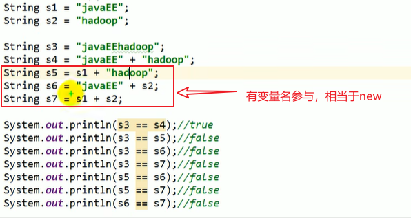
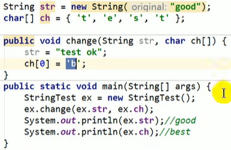

# 常用类

## String类及常用方法

```java
public final class String
    implements java.io.Serializable, Comparable<String>, CharSequence {
    /** The value is used for character storage. */
    private final char value[];

    /** Cache the hash code for the string */
    private int hash; // Default to 0
    //
}
```


- 是一个 `final` 类，字符串的值在创建之后不能更改，同时说明类不能被继承
  - 当对字符串重新赋值的时候，实际上是新造了一个字符串，然后指向这个新的字符串
  - 字符串拼接也是新造了一个字符串，本质上是通过`StringBuilder`或者`StringBuffer`以及他们的 `append` 方法实现的
  - 当调用`String`的`replace`方法修改字符串内容时，也需要新造一个字符串
- `String`对象的内容是放在一个`char`型数组里面的，数组也被`final`修饰
- 通过字面量的方式（区别于new）给字符串赋值，此时字符串值放在字符串常量池中（在方法区里面）
- 字符串常量池中是不会存储相同内容的字符串的


### String实例化的方式

1、通过字面量直接复制；存放在方法区的字符串常量池里面

2、通过`new+构造器`；存放在堆里面

### 和基本数据类型的转换

- 调用基本数据类型包装类的`parsexx`可以把字符串转为基本数据类型
- 调用`String`类的`valueOf`方法可以把基本数据类型及其包装类转为字符串

### 和char[]的转换

- 调用`String`的`toCharArray`方法即可转为char型数组

- char型数组作为参数传到`String`的构造函数就能得到对应的字符串

### 和字节数组（byte[]）的转换

- String --> byte[]：调用`String`的`getBytes`方法；可选传递字符集，不给定字符集则是一般是默认编码UTF-8。类似编码
- byte[] --> String：字节数组作为参数传到`String`的构造函数就能得到对应的字符串；也可以指定字符集。类似解码

### 面试题

1、`String s1 = "abc"` 和 `String s2 = new String("abc")` 的区别？

- 一个在方法区的字符串常量池里面，一个在堆空间
- 内容都是一样的

```java
public static void main(String[] args) {
    String s1 = "abc";
    String s2 = new String("abc");
    System.out.println(s1 == s2);
    System.out.println(s1.equals(s2));
}
```

输出：

```
false
true
```


2、`String s2 = new String("abc")`在内存中创建了几个对象？

两个：一个是堆空间中的new结构，另一个是`char[]`对应常量池中的数据"abc"

3、字符串拼接问题




- 常量和常量的连接，结果在常量池中

- 只要其中一个是变量（不加`final`修饰），结果在堆中
- 如果拼接的结果调用`intern`方法，则结果在常量池

4、函数调用




> 函数调用的时候，基本数据类型传的是存储的数据，引用数据类型传的是地址

## `StringBuffer`和`StringBuilder`

`String`：不可变的字符序列；底层使用char[]存储，加final修饰，调用`new String()`的时候默认容量是0

`StringBuffer`：可变的字符序列；大多数方法都使用`synchronized`关键字加锁，线程安全，效率低；底层使用char[]存储，不加final修饰，会多给16个容量；扩容时变为原来的2倍再加2，同时把原有数组的元素复制到新数组里面

`StringBuilder`：可变的字符序列；JDK 5新增，线程不安全，效率高；底层使用char[]存储，不加final修饰，会多给16个容量；扩容时变为原来的2倍再加2，同时把原有数组的元素复制到新数组里面

> 开发中建议直接指定容量，不然频繁扩容效率低。
>
> `StringBuffer(int capacity)`或者`StringBuilder(int capacity)`

### `StringBuffer`和`StringBuilder`常用方法

`append`，`delete`，`replace`，`insert`，`reverse`等

## 日期API

### `System`类

`System`类中的`currentTimeMillis`方法

### `Date`类

`util`包下的`Date`类

1、两个构造器

`Date()`：创建一个当前时间的`Date`对象

`Date(long date)`：创建指定毫秒数的`Date`对象

2、两个方法

`toString`：显示当前的年月日时分秒

`getTime`：获取当前`Date`对象的时间戳（毫秒数）


`sql`包下的`Date`类对应数据库中的日期类型变量；平时不用这个

构造器：`Date(long date)`

`sql`包下的`Date`对象和`util`包下的`Date`对象转换：

- `sql.Date`转`util.Date`，直接转，子类对象赋给父类即可
- 反过来就先要获取时间戳，然后把时间戳作为参数传到构造器。父类对象是不能直接强转成子类的

```java
Date date1 = new Date();// util包
java.sql.Date date2 = new java.sql.Date(date1.getTime());
```

### `SimpleDateFormat`类

#### 格式化（日期转字符串）

（1）按照默认方式格式化（不建议使用）

```java
SimpleDateFormat sdf = new SimpleDateFormat();// 使用默认构造器

Date date = new Date();
System.out.println(date);

String format = sdf.format(date);
System.out.println(format);

/*
输出如下：
Wed Aug 24 20:30:35 CST 2022
22-8-24 下午8:30
*/
```

（2）按照指定方式格式化（**建议使用**）

```java
Date date = new Date();
System.out.println(date);

SimpleDateFormat sdf1 = new SimpleDateFormat("yyyy-MM-dd hh:mm:ss");
String format1 = sdf1.format(date);
System.out.println(format1);

/*
Wed Aug 24 20:46:38 CST 2022
2022-08-24 08:46:38
*/
```

> 大写M代表月份，小写m代表分钟
>
> 大写H代表24小时制，小写12小时制

#### 解析（字符串转日期）

```java
SimpleDateFormat sdf1 = new SimpleDateFormat("yyyy-MM-dd hh:mm:ss");
Date date1 = sdf1.parse("2022-08-24 09:46:38");// 要求字符串必须符合上面定义的格式
System.out.println(date1);

/*
Wed Aug 24 09:46:38 CST 2022
*/
```


练习：

1、把字符串转为`sql`包下的`Date`类型

```java
SimpleDateFormat sdf1 = new SimpleDateFormat("yyyy-MM-dd");
Date date1 = sdf1.parse("2022-08-24");// util包下的Date
java.sql.Date date2 = new java.sql.Date(date1.getTime());
```

### `Calendar`类

是一个抽象类

#### 实例化方法

1、创建其子类`GregorianCalendar`的对象

2、调用本身的`getInstance`静态方法

#### 常用方法

`get`、`set`，`getTime`、`setTime`等

```java
calendar.get(Calendar.DAY_OF_MONTH);// 这个月的第几天（获取其他信息可以调用其他常量）
set(Calendar.DAY_OF_MONTH, 22);// 指定今天是这个月的第22天
getTime();// 得到一个java.util.Date对象
setTime(Date date);// Date转日历类
```

## JDK8中新日期API

都在`java.time`包下面放着，常用的是基础包和format包

> JDK8之前想用可以导入joda-time包

#### `LocalDate`，`LocalTime`，`LocalDateTime`

类被`final`修饰，都是不可变的

```java
LocalDate localDate = LocalDate.now();
LocalTime localTime = LocalTime.now();
LocalDateTime localDateTime = LocalDateTime.now();

System.out.println(localDate);
System.out.println(localTime);
System.out.println(localDateTime);

/*
2022-08-24
21:31:59.353
2022-08-24T21:31:59.353
*/
```

`localDateTime`用的多一点

#### `Instant`类

```java
Instant instant = Instant.now();// utc时间
System.out.println(instant);// 2022-08-24T13:46:42.561Z

OffsetDateTime offsetDateTime = instant.atOffset(ZoneOffset.ofHours(8));
System.out.println(offsetDateTime);// 2022-08-24T21:46:42.561+08:00

instant.toEpochMilli();// 获取时间戳

Instant instant1 = Instant.ofEpochMilli(instant.toEpochMilli());
System.out.println(instant1);// 2022-08-24T13:46:42.561Z, 同instant
```


